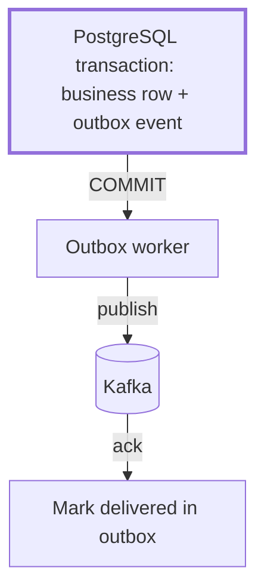

# The Transactional Outbox pattern in Python: omni-box

<div class="bdr-post__hero" data-bdr-post="2026-05-15-transactional-outbox-with-omni-box" role="img" aria-label="One transaction holds both the row and the event; a separate relay carries the event onward" markdown="0"></div>

Distributed systems have a classic problem: you want to update your database and publish an event to Kafka in the same operation, but there is no cross-system transaction. If your service crashes between the `INSERT` and the `kafka.produce()`, you get silent data loss. **omni-box** solves this with the Transactional Outbox pattern.

<!-- more -->

## The dual-write problem

Imagine a `CreateUserUseCase` that needs to:
1. Insert a `users` row into Postgres
2. Publish a `UserCreated` event to Kafka for downstream services

The naive implementation has a race condition:

```python
# ❌ Not atomic — crash between these two leaves data inconsistent
await session.execute(insert(UserDB).values(...))
await session.commit()
await kafka_producer.send("user-created", payload)  # might never run
```

If the process restarts after the commit but before the Kafka send, downstream services never learn about the new user. Compensating for this at the application level is complex and error-prone.

## The Outbox pattern

The solution is to write the event into the *same database transaction* as the business data. A background worker then reads undelivered events and publishes them to Kafka, marking each one as delivered after a successful send.

The business data and the event either commit together in Postgres or both roll back. After the commit, the worker retries delivery until Kafka acknowledges the message. Delivery is at least once: the same event can arrive more than once.

<!-- diagram:concept -->
<figure class="bdr-diagram" markdown="1">
<figcaption><span class="bdr-diagram__eyebrow">THE IDEA, VISUALIZED</span><strong>The transaction ends before delivery starts</strong></figcaption>
<div class="bdr-diagram__viewport" markdown="1" data-search-exclude>



</div>
<p class="bdr-diagram__caption">The business row and the outbox row commit together. Kafka delivery happens later; a crash after sending but before marking delivery can produce a duplicate.</p>
</figure>
<!-- /diagram:concept -->

## Using omni-box

omni-box provides the `outbox_events` table, the background worker, and the UoW integration. Inside a use case:

```python
async with self._uow.transaction() as tx:
    user = await tx.users.create(email=email, name=name)

    # Written in the same transaction — zero chance of loss
    await tx.outbox.create(
        UserCreatedEvent(user_id=user.id, email=email)
    )
```

The outbox worker runs as a separate asyncio task and polls for undelivered events:

```python
from omni_box import OutboxWorker

worker = OutboxWorker(session_factory=session_factory, producer=kafka_producer)
await worker.run()
```

## The Inbox side

omni-box also implements the Inbox pattern for idempotent Kafka consumption. Each incoming message is recorded in an `inbox_events` table before processing. If the consumer crashes and re-reads the message, the inbox check prevents double-processing:

```python
async with self._uow.transaction() as tx:
    if await tx.inbox.already_processed(message_id):
        return  # idempotent — skip

    await tx.inbox.record(message_id)
    await self._handle(message)
```

## Why a library?

The pattern itself is well-understood, but the implementation details matter: polling interval, batch size, backoff on Kafka errors, table schema, migration support. omni-box ships all of this with sensible defaults and integrates directly into the `unit-of-work-kit` transaction model used across all Bedrock services.

Full documentation at [bedrock-python.github.io/omni-box](https://bedrock-python.github.io/omni-box/).
