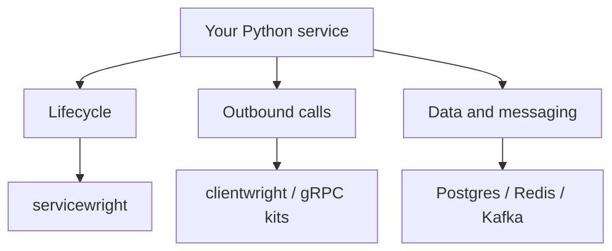

# Welcome to the Bedrock Python Blog

This is the home of the **Bedrock Python** ecosystem — what it is, why it exists, and the thinking behind it. Alongside that, guides, practical advice, and plain engineering articles on building backend services in Python.

<!-- more -->

## Why this exists

Over the years I have started more backend services than I care to count. Different domains, different teams, but almost always the same stack underneath: Python, asyncio, SQLAlchemy, Kafka, Redis, PostgreSQL.

And every single time, the first week or two looked exactly the same. Wire up async sessions. Write the base model with UUIDs and UTC timestamps. Put together an Outbox so events don't get lost between the database and the broker. Bolt on tracing. Write the migration tests nobody wants to write.

None of that is the product. Nobody hires you to write a session factory. It is plumbing, and I kept copy-pasting it from the previous project, fixing a bug in one copy and forgetting about the other four.

At some point I got tired of reinventing the same wheel.

## The decision

So I pulled the plumbing out of the services and into libraries. Each one takes a single piece of infrastructure I kept rewriting and turns it into a versioned, tested, published package. The services keep only what makes them different: the domain, the business rules, the actual product.

That is what Bedrock Python is. Not a framework and not a platform — just the infrastructure layer I no longer want to write for the fifth time, so the time goes into the core of whatever I'm building instead.

A few things every library is held to:

- **Single responsibility** — each package does one thing and does it well
- **Type-safe by default** — full mypy strict compliance, no `Any` leaking through
- **Observable** — OpenTelemetry integration where it matters
- **Testable** — designed for Clean / Onion architecture so your business logic stays free of infrastructure concerns

<!-- diagram:concept -->
<figure class="bdr-diagram" markdown="1">
<figcaption>THE IDEA, VISUALIZED<strong>Compose the service you need</strong></figcaption>

Libraries share conventions, while the application chooses its runtime, clients and data components. This is a map of responsibilities, not a mandatory dependency tree.

</figure>
<!-- /diagram:concept -->

## What to expect from this blog

Guides, tips from running this stack in production, and general engineering articles that aren't tied to any particular package. Now and then a design note on why something is built the way it is.

Stay tuned.
