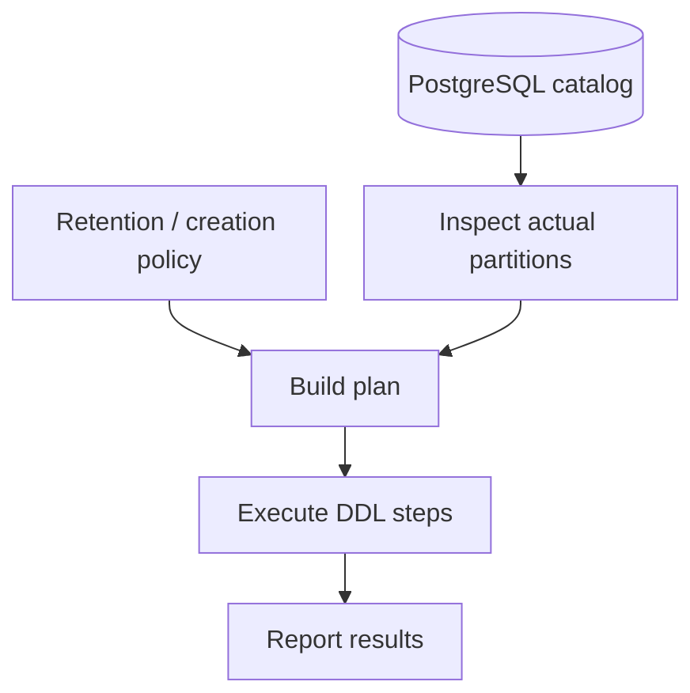

# Managing PostgreSQL partitions, one failure at a time

<div class="bdr-post__hero" data-bdr-post="2026-09-06-pg-partsmith" role="img" aria-label="A tree of time-ordered partitions kept correct: one created ahead, one retired, one never touched" markdown="0"></div>

There are two ways a partitioned table gets you out of bed. The first is an INSERT at 03:00 that PostgreSQL rejects because nobody created next month's partition. The second is quieter and worse: a retention job that dropped a table it did not make. Creating the partitions is the easy part. Keeping a tree of them right every night, for years, without ever touching a table that is not yours, is the part nobody budgets for, and it is the part I kept rewriting from one service to the next until it became **pg-partsmith**. Its shape follows the failures, and so does this post: not knowing what maintenance will do, dropping something you did not make, two replicas ticking at once, a team with no Python in it, an archiver that has to run before the drop, and an assistant that guesses an API which does not exist.

<!-- more -->

## Not knowing what maintenance will do

Before designing the core I wanted to know which of the hard cases were mine and which were everybody's, so I read the partition management code of ten production systems at source level: GlitchTip, GitLab, Centrifugo, PGMQ, Hatchet, pg-trx-outbox, Hookdeck Outpost, ColdFront, pg_partman and pg_clickhouse. The [final report](https://bedrock-python.github.io/pg-partsmith/design/final-report/) opens with the question as it stood: *if ten production systems each wrote their own PostgreSQL partition manager, what did they all need, and which of it belongs in a library?*

They agreed on more than I expected, and the [OSS research](https://bedrock-python.github.io/pg-partsmith/design/oss-research/) keeps the list. Nobody trusts a partition's name for the truth when there is anything else to read; the rest read the bounds in the catalog. Every serious one separates "what should exist" from "what to do now". Detach and drop are different events. Ownership is unsolved everywhere. Operators want to see the plan before it runs. Those findings are the sections below.

pg-partsmith is a desired-state loop: you describe the shape the tree should have, it reads the shape the tree has from the catalog, the difference becomes a plan, the plan is applied. The middle step is a value you can hold: `plan_maintenance` is pure Python over a configuration, the tree as read and the clock, and `service.plan()` produces it with no lock and no DDL.

```python
from sqlalchemy.ext.asyncio import create_async_engine

from pg_partsmith import PartitionGranularity, TablePartitionConfig
from pg_partsmith.aio import PartitionToolkit

config = TablePartitionConfig(
    schema="public",
    table_name="events",
    partition_column="created_at",
    granularity=PartitionGranularity.MONTH,
    create_ahead_count=3,
    retention_count=12,
)

engine = create_async_engine("postgresql+asyncpg://app@localhost/app")
kit = PartitionToolkit.from_engine(engine)
plan = await kit.service.plan(config)                # no lock, no DDL
print(plan.describe())
```

Planned on 28 August, that prints:

```text
plan for public.events at 2026-08-28T00:00:00+00:00
  CREATE public.events__2026_08 (create_ahead)
  CREATE public.events__2026_09 (create_ahead)
  CREATE public.events__2026_10 (create_ahead)
```

Every operation carries a reason, and a detach or drop line carries `size=` and `rows~` when a rule such as `SizeAbove` or `RowsAbove` asked for them; a plain monthly table is never measured. What the planner saw and left alone appears as findings with a severity: a warning needs a person, an info line does not.

The flat spelling above covers the first table you partition. The second has a UUIDv7 primary key and no timestamp worth partitioning on; the third is per-tenant and wants a hash split under every month; the fourth is referenced by another table's foreign key, so PostgreSQL refuses to detach a partition while rows still point into it; the fifth was managed by pg_partman for three years. For those there is the composed form:

```python
from datetime import timedelta

from pg_partsmith import (
    CreateAhead, DropAfter, HashPartitioning, KeepNewest, LifecyclePolicy,
    PartitionGranularity, RangePartitioning, TablePartitionConfig,
    TimeBoundaries, UUIDv7BoundaryCodec,
)

config = TablePartitionConfig(
    table_name="issue_events",
    scheme=RangePartitioning(
        key="id",                                                   # a UUIDv7 column
        boundaries=TimeBoundaries(granularity=PartitionGranularity.WEEK, codec=UUIDv7BoundaryCodec()),
        child=HashPartitioning(key="organization_id", modulus=4),   # each week split by tenant
    ),
    lifecycle=LifecyclePolicy(
        creation=CreateAhead(count=3),
        retention=KeepNewest(count=12),          # twelve weeks, not twelve leaves
        drop=DropAfter(grace=timedelta(days=7)), # detach now, drop a week later
    ),
)
```

The comment on the retention line is the idea everything else rests on. A `RANGE` level is a progression: an open-ended sequence of windows the lifecycle moves along. A `HASH` level is a set: fixed, complete, never expired. The partition directly under a progression level is the lifecycle unit — created, counted, hooked and expired as one, subtree included. So `KeepNewest(12)` keeps twelve weeks, however many buckets each holds, and a `before_drop` hook fires once per week, not four times. `Unreferenced()`, combined with the count as `ExpireIf(AllOf((KeepNewest(12), Unreferenced())))`, answers the fourth table: a still-referenced partition is simply not expired yet, instead of a refused `DETACH` landing in `result.issues` every tick. Note the defaults: `CreateAhead()` is six windows, `KeepNewest()` twelve, both counting the current one, and `DropAfter()` has no grace, so the default policy detaches and drops in the same run. A grace period, or `DropNever()`, is a decision to make on purpose.

A [plan](https://bedrock-python.github.io/pg-partsmith/concepts/plan/) is also a document: JSON with each operation's `is_destructive` flag and heaviest lock, and a `config_fingerprint` over the table configuration, so a plan saved on Tuesday and applied on Thursday, after someone edited the retention count, is refused with `PlanConfigMismatchError`. A second run over a converged tree issues zero DDL, and that is an integration test counting statements, not a promise.

<!-- diagram:concept -->
<figure class="bdr-diagram" markdown="1">
<figcaption><span class="bdr-diagram__eyebrow">THE IDEA, VISUALIZED</span><strong>Inspect, then execute an explicit plan</strong></figcaption>
<div class="bdr-diagram__viewport" markdown="1" data-search-exclude>



</div>
<p class="bdr-diagram__caption">Planning describes intended changes. Maintenance executes DDL separately; it is not one atomic transaction across every partition.</p>
</figure>
<!-- /diagram:concept -->

## Dropping something you did not make

The question a DBA asks about any tool with DROP is "is this mine?". The answer comes from the [catalog](https://bedrock-python.github.io/pg-partsmith/concepts/ownership/), with no metadata table to fall out of step with it, and whenever the library cannot tell, the answer is no.

For an attached partition the test is its bounds, read with `pg_get_expr(relpartbound)`, never its name. A partition whose window is a cell of the configured grid, or lies inside one, is a lifecycle partition. Anything coarser, or straddling two cells, is reported as `unmanaged_partition` and left alone. That is also how a table moves off pg_partman: partitions are adopted by their bounds, nothing is renamed, and the tables the old manager detached get `repo.adopt_partition` before the library will drop them.

For a detached table the record is a `COMMENT`, written before the `DETACH` so an interrupted run leaves a marked table rather than an invisible one: `pg-partsmith:orphan-parent=public.events` on the first line, `pg-partsmith:detached-at=` on the second, which is what a grace period is measured from.

One more check sits between plan and statement: a detach or drop runs only if the relation still carries the OID the plan saw, otherwise the operation is refused with `PlanStaleError` and nothing destructive happens. `DROP` is never issued with `CASCADE`, never against an attached partition, and never against a table without the marker unless you set `drop_allow_unmanaged=True` on the repository, which is a sentence you have to type on purpose. I care about the refusals as much as the operations.

There is no run-wide transaction, because `DETACH CONCURRENTLY` cannot run inside one: every statement commits on its own, which is why you give the library an engine, not a session. When the parent holds a DEFAULT partition PostgreSQL refuses the concurrent form; the planner knows and plans the blocking detach, so `plan --locks` names the ACCESS EXCLUSIVE it will really take.

## Two replicas tick at once

There is no scheduler inside. Whatever already schedules things for you calls `PartitionMaintainer.run_maintenance_safe`, which never raises: failure comes back as `result.error`. Locks are per table and non-blocking, advisory by default or Redis. When two replicas tick at once the loser gets `LockAcquisitionError` in `result.error`, which the [scheduling guide](https://bedrock-python.github.io/pg-partsmith/guide/scheduling/) says to treat as skipped, not failed.

The library ships twice under the same names, `pg_partsmith.aio` on a SQLAlchemy `AsyncEngine` and `pg_partsmith.sync` on an `Engine`. Three differences survive: the DDL timeout is a server-side `statement_timeout`, the Redis lock renews from a thread and can only warn when the lease is lost, and a Python block hook runs inline.

`PartitionToolkit.from_engine` exists because three settings — `marker_prefix`, `ddl_timezone`, `boundary_codec` — live on two objects and have to match. Give `marker_prefix` to the repository alone and the orphans it marks are never found by the metadata provider, so never dropped.

Hooks are eight phases — before and after create, attach, detach and drop — plus `on_event`, which sees every event first, so a refusal still leaves an audit trail. A `before_*` hook that raises aborts that operation, and the next tick plans it again.

## The team with no Python in it

None of that helps a team whose services are not Python. With the `cli` extra, `pg-partsmith` is a command over a configuration document — YAML or JSON — and a DSN, and the image packages it so the application needs no Python at all.

`inspect`, `plan` and `validate` issue no DDL, take no lock and fire no hook. `apply` acts, but withholds every detach and drop unless `--allow-destructive` is passed — it creates and re-attaches, nothing destructive, which is what an init container should do. `backfill` is the library's `partition_data` from the command line: it drains a DEFAULT partition window by window in batches of 10,000 rows by default, each batch a single `DELETE … RETURNING` / `INSERT` that commits on its own, so a row is never in two places and never in none. It is not transparent: a window's rows are invisible through the parent from the batch that moves them until the attach. `--max-batches 50` stops after fifty statements per table and exits 2 while rows are left, which makes `until pg-partsmith backfill -c partitions.yaml --max-batches 50; do sleep 60; done` a resumable Job.

A CronJob and a CI step read the exit code and nothing else, so the codes are distinguishable on purpose:

- `0` nothing pending
- `2` drift under `plan --check`, or `backfill` with rows still to move
- `3` findings that need a person, such as a hook that refused
- `4` configuration, a changed fingerprint included
- `5` the database could not be reached
- `6` another maintainer holds the lock; not a failure, and `--ok-if-locked` turns it into `0`
- `64` usage — deliberately not the parser's `2`, so a typo never pages as drift
- `130` / `143` stopped by SIGINT / SIGTERM, after the lock is released
- `1` unexpected

```bash
pg-partsmith plan  -c partitions.yaml --check                  # exit 2 while anything is pending; a scheduled probe
pg-partsmith plan  -c partitions.yaml --save plan.json         # zero DDL; the artifact a reviewer reads
pg-partsmith apply -c partitions.yaml --plan plan.json --allow-destructive
```

There is deliberately no `--sql`. I decided against it because the DDL is built at execution time from decisions only made then, and a printout that left those out would be read as the real thing precisely by the person checking for surprises. `--output metrics --write FILE` writes Prometheus gauges, renaming a temporary file into place so a node_exporter textfile collector never reads half of one; the [CLI guide](https://bedrock-python.github.io/pg-partsmith/guide/cli/) has every flag.

The image, `ghcr.io/bedrock-python/pg-partsmith`, is distroless Debian 12 with a pruned Python 3.14, UID 65532 and the command as entrypoint. I wanted nothing in it the command does not need, so there is no shell, no package manager and no pip; `--write` and `--ok-if-locked` do the two jobs a wrapper script used to. Each release is built natively on amd64 and arm64, scanned and pushed by digest with an SBOM and SLSA provenance before PyPI is touched, then signed keylessly with cosign, then pulled back on both architectures, verified and run through the end-to-end suite. The nightly tick from the [running guide](https://bedrock-python.github.io/pg-partsmith/guide/running/), which CI checks with kubeconform:

```yaml
apiVersion: batch/v1
kind: CronJob
metadata: { name: partition-maintenance }
spec:
  schedule: "15 2 * * *"
  concurrencyPolicy: Forbid
  startingDeadlineSeconds: 3600
  successfulJobsHistoryLimit: 3
  failedJobsHistoryLimit: 5
  jobTemplate:
    spec:
      backoffLimit: 0
      activeDeadlineSeconds: 3600
      template:
        spec:
          restartPolicy: Never
          containers:
            - name: pg-partsmith
              image: ghcr.io/bedrock-python/pg-partsmith:latest
              args: ["apply", "-c", "/etc/partitions.yaml", "--allow-destructive"]
              env:
                - { name: PG_PARTSMITH_DSN, valueFrom: { secretKeyRef: { name: partsmith-dsn, key: dsn } } }
              volumeMounts:
                - { name: config, mountPath: /etc/partitions.yaml, subPath: partitions.yaml, readOnly: true }
          volumes:
            - { name: config, configMap: { name: partition-config } }
```

The examples say `latest` so they never go stale; on a real schedule I pin the minor tag, because I do not want a CronJob crossing a major version on its own overnight with `--allow-destructive` in its arguments. The container issues DDL, so give it a role of its own: `USAGE` and `CREATE` on the schema, and ownership of the parent, because PostgreSQL refuses `CREATE TABLE … PARTITION OF`, `ATTACH` and `DETACH` from anyone else — so the role owns the tables it maintains or is a member of the role that does. The read-only commands need `USAGE` on the schema, `SELECT` on the catalog and, for a `SqlPredicate`, `SELECT` on the partition.

## The archiver has to run before the drop

Retention rarely means only delete; it means export, then delete. In Python that is a hook class; from a document it is a `hooks` section:

```yaml
tables:
  - table_name: events
    partition_column: created_at
    granularity: month
    create_ahead_count: 3
    retention_count: 12

hooks:
  timeout_seconds: 900
  before_drop: ["/opt/hooks/archive-partition.sh"]
  after_create: ["/opt/hooks/notify.sh"]
  before_detach:
    python_file: hooks/export_partition.py
  after_drop:
    python: |
      log.info("dropped %s (%s)", event.partition.name, event.operation.reason)
```

A command is an argument vector, never a shell string; it gets the whole `PartitionEvent` as JSON on stdin and the phase, table, partition and window edges as `PG_PARTSMITH_*` variables, and a non-zero exit is a refusal. A Python block runs with `event` and `log` in scope, and raising is a refusal. Every block is compiled when the command reads the document, so a `SyntaxError` is a validation error with a line number rather than a discovery at 03:00. Because those hooks are arbitrary code in a process holding DDL credentials, `apply` and `backfill` refuse a document that declares them — exit 4, before any connection is opened — unless `--allow-hooks` is passed; the read-only commands never run them. No sandbox is claimed.

The document is strict all the way down — `befor_drop` is refused where it is written, a typo in `defaults` by name, an empty `tables` list, one relation described twice — because a wrong field in a file nobody opens between deploys does not behave like a typo; it behaves like a policy.

## Wiring it with an assistant in the loop

With a coding assistant in the loop the failure mode is specific: the model guesses a method that sounds plausible — `retention_days=90`, a `Session` where an `Engine` is required. I can design against that, so the documentation has [one page written for the model](https://bedrock-python.github.io/pg-partsmith/agents/) rather than the person, served as raw Markdown at `/agents.md` as well.

It holds the mental model, the wiring, fourteen rules that hold or break the code — give it an `Engine`, never a `Session`; there is no scheduler inside; the counts include the current period; the default lifecycle drops — four WRONG/RIGHT pairs of the kind models actually produce, and a map of the rest of the documentation. It is about 3,400 words, which is long for a prompt and short for a library. Every page but the API reference is served the same way, `.md` in place of the trailing slash, and carries a Copy page control that copies that Markdown, shows it, or opens ChatGPT, Claude or Perplexity on it.

## Where to read more

The flat five-field configuration at the top is not a beginner mode: it is sugar for a `RangePartitioning` over `TimeBoundaries` with `CreateAhead` and `KeepNewest`, and `config.scheme` and `config.lifecycle` expose the composed form either way.

Three ways in, then. If your service is Python, `pip install pg-partsmith`, pick `pg_partsmith.aio` or `pg_partsmith.sync`, and start with `plan()`. If it is not, or you would rather keep DDL credentials out of the application, the `cli` extra or the image runs the same loop over a configuration document and reports through exit codes and gauges. If an assistant is doing the wiring, hand it the agents page and nothing else. The [documentation](https://bedrock-python.github.io/pg-partsmith/) has the rest; the source and the tests on PostgreSQL 15 through 18 are on [GitHub](https://github.com/bedrock-python/pg-partsmith).
