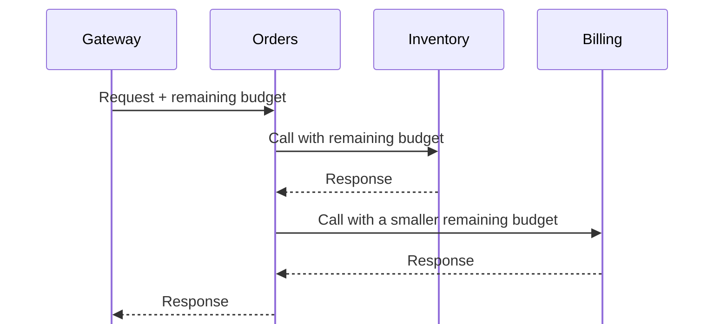

# Timeouts are not deadlines: how latency budgets break across microservices

<div class="bdr-post__hero" data-bdr-post="2026-09-06-timeouts-are-not-deadlines" role="img" aria-label="A shared budget shrinks along a chain; identical per-hop timeouts do not" markdown="0"></div>

Imagine an Orders service: it reads stock over HTTP, then reserves items and charges a card over gRPC. We will give the request two seconds and follow that budget through slow responses, retries, and downstream calls.

<!-- more -->

The [lab](../lab/2026-09-06-timeouts-are-not-deadlines/README.md) contains runnable loopback servers. Examples use Python 3.13, httpx 0.28.1, grpcio 1.83.1, deadline-budget 0.1.3, clientwright 0.2.2, and grpc-client-kit 0.1.0. Timings below are approximate; startup and scheduling add overhead.

## One HTTP response takes longer than its timeout { #a-timeout-limits-an-operation }

First, Orders downloads a stock report. Inventory sends headers immediately, then eight bytes at half-second intervals. This handler models that response:

```python
import asyncio


async def drip(reader, writer):
    await reader.readuntil(b"\r\n\r\n")
    writer.write(b"HTTP/1.1 200 OK\r\nContent-Length: 8\r\n\r\n")
    await writer.drain()
    try:
        for _ in range(8):
            await asyncio.sleep(0.5)
            writer.write(b"x")
            await writer.drain()
    except ConnectionResetError:
        pass  # The client may stop reading before the body is complete.
    finally:
        writer.close()
```

Orders requests the report with HTTPX:

```python
import httpx


async def get_report(url):
    async with httpx.AsyncClient(timeout=1.0) as client:
        return await client.get(url)
```

The call succeeds after roughly four seconds. In HTTPX, `timeout=1.0` sets connect, read, write, and pool limits. The [read limit](https://www.python-httpx.org/advanced/timeouts/) bounds the wait for the next chunk, so a byte every 0.5 seconds keeps it satisfied. If Inventory sends nothing, the same client raises `ReadTimeout` after roughly one second.

To limit the entire download, put the deadline outside `get()`. Python 3.11+ provides `asyncio.timeout()`:

```python
async def get_report_with_deadline(url):
    async with httpx.AsyncClient(timeout=1.0) as client:
        async with asyncio.timeout(1.0):
            return await client.get(url)
```

Now the slow body produces `TimeoutError` after roughly one second. This covers the buffered `get()`, including its body. With `client.stream()`, keep body iteration inside the timeout block too. An HTTPX read timeout limits one wait; a deadline limits the whole operation. [Asyncio timeouts](https://docs.python.org/3/library/asyncio-task.html#timeouts) use cooperative cancellation: blocking the event loop or suppressing cancellation can delay enforcement.

## Retries spend the same budget { #retries-multiply-it }

Now Inventory accepts connections but does not answer. Orders retries this read-only GET up to three times:

```python
async def get_stock(client, url):
    for attempt in range(3):
        try:
            return await client.get(url, timeout=1.0)
        except httpx.TimeoutException:
            if attempt == 2:
                raise
```

Each attempt can spend a second waiting for data: about three seconds in total, before other overhead. The final `raise` matters; without it, exhausting the loop would return `None`. Wrap the loop once to give all attempts one second between them:

```python
async def get_stock_with_deadline(client, url):
    async with asyncio.timeout(1.0):
        return await get_stock(client, url)
```

If many clients need this policy, [clientwright](https://bedrock-python.github.io/clientwright/) adds retries and a total deadline while returning an `httpx.AsyncClient`. Here Orders allows three attempts, but bounds their combined duration, including backoff, with `total`:

```python
from clientwright import ClientConfig, RetryConfig, TimeoutConfig, build


async def get_stock_with_clientwright(url):
    config = ClientConfig(
        service_name="orders",
        timeout=TimeoutConfig(total=1.0),
        retry=RetryConfig(max_attempts=3, initial_backoff=0.01),
    )
    async with build("httpx", config) as client:
        return await client.get(url)
```

Against the silent server, the lab produces:

| Policy | Result | Approximate wait | Requests received |
|---|---|---|---|
| Manual loop, `timeout=1.0` per attempt | `ReadTimeout` | 3 s + overhead | 3 |
| clientwright, `total=1.0` | `HttpxDeadlineExceededError` | 1 s | 1 |
| clientwright, `total=3.0, read=1.0` | `HttpxDeadlineExceededError` | 3 s | 3 |

`HttpxDeadlineExceededError` also inherits from `clientwright.DeadlineExceededError` and `httpx.TimeoutException`. Three allowed attempts are a ceiling; the total budget decides whether another can start. The short functions create clients for clarity; a service normally reuses them across requests.

## Orders calls Inventory, then Billing { #across-a-hop-the-timeout-becomes-a-lie }

Move on to checkout. Gateway gives Orders two seconds. Orders first reserves stock in Inventory, then asks Billing to charge the card. Each operation takes 1.5 seconds in the lab. The examples use byte messages and a small stub to avoid generated protobuf files:

```python
import grpc
import grpc.aio


class LeafStub:
    def __init__(self, channel):
        self.call = channel.unary_unary("/lab.Leaf/Do")


async def submit_from_gateway(target):
    async with grpc.aio.insecure_channel(target) as channel:
        submit = channel.unary_unary("/lab.Orders/Do")
        return await submit(b"order", timeout=2.0)


async def submit_with_fresh_timeouts(inventory, billing):
    await inventory.call(b"reserve", timeout=5.0)
    await billing.call(b"charge", timeout=5.0)
```

Unlike an HTTPX read timeout, gRPC's `timeout` sets a deadline for the RPC. The problem here is that Orders gives **each outgoing RPC a fresh five seconds**, regardless of the incoming deadline.

| Time | Event with fresh timeouts |
|---|---|
| 0.0 s | Gateway calls Orders with 2 s; Inventory receives 5 s |
| 1.5 s | Stock reserved; Billing receives a fresh 5 s |
| 2.0 s | Gateway gets `DEADLINE_EXCEEDED`; handlers are cancelled |
| 3.0 s | The simulated charge finishes |

The lab uses `asyncio.shield()` to model payment work that continues after handler cancellation. This is an explicit simulation, not a claim that every database write ignores cancellation. Cancelling a handler cannot guarantee that an external payment was undone.

## Pass the incoming deadline to outgoing RPCs { #where-the-deadline-lives }

Orders can read the incoming time limit with [`context.time_remaining()`](https://grpc.github.io/grpc/python/grpc_asyncio.html#grpc.aio.ServicerContext.time_remaining). To share it between calls, [deadline-budget](https://bedrock-python.github.io/deadline-budget/) provides a budget measured with a monotonic clock. [grpc-client-kit](https://bedrock-python.github.io/grpc-client-kit/guide/deadlines/) connects that budget to outgoing RPCs through interceptors. Both parts are wired below:

```python
from deadline_budget import BudgetContext
from grpc_client_kit import (
    ChannelPool,
    DeadlineBudgetConfig,
    GrpcClient,
    GrpcClientConfig,
    TimeoutConfig as GrpcTimeoutConfig,
    build_interceptors,
    use_budget as use_grpc_budget,
)


class Orders:
    def __init__(self, pool: ChannelPool, inventory: str, billing: str):
        chain = build_interceptors(
            timeout=GrpcTimeoutConfig(default=5.0),
            deadline_budget=DeadlineBudgetConfig(),
        )
        self.inventory = GrpcClient(
            LeafStub, GrpcClientConfig(target=inventory, insecure=True),
            pool, interceptors=chain,
        )
        self.billing = GrpcClient(
            LeafStub, GrpcClientConfig(target=billing, insecure=True),
            pool, interceptors=chain,
        )

    async def handle(self, request, context):
        left = context.time_remaining()
        total = 2.0 if left is None else min(left, 2.0)
        if total <= 0:
            await context.abort(grpc.StatusCode.DEADLINE_EXCEEDED, "no time left")
        budget = BudgetContext.create(total_seconds=total, min_timeout=0.0)

        try:
            with use_grpc_budget(budget):
                async with self.inventory as inventory:
                    await inventory.call(b"reserve")
                async with self.billing as billing:
                    await billing.call(b"charge")
        except grpc.aio.AioRpcError as error:
            await context.abort(error.code(), "downstream failed")
        return b"ok"
```

The service owns `ChannelPool` for its lifetime and registers `Orders.handle` as `/lab.Orders/Do`; the lab includes that startup code. `None` means no incoming deadline, so Orders applies its own two-second limit. Zero means time has run out and must not become a new budget. Setting `min_timeout=0.0` avoids rounding a small remainder up to the library's default 0.1-second floor.

Inventory now receives about two seconds; Billing receives about half a second. Billing can reject work before starting it if the remaining time is insufficient. Its lab handler checks:

```python
async def require_time(context, seconds):
    left = context.time_remaining()
    if left is not None and left < seconds:
        await context.abort(
            grpc.StatusCode.DEADLINE_EXCEEDED, "cannot finish in time"
        )


async def billing_handler(request, context):
    await require_time(context, 1.5)
    await asyncio.sleep(1.5)  # Simulated payment; no real money moves.
    return b"ok"
```

In this deterministic example, the request fails at about 1.5 seconds and Billing never starts the charge. A real service needs a conservative admission estimate; it cannot know the exact completion time. Inventory has already reserved stock, so releasing that reservation is still a separate business concern. Deadlines neither roll back completed work nor make payment retries safe.

<!-- diagram:concept -->
<figure class="bdr-diagram" markdown="1">
<figcaption><span class="bdr-diagram__eyebrow">THE IDEA, VISUALIZED</span><strong>Pass the remaining time, not a fresh timeout</strong></figcaption>
<div class="bdr-diagram__viewport" markdown="1" data-search-exclude>



</div>
<p class="bdr-diagram__caption">Every outgoing call is limited by the time left in the incoming request. Work and retries consume the same end-to-end budget.</p>
</figure>
<!-- /diagram:concept -->

## Carry the budget over HTTP too { #carry-the-budget-over-http-too }

Return to the HTTP version of Inventory. It returns `503` on the first read and succeeds on retry. Orders then spends half a second on local work and reads again. We want every attempt to carry the current remainder. HTTP has no standard equivalent of the gRPC deadline; here the two services agree on an `X-Deadline-Ms` header containing remaining milliseconds.

```python
from clientwright import AdapterDeps
from clientwright.contrib.deadline import AmbientDeadlineSource, use_budget as use_http_budget


async def read_inventory_twice(url):
    config = ClientConfig(
        service_name="orders",
        timeout=TimeoutConfig(total=10.0),
        retry=RetryConfig(max_attempts=3, initial_backoff=0.3, jitter=0.0),
        deadline_header="X-Deadline-Ms",
    )
    deps = AdapterDeps(deadline_source=AmbientDeadlineSource())
    async with build("httpx", config, deps) as client:
        budget = BudgetContext.create(total_seconds=2.0)
        with use_http_budget(budget):
            first = await client.get(url)
            await asyncio.sleep(0.5)  # Simulated local work.
            second = await client.get(url)
        return first, second
```

The server sees three requests: the first attempt, its retry, and the second logical call. Header values decrease: roughly 2000 ms, then less after the backoff, then less again after local work. The configured ten seconds cannot extend the two-second request budget.

On receipt, Inventory must parse the header and create its own budget; clientwright does not install server middleware. This helper applies a local two-second ceiling and keeps 0.2 seconds for completion:

```python
def budget_from_header(value: str | None) -> BudgetContext:
    total = 2.0 if value is None else min(int(value) / 1000, 2.0)
    if total <= 0.2:
        raise TimeoutError("not enough time after the completion margin")
    return BudgetContext.create(
        total_seconds=total, safety_margin=0.2, min_timeout=0.0
    )
```

The HTTP handler maps a malformed integer (`ValueError`) to `400`, an exhausted budget (`TimeoutError`) to its deadline error response, and installs a valid budget with `use_http_budget()`. Only accept this header from callers allowed to set internal budgets. A relative value does not subtract transit time: rebuilding 500 ms after 50 ms in transit can give the receiver 50 ms more than the caller has left. A margin reduces that discrepancy, but is not an exact distributed deadline. The caller must still enforce its own limit.

`use_http_budget()` and `use_grpc_budget()` refer to different context variables. If a handler makes both HTTP and gRPC calls, install the same object in both:

```python
async def call_both(http_client, url, grpc_stub, budget):
    with use_http_budget(budget), use_grpc_budget(budget):
        await http_client.get(url)
        return await grpc_stub.call(b"reserve")
```

## Leave time for the next step { #the-safety-margin }

Suppose Orders needs 0.2 seconds to finish its response and wants Inventory to leave 0.5 seconds for Billing. With native gRPC stubs, it can allocate the time explicitly using `DeadlineBudget`:

```python
from deadline_budget import DeadlineBudget


async def submit_with_reserve(inventory, billing):
    budget = DeadlineBudget(
        total_seconds=2.0, safety_margin=0.2, min_timeout=0.0
    )
    timeout = budget.timeout_for(cap=5.0, reserve_for_next=0.5)
    if timeout <= 0:
        raise TimeoutError("no time for inventory after reserving billing time")
    await inventory.call(b"reserve", timeout=timeout)
    await billing.call(b"charge", timeout=budget.timeout_for(cap=5.0))
```

Inventory gets at most about 1.3 seconds: `2.0 - 0.2 - 0.5`. If it finishes in one second, Billing gets about 0.8 seconds. For this variant to succeed, both operations must actually fit those limits; the earlier 1.5-second Inventory simulation would time out. `DeadlineBudget` only calculates durations; the gRPC call enforces them. Its default `min_timeout=0.1` can exceed a small positive remainder, which is why this example sets zero and rejects a zero allocation. A completion margin reserves time; it does not guarantee cleanup will finish within it.

## Conclusion { #what-changed-in-the-code }

We worked through a slow HTTP response, retries, and a chain of service calls. Each scenario needed the same rule: set one budget for the request and spend it across every step, including backoff and local work.

Use our libraries to apply this in your services: [deadline-budget](https://bedrock-python.github.io/deadline-budget/) tracks the remaining time and allocates it between calls; [clientwright](https://bedrock-python.github.io/clientwright/) applies that budget to HTTP calls and retries while keeping your familiar client interface. For gRPC, [grpc-client-kit](https://bedrock-python.github.io/grpc-client-kit/guide/deadlines/) connects the budget to outgoing RPCs.

Start with the [lab](../lab/2026-09-06-timeouts-are-not-deadlines/README.md): change the delays, observe where the budget runs out, then apply the same setup to your own request chain.
