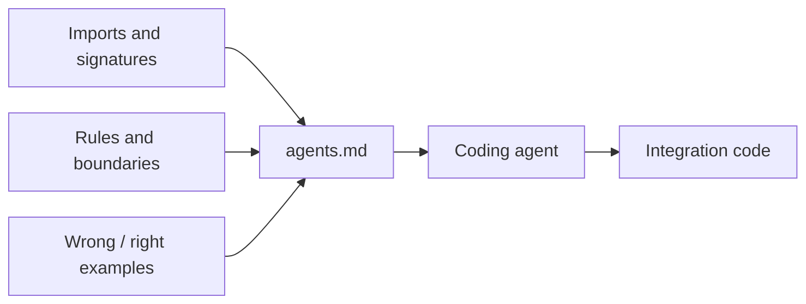

# We started writing documentation for AI coding agents

<div class="bdr-post__hero" data-bdr-post="2026-09-07-documentation-for-ai-coding-agents" role="img" aria-label="One page written for a model, handed over in a single click" markdown="0"></div>

In 2024 I wrote documentation for developers. Somewhere in 2026 I noticed that a good share of the readers were not people. Coding assistants wiring my libraries into services have invented a class that does not exist, called a synchronous function with `await`, and passed a session where the library wants an engine, each time with complete confidence, because the documentation they had read was written for someone who browses. This post is about what I changed: a page per library written for a model, the rules I put on it, the mechanics that hand it to a chat window in one click, and what it turned out to cost.

<!-- more -->

## Two readers, two questions

A person reading library documentation is answering "should I use this, and how does it think?" They start at the overview, skim the concepts, open the quick start, and come back to the reference when a signature is unclear. Prose works for them. Diagrams work for them. A tutorial that builds up over six pages works for them, because they carry state between pages and forgive the pages for not repeating themselves.

A model that is about to write code against the library is answering a narrower question: "what exactly is the API, and what will break if I get it wrong?" It does not browse. It gets whatever was pasted into its context, in one shot, and it fills every gap with the most plausible thing it has seen elsewhere. When a docs site says "pass the coordinator" without saying where the coordinator is imported from, a model imports it from the package root, because that is where such things usually live. When a page shows `await run_alembic_upgrade(...)` and never says that `get_all_revisions` is synchronous, the model awaits both. The failures are not random: they are the library as it would have been designed by the average of every other library.

That is the observation that started this. The model was not misreading the documentation. It was reading it correctly and the documentation was not saying the things it needed. Concepts, yes. Invariants, no.

## One page per library

Every library in the organisation now has a page called `agents.md`, in the navigation as "For AI agents", at `/agents/` on its docs site. It is not a summary of the other pages. It is the whole library on one page, written for a reader that will never see the other pages unless told to fetch one.

The pages share a skeleton, and the skeleton is the design. This is deadline-budget's header, the first thing a model reads:

```text
| Package      | deadline-budget on PyPI, import root deadline_budget                         |
| Requires     | Python 3.10+, no runtime dependencies                                        |
| Install      | pip install deadline-budget · extras: settings (Pydantic models), dishka     |
| Entry points | DeadlineBudget, BudgetContext — both from deadline_budget                    |
| Async        | None. Every method is synchronous and returns immediately; it reads a clock, |
|              | it never sleeps, awaits or cancels                                           |
```

Package name and import root, because they differ and models conflate them. Where the entry points are imported from, because that is the first thing a model gets wrong. Whether anything is async, before a single example, because a model that has seen one `await` will await everything.

Then a section called **Scope** with two paragraphs: what the library does, and what it does not. The second paragraph is the more useful one. deadline-budget's says it "enforces nothing. It starts no timer, spawns no task, cancels nothing, and wraps no client. It has no transport of its own: no header, no context variable, no thread-local." Every one of those clauses is a thing a model would otherwise assume the library does, and then write code that depends on.

Then a **Mental model**, four to six nouns and the flow between them, and a **Wiring** section with the smallest complete program. Then the API as tables: name, signature, what it returns, what it raises. Then the two sections that do most of the work.

<!-- diagram:concept -->
<figure class="bdr-diagram" markdown="1">
<figcaption><span class="bdr-diagram__eyebrow">THE IDEA, VISUALIZED</span><strong>Give the agent the whole contract</strong></figcaption>
<div class="bdr-diagram__viewport" markdown="1" data-search-exclude>



</div>
<p class="bdr-diagram__caption">A single agents page combines imports, signatures, invariants and examples. It reduces the missing context that the model would otherwise fill with guesses.</p>
</figure>
<!-- /diagram:concept -->

## Rules that hold or break the code

Every page has a numbered list under that heading. They are not tips. Each one is an invariant that the library will not enforce for you and that produces working-looking code when broken. A few, from different libraries:

- servicewright: "`serve()` returns while still accepting work. When `stop` is set, return; do not close the listener there. The Host flips readiness to false first, then calls `drain(grace)`."
- alembic-gauntlet: "Your `env.py` decides whether any of this is real. It must run on `config.attributes['connection']` when that key is present. Ignore it and the tests pass while migrating `public` on a connection nobody rolls back."
- grpc-client-kit: "A timeout is the budget of the entire call, retries included. `max_attempts × timeout` is not how long a call can take."
- pg-partsmith: "Give it an `Engine` / `AsyncEngine`, never a `Session` / `AsyncSession`. DDL runs on its own connection and commits immediately; a session's transaction is the wrong shape."
- omni-box: "The library never opens or commits a database transaction."
- clientwright: "`UNSET` is not `None`. `UNSET` defers to the adapter's native default and says so in the report; `None` means explicitly unbounded."

Notice the shape. Each rule names the thing a model would plausibly do, says what happens when it does, and gives the sentence to hold instead. "Engine, never Session" is four words a model can carry through two hundred lines of generated code. The paragraph in the concepts guide that explains why DDL and sessions do not mix is true and useful and a model will not carry it anywhere.

The lists run from fifteen to twenty rules per library. Writing them was the most useful documentation exercise I have done in years, for a reason that has nothing to do with models: to write a rule in that form you have to know the behaviour precisely, and a concepts guide never demands that of its author.

## WRONG, then RIGHT

The second section is **Common mistakes**, and every entry is a pair:

```python
# WRONG — a mixin that does not exist in this package
from alembic_gauntlet.contrib.testcontainers import TestcontainersDatabaseMixin

class TestMigrations(TestcontainersDatabaseMixin, MigrationTestBase): ...

# RIGHT — contrib ships one fixture; import it into a conftest
# tests/conftest.py
from alembic_gauntlet.contrib.testcontainers import migration_db_url  # noqa: F401
```

```python
# WRONG — the budget object sent to another service
await billing.charge(order_id, budget=pickle.dumps(ctx.budget))

# RIGHT — the number sent, a new budget built on arrival
await billing.charge(order_id, timeout=ctx.timeout_for_call("billing.charge"))
# ... in the callee:
budget = DeadlineBudget(total_seconds=timeout_from_request, safety_margin=0.2)
```

The WRONG half is not a straw man. Each one is the plausible shape: what the API would look like if it had been designed by the average of every other library, which is exactly what a model reaches for when a page leaves a gap. A page that describes "the testcontainers integration" and stops there will get you that mixin. Showing the wrong code next to the right code works better than any amount of prose about it, because a model pattern-matches on shape: it will recognise the shape it was about to produce and take the one beside it. There are 83 such pairs across the fourteen pages today.

## The page has to reach the model

A page written for a model is useless if the way to get it there is to select all in a browser and hope the formatting survives. So every documentation page in the organisation is also served as raw Markdown at its own URL: the page at `/guide/quickstart/` is also at `/guide/quickstart.md`, and `/agents/` is `/agents.md`. Nothing clever produces this. After the site builds, a thirty-line script copies each `docs/<path>.md` to `site/<path>.md`, one URL away from the HTML it built. A model that can fetch a URL can fetch the page as text; an agent told "read `/agents.md` before you write code" needs no scraping.

Above every page there is a control for the human with a chat window open. Its main button is **Copy page**, which puts the Markdown on the clipboard. The menu next to it has **View as Markdown**, **Open in ChatGPT**, **Open in Claude** and **Open in Perplexity**, each of which opens the assistant with the page's URL in the prompt and a request to read it first. The generated API reference declines the control with one line of front matter, `copy_page: false`, because its Markdown is a two-line instruction to a docstring renderer rather than the API; a file nothing links to is worse than no file when its content would mislead.

The agents page itself says all of this in a section called "How to read this page", so a model that received it by any route knows what else it may fetch and how. The last section of every page is a **Documentation map**: a table of the other pages and the one situation in which to fetch each. "Read it when you are choosing between `DeadlineBudget` and `BudgetContext`." That is a model-shaped index: not a list of what exists, but a list of when to go and get it.

## Keeping it true

A page like this is a promise about the API, and a stale promise teaches a model an API that no longer exists. That is worse than no page, because the model will trust it over the code. So the page is treated as part of the public surface. Every library's contributing guide says so, the pull request template has a checkbox for it, and the review rule is mechanical: if the diff changes the public surface and `docs/agents.md` is untouched, the pull request is not done.

The skeleton lives in the organisation's library template, with `TODO` markers for the parts that are library-specific, and the instructions for whoever creates a new library, human or agent, say to fill it in before the first commit. The Copy page control is four files that are byte-identical in every repository on purpose, so a change to the control is one sweep across all of them rather than fourteen slightly different fixes. pg-partsmith's page is the worked example the others were shaped after.

What it costs is real. The fourteen pages are 7,045 lines of Markdown between them, from 374 lines for the smallest library to 657 for the largest, and every public change touches one. I have not found a way to make that cheaper, and I have stopped trying, because of what happened next.

## What it did for the humans

The agents page turned out to be the best page on each site for a senior engineer who already knows the domain. The header table answers the five questions they were going to ask. The Scope section tells them in two paragraphs whether the library is the right shape. The rules are the things they would otherwise learn from an incident. It is the page to send a colleague who asks what a library does and what will bite them, and it is the one I open myself when I come back to a library after a month.

I think that is the general lesson. Writing for a reader that has no patience, no context and no ability to browse forced me to say the invariants out loud, put the import next to the name, show the wrong code beside the right, and state what the library does not do as carefully as what it does. Those were always the things worth saying. The model was the first reader honest enough to fail when they were missing.

Every library in [the catalog](https://bedrock-python.github.io/libraries/) has its page under "For AI agents". If you want to see the shape, [pg-partsmith's](https://bedrock-python.github.io/pg-partsmith/agents/) is the one the others were modelled on, and [deadline-budget's](https://bedrock-python.github.io/deadline-budget/agents/) is the shortest complete one.
