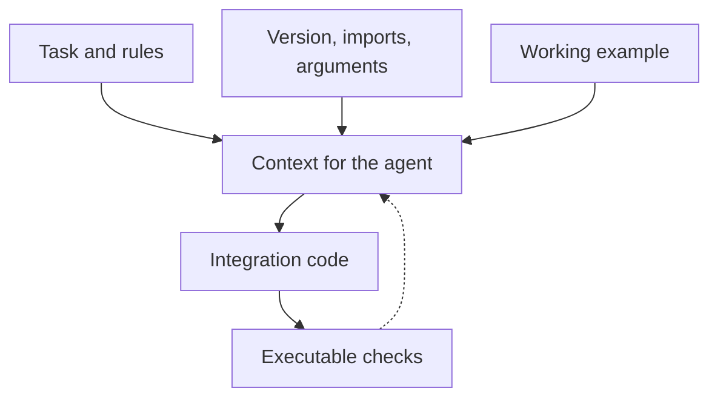

# Documentation an AI coding agent can use and verify {#we-started-writing-documentation-for-ai-coding-agents}

<div class="bdr-post__hero" data-bdr-post="2026-09-07-documentation-for-ai-coding-agents" role="img" aria-label="A task, a versioned API description and a working example lead to code that can be checked" markdown="0"></div>

Imagine asking a coding agent to add a shipping quote to an orders service. It must check stock, then calculate shipping, with 600 ms for both steps and a 400 ms ceiling for each. The project uses deadline-budget. A link to the overview explains the idea, but the implementation also needs the exact import, synchronous methods, timeout units and cancellation behavior.

We will assemble that information into a short task brief, implement the function and test the promises made by the documentation. This is a worked example of writing useful documentation, not a benchmark of an AI model.

<!-- more -->

## Give the reader enough context for the task {#two-readers-two-questions}

“Use deadline-budget” leaves several decisions open. Does creating a budget start a timer? Does `timeout_for_call()` need `await`? Will the library cancel a warehouse request? A plausible answer to any of these can produce incorrect code.

An agent may be able to browse, search the repository and run tests. We should give it a clear starting point and tell it where to verify a missing detail. A human implementing the same function needs those facts too.

For this task, we can provide a brief like this alongside the relevant files:

> Implement `shipping_quote(sku, *, stock, shipping)` using `deadline-budget==0.1.3` on Python 3.13.
>
> Share 600 ms across stock lookup and shipping calculation; cap each at 400 ms. Return `None` when the stock count is zero or negative; otherwise return the quote.
>
> Read the supplied API brief and adapter contract before choosing calls. Run the provided tests and report the result.

The adapters are part of our application. `stock` returns an integer count; `shipping` returns a quote. Both are async callables accepting `sku` and a keyword-only `timeout` in seconds. They must apply that timeout and propagate cancellation. Naming this boundary prevents the example from quietly inventing a warehouse client inside deadline-budget.

## Put imports, defaults and ownership together {#one-page-per-library}

The [Bedrock library template](https://github.com/bedrock-python/python-library-template/blob/master/template/docs/agents.md.jinja) includes `docs/agents.md` for this purpose. For our example, a small API table is enough to orient the reader:

| Question | Answer for this example |
|---|---|
| What is installed? | `deadline-budget==0.1.3`; tested with Python 3.13 |
| Where are the names imported from? | `from deadline_budget import BudgetContext, DeadlineExceededError` |
| How is a context created? | `BudgetContext.create(total_seconds, call_caps=None, *, min_timeout=0.1, safety_margin=0.0)` |
| Which calls need `await`? | Neither `create()` nor `timeout_for_call()`; both are synchronous |
| What are the units? | Seconds; `timeout_for_call()` returns a `float` |
| Who owns the budget? | One context per quote, shared by both steps |
| Who cancels work? | The adapter and the application's `asyncio.timeout()` boundary |
| Which errors matter? | `DeadlineExceededError` while calculating a new timeout; `TimeoutError` from the operation boundary or these adapters |

The [full deadline-budget agent guide](https://github.com/bedrock-python/deadline-budget/blob/master/docs/agents.md) covers more API surface. The [lab README](../lab/2026-09-07-documentation-for-ai-coding-agents/README.md) is our smaller brief for this one integration, including the adapter contract and runnable code. A focused brief should identify its version and scope so a reader knows when to consult the broader reference.

## Show the mistake and its replacement {#wrong-then-right}

Consider a possible mistake inside an async function:

```python
from deadline_budget import BudgetContext

# WRONG: inside an async function
ctx = await BudgetContext.create(total_seconds=0.6)
```

This raises `TypeError`: `create()` returns a `BudgetContext`, which is not awaitable. The correction is small:

```python
from deadline_budget import BudgetContext

ctx = BudgetContext.create(total_seconds=0.6)
timeout = ctx.timeout_for_call("stock")
```

The lab executes the incorrect call and asserts the error. It also checks the public signature and defaults against the installed package. We can therefore explain a specific API mistake without claiming that a model produced it or that a particular prompt always prevents it.

A short pair works well for one local mistake. For a rule spanning several calls, give the reader a complete function instead.

## Make the rules visible in a working example {#rules-that-hold-or-break-the-code}

Here is `shipping.py`. Its only external import is the real budget API; `stock` and `shipping` are supplied by the application:

```python
import asyncio

from deadline_budget import BudgetContext


async def shipping_quote(sku, *, stock, shipping):
    ctx = BudgetContext.create(
        total_seconds=0.6,
        min_timeout=0,
        call_caps={"stock": 0.4, "shipping": 0.4},
    )
    async with asyncio.timeout(ctx.remaining()):
        available = await stock(sku, timeout=ctx.timeout_for_call("stock"))
        if available <= 0:
            return None
        return await shipping(sku, timeout=ctx.timeout_for_call("shipping"))
```

The context starts once, before the stock check. The next timeout is calculated just before each call. If the first step consumes 250 ms, the second gets at most 350 ms; creating a new context there would wrongly give it a fresh budget.

Two details need to be stated beside the code. First, `min_timeout` defaults to 100 ms in version 0.1.3 and can exceed the remaining time. We explicitly use zero here. Second, the budget only calculates numbers. [Python's `asyncio.timeout()`](https://docs.python.org/3.13/library/asyncio-task.html#asyncio.timeout) requests cancellation of the current task when the enclosing operation runs out of time. It relies on cooperative async code; blocking work or suppressed cancellation can overrun it.

The names in `call_caps` are part of the example's contract too. An unknown name has no cap; `"stcok"` does not trigger a configuration error. A typo can therefore change behavior while the code still imports successfully.

<!-- diagram:concept -->
<figure class="bdr-diagram" markdown="1">
<figcaption><span class="bdr-diagram__eyebrow">THE IDEA, VISUALIZED</span><strong>From a task description to verifiable code</strong></figcaption>
<div class="bdr-diagram__viewport" markdown="1" data-search-exclude>


```mermaid
---
config:
  theme: default
  look: classic
  flowchart:
    useMaxWidth: false
    wrappingWidth: 150
    padding: 12
    nodeSpacing: 24
    rankSpacing: 32
---
flowchart TD
    accTitle: From a task description to verifiable code
    accDescr: The task, API details and working example form the context. Integration code is checked, and discovered errors feed back into the documentation.
    A["Task and rules"] --> D["Context for the agent"]
    B["Version, imports, arguments"] --> D
    C["Working example"] --> D
    D --> E["Integration code"] --> F["Executable checks"]
    F -.-> D
```

</div>
<p class="bdr-diagram__caption">The task, API details and working example form the context. Integration code is checked, and discovered errors feed back into the documentation.</p>
</figure>
<!-- /diagram:concept -->

## Give the agent the actual page contents {#the-page-has-to-reach-the-model}

There are two useful handoff paths: give an agent that can fetch files a direct Markdown link, or copy the relevant page into its context. A URL in a prompt is not evidence that the page was retrieved. For a tool that cannot open it, provide the text or a local file.

The library template includes an [export script](https://github.com/bedrock-python/python-library-template/blob/master/template/scripts/emit_markdown.py) and a **Copy page** control. The export runs after the documentation build. Its path mapping includes section indexes:

| Source | Published Markdown |
|---|---|
| `docs/agents.md` | `site/agents.md` |
| `docs/guide/quickstart.md` | `site/guide/quickstart.md` |
| `docs/guide/index.md` | `site/guide.md` |

Pages marked `copy_page: false` are excluded. That matters for an API page whose source contains only a docstring-rendering directive: copying the directive does not give the reader the rendered API. Verify the exported file, including its code blocks and links, rather than assuming the HTML page proves that export works.

Keep a small reading map next to the brief. For this task, it can point to the [deadline article](2026-09-06-timeouts-are-not-deadlines.md) for propagation between calls, [optional dependencies](2026-09-07-zero-dependency-cores.md) for installation choices, and the library reference for an unlisted method. Link by the question a page answers; there is no need to paste every page into every task.

## Test the statements that can become stale {#keeping-it-true}

Our lab checks the version, imports, defaults and the function's behavior. It also compares the README's Python block with `shipping.py` by syntax tree. A code change without the corresponding example update fails the check.

The behavior test records both timeouts. It uses a manually advanced clock only inside the budget module; asyncio keeps its real clock. This is the test body from `test_contract.py`:

```python
async def test_sequential_steps_share_one_budget(self):
    calls = []

    async def stock(sku, *, timeout):
        calls.append(("stock", sku, timeout))
        self.clock.advance(0.25)
        return 3

    async def shipping(sku, *, timeout):
        calls.append(("shipping", sku, timeout))
        return {"shipping_cents": 490}

    result = await shipping_quote("sku-42", stock=stock, shipping=shipping)
    self.assertEqual(result, {"shipping_cents": 490})
    self.assertEqual(
        [(name, sku) for name, sku, _ in calls],
        [("stock", "sku-42"), ("shipping", "sku-42")],
    )
    self.assertAlmostEqual(calls[0][2], 0.4)
    self.assertAlmostEqual(calls[1][2], 0.35)
```

The first 400 ms is the configured per-call cap; the next 350 ms is the shared budget's remainder. Other tests cover empty stock, exhaustion before the second step, the default minimum, a misspelled call name and a stalled step cancelled by the actual asyncio timeout. They distinguish a budget calculation error from a downstream timeout.

Run the checks from the website repository root:

```bash
cd docs/blog/lab/2026-09-07-documentation-for-ai-coding-agents
uv run --no-project --python 3.13 --with-requirements requirements.txt python test_contract.py
```

There are eleven checks, using the pinned package and standard-library test tools. No model call, external service or Docker is involved. They verify that the documented example works; they do not establish how often an agent will implement it correctly.

When a public API changes, review the affected brief, examples and tests in the same change. Passing tests only cover their assertions: they cannot prove that every sentence on an agents page is still correct. Avoid keeping a second hand-written API reference if a short contract and precise links are enough.

<div id="what-it-did-for-the-humans" data-search-exclude></div>

## Leave the next reader a verifiable starting point {#conclusion}

For the shipping task, the useful documentation was concrete: a version, imports, defaults, adapter responsibilities, one working function and a command that checks it. These are also the facts a reviewer needs when assessing the resulting code.

For Bedrock integrations, start with the library's agent page and match it to the installed version. Use the [template](https://github.com/bedrock-python/python-library-template) to create the same starting point for your own package, then add tests for the behavior your examples promise. The goal is enough verified context to implement the task and a clear way to detect mistakes.
