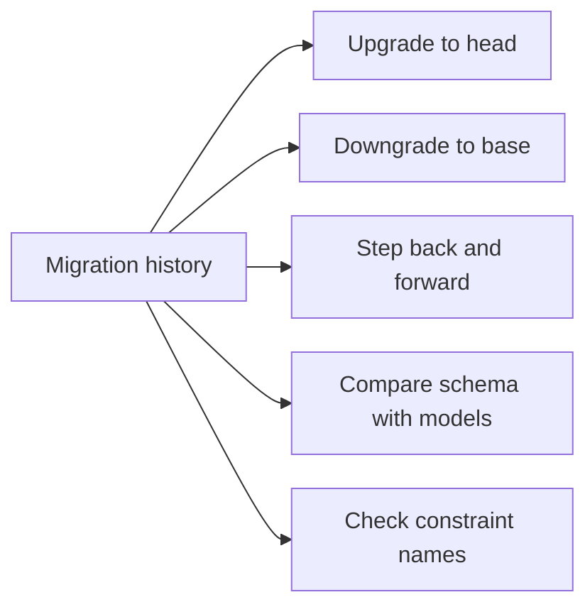

# The five migration tests every Python project should run in CI

<div class="bdr-post__hero" data-bdr-post="2026-09-07-five-alembic-migration-tests" role="img" aria-label="A revision history walked up, back and up again, with five checks planted along it" markdown="0"></div>

We test application code until the coverage badge is green, and then we deploy database migrations that have been run exactly once, on a laptop, in one direction. The `downgrade()` function gets its first real run during an incident, by whoever is on call, against production. I wanted to know how much of that risk a test suite can take away, so I built a small schema with a four-revision history, planted five bugs I have personally shipped, and ran three suites against each: the one most pipelines already have, five checks written by hand against Alembic's own API, and the same five as a library. The first suite caught one bug in five.

<!-- more -->

Everything below was run on one laptop against PostgreSQL 17 in a container, with the code in [the post's lab directory](https://github.com/bedrock-python/bedrock-python.github.io/tree/master/docs/blog/lab/2026-09-07-five-alembic-migration-tests). Versions: Alembic 1.19.2, SQLAlchemy 2.0.52, asyncpg 0.31.0, testcontainers 4.15.0, pytest 9.1.1, pytest-asyncio 1.4.0, alembic-gauntlet 0.2.2, Python 3.13.

## The test most pipelines have

Somewhere in the CI file there is a step that starts a database, runs `alembic upgrade head` and moves on. It looks like this as a test:

```python
async def test_upgrade_head(migration_engine, alembic_config):
    async with fresh_schema(migration_engine) as schema:
        await migrate(migration_engine, alembic_config, schema, command.upgrade, "head")
```

It proves that the migrations apply, in order, to an empty database. That is one of the things a migration has to do. Here is what it proved about my five bugs:

| Bug | `upgrade head` |
|---|---|
| a downgrade forgets the enum type it created | pass |
| a downgrade drops a constraint by a name that never existed | pass |
| a hand-edited migration disagrees with the model about `NOT NULL` | pass |
| two branches, two heads, no merge revision | **fail** |
| a constraint named outside the convention | pass |

Four of five pass. The one that fails, fails because Alembic itself refuses to pick between two heads. Everything else is a migration that applies cleanly and is wrong.

## Five bugs, one file each

The schema is a shop: a `users` table, an `orders` table with a foreign key, an index and a PostgreSQL enum for the status, a check constraint on the amount, and a later `is_active` column on users. Four revisions, all written the way autogenerate would write them, with a naming convention on the metadata so every constraint has a name a downgrade can find:

```python
NAMING_CONVENTION = {
    "ix": "idx_%(column_0_label)s",
    "uq": "uq_%(table_name)s_%(column_0_name)s",
    "ck": "chk_%(table_name)s_%(constraint_name)s",
    "fk": "fk_%(table_name)s_%(column_0_name)s_%(referred_table_name)s",
    "pk": "pk_%(table_name)s",
}
```

Each bug is the clean history with one file changed, and each is something I have seen in a real repository.

**The enum that stays behind.** Revision 0002 creates `orders` with a `status` column of type `order_status`. Its downgrade drops the table. It does not drop the type, because `op.drop_table` does not know the type exists. The downgrade succeeds. The next upgrade does not.

**The typo in the downgrade.** Revision 0003 adds a check constraint called `amount_positive`. Its downgrade drops `positive_amount`. Nobody has ever run this downgrade, so nobody knows.

**The hand edit.** Revision 0004 was autogenerated with `nullable=False` on `is_active`, and then somebody softened it to `nullable=True` in the migration to get a deploy through, and did not touch the model. The model says one thing, the database says another, and every ORM query believes the model.

**Two heads.** Revisions 0003 and 0004 were written on two branches, both off 0002, and merged in the same afternoon. Locally each branch worked. Together, the history has two heads and `alembic upgrade head` refuses to run.

**The name outside the convention.** Revision 0003 adds its check constraint as raw SQL, `ALTER TABLE orders ADD CONSTRAINT amount_positive CHECK (amount > 0)`, because the author knew the DDL and did not look up the Alembic call. The constraint exists, works, and is the only one in the database that does not follow the convention, which means it is the only one a future downgrade will have to look up by hand.

## Five tests, by hand

Each test wants the same two things: an empty schema of its own, and a way to run Alembic against a connection the test controls. The schema is a `CREATE SCHEMA` with a random suffix and a `DROP SCHEMA ... CASCADE` in a `finally`. Running Alembic on a connection is a contract with `env.py`, which I come back to below. With those two helpers in place, the five tests are short.

**One: every revision up, down, and up again.** This is the stairway. It walks the history from base to head and, at each step, applies the revision, rolls it back one step, and applies it again:

```python
async def test_every_revision_up_down_up(migration_engine, alembic_config):
    revisions = revisions_base_to_head(alembic_config)
    async with fresh_schema(migration_engine) as schema:
        for i, revision in enumerate(revisions):
            await migrate(migration_engine, alembic_config, schema, command.upgrade, revision)
            assert await current_revision(migration_engine, schema) == revision
            await migrate(migration_engine, alembic_config, schema, command.downgrade, revisions[i - 1] if i else "base")
            await migrate(migration_engine, alembic_config, schema, command.upgrade, revision)
```

The third line inside the loop is the one that matters. A downgrade that leaves something behind passes its own step and fails the upgrade that follows.

**Two: the schema matches the models.** After a full upgrade, ask autogenerate what it would generate. The right answer is nothing:

```python
async def test_schema_matches_the_models(migration_engine, alembic_config):
    def diff(conn):
        conn.execute(text(f'SET LOCAL search_path TO "{schema}"'))
        ctx = MigrationContext.configure(conn, opts={"version_table_schema": schema})
        return [item for item in compare_metadata(ctx, Base.metadata) if not is_the_version_table(item)]

    async with fresh_schema(migration_engine) as schema:
        await migrate(migration_engine, alembic_config, schema, command.upgrade, "head")
        async with migration_engine.connect() as conn:
            assert await conn.run_sync(diff) == []
```

`compare_metadata` is the function behind `alembic revision --autogenerate`. The only thing it is allowed to notice is the `alembic_version` table, which the models do not know about.

**Three: exactly one head.** No database needed:

```python
def test_exactly_one_head(alembic_config):
    assert len(ScriptDirectory.from_config(alembic_config).get_heads()) == 1
```

**Four: all the way down.** The emergency rollback, rehearsed: upgrade to head, downgrade to base, and check the version table agrees that nothing is applied:

```python
async def test_downgrade_to_base(migration_engine, alembic_config):
    async with fresh_schema(migration_engine) as schema:
        await migrate(migration_engine, alembic_config, schema, command.upgrade, "head")
        await migrate(migration_engine, alembic_config, schema, command.downgrade, "base")
        assert await current_revision(migration_engine, schema) is None
```

**Five: every name follows the convention.** After a full upgrade, reflect every primary key, foreign key, unique, check and index in the schema and match the names against the prefixes the convention promises:

```python
NAME_RULES = {"pk": r"^pk_", "fk": r"^fk_", "uq": r"^uq_", "ck": r"^chk_", "ix": r"^idx_"}

async def test_names_follow_the_convention(migration_engine, alembic_config):
    def offenders(conn):
        insp = inspect(conn)
        bad = []
        for table in insp.get_table_names(schema=schema):
            if table == "alembic_version":
                continue
            named = [("pk", insp.get_pk_constraint(table, schema=schema)["name"])]
            named += [("fk", fk["name"]) for fk in insp.get_foreign_keys(table, schema=schema)]
            named += [("uq", uq["name"]) for uq in insp.get_unique_constraints(table, schema=schema)]
            named += [("ck", ck["name"]) for ck in insp.get_check_constraints(table, schema=schema)]
            named += [("ix", ix["name"]) for ix in insp.get_indexes(table, schema=schema) if not ix.get("duplicates_constraint")]
            bad += [f"{table}.{name}" for kind, name in named if not re.match(NAME_RULES[kind], name or "")]
        return bad

    async with fresh_schema(migration_engine) as schema:
        await migrate(migration_engine, alembic_config, schema, command.upgrade, "head")
        async with migration_engine.connect() as conn:
            assert await conn.run_sync(offenders) == []
```

This one looks like housekeeping until you remember what a downgrade is: a list of names to drop. An object the convention did not name is an object the next person has to go and look up in `pg_constraint` before they can write the rollback.

## What each test caught

Six runs of the suite, one per history, the plain upgrade included:

| | clean | enum left behind | typo in downgrade | hand edit | two heads | name outside convention |
|---|---|---|---|---|---|---|
| `upgrade head` | pass | pass | pass | pass | FAIL | pass |
| every revision up, down, up | pass | **FAIL** | **FAIL** | pass | FAIL | pass |
| schema matches the models | pass | pass | pass | **FAIL** | FAIL | pass |
| exactly one head | pass | pass | pass | pass | **FAIL** | pass |
| all the way down | pass | pass | **FAIL** | pass | FAIL | pass |
| names follow the convention | pass | pass | pass | pass | FAIL | **FAIL** |

Every bug is caught by at least one test, and no test is redundant: the enum is caught by the stairway alone, the hand edit by the diff alone, the name by the naming test alone. Two heads breaks everything that runs `upgrade head`, and the single-head test is the one whose message says why instead of what.

The messages are worth reading, because they are the messages you would otherwise read at two in the morning:

```text
enum left behind        asyncpg.exceptions.DuplicateObjectError: type "order_status" already exists
                        [SQL: CREATE TYPE order_status AS ENUM ('new', 'paid', 'shipped')]

typo in downgrade       asyncpg.exceptions.UndefinedObjectError: constraint "chk_orders_positive_amount"
                        of relation "orders" does not exist

hand edit               Database schema is out of sync with ORM models. Differences:
                        [('modify_nullable', None, 'users', 'is_active', {...}, True, False)]
                        Run: alembic revision --autogenerate

two heads               Found 2 head revisions; expected exactly 1. Merge branches with: alembic merge

name outside convention Check constraint 'amount_positive' on table 'orders' does not follow
                        naming conventions. Allowed prefixes: ['chk_'], suffixes: [].
```

The first two are the database talking. In CI, that is a failed check on a pull request. In production, the first one is a rollback that cannot roll forward again and the second is a rollback that stops halfway.

<!-- diagram:concept -->
<figure class="bdr-diagram" markdown="1">
<figcaption><span class="bdr-diagram__eyebrow">THE IDEA, VISUALIZED</span><strong>Each check asks a different question</strong></figcaption>
<div class="bdr-diagram__viewport" markdown="1" data-search-exclude>



</div>
<p class="bdr-diagram__caption">Reaching head proves only one migration path. Rollback, model comparison and constraint names test separate properties of the history.</p>
</figure>
<!-- /diagram:concept -->

## The thing the naming test taught me

Look again at the typo message: the migration dropped `positive_amount`, and the database complained about `chk_orders_positive_amount`. Alembic applied the naming convention to the name I passed in. When the metadata's convention for a constraint type contains `%(constraint_name)s`, the name you give `op.create_check_constraint` is not the name of the constraint; it is the token the template fills in. `amount_positive` becomes `chk_orders_amount_positive`, which is what you want, and it also means the first version of my clean history, which passed `"chk_orders_amount_positive"` as the name, had created a constraint called `chk_orders_chk_orders_amount_positive`. It passed every test, because the prefix was right.

Autogenerate never has this problem because it wraps every name in `op.f()`, which marks it as final. Hand-written migrations do, and raw SQL bypasses the convention altogether, which is how the fifth bug got its name. The naming test is the only one of the five that tells you what the database actually calls things.

## Running it in CI

The suite needs a real PostgreSQL. SQLite does not have schemas, enums or the same constraint reflection, and a migration test against a different engine tests a different migration. The cheapest real PostgreSQL is a container started once per test session, which is a session-scoped fixture:

```python
# tests/conftest.py
from alembic_gauntlet.contrib.testcontainers import migration_db_url  # noqa: F401
```

On a laptop with the image already pulled, the eleven tests in the lab, the plain upgrade, the five by hand and the five from the library, take 4.3 s, of which 2.7 s is the container starting. The stairway over four revisions is 0.4 s. This is not the slow part of anybody's pipeline, and GitHub's Ubuntu runners have Docker, so the same conftest works there without a `services:` block.

Two settings are not optional. The tests are `async def` with no marker, so pytest-asyncio has to run in auto mode:

```toml
[tool.pytest.ini_options]
asyncio_mode = "auto"
```

And the engine has to use `NullPool`. Each test sets `search_path` on its connection, and a pooled connection would carry that setting into the next test.

## The contract with env.py

Everything above depends on one thing you have to write yourself: an `env.py` that runs on a connection the test hands it, in a schema the test names. Alembic passes arbitrary values through `config.attributes`, and that is the channel:

```python
target_schema = config.attributes.get("target_schema") or os.getenv("MIGRATION_SCHEMA", "public")


def do_run_migrations(connection: Connection) -> None:
    if target_schema != "public":
        connection.execute(text(f'CREATE SCHEMA IF NOT EXISTS "{target_schema}"'))
        connection.execute(text(f'SET LOCAL search_path TO "{target_schema}"'))
    context.configure(connection=connection, target_metadata=target_metadata, version_table_schema=target_schema)
    with context.begin_transaction():
        context.run_migrations()


injected = config.attributes.get("connection")
if injected is not None:
    do_run_migrations(injected)
else:
    asyncio.run(run_migrations_online())
```

In production nothing is injected, the `else` branch runs and the schema is `public`. In a test the runner sets both attributes, opens `engine.begin()` and calls `alembic.command.upgrade` on that connection, so every migration runs inside the test's transaction, in the test's schema, and disappears with it.

`SET LOCAL`, not `SET`. A plain `SET search_path` outlives the transaction and goes back to the pool with the connection, and the next borrower's queries land in a schema that no longer exists. `SET LOCAL` dies with the transaction. This is the line I would check first in any `env.py` that supports schema isolation.

## The five tests as one import

The five hand-written tests above are about eighty lines with their plumbing, and they are the same eighty lines in every service I have worked on. Once a check is the same everywhere, it wants to be a package. [alembic-gauntlet](https://bedrock-python.github.io/alembic-gauntlet/) is these five tests as a base class:

```python
import pytest
from alembic_gauntlet import MigrationTestBase
from sqlalchemy import MetaData

from shop.models import Base


@pytest.mark.integration
class TestMigrations(MigrationTestBase):
    @pytest.fixture
    def orm_metadata(self) -> MetaData:
        return Base.metadata
```

Two fixtures are yours, the database URL and the metadata; the config, the engine, the isolated schema and the five tests are inherited. In the lab both suites ran against all six histories, and the inherited five failed on exactly the same cells as the hand-written five, with the messages quoted above. The naming rules are read from your metadata's `naming_convention`, so the `NAME_RULES` dictionary is not something you maintain. The `env.py` contract is the same contract described above, and it stays yours.

The point was never the package. It was the table with four `pass` cells in the first row.
