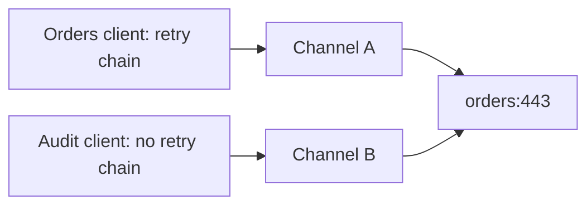

# gRPC channels should not be pooled by address alone

<div class="bdr-post__hero" data-bdr-post="2026-09-07-grpc-channels-pooled-by-identity" role="img" aria-label="A channel's identity is address plus credentials plus options plus interceptors" markdown="0"></div>

A gRPC channel is expensive to open and cheap to keep, so every service that talks to more than one gRPC backend grows a channel pool, and the first pool is always a dictionary keyed by `host:port`. It is the obvious key and it is wrong, because `grpc.aio` bakes more than the address into a channel when it is created: the credentials, the channel options, the compression, and the interceptor chain, none of which can be changed afterwards. Two callers who agree on the address and disagree on any of those get one channel, and the second caller silently runs its calls through the first caller's configuration. I measured the cheapest version of that: an audit client with no retry policy that retried anyway, three times, because it shared an address with the orders client.

<!-- more -->

The numbers come from [the post's lab script](https://github.com/bedrock-python/bedrock-python.github.io/tree/master/docs/blog/lab/2026-09-07-grpc-channel-identity), against an in-process server that counts the attempts it receives. Versions: grpc-client-kit 0.1.0, grpcio 1.83.1, Python 3.13.

## What a channel is

In `grpc.aio`, a channel is created with a target, credentials or the insecure flag, a list of options such as keepalive and message size limits, a default compression, and a list of interceptors. Every one of those is fixed at creation. There is no `channel.add_interceptor()` and no way to change an option; the API is `insecure_channel(target, options, compression, interceptors)` and the channel you get is the channel you keep. That is by design: interceptors run inside the channel, and the channel's connection state, keepalive timer and reconnect backoff are all functions of those arguments.

So a channel's identity is the whole tuple, and a pool that files channels by one element of it, the address, is a pool that will eventually hand a channel built for one caller to another.

## Measured: the audit client that retried

Two clients in one process, both talking to the ledger service at the same address. The orders client has a retry policy, three attempts on `UNAVAILABLE`, because an order that fails to post should be retried. The audit client has no retry policy, because an audit record must be written once or reported as failed, never twice. The ledger answers `UNAVAILABLE` to everything and counts what it receives. First with a pool keyed by address:

```text
pool keyed by address:  orders -> UNAVAILABLE after 3 attempt(s) at the server
                        audit  -> UNAVAILABLE after 3 attempt(s) at the server   (the audit client inherited the orders client's retries)
```

The audit client asked for a channel to `127.0.0.1:port`, the pool had one, built for the orders client with the orders client's interceptors, and the audit client's single call became three attempts at the server. Nothing in the audit client's configuration says retry. Nothing in the audit client's code can find out that it did. On a real ledger those are three audit records, or two `ALREADY_EXISTS` errors, or a duplicate that a downstream reconciliation finds in a month.

The same two clients with a pool keyed by identity:

```text
pool keyed by identity: orders -> UNAVAILABLE after 3 attempt(s) at the server
                        audit  -> UNAVAILABLE after 1 attempt(s) at the server   channels in the pool: 2
```

Two channels to one address, one per interceptor chain, and each client gets exactly the policy it declared. Two channels is not waste; it is the minimum number of channels that can carry two different configurations, because the configuration lives in the channel.

<!-- diagram:concept -->
<figure class="bdr-diagram" markdown="1">
<figcaption><span class="bdr-diagram__eyebrow">THE IDEA, VISUALIZED</span><strong>Same address does not mean the same channel</strong></figcaption>
<div class="bdr-diagram__viewport" markdown="1" data-search-exclude>



</div>
<p class="bdr-diagram__caption">An interceptor chain is part of channel identity. Reuse each identity across requests, while keeping clients with different policies on separate channels.</p>
</figure>
<!-- /diagram:concept -->

## The opposite mistake: a channel per call

Once the chain is part of the identity, the cost of getting it wrong flips. A chain is a list of interceptor *instances*, and two lists built from the same configuration are two identities, so a service that rebuilds its chain per request, out of caution or because the builder call is inside a request handler, mints a new channel for every call:

```text
a chain built per call:  5 calls -> 5 channels
one chain per target:    5 calls -> 1 channel(s)
```

Five calls, five channels, five connection setups, five keepalive timers, and a pool that grows without bound under load. The rule is to build the chain once per target and reuse the list, which is what the client does when it caches the chain it builds per target and why the interceptor factory is called once per target and not once per call. The same rule applies to credentials: the pool compares them by identity, because gRPC credentials define no equality, and a credentials object constructed per request is a channel per request.

## Options are identity too

Keepalive is the option people meet first. A client that pings a server every ten seconds needs the server to permit that, or it is answered with `GOAWAY` and `ENHANCE_YOUR_CALM`, and a keepalive interval is a channel argument. So are the reconnect backoff bounds, the maximum message sizes and the load-balancing policy string. Two clients for one address with different keepalive settings:

```text
two connectivity configs -> 2 channels
```

Again two, and again the minimum. The pool is not being generous; it is refusing to merge two things that gRPC would not let it merge anyway.

## Health, per address

There is one thing that *is* per address rather than per identity: whether the backend is up. A health checker probes addresses, and when an address goes unhealthy every channel to it, whatever its options and chain, is unhealthy together. So the pool's health flag is keyed by address and flips every entry that shares it, while the channels themselves stay keyed by identity. Two keys, two questions: "which channel carries this configuration" and "is anything at this address answering". Conflating them in either direction is a bug, and the address-keyed pool conflates them in one.

## The pool

```python
from grpc_client_kit import ChannelPool, GrpcClient, GrpcClientConfig, RetryConfig, TimeoutConfig, build_interceptors

retrying = build_interceptors(timeout=TimeoutConfig(default=2.0), retry=RetryConfig(max_attempts=3))
plain = build_interceptors(timeout=TimeoutConfig(default=2.0))       # built once each, reused

async with ChannelPool() as pool:                                     # one per process; owns the channels
    orders = GrpcClient(LedgerStub, GrpcClientConfig(target="ledger:50051"), pool, interceptors=retrying)
    audit = GrpcClient(LedgerStub, GrpcClientConfig(target="ledger:50051"), pool, interceptors=plain)
    async with orders as stub:                                        # a stub on the channel for THIS identity
        await stub.Post(request)
```

The pool owns the channels and outlives every client; a client owns nothing and is cheap to create per request, because it only picks a target and asks the pool for the channel that matches its identity. The key the pool uses is the target, the security, the credentials by identity, the options, the compression and a token for the chain, which is the whole of what `grpc.aio` fixed at creation, and nothing less.

That pool is [grpc-client-kit](https://bedrock-python.github.io/grpc-client-kit/guide/channels/)'s `ChannelPool`, whose first design decision was the key.

The point was the second line of the first table. Three attempts, from a client configured for one.
