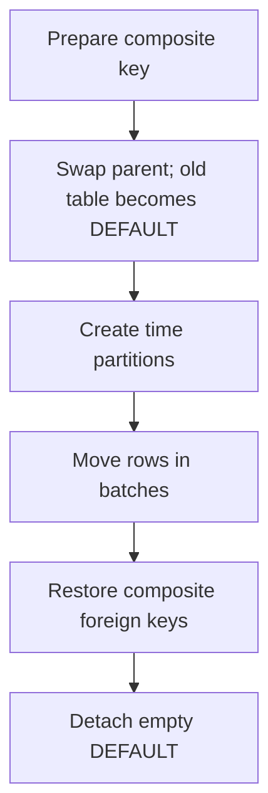

# How to partition an existing PostgreSQL table without rewriting your application

<div class="bdr-post__hero" data-bdr-post="2026-09-07-how-to-partition-an-existing-postgresql-table" role="img" aria-label="Adopt the old table as DEFAULT and drain it window by window while writes continue" markdown="0"></div>

`ALTER TABLE ... PARTITION BY` does not exist. Turning a live table into a partitioned one means making a new parent, adopting the old table as its DEFAULT partition, and draining it window by window while the application keeps writing. I did it to a two-million-row table with a writer inserting the whole time and a reader counting the oldest month, and measured every step: what it locked, how long it held, and what the application saw. The writer's statement never changed, and no row was ever in two places.

<!-- more -->

The numbers come from [the post's lab](https://github.com/bedrock-python/bedrock-python.github.io/tree/master/docs/blog/lab/2026-09-07-partition-existing-table), against PostgreSQL 17 in a container, with a writer inserting every 5 ms and a reader counting the oldest month every 20 ms. Versions: pg-partsmith 1.5.1, asyncpg 0.31.0, Python 3.13.

The table: `events`, two million rows over a year, 263 MB with indexes, `PRIMARY KEY (id)`, plus an `event_notes` table with a foreign key into it.

## Step 1: the primary key has to contain the partition column

The first thing that stops you is not the data, it is the key:

```text
    CREATE TABLE ... (LIKE events INCLUDING ALL) PARTITION BY RANGE (created_at):
      FeatureNotSupportedError: unique constraint on partitioned table must include all
      partitioning columns
```

So `PRIMARY KEY (id)` has to become `PRIMARY KEY (id, created_at)` before anything else. And the second thing that stops you is that the key is load-bearing elsewhere:

```text
    ALTER TABLE events DROP CONSTRAINT events_pkey:
      DependentObjectsStillExistError: cannot drop constraint events_pkey on table events
      because other objects depend on it
```

The foreign key from `event_notes` depends on that index. It has to go first, and it comes back at the end, in a different shape. That is the real cost of partitioning by a timestamp, and it is [the argument for a time-ordered id](2026-09-07-uuidv7-as-a-postgresql-partition-key.md) if you are choosing the schema now rather than migrating one.

The key change itself has two spellings, and the difference is what the writers see:

```text
    DROP CONSTRAINT, ADD PRIMARY KEY (id, created_at):        422 ms
      writer: p50 412.7 ms, longest 413 ms
    CREATE UNIQUE INDEX CONCURRENTLY events_id_created_at_key: 477 ms
    DROP CONSTRAINT, ADD PRIMARY KEY USING INDEX:               3 ms
      writer: p50 1.3 ms, longest 37 ms
```

`ADD PRIMARY KEY` builds the index while holding `ACCESS EXCLUSIVE`, so every writer waits for the whole build: 413 milliseconds here, and minutes on a table with a hundred million rows. Building the index `CONCURRENTLY` first and then promoting it takes three milliseconds under the lock. Same result, and the difference between a blip and an outage.

Two things about the concurrent route: it cannot run inside a transaction, and it can leave an invalid index behind if it fails, which you then drop and retry. Both are fine; neither is a surprise if you know to look.

## Step 2: the swap

One transaction, four statements, two milliseconds:

```sql
BEGIN;
SET LOCAL lock_timeout = '2s';
ALTER TABLE events RENAME TO events_legacy;
ALTER INDEX events_created_at_idx RENAME TO events_legacy_created_at_idx;
ALTER TABLE events_legacy RENAME CONSTRAINT events_pkey TO events_legacy_pkey;
CREATE TABLE events (LIKE events_legacy INCLUDING ALL) PARTITION BY RANGE (created_at);
ALTER TABLE events ATTACH PARTITION events_legacy DEFAULT;
COMMIT;
```

```text
    one transaction: 2 ms
    live rows written so far: 62, in the DEFAULT partition: 51
```

Every row is visible through `events` again the moment that commits, and the application's `INSERT INTO events ...` keeps working without knowing anything happened. The rows written during the swap landed in the DEFAULT partition, which is the old table, which is where they would have gone anyway.

The `lock_timeout` is not decoration. This transaction needs `ACCESS EXCLUSIVE` on the table for a moment, and if a long-running query is holding it, you want the swap to fail in two seconds rather than queue behind that query while every new statement queues behind the swap. Set it, and retry the whole transaction if it fires.

## Step 3: the first maintenance tick

Now the parent exists and needs partitions. The first tick creates the current month and the ones ahead of it:

```text
    plan for public.events:
      CREATE public.events__2026_09 (create_ahead)
      CREATE public.events__2026_10 (create_ahead)
      CREATE public.events__2026_11 (create_ahead)
    created 3, issues 0, error None, 976 ms
    live rows: 109 in this month's partition, 0 left in DEFAULT
    writer: 53 inserts, longest 540 ms
```

The interesting one is the current month, because the writer is inserting into it while it is being created. Attaching a partition for a window whose rows are still in the DEFAULT partition is refused by PostgreSQL, so those rows have to move out of the way first — and any row the writer adds between the move and the attach makes the attach fail again. The move and the attach have to happen under one lock; that is what makes 109 live rows end up in the new partition with none left behind.

The writer's worst insert in that step was 540 milliseconds, waiting for that lock. That is the price of the operation, and it is bounded by how much of the current month is still in DEFAULT.

## Step 4: the drain

The remaining twelve months are still in the old table. They move in batches, oldest window first:

```text
    5 calls, 47 batches, 1,964,376 rows moved into 12 partitions in 13.9 s
    writer: 1938 inserts, p50 0.8 ms, longest 93 ms
    reader: lowest count 28771 of 128771, below full in 6 of 418 samples
      the oldest month was below its full count for about 0.5 s
```

Two million rows in fourteen seconds, with the writer's median insert at 0.8 milliseconds throughout. Each batch is a `DELETE ... RETURNING` piped into an `INSERT`, committing on its own, so a row is in exactly one place at every commit point and an interruption costs you one batch.

The reader's line is the honest caveat. While a window's rows are being moved, they sit in a partition that is not attached yet, so they are invisible through the parent: the oldest month read 28,771 instead of 128,771 for about half a second. PostgreSQL leaves no other ordering — it will not attach a partition while the DEFAULT still holds rows for it — so the choice is between a short window of undercounting per month and a maintenance window with no readers. Rows already in real partitions, and rows still in DEFAULT for other windows, stay visible throughout.

Smaller batches make the window shorter and the drain longer. If your readers cannot tolerate it at all, drain during a quiet hour, or accept that reports for the month being moved are briefly low.

## Step 5: the foreign key comes back, composite

```text
    ADD FOREIGN KEY (event_id) REFERENCES events (id):
      InvalidForeignKeyError: there is no unique constraint matching given keys for
      referenced table "events"
    ADD COLUMN event_created_at:                             1 ms
    backfill it from events (50,000 notes):               2003 ms
    ADD FOREIGN KEY (event_id, event_created_at) NOT VALID:   4 ms
    VALIDATE CONSTRAINT:                                   381 ms
```

The referencing table has to carry the partition column too, because the only unique constraint on the parent is `(id, created_at)`. So `event_notes` gains a column, it is backfilled, and the constraint is added in two steps: `NOT VALID` takes a brief lock and does not scan, then `VALIDATE CONSTRAINT` scans without blocking writes. Four milliseconds and 381 milliseconds instead of one statement that holds the table for the length of the scan.

Do this *after* the drain. Rows that are already referenced cannot be moved at all — the movers refuse them rather than corrupt the reference — so a foreign key in place during the drain turns the migration into a series of refusals.

## Step 6: the empty DEFAULT, and the sequence

The old table is empty now and can go. Except:

```text
    DETACH PARTITION events_legacy: 157 ms
    DROP TABLE events_legacy:
      DependentObjectsStillExistError: cannot drop table events_legacy because other objects
      depend on it
      DETAIL: default value for column id of table events depends on sequence events_id_seq
              default value for column id of table events__2025_09 depends on ...
              (one line per partition)
    the sequence events_id_seq is owned by: events_legacy
    ALTER SEQUENCE events_id_seq OWNED BY events.id: 0 ms
    DROP TABLE events_legacy: 32 ms
```

This is the step nobody writes down. `BIGSERIAL` created a sequence *owned by* the original table's column, and `LIKE ... INCLUDING ALL` gave the new parent and every partition a default of `nextval('events_id_seq')`. Dropping the old table would take the sequence with it, and PostgreSQL refuses rather than break fifteen tables. The `HINT` suggests `CASCADE`, which here would remove the default from every partition and break every insert.

The fix is one statement that costs nothing: reassign ownership of the sequence to the new parent's column, then drop the old table. Do this and not `CASCADE`, and check it in a rehearsal rather than at three in the morning.

## The result

```text
    events__2025_09  128390 rows   ...  events__2026_08  169671 rows
    events__2026_09   37362 rows   events__2026_10  0   events__2026_11  0
    2,001,930 rows through the parent; the writer inserted 1930, 1930 are there
    the writer's statement never changed:
      INSERT INTO events (created_at, kind, payload) VALUES (now(), 'live', $1)
```

Two million original rows plus every row the writer inserted during the migration, in twelve monthly partitions with two months created ahead. The application never changed a query.

## The order, and where the risk is

1. `CREATE UNIQUE INDEX CONCURRENTLY`, then promote it — the key change without a long exclusive lock.
2. Drop the incoming foreign keys.
3. The swap, in one transaction with a `lock_timeout`.
4. The first tick, which claims the current month.
5. The drain, in batches, oldest first.
6. The foreign keys back, composite, `NOT VALID` then `VALIDATE`.
7. Reassign the sequence, detach and drop the old table.

The two steps with real risk are the key change and the swap, and both are short exclusive locks that a `lock_timeout` turns from an outage into a retry. Everything after that is incremental and resumable: a drain that stops half way leaves a partition filled and detached, and the next call finishes it.

Rehearse it on a copy with the production row count. The numbers above scale with table size, and the one you most want to know before the day is how long `CREATE INDEX CONCURRENTLY` takes on your table.

<!-- diagram:concept -->
<figure class="bdr-diagram" markdown="1">
<figcaption><span class="bdr-diagram__eyebrow">THE IDEA, VISUALIZED</span><strong>Separate the structural switch from data movement</strong></figcaption>
<div class="bdr-diagram__viewport" markdown="1" data-search-exclude>



</div>
<p class="bdr-diagram__caption">The new composite key and foreign keys need explicit planning. The table swap is short; draining the old DEFAULT partition is a separate, batched operation.</p>
</figure>
<!-- /diagram:concept -->

## The pieces

The tick, the plan and the drain are [pg-partsmith](https://bedrock-python.github.io/pg-partsmith/): `partition_data` moves the DEFAULT partition's rows into the windows they belong to, in bounded batches, creating each partition as it goes and attaching it once its window is empty, under the lock that makes the last batch and the attach one operation. The DDL for the swap stays yours, because it is four statements you should read before running them on your own table.

Fourteen seconds of draining, two short exclusive locks, and one sequence nobody expected.
