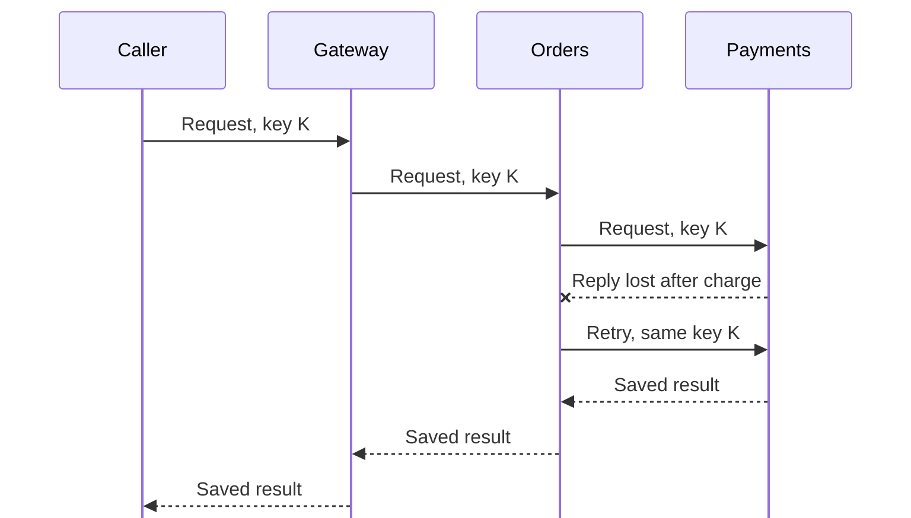

# Idempotency across a chain of microservices

<div class="bdr-post__hero" data-bdr-post="2026-09-07-idempotency-across-a-chain-of-microservices" role="img" aria-label="The key travels with the request all the way down, so one intent means one effect" markdown="0"></div>

One idempotency key in one service is a solved problem. A chain is not, because the retry that matters happens at the top and the effect that matters happens at the bottom, with two or three hops in between that each have their own retry policy. I built a gateway calling orders calling payments, made the first attempt take longer than the caller's timeout, and counted the charges. Without a key that travels, one user request produced four charges. With one, it produced one.

<!-- more -->

The numbers come from [the post's lab](https://github.com/bedrock-python/bedrock-python.github.io/tree/master/docs/blog/lab/2026-09-07-idempotency-across-a-chain), three services in one process with Redis in a container. Versions: idempotency-kit 0.3.0, httpx 0.28.1, Python 3.13.

## The shape of the problem

The gateway gives up after 600 milliseconds and retries once. Orders retries once too. Payments takes 1.5 seconds on its first attempt — the case that matters, where the work completes and the answer is lost.

```text
  no idempotency anywhere         charged 4 time(s); the caller answered on attempt 2;
                                  a later retry answered in 11 ms, charged again: True
```

Four charges from one user action, and a fifth from the user pressing the button again. The arithmetic is the retries multiplying: the gateway's two attempts times orders' two attempts, each reaching payments. Nobody configured "retry four times"; two layers each configured "retry once".

That multiplication is the first thing to understand about a chain. Retry counts do not add, they multiply, and the deepest service — the one that touches money, or sends the email, or ships the box — sees the product of every layer above it.

## The mistake that looks like a fix

The obvious repair is to give every request an idempotency key. Here is that, done the way it usually gets done: each service mints a key when it does not have one, and each attempt gets a fresh one.

```text
  a fresh key per attempt, per hop  charged 2 time(s); the caller answered on attempt 2
```

Better than four and worse than one, which is the worst place to be: it looks like idempotency is working, and it charges the customer twice.

A new key per attempt is not idempotency, it is bookkeeping. The key exists to tell the server "this is the same request you may have already seen", and a key generated inside the retry loop says the opposite on every attempt. This is easy to write by accident — `str(uuid4())` in a request builder is inside the loop, not outside it — and it is invisible in any test where nothing times out.

## The key belongs to the request, not to the attempt

```text
  the caller's key, propagated  charged 1 time(s); the caller no answer;
                                a later retry answered in 4 ms, charged again: False
```

One charge, from an action that was attempted four times through two layers of retries. The key is minted once, by whoever represents the user's intent — the gateway, or the client itself — and travels down every hop as a header. Each service keys its own operation on it, so the same user action maps to one record per service, and a repeat of any attempt at any depth finds that record.

Two details that make it work:

**The key names the intent, not the call.** Payments and orders both key on the same string, but under their own operation names, so "place order 42" and "charge order 42" are separate records that both dedupe. A shared key with no operation namespace would make the first hop's stored result answer the second hop's question.

**It has to survive the retry loop.** The client generates the key before the first attempt and reuses it for every retry of that request. If your HTTP client generates keys, it must do it outside its own retry, which is the same mistake as the previous section, one level down.

<!-- diagram:concept -->
<figure class="bdr-diagram" markdown="1">
<figcaption><span class="bdr-diagram__eyebrow">THE IDEA, VISUALIZED</span><strong>One operation key survives every retry</strong></figcaption>
<div class="bdr-diagram__viewport" markdown="1" data-search-exclude>



</div>
<p class="bdr-diagram__caption">A retry must reuse the original operation identity at every hop. Each service still needs its own scope and a policy for an operation already in flight.</p>
</figure>
<!-- /diagram:concept -->

## The line that says the work is not finished

Look at the middle column: **the caller got no answer.** One charge, correctly, and the user is still staring at a spinner.

That is not a flaw in the idempotency; it is the deadline. The first attempt held the record while it did 1.5 seconds of work, and the retry — arriving at 600 milliseconds — waited for it, and the caller's own timeout fired before either finished. An idempotency key removes the *duplicate*; it does not make a slow action fit in a budget it never fitted in.

What it does do is make the next attempt cheap and correct:

```text
  a later retry answered in 4 ms, charged again: False
```

Four milliseconds, the stored result, no second charge. So the pattern that actually serves the user is: key the request, retry it, and expect one of three answers — the result, "still in progress", or the stored result of the completed one. That is the argument for returning `409` on an in-flight key rather than blocking, and for a client that treats "in progress" as "ask again shortly" rather than as a failure.

## When there is no key to propagate

Not every caller sends one. A message from a queue, a webhook from a provider, an internal call somebody wrote before the convention existed.

```text
  no header, a fingerprint per hop  charged 1 time(s); a later retry answered in 6 ms,
                                    charged again: False
```

Each hop hashes what it was asked to do — the method, the path, the body — and uses that as the key. Same result as the propagated key for this scenario, and a different set of trade-offs.

It works when the request is a complete description of the intent and two identical requests really are the same action. It fails, in the dangerous direction, when they are not: two genuine "add one item to the cart" requests are byte-identical and the second one is supposed to happen. A fingerprint turns those into one.

So: fingerprints are a good default for messages and webhooks, which carry their own identity, and a bad default for a user-facing API where repetition is meaningful. Where both exist, an explicit key wins and the fingerprint is the fallback — and a request that arrives with the same key but a *different* body is a client bug worth rejecting loudly rather than answering from the store.

## What to standardise across the chain

A chain does not work because each service is individually careful. It works because every service agrees on the same four things:

1. **One header name**, propagated by every service to everything it calls, like a trace id. If it is not in the shared HTTP client, it will be forgotten by the third service.
2. **The key is minted once per intent**, by the outermost component that represents it, and reused by every retry at every depth.
3. **Each service keys on it under its own operation name**, so records do not collide across hops.
4. **A retention window longer than the longest possible retry.** A key that expires before the caller's last retry is no key at all, and the caller's last retry may be a person clicking again after lunch.

And one thing to standardise about failures: the deepest service should be the one whose idempotency you trust least, because it is the one whose duplicate costs money. Its window should be the longest and its key the most explicit.

## The pieces

The store and the flow are [idempotency-kit](https://bedrock-python.github.io/idempotency-kit/): a coordinator that reserves the key before the action, stores the result after it, and decides what a concurrent caller gets — wait for the result, or be told it is in progress. The propagation is a header your HTTP client adds, which is what [clientwright](https://bedrock-python.github.io/clientwright/) does for outbound calls, and the single-service version of the argument is in [the idempotency keys post](2026-09-07-idempotency-keys-the-part-everyone-gets-wrong.md).

Four charges, then two, then one. The difference was where the key was created.
