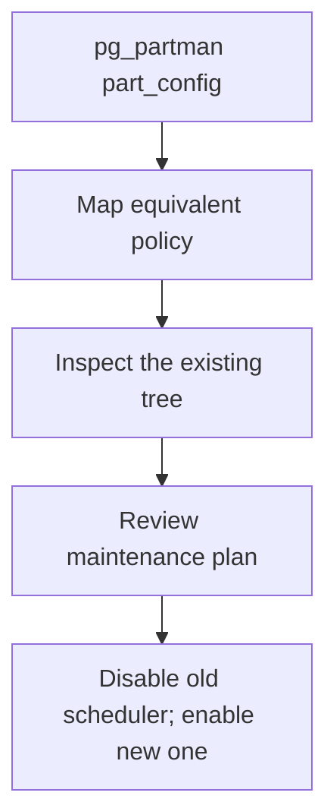

# Migrating from pg_partman to application-managed partitions

<div class="bdr-post__hero" data-bdr-post="2026-09-07-migrating-from-pg-partman" role="img" aria-label="Partitions are owned by their bounds, so an inherited tree is adopted where it stands" markdown="0"></div>

pg_partman is the default answer for PostgreSQL partition maintenance, and it is a good one when you can install extensions and your team is comfortable operating inside the database. Teams leave it for three reasons: a managed PostgreSQL that does not offer the extension, a Python team that would rather have the logic in the application where it is tested and deployed like everything else, and the wish to see what maintenance will do before it does it. The question that stops the migration is always the same: what happens to the partitions that already exist? The answer, measured, is nothing. They are adopted where they stand.

<!-- more -->

The numbers come from [the post's lab](https://github.com/bedrock-python/bedrock-python.github.io/tree/master/docs/blog/lab/2026-09-07-migrating-from-pg-partman), a container running PostgreSQL 17 with pg_partman 5.5.0 installed. Versions: pg-partsmith 1.5.1, Python 3.13.

## What pg_partman built

```text
    events_default     DEFAULT
    events_p20260701   FOR VALUES FROM ('2026-07-01 00:00:00+00') TO ('2026-08-01 00:00:00+00')
    events_p20260801   FOR VALUES FROM ('2026-08-01 00:00:00+00') TO ('2026-09-01 00:00:00+00')
    events_p20260901   FOR VALUES FROM ('2026-09-01 00:00:00+00') TO ('2026-10-01 00:00:00+00')
    events_p20261001   FOR VALUES FROM ('2026-10-01 00:00:00+00') TO ('2026-11-01 00:00:00+00')
    events_p20261101   FOR VALUES FROM ('2026-11-01 00:00:00+00') TO ('2026-12-01 00:00:00+00')
```

Five monthly partitions and a DEFAULT, created by `create_parent` with `p_premake := 2` and maintained by `run_maintenance`. Ordinary PostgreSQL tables attached to a parent with range bounds; the only thing that makes them "pg_partman's" is a row in its configuration table.

## The configuration is the migration

```text
    control                created_at
    partition_interval     1 mon
    premake                2
    retention              3 months
    retention_keep_table   True
```

Five fields, and each maps onto one:

| pg_partman | pg-partsmith |
|---|---|
| `control` | `partition_column` |
| `partition_interval = '1 mon'` | `granularity=PartitionGranularity.MONTH` |
| `premake = 2` | `creation=CreateAhead(count=3)` |
| `retention = '3 months'` | `retention=KeepNewest(count=3)` or `KeepFor(timedelta(days=90))` |
| `retention_keep_table = true` | `drop=DropNever()` |

Two of those deserve care. **`premake` counts partitions *ahead*; `CreateAhead` includes the current one**, so the migration is `premake + 1` and getting it wrong by one is the easiest mistake in the whole exercise. And **`retention` is a duration while `KeepNewest` is a count**, which are the same thing only for a fixed interval; `KeepFor` is the literal translation, `KeepNewest` the one people usually mean.

Everything else in `part_config` — the template table, the background worker's schedule, `infinite_time_partitions` — either has no equivalent because the library does it differently, or is a scheduling concern that moves out of the database and into whatever already runs your jobs.

## Adoption is not a step

The interesting measurement is what the library sees in a tree it did not build:

```text
    inspect: the root has 6 children, 0 detached partition(s) known to the library
    plan for public.events:
      nothing to do
```

Nothing to do. Not "adopt these five partitions", not "these are foreign" — the tree already matches the configuration, so there is no work.

That is because **ownership is decided by bounds, not by names.** A partition whose bounds sit on the scheme's grid is a lifecycle partition of that scheme, regardless of what it is called or which tool created it. `events_p20260901` covers exactly September, so it *is* September's partition. There is no adoption command to run, no metadata to import, and no possibility of building a duplicate for a window that already has one.

The names never converge, and that is fine:

```text
    events__2026_12     <- created by pg-partsmith
    events_p20260801    <- created by pg_partman
    events_p20260901
```

Both naming schemes in one tree, both understood, because neither tool is reading names to decide what a table is.

## Running both at once

The transition is not a switchover if you do not want it to be:

```text
--- 4. one tick of pg-partsmith on the same table
    created=0 detached=0 dropped=0 issues=0 error=None
--- 5. and one more run of pg_partman, after pg-partsmith's tick
    6 partitions: events_default, events_p20260701, ..., events_p20261101
```

Both maintainers ran against the same table and neither did anything, because the tree was already what both configurations describe. A converged tree costs zero DDL, so an overlap period where the old cron and the new job both run is safe: whichever runs first does the work, and the second finds nothing to do.

That is worth using. Run the new maintenance in plan-only mode for a week and compare it against what pg_partman actually did; then let it apply; then turn the old one off. There is no moment where the table is unmanaged, and no moment where two tools fight.

Two things to keep straight during the overlap. Both should agree about creating ahead, or the one that creates further ahead simply wins and the other finds the partition already there — harmless. They must not disagree about **retention**, because that is where one tool removes what the other expects; run the new one with `DropNever()` until the old one is off.

## Switching pg_partman off

Deleting the `part_config` row is the whole of it. Then a policy that differs from what pg_partman was doing:

```text
    plan for public.events:
      CREATE public.events__2026_12 (create_ahead)
      DETACH public.events_p20260701 (retention_expired)
    created=1 detached=1 dropped=0 issues=0
    detached: events_p20260701
      marker='pg-partsmith:orphan-parent=public.events\npg-partsmith:detach'
```

Create one month further ahead, keep one month less history. It created its own December partition and retired pg_partman's July one — a table it did not create, detached under a policy it now owns.

The last line is the safety property. Before detaching, the library writes a marker into the table's comment recording that it detached it and from where. That marker is what a later drop checks: a detached table without it was detached by somebody else and is never dropped. So the July partition is now the library's to retire after the grace period, and any other table sitting around detached is not — which is [the retention argument](2026-09-07-partition-retention-is-not-drop-table.md) with an inherited tree as its subject.

<!-- diagram:concept -->
<figure class="bdr-diagram" markdown="1">
<figcaption><span class="bdr-diagram__eyebrow">THE IDEA, VISUALIZED</span><strong>Transfer the maintenance policy, not the data</strong></figcaption>
<div class="bdr-diagram__viewport" markdown="1" data-search-exclude>



</div>
<p class="bdr-diagram__caption">pg-partsmith inspects the existing partition tree. Match the old policy, inspect its plan, then transfer scheduling ownership; overlapping maintainers are not a general concurrency guarantee.</p>
</figure>
<!-- /diagram:concept -->

## What you give up, and what you get

**You give up** the background worker. pg_partman can maintain itself inside the database with `pg_partman_bgw`; an application-managed library needs something to call it — a Kubernetes CronJob, APScheduler, Celery beat, whatever already runs your scheduled work. That is a real operational difference, and for a team whose database is more reliable than its scheduler it is a reason to stay.

**You get** three things measured elsewhere in this series: a plan you can print before anything runs, ownership that refuses to touch a table it does not recognise, and maintenance that is deployed, versioned and tested with the application rather than with the database. For a Python team, the third one is usually the deciding argument: the partition policy lives in the same review as the code that writes the rows.

**Neither tool** solves the DEFAULT partition for you, and both leave it alone here. If your table has one holding real rows, that is a separate migration, and it is [the drain](2026-09-07-how-to-partition-an-existing-postgresql-table.md).

## The pieces

The adoption above is [pg-partsmith](https://bedrock-python.github.io/pg-partsmith/) doing nothing special: the same `inspect`, `plan` and `maintain` it runs against a tree it built. Ownership by bounds is what makes an existing tree a first-class input rather than a migration problem, and the marker is what keeps retention honest about tables it inherited.

Five partitions, two naming schemes, one tree, and no partition recreated.
