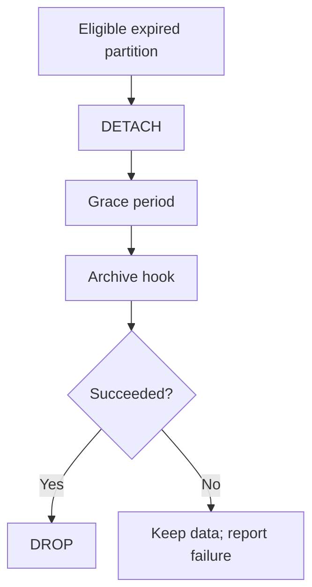

# Partition retention is not DROP TABLE

<div class="bdr-post__hero" data-bdr-post="2026-09-07-partition-retention-is-not-drop-table" role="img" aria-label="A retention job may only retire what it can prove it created" markdown="0"></div>

The retention job is the one line of the partitioning setup that nobody reviews. Find the partitions older than the window, drop them, run it nightly. I gave that job a table with fifteen monthly partitions, one partition somebody else had attached, and a second table with a foreign key into the data. It dropped a partition it did not create, and, on its way past a `DROP` that PostgreSQL refused, it removed all seventeen foreign key constraints from a table it was never asked to touch.

<!-- more -->

The numbers come from [the post's lab](https://github.com/bedrock-python/bedrock-python.github.io/tree/master/docs/blog/lab/2026-09-07-partition-retention), against PostgreSQL 17 in a container. Versions: pg-partsmith 1.5.0, Python 3.13.

## The job everybody writes

List the child tables, sort by name, keep the newest twelve, drop the rest.

```text
    the job's list: ['events__2025_07', 'events__2025_08', 'events__2025_09', 'events_archive_old']
    foreign keys on receipts before the job: 17
    DROP TABLE events__2025_07: DependentObjectsStillExistError: cannot drop table events__2025_07
      because other objects depend on it
    DROP TABLE events__2025_07 CASCADE: dropped
    DROP TABLE events__2025_08: dropped
    DROP TABLE events__2025_09: dropped
    DROP TABLE events_archive_old: dropped
    foreign keys on receipts after the job:  0
```

Four things went wrong in nine lines.

**It dropped a table it did not create.** `events_archive_old` was attached by hand, on a range the monthly scheme does not use, holding data somebody put there on purpose. It was in the list because it was attached to the parent and its name did not look like one of the newest twelve. A name pattern is not ownership.

**PostgreSQL refused, correctly.** An attached partition with a foreign key pointing into it cannot be dropped; the constraint depends on the table. That refusal is the database protecting the referencing rows.

**And the job talked its way past the refusal.** `CASCADE` is what the error message suggests and what the next commit adds. It succeeded, and it did so by dropping the dependent objects: every foreign key on `receipts` disappeared, seventeen of them, one per partition plus the parent. The constraint that guaranteed a receipt always points at a real event is simply gone, on a table the retention job has no business modifying, with no error and nothing in the log.

**The rows went with it.** Dropping an attached partition takes its data. There was no window between "this partition is no longer served" and "this partition no longer exists" — no chance to notice that the retention window was wrong before the data was unrecoverable.

That last one is the general shape of the problem: a `DROP` is a single, immediate, irreversible step. Retention needs to be several steps, and the interesting design work is in what happens between them.

## Print the plan first

The same retention, expressed as a policy and asked what it would do:

```text
    plan for public.events at 2026-09-07T11:17:38+00:00
      DETACH public.events__2025_07 (retention_expired)
      DETACH public.events__2025_08 (retention_expired)
      DETACH public.events__2025_09 (retention_expired)
      DROP public.events__2025_07 (follows_detach)
      DROP public.events__2025_08 (follows_detach)
      DROP public.events__2025_09 (follows_detach)
      [info] unmanaged_partition: public.events_archive_old covers 2025-05-01 .. 2025-07-01, which is
      not a window of the configured scheme; it is not a lifecycle partition and is left alone.
    nothing has run yet: 16 attached, 0 detached, 301 rows through the parent
```

Two things this buys, and they are not the same thing.

The first is that a destructive operation becomes reviewable. It has a name, a reason code, and a place in a list you can read in code review, in a dry-run job in CI, or at three in the morning before you let it run. "What will tonight's retention delete" is a question with an answer.

The second is the `[info]` line. The hand-made partition is *reported*, not silently skipped and not dropped: the planner saw it, decided it is not a lifecycle partition because its bounds are not on the scheme's grid, and said so. Ownership is decided by whether the bounds match the scheme, not by whether the name matches a pattern, and anything that does not match is left alone and reported for a human. A silent skip would be almost as bad as a drop: you would never learn that a table is sitting inside your partitioned table doing nothing.

## Detach and drop are two steps

Detaching removes a partition from the parent: queries through `events` no longer see it, writes no longer route to it, and the table still exists with all its rows. Dropping deletes it. Between those two is where a mistake is still recoverable.

```text
    detached=2 dropped=0 issues=1
    after the tick with a 7-day grace: 14 attached, 2 detached, 261 rows through the parent
      detached: events__2025_07, events__2025_09
```

With a seven-day grace period, tonight's tick detaches and nothing is dropped. If the retention window turns out to have been wrong, the fix is re-attaching a table that still has its data, rather than a restore from backup. Seven days later, if nobody complained, the drop happens.

The default in most tools, and the default here unless you say otherwise, is a zero grace: detach and drop in the same run. That is a defensible default for a table nobody would miss and a bad one for anything else. It is worth making the decision explicitly, because the cost of a grace period is disk and the cost of not having one is a restore.

## The archive runs before the drop, and may refuse it

Retention usually means "we do not need this in the hot table", not "we never want to see this again". So there is a hook before the drop, and what matters is what a failure in it does:

```text
    detached=0 dropped=0 issues=0 error='RuntimeError: the archive bucket is not reachable'
    after the tick whose hook raised: 14 attached, 2 detached, 261 rows through the parent
    the next tick, hook working: dropped=2, archived=['public.events__2025_07', 'public.events__2025_09']
```

The hook raised, nothing was dropped, and the run reported the error. The partitions stayed where they were, and the next tick, with the archive reachable again, archived them and dropped them. That ordering is the whole point: **a before-drop hook that fails must abort the drop**, or the archive is a best-effort log line and the data is gone when it fails.

The inverse arrangement, where the archiver is a separate job that runs before the retention job, has a race in it that only shows up under load: the retention job does not know whether the archive finished. Making the archive a step of the drop rather than a neighbour of it removes the question.

<!-- diagram:concept -->
<figure class="bdr-diagram" markdown="1">
<figcaption><span class="bdr-diagram__eyebrow">THE IDEA, VISUALIZED</span><strong>Detach is reversible; drop is the final step</strong></figcaption>
<div class="bdr-diagram__viewport" markdown="1" data-search-exclude>



</div>
<p class="bdr-diagram__caption">Expired partitions are detached before deletion. A grace period and a successful archive hook precede DROP; a failed hook must leave the detached data intact.</p>
</figure>
<!-- /diagram:concept -->

## What a foreign key does to retention

The third partition in that run was never detached:

```text
    issue: detach public.events__2025_08: PartitionReferencedError: Partition public.events__2025_08 is
    still referenced by rows of another table: removing partition "events__2025_08" violates foreign
    key constraint "receipts_event_id_event_at_fkey2"
```

PostgreSQL refuses to detach a partition whose rows another table still references, and the run recorded it as an issue and carried on with the other two. Safe, and noisy: the same issue appears every night until the referencing rows are gone. The `CASCADE` from the first section is what "fixing" that noise looks like when you fix it in the wrong direction.

The right direction is to put the fact into the policy, so that a referenced partition is not expired in the first place:

```text
    with Unreferenced() in the policy, the plan is: nothing to do
    after the referencing row is gone: detached=1 dropped=1
```

"Older than the twelve newest months **and** no longer referenced." The plan is empty while the receipt exists, there is no issue to page through, and the partition retires on the first tick after the last referencing row goes away. Retention becomes a statement about what may be removed rather than a schedule that fights the database.

## The checklist for a retention job

- **Ownership before anything destructive.** Bounds on the scheme's grid, or a marker the tool itself wrote. Never a name pattern.
- **A plan you can print.** If you cannot ask what tonight will delete, you cannot review it.
- **Detach and drop as separate steps**, with a grace period long enough to notice a mistake.
- **Never `CASCADE`.** It converts a refusal into collateral damage in another table, which is exactly the thing the refusal was protecting.
- **Archive as a before-drop hook**, where a failure stops the drop.
- **Referencing rows in the policy, not in the error log.**
- **A dry run in CI.** The plan for a table with a year of partitions is a few lines, and a diff on those lines catches a changed retention window before it runs.

## The pieces

All of the above is [pg-partsmith](https://bedrock-python.github.io/pg-partsmith/): the plan with its reasons and findings, ownership by bounds plus a marker written before the detach, a grace period the drop counts from, hooks around every phase, and `Unreferenced()` as a retention predicate. The library never issues `CASCADE` and never drops an attached partition, which is why the first section of this post is not something it can be made to do.

Seventeen foreign keys, on a table the job was not asked to touch, removed by a line that was there to save disk space.
