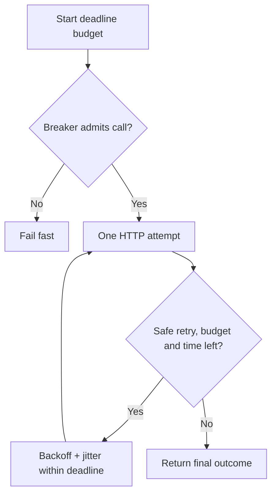

# Reliability is not `retry=3`

<div class="bdr-post__hero" data-bdr-post="2026-09-07-reliability-is-not-retry-3" role="img" aria-label="Retries are one lever among four, and the only one that adds load" markdown="0"></div>

`retry=3` is the first thing anybody adds to an HTTP client and the last thing anybody revisits. It is not a reliability strategy; it is one knob, and on a normal day it is invisible, which is exactly why it survives every review. I pointed forty callers at one dependency and measured what each mechanism does: retries, a deadline, a retry budget and a circuit breaker, alone and together. On a healthy dependency the retries cost nothing at all. On a failing one, they tripled the load on the thing that was already failing.

<!-- more -->

The numbers come from [the post's lab](https://github.com/bedrock-python/bedrock-python.github.io/tree/master/docs/blog/lab/2026-09-07-reliability-is-not-retry-3), forty concurrent callers against an in-process origin. Versions: clientwright 0.2.2, httpx 0.28.1, Python 3.13.

## Why retries look free

The dependency is slow but working — two seconds per request:

```text
  no retries, total=30s     origin saw  40 (1.00x)  ok=40  slowest caller 2.09s
  retry=3, total=30s        origin saw  40 (1.00x)  ok=40  slowest caller 2.05s
```

Identical. Retries fire on failures, and nothing failed, so the retry configuration made no difference to anything: not to the load, not to the latency, not to the outcome. That is the everyday experience of `retry=3`, and it is why nobody ever removes it or thinks about it again.

## What they cost when it matters

The same forty callers against the same dependency returning `503`:

```text
  no retries    origin saw  40 (1.00x)  ok=0  503=40
  retry=3       origin saw 120 (3.00x)  ok=0  503=40
```

Three times the requests, zero extra successes. The dependency that was failing under some load is now failing under three times that load, produced by the clients that are supposed to be protecting themselves from it. And the callers are no better off: every one of them still got an error, a little later.

This is the whole argument against `retry=3` as a strategy. Retries help when a failure is *independent* — one bad connection, one unlucky node, one blip. They actively hurt when a failure is *correlated*, which is what an overloaded or broken dependency produces, because then every client retries at the same time and the load multiplies at the worst moment. And `max_attempts` is a per-call number that has no idea which kind of failure it is looking at.

## A deadline is the first real mechanism

```text
  retry=3, total=1.0s (a deadline)  origin saw 40 (1.00x)  ok=0
                                    slowest caller 1.00s  HttpxDeadlineExceededError=40
```

Two things happened there, and the second is the one people miss.

The good part: every caller got an answer in exactly one second instead of waiting two. A deadline is what turns "the dependency is slow" into "my request failed quickly", and a fast failure is something a caller can handle — a fallback, a cached value, a 503 of its own with a `Retry-After`. A slow success that arrives after the user gave up is worth nothing.

The part to think about: **the origin still saw forty requests and did all forty of them.** It does not know the caller left. So a deadline protects the *caller*, and does nothing for the dependency unless the deadline travels with the request and the dependency stops work that nobody is waiting for. That is [deadline propagation](2026-09-06-timeouts-are-not-deadlines.md), and it is the difference between a timeout and a deadline.

A deadline is also what makes retries safe to have at all: with a total budget, `max_attempts=3` cannot turn a two-second call into a six-second one, because the deadline is the thing that stops it. Retries without a deadline multiply latency; retries under a deadline fit inside a promise.

## A retry budget removes the amplification

```text
  retry=3                    origin saw 120 (3.00x)  503=40
  retry=3, budget_ratio=0.1  origin saw  50 (1.25x)  503=40  budget refused 40
```

The budget is a ratio of retries to requests, held across all calls the client makes rather than per call. Ten percent means the client may issue one retry for every ten ordinary requests, and once that allowance is spent, a failure is simply returned.

Forty retries were refused, and the origin saw a quarter more traffic instead of three times. A single flaky call still gets its retry, because a budget is not a switch: it works exactly as before while failures are rare, and stops multiplying load precisely when failures become common. It is the mechanism that distinguishes an independent failure from a correlated one without needing to know which one it is looking at.

## A circuit breaker protects the next wave, not this one

```text
  retry=3, budget, breaker(8, 5s)  origin saw 50 (1.25x)  503=40
```

The breaker changed nothing for the burst, and that is not a bug. All forty calls were in flight before the failures had been counted, so there was nothing for the breaker to stop. Its value shows in the wave after:

```text
  wave 1 through one client: origin saw 50, 0.09s, 503=40
  wave 2 through one client: origin saw  0, 0.00s, HttpxCircuitOpenError=40
```

The second wave never touched the origin. Forty callers were told, immediately, that this dependency is not answering — no connection, no timeout, no waiting. That is the point of a breaker: it converts a slow, expensive failure into a free one, and it takes the load off a dependency that needs quiet to recover.

The price is on the way back:

```text
  the first success after the origin healed: 5.04 s (breaker recovery_timeout is 5 s)
```

The origin was healthy for five seconds before any caller found out. That number is a direct trade: a short recovery timeout finds the recovery sooner and risks slamming a half-recovered dependency; a long one is gentler and extends the outage past the fix. It is also why a breaker belongs per origin rather than per client — one bad host should not blind you to a healthy one, which is [the per-origin argument](2026-09-07-circuit-breakers-should-be-per-origin.md).

## What none of them do

Every mechanism above is about *the caller's* experience of a failure. None of them makes a retried write safe.

A retried `POST` that timed out may or may not have been processed; the client cannot tell, and the mechanisms in this post do not care. That is why the payment gets charged twice: not because retries were configured wrong, but because retrying a non-idempotent operation is unsafe at any budget. The answer is a key the server can recognise, which is [idempotency](2026-09-07-idempotency-keys-the-part-everyone-gets-wrong.md), and until that exists, the only correct `max_attempts` for a write is one.

The second thing they do not do is fix capacity. A budget and a breaker stop your client from making an overload worse. They do not add servers, and they do not shed load on the server side, where the decision about which requests to drop actually belongs.

## The list

For every dependency, four numbers rather than one:

1. **A deadline**, sized from the caller's own budget, propagated so the dependency can stop work nobody wants.
2. **A retry policy** whose attempts fit inside that deadline, on the status codes that mean "try again", not on the ones that mean "your request is wrong".
3. **A retry budget**, so correlated failures cannot multiply load.
4. **A circuit breaker per origin**, so a dependency that is down costs a caller nothing and gets quiet to recover in.

Plus the one that is not in the client: an idempotency key on anything that changes state, so that a retry is a repeat of a decision rather than a second one.

`retry=3` is item two, with items one, three and four missing, and item five assumed.

<!-- diagram:concept -->
<figure class="bdr-diagram" markdown="1">
<figcaption><span class="bdr-diagram__eyebrow">THE IDEA, VISUALIZED</span><strong>Retries sit inside a bounded logical call</strong></figcaption>
<div class="bdr-diagram__viewport" markdown="1" data-search-exclude>



</div>
<p class="bdr-diagram__caption">A deadline bounds total time; a budget bounds extra work; a breaker rejects calls to an unhealthy origin. Each mechanism limits a different part of the failure.</p>
</figure>
<!-- /diagram:concept -->

## The pieces

All four are configuration on one client in [clientwright](https://bedrock-python.github.io/clientwright/): `TimeoutConfig` for the deadline, `RetryConfig` with `max_attempts`, retryable statuses and `budget_ratio`, and `CircuitBreakerConfig` keyed by origin. The deadline that travels between services is [deadline-budget](https://bedrock-python.github.io/deadline-budget/), and the key that makes a retried write safe is [idempotency-kit](https://bedrock-python.github.io/idempotency-kit/).

One knob turned three times the traffic onto a dependency that was already failing. The other three are the ones that were missing.
