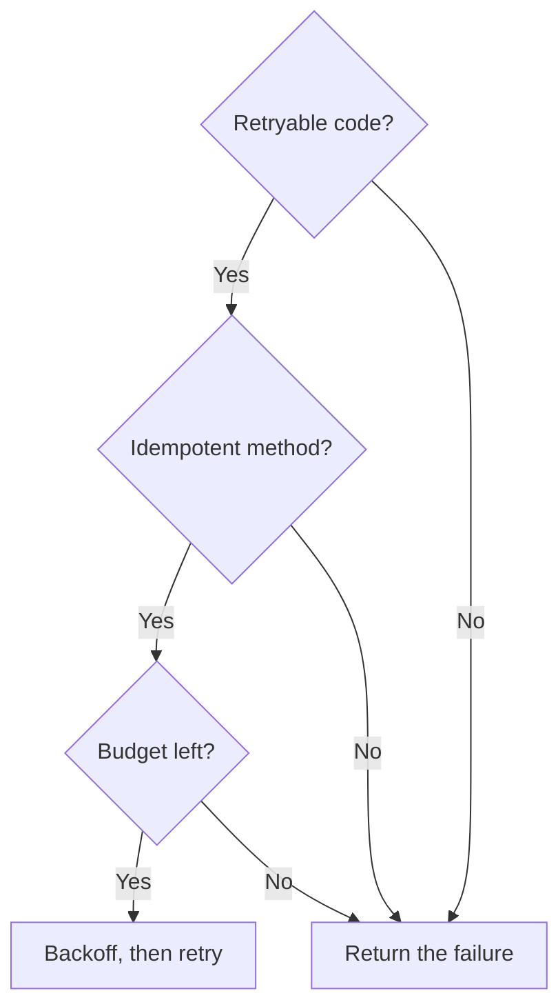

# Safe gRPC retries: which status codes you should actually retry

<div class="bdr-post__hero" data-bdr-post="2026-09-07-safe-grpc-retries" role="img" aria-label="Some status codes make the retry bet safe; two of them do not" markdown="0"></div>

`max_attempts=3` is the most common line in a gRPC client configuration and the least examined. A retry is a bet: the bet that the server did not do the work, so doing it again is free. Some status codes tell you the bet is safe. Most do not, and one of them, `INTERNAL`, tells you the opposite and gets retried anyway in more configs than I would like to admit having written. So I built a payments server that counts every charge it makes and ran retry policies against it. Retrying `INTERNAL` charged the card three times. Retrying `UNAVAILABLE`, the code everyone agrees is safe, also charged it three times in one of the two ways a server can produce it. This post is the table of codes, the measurements behind it, and the three settings that make a retry policy honest.

<!-- more -->

The numbers come from [the post's lab directory](https://github.com/bedrock-python/bedrock-python.github.io/tree/master/docs/blog/lab/2026-09-07-safe-grpc-retries): one `grpc.aio` server on loopback whose `Charge` handler misbehaves on request and counts what it did. Versions: grpcio 1.83.1, grpc-client-kit 0.1.0, Python 3.13.

## What a status code tells you about the work

Every gRPC status code answers one question badly and another one well. The bad question is "what went wrong". The good question is "did the handler run", because that is the question a retry policy is actually asking.

```text
the request was refused before the handler ran        the request is wrong; retrying changes nothing
──────────────────────────────────────────────        ──────────────────────────────────────────────
UNAVAILABLE          connection failed, server         INVALID_ARGUMENT      the payload is bad
                     draining, no healthy backend      NOT_FOUND             the thing is not there
RESOURCE_EXHAUSTED   quota, flow control, a full       ALREADY_EXISTS        it was already done
                     queue ahead of the handler        PERMISSION_DENIED     you may not
                                                      UNAUTHENTICATED       who are you
                     usually. see below.               FAILED_PRECONDITION   the world is not in the right state
                                                      OUT_OF_RANGE          past the end
                                                      UNIMPLEMENTED         no such method

the handler ran, and nobody knows how far
─────────────────────────────────────────
INTERNAL             the handler raised; the write it made before raising is still there
UNKNOWN              an exception nobody mapped
DATA_LOSS            exactly what it says
ABORTED              a conflict mid-transaction; retry the transaction, not the RPC
DEADLINE_EXCEEDED    the request's budget is spent; a retry spends more of what is gone
CANCELLED            the caller left
```

The first column is the only one a client may retry on its own authority, and even that comes with a footnote. The second column is a client bug or a business fact; retrying it is noise. The third column is the one that duplicates side effects, because by definition the server got far enough to fail on its own terms.

The default retry set in [grpc-client-kit](https://bedrock-python.github.io/grpc-client-kit/) is the first column and nothing else: `{UNAVAILABLE, RESOURCE_EXHAUSTED}`. Here is why the footnote matters.

## Measured: five ways to fail a charge

The server's `Charge` handler increments a counter at the moment the card would be charged. Before that line it can refuse; after it, it can fail. The client runs the same request with `max_attempts=3` under different policies, and the table records what the caller saw, how many attempts reached the server, and how many charges were made.

```text
UNAVAILABLE before the handler ran                              -> OK           attempts=2  charges=1
INTERNAL after the charge, default policy                       -> INTERNAL     attempts=1  charges=1
INTERNAL after the charge, INTERNAL made retryable              -> INTERNAL     attempts=3  charges=3
UNAVAILABLE after the charge, default policy                    -> UNAVAILABLE  attempts=3  charges=3
UNAVAILABLE after the charge, Charge not in idempotent_methods  -> UNAVAILABLE  attempts=1  charges=1
```

Row one is the case retries exist for. The first replica was draining and refused before doing anything; the second attempt landed on a working one; the customer was charged once and saw success. That is the entire upside of a retry policy, and it is real.

Row two is the default doing its job: the handler charged the card, then failed writing the ledger, and answered `INTERNAL`. The client did not retry. The caller sees an error and a single charge, which is the honest outcome. It is a bad outcome, but it is one the caller can reason about.

Row three is the config I have written myself, more than once: "INTERNAL is transient, our servers throw it when the database hiccups, retry it." Three attempts, three charges, and the caller still sees `INTERNAL` at the end, so from the client's point of view nothing happened at all. This is the row to remember.

Row four is the footnote. `UNAVAILABLE` is supposed to mean the request never reached the handler, and usually it does, but a replica that is killed after the charge and before the response also surfaces as `UNAVAILABLE`, and so does a handler that aborts with it deliberately. The default policy cannot tell the two apart. Three charges.

Row five is the fix for row four: a whitelist. `idempotent_methods` names the methods that are safe to repeat, and with the whitelist in place nothing outside it is retried, whatever the code. `Charge` is not on it, so the one attempt is the only attempt. `Export`, a read, is on it, and keeps its retries.

That is the design decision behind the policy: the code decides whether the *transport* thinks a retry is safe; the method decides whether the *business* does. A retry needs both.

<!-- diagram:concept -->
<figure class="bdr-diagram" markdown="1">
<figcaption><span class="bdr-diagram__eyebrow">THE IDEA, VISUALIZED</span><strong>A retry needs three permissions</strong></figcaption>
<div class="bdr-diagram__viewport" markdown="1" data-search-exclude>



</div>
<p class="bdr-diagram__caption">A retryable status alone is insufficient: the method must be safe to repeat, and the attempt plus backoff must fit the remaining deadline and attempt limit.</p>
</figure>
<!-- /diagram:concept -->

## The deadline is for the call, not the attempt

The second most common line in a gRPC client config is a timeout, and the second most common bug is that the two lines multiply. Three attempts of a ten-second timeout is thirty seconds, unless something says otherwise.

```text
1.5 s then UNAVAILABLE, timeout 2.0 s, 3 attempts allowed  -> DEADLINE_EXCEEDED  attempts=2  charges=0  2.01s
```

The handler sleeps a second and a half and then refuses. The call's timeout is two seconds. The retry layer converts that timeout into a deadline once, when the call starts, and issues every attempt with what is left of it: the first attempt got 2.0 s and failed at 1.5, the backoff took a tenth, the second attempt got the remaining 0.4 s and hit the deadline, and the third attempt was never made because there was nothing left to make it with. The caller waited 2.01 s, which is the number it was promised. Retries that respected the attempt count instead of the deadline would have waited 4.7 s.

The other post in this series on [deadlines](2026-09-06-timeouts-are-not-deadlines.md) covers what happens when that call is one of five in a request. The rule is the same at every level: a retry spends the budget, it never extends it.

## The breaker counts attempts

A circuit breaker under a retry policy sees every attempt as a failure, because the retry layer sits above it and manufactures the attempts. That has a consequence for the threshold:

```text
fail_threshold=2 under max_attempts=3, first call              -> CircuitBreakerOpenError  attempts=2  charges=2
fail_threshold=2 under max_attempts=3, first call, recoverable -> OK                       attempts=2  charges=1
```

In the first row a single unlucky call tripped its own circuit: two failed attempts reached the threshold, and the third attempt was refused by the breaker before it left the process. The caller did not get the server's `UNAVAILABLE`; it got `CircuitBreakerOpenError`, which is the client telling on itself. In the second row the first attempt failed, the second succeeded, and the breaker's count went back to zero.

So `fail_threshold` has to be larger than `max_attempts`, or a breaker meant to protect the server from a client in a retry storm opens on the first bad call. Five over three is the usual pair.

## Streams are not calls

A unary-stream RPC that breaks halfway is not retried by default, and when you opt in the result needs reading twice:

```text
unary-stream breaks at item 3, default policy               -> UNAVAILABLE  client received [1, 2]              server attempts=1
same, retry_streaming=True and Export in idempotent_methods -> OK           client received [1, 2, 1, 2, 3, 4, 5]  server attempts=2
```

A retried stream is a *restarted* stream. The server sends from the beginning, and the consumer that already saw items one and two sees them again. The second row is a success from the transport's point of view and a duplicate from the consumer's, which is why the kit requires both the flag and the whitelist before it will do this, and logs a warning each time it does. A stream that has to survive a broken connection wants a resume token in its protocol, not a retry in its client. Streaming requests, the other direction, are never retried at all: the request iterator was consumed by the first attempt and cannot be replayed.

## The policy, written down

```python
from grpc_client_kit import CircuitBreakerConfig, RetryConfig, TimeoutConfig, build_interceptors

chain = build_interceptors(
    timeout=TimeoutConfig(default=2.0, per_method={"/lab.Payments/Export": 30.0}),
    retry=RetryConfig(
        max_attempts=3,                                        # per call, inside the timeout above
        idempotent_methods={"/lab.Payments/Export", "/lab.Payments/GetCharge"},
    ),                                                         # retryable_codes stays at the default two
    circuit_breaker=CircuitBreakerConfig(fail_threshold=5),   # more than max_attempts
)
```

Three decisions, each of them named once. The codes stay at the two that mean "the handler did not run". The methods that may be repeated are listed, by full name, and `Charge` is not among them. The breaker's threshold clears the attempt count. The timeout is the call's, and the retry layer divides it rather than multiplying it. Everything else in the retry config is backoff and jitter, which matter for the server's load and not at all for correctness.

One more thing the kit does that is worth knowing: it warns when a channel also carries a native gRPC `retryPolicy` in its service config, because those retries run inside the channel, below every interceptor, and the two layers multiply into nine requests that no log line accounts for. One retry loop per call, whichever one you pick.

The point was the third row of the first table. Three charges, and the caller saw an error.
