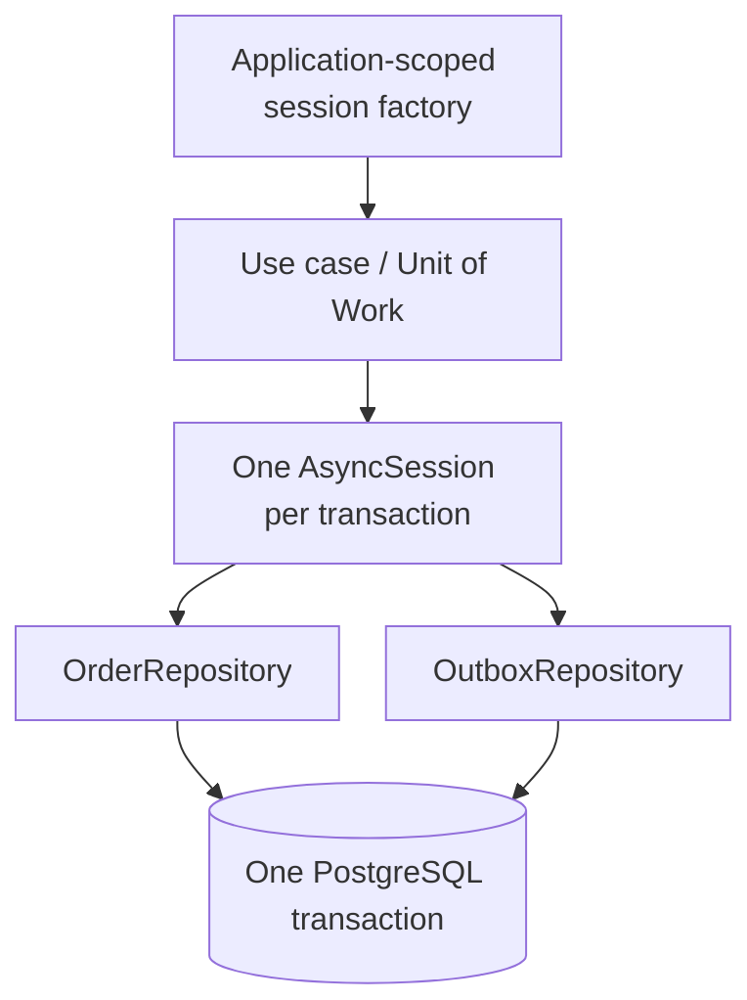

# Stop passing AsyncSession everywhere

<div class="bdr-post__hero" data-bdr-post="2026-09-07-stop-passing-asyncsession-everywhere" role="img" aria-label="A resource with a lifetime and an owner, not a parameter threaded through frames" markdown="0"></div>

Every async SQLAlchemy codebase I have worked on has the same signature, repeated at every level:

```python
async def place_order(session: AsyncSession, order: Order) -> None:
```

The handler takes a session and passes it to the service, which passes it to two other services, which pass it to four repositories. It is the most-repeated parameter in the codebase, and it is not a parameter at all. It is a resource with a lifetime, an owner and a transaction attached to it, and threading it through call frames hides all three. This post measures what that hiding costs: an order that exists with no outbox row, five requests out of six failing on a pool of two, and an `INSERT` that vanishes.

<!-- more -->

The numbers come from [the post's lab](https://github.com/bedrock-python/bedrock-python.github.io/tree/master/docs/blog/lab/2026-09-07-stop-passing-asyncsession-everywhere), against PostgreSQL 17 in a container. Versions: sqlalchemy-foundation-kit 0.3.0, SQLAlchemy 2.0.52, asyncpg 0.31.0, Python 3.13.

## What the parameter is hiding

A session is three things at once. It is a connection checked out of a pool, so it is a scarce resource with a cost. It is a transaction, so it is a unit of atomicity. And it is an identity map, so the objects that came out of it are only meaningful while it is open. A parameter carries none of that. Nothing in the signature says how long the session may be held, who commits it, or whether the caller already has one.

So the two questions that decide correctness, *what is atomic here* and *who commits*, are answered by whoever happens to be holding the parameter at the time. Which means they are answered differently in different call paths.

## What "the same session" is worth

The lab runs one use case, "place an order", which writes a row into `orders` and a row into `outbox`, and the outbox write fails. Four ways of writing it, and what is in the database afterwards:

```text
    a session per repository       RuntimeError     orders=1 outbox=0 failures=0
    threaded, repository commits   RuntimeError     orders=1 outbox=0 failures=0
    one unit of work               RuntimeError     orders=0 outbox=0 failures=0
    unit of work with a savepoint  no exception     orders=1 outbox=0 failures=1
```

The first line is the codebase where somebody, somewhere, opened their own session because the parameter was not in scope. Two sessions, two transactions, and the first one committed. There is now an order that no consumer will ever hear about, and no error anywhere pointing at it: the exception says the serializer failed, and the order looks perfectly normal in the table.

The second line is more interesting, because that design *did* thread one session through, correctly, and produced the same broken state. The difference was a `session.commit()` inside a repository, which is the natural thing to write when you have been handed a session and are finishing your part of the work. The commit ended the transaction that everything else was going to share.

That is the actual rule: **the commit belongs to the use case, not to a repository**. A repository writes and flushes; something above it decides that the whole operation succeeded. And once you have said that out loud, the session parameter stops making sense, because what a repository needs is not a session, it is *this* transaction's session.

The third line is that arrangement, and nothing is committed. The fourth is worth having in the vocabulary too: when a part of an operation is genuinely allowed to fail, a savepoint makes that explicit. The order stays, the outbox row does not, and the failure is recorded in the same transaction. Without a savepoint that would not be possible — a failed statement poisons the whole PostgreSQL transaction, including the statement that would have recorded the failure.

## What it costs the pool

The atomicity argument is the one everybody knows. The pool argument is the one that pages you.

A session is a connection. When each layer opens its own, a request holds two, or three, or however many layers deep the call goes, at the same time. The lab puts six concurrent requests against a pool of two connections with no overflow:

```text
    two sessions per request   2.01 s, orders=1 outbox=1, failures: 5 x TimeoutError
    one session per request    0.01 s, orders=6 outbox=6, failures: none
```

Five of six requests failed with `QueuePool limit of size 2 overflow 0 reached, connection timed out`, and it happened because *one* request held two connections while doing the work of one. The production version of this has a pool of twenty and a hundred concurrent requests, and it looks like a database problem: the pool is exhausted, checkout times are up, and the obvious fix is a bigger pool. The pool was never the problem. The request was using twice the connections it needed, and doubling the pool doubles the load the database sees for the same traffic.

There is a nastier version of the same shape. A request holds a session, calls a service that opens a second one, and that second checkout waits for a connection that will only be released when the first one finishes. On a pool that is fully checked out by requests all doing the same thing, nobody can proceed. That is a self-inflicted deadlock, and it clears itself only when the checkout timeout fires.

## One session, one task

The other thing a threaded session invites is sharing it between tasks, because it is right there and `asyncio.gather` is right there too:

```text
    asyncio.gather on one session: IllegalStateChangeError: Method 'close()' can't be called here;
    method '_connection_for_bind()' is already in progress
    a transaction per task:        both ran in 0.41 s
```

A session is not concurrency-safe. Two statements on one session from two tasks is an error, and it is the kind of error that shows up under load and not in the test that ran the two statements sequentially. Fanning out means a transaction per task, which is a decision about atomicity: those tasks now commit separately, and if that is wrong, they should not have been fanned out.

## What leaves the block

Two more measurements, both about lifetime.

```text
    a transaction used after its block: the session still works
      (and it holds a pooled connection until somebody closes it)
```

That is the bad news. Using a transaction object after its block has exited does not raise; the session opens a *new* implicit transaction and the statement runs in it, outside whatever atomicity the caller thought it had, and the connection stays checked out until something closes it. A stored `tx`, a `tx` on `self`, a `tx` in a `ContextVar` that outlives the block: all of them work, quietly, in the wrong transaction. What should leave a transaction block is domain objects or plain data, never the transaction and never anything still attached to its session.

```text
    an INSERT issued inside query():    0 rows survived
```

And the read path is not a write path with a nicer name. A read-only block that starts no transaction of its own commits nothing, so a write issued inside it is rolled back at close, silently. This is the same class of failure as the first section: the code ran, no exception was raised, and the row is not there.

## What it looks like when the session has an owner

The shape that removes all of the above is not complicated. The session is created by whatever owns the request or the job, the transaction is opened once at the top of the use case, and the repositories take that transaction's session:

```python
async def place_order(uow: AsyncUnitOfWork, order: Order) -> None:
    async with uow.transaction() as tx:          # opens, commits, rolls back
        await OrderRepository(tx.session).add(order)
        await OutboxRepository(tx.session).add(order.id, "orders.placed")
```

The use case names its own boundary. The repositories cannot commit, because committing was never their job and now it is not their vocabulary either. And the unit of work is what the layers below receive, which is a factory and therefore safe to share, unlike the session, which is not.

The DI container is where the last piece goes. The unit of work is a dependency of the handler, resolved per request, and no function below the handler needs to receive a session as an argument at all — the ones that need to write receive a repository, and the repository has the session it was constructed with. A container that provides an application-scoped session factory and a request-scoped transaction makes the lifetime explicit in one place instead of implicit in fifty signatures.

The rule of thumb I use when reviewing: **if a function's signature contains a session and its body does not open a transaction, that session should not be there.** Either the function is a repository, in which case give it the session at construction, or it is a use case, in which case give it the unit of work.

<!-- diagram:concept -->
<figure class="bdr-diagram" markdown="1">
<figcaption><span class="bdr-diagram__eyebrow">THE IDEA, VISUALIZED</span><strong>One owner, one transaction, several repositories</strong></figcaption>
<div class="bdr-diagram__viewport" markdown="1" data-search-exclude>



</div>
<p class="bdr-diagram__caption">The use case owns commit and rollback. Repositories use the same transaction session sequentially; parallel tasks need separate sessions and separate transaction boundaries.</p>
</figure>
<!-- /diagram:concept -->

## The pieces

[sqlalchemy-foundation-kit](https://bedrock-python.github.io/sqlalchemy-foundation-kit/) is the arrangement above with the sharp edges labelled: a session manager that owns the engine and the pool, a unit of work whose `transaction()` commits on success and rolls back on failure, `savepoint()` for the part that is allowed to fail, a read block that starts no transaction, and dishka providers so the container hands the use case a unit of work instead of the handler hunting for a session. The mechanics of the pattern itself are in [the Unit of Work post](2026-09-07-unit-of-work-in-sqlalchemy-2.md); this one is about who is allowed to hold the thing.

An order with no outbox row and a pool that empties itself are the same bug, seen from two directions. The session was passed around, so nobody owned it, so nothing decided when it began or ended.
