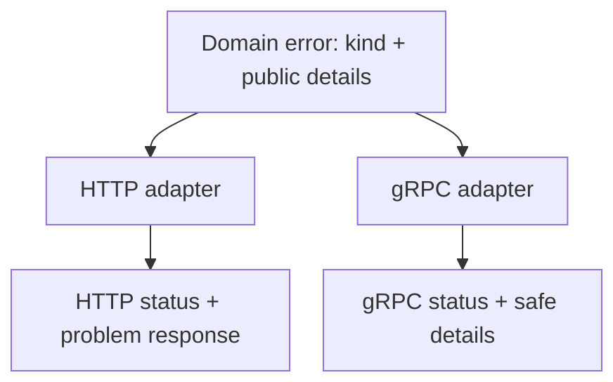

# Transport-independent errors: one domain error, HTTP and gRPC responses

<div class="bdr-post__hero" data-bdr-post="2026-09-07-transport-independent-errors" role="img" aria-label="One domain error, two transports, two correct shapes" markdown="0"></div>

A service that speaks HTTP to the outside and gRPC to its neighbours has two answers for every failure, and the two drift. The HTTP handler learns to return a problem document; the gRPC servicer learns to call `context.abort`; and somewhere between them a `NotFound` becomes a 404 in one place and an `UNKNOWN` with a stack trace in the other. The fix is not a shared helper. It is deciding that the domain raises errors that name what happened, and that each transport is the only thing that knows how to say it.

<!-- more -->

The numbers come from [the post's lab](https://github.com/bedrock-python/bedrock-python.github.io/tree/master/docs/blog/lab/2026-09-07-transport-independent-errors): one service with a FastAPI entrypoint and a gRPC entrypoint over the same use case, called once per transport for every case. Versions: servicewright 0.10.1, grpcio 1.83.1, Python 3.13.

## The domain raises, and does not format

```python
class OrderNotFoundError(ServiceError):
    kind = ErrorKind.NOT_FOUND


class LedgerCorruptedError(ServiceError):
    kind = ErrorKind.INTERNAL
    public = False


async def pay_order(order_id: str) -> Receipt:
    ...
    raise OrderNotFoundError("no order with id 42", params={"order_id": "42"})
```

Two properties do all the work. **`kind`** is the shape of the failure in the vocabulary of the domain — not found, conflict, forbidden, unavailable — which each transport translates into its own alphabet. **`public`** says whether the detail is the caller's business.

Everything else is derived. The error code on the wire is the class name in snake case, so `OrderNotFoundError` becomes `order_not_found` without anybody writing a string twice.

## The same seven calls, two transports

```text
    case         HTTP                                       gRPC
    missing      404 code=order_not_found                   NOT_FOUND  [x-error-code=order_not_found]
                 detail="no order with id 42"               "no order with id 42"
    paid         409 code=order_already_paid                ALREADY_EXISTS  [x-error-code=order_already_paid]
    forbidden    403 code=not_your_order                    PERMISSION_DENIED  [x-error-code=not_your_order]
    provider     503 code=payment_provider_down             UNAVAILABLE  [x-error-code=payment_provider_down]
    ledger       500 code=internal_error, no detail         INTERNAL: internal_error  [x-error-code=internal_error]
    unexpected   500 code=internal_error, no detail         INTERNAL: internal_error  [x-error-code=internal_error]
    ok           200                                        OK
```

Neither handler contains a `try`. The HTTP one returns a dictionary; the gRPC one returns bytes. The mapping is in the transport layer, once.

Three things in that table are worth pulling out.

**The status is a translation, not a copy.** `ErrorKind.CONFLICT` is 409 over HTTP and `ALREADY_EXISTS` over gRPC. The mapping table is a decision per kind, made once, and it is the only place where "what does this mean over this protocol" is answered. gRPC's status set is smaller and vaguer than HTTP's, so some choices are arguable — `ALREADY_EXISTS` against `ABORTED` for a state conflict, for instance — but the point is that they are made in one table rather than in forty handlers.

**The code survives the translation.** `x-error-code` in the trailing metadata carries `order_already_paid` to a gRPC caller, which is what makes the vaguer status usable: a client that needs to distinguish "duplicate" from "wrong state" reads the code, not the status. Over HTTP the same string is a field in the problem document. One vocabulary, two envelopes.

**The last two rows are identical, and that is the point.** `ledger` is a `ServiceError` marked `public=False`; `unexpected` is a plain `RuntimeError` nobody declared. Both reach the caller as a generic internal error with no detail, over both transports, while the real message and its traceback go to the log. A caller cannot tell which one happened, which is exactly right: the difference between "our ledger is corrupt" and "somebody divided by zero" is not information a client is owed.

That last row is the one that breaks in most codebases. Declared errors get careful handling; the undeclared ones fall through to whatever the framework does by default, and gRPC's default is to put `repr` of the exception in the status details. The message in this lab was harmless. The one that made me look was a connection string with a password in it.

## What each layer is allowed to know

The rule that keeps this from rotting: **the domain may not import anything from a transport, and a transport may not know anything about a specific error.**

The domain names failures. A use case raises `OrderNotFoundError`, and it would raise the same thing if the service were a CLI. It never sees a status code, so it cannot get one wrong, and a new transport costs it nothing.

The transport translates kinds. The HTTP layer knows kind-to-status and how to render a problem document; the gRPC layer knows kind-to-status-code and how to write trailing metadata. Neither has a branch for `OrderNotFoundError`, so a new domain error costs the transports nothing either.

What is left over is the interesting part: the two decisions that are neither domain nor transport. *Is this detail public?* is a domain judgement about the message, so it lives on the error class. *What is the default when nobody decided?* is a policy, and it has to be "mask it", enforced by a catch-all at the outermost layer of every transport — because the thing you did not think about is precisely the thing that will leak.

<!-- diagram:concept -->
<figure class="bdr-diagram" markdown="1">
<figcaption><span class="bdr-diagram__eyebrow">THE IDEA, VISUALIZED</span><strong>One domain error, two transport representations</strong></figcaption>
<div class="bdr-diagram__viewport" markdown="1" data-search-exclude>



</div>
<p class="bdr-diagram__caption">The domain owns the error kind and safe public details. Transport adapters choose HTTP or gRPC representation; unexpected internal details stay in server logs.</p>
</figure>
<!-- /diagram:concept -->

## Testing it once

The property to test is not "the HTTP layer returns 404". It is that the two transports agree:

```python
@pytest.mark.parametrize("error, kind", CASES)
def test_both_transports_say_the_same_thing(error, kind):
    ...
```

One parametrised test over the list of domain errors, asserting the HTTP status, the gRPC code and the shared error code for each. It fails when somebody adds a kind and wires it into one table only, which is the drift this design exists to prevent. And it should include the case that is not a `ServiceError` at all, because that is the row that regressed here.

## What this does not solve

Error *messages* for humans are not part of this. `detail` is a developer-facing string; the user-facing text belongs to whatever renders the UI, keyed on the code, in the user's language. Putting a translated sentence in `detail` is how a backend ends up owning copy.

Nor does it decide retryability. A client seeing `UNAVAILABLE` may retry; one seeing `INVALID_ARGUMENT` must not. That distinction is carried by the kind, and it is worth being explicit about which kinds you consider retryable when you choose them — an error kind chosen carelessly becomes a retry storm on somebody else's dashboard, which is [the reliability argument](2026-09-07-reliability-is-not-retry-3.md) arriving from the server's side.

## The pieces

The error model is [servicewright](https://bedrock-python.github.io/servicewright/): `ServiceError` with its `kind`, `code` and `public`, one mapping table per transport, a renderer for RFC 9457 problem documents on the HTTP side, an interceptor that maps kinds to status codes on the gRPC side, and a catch-all at each transport's outermost layer so an undeclared exception is masked rather than printed. The catch-all on the gRPC side landed in 0.10.1, because this lab is what found it missing.

Seven calls, two transports, one table. The row that mattered was the exception nobody declared.
