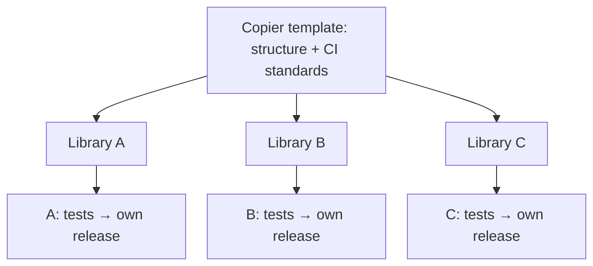

# Twelve libraries, one engineering standard, no monorepo

<div class="bdr-post__hero" data-bdr-post="2026-09-07-twelve-libraries-one-standard" role="img" aria-label="Sixteen independent repositories, cut to one edge profile" markdown="0"></div>

Bedrock Python is sixteen repositories: twelve libraries, two tools, a template and this site. Every library releases on its own schedule, has a zero-dependency core, and can be installed without knowing the others exist. That was the point of splitting them, and it is also the classic argument for a monorepo, because sixteen repositories means sixteen copies of every CI file, lint rule, release pipeline and security setting, drifting in sixteen directions. This post is how they stopped drifting: one template that renders a complete library in 1.3 seconds, one script that configures a GitHub repository the same way every time, and the three things I got wrong on the way.

<!-- more -->

The numbers come from [the post's lab script](https://github.com/bedrock-python/bedrock-python.github.io/tree/master/docs/blog/lab/2026-09-07-twelve-libraries-one-standard), which renders a library from the template and runs the result's own quality gate. Versions: uv 0.11.25, Python 3.13.

## What "one standard" means in practice

Every repository in the organisation gives the same answers to the same questions:

- **Tooling.** uv for the environment and the lock file, hatchling for the build, Ruff for lint and format at line length 120 with twenty rule families selected, mypy strict, pytest with `asyncio_mode = "auto"` and a coverage floor.
- **The gate.** `make check` is Ruff plus mypy; `make test` is unit and integration. CI runs lint, unit tests on the minimum Python and on 3.12 and 3.13, integration tests, and one sentinel job called *All checks passed* that depends on all of them. The sentinel is the only check the branch protection asks for, so adding a job never means editing a ruleset.
- **Releases.** Conventional commits, enforced by a commit-msg hook. Release Please reads them on every push to `master` and maintains one release pull request; merging it tags a release and the Publish workflow ships to PyPI through Trusted Publishing, with no API token anywhere in the organisation.
- **Repository settings.** Squash or merge commits only, branches deleted on merge, no wiki, no projects, the docs site as the homepage, topics taken from `pyproject.toml`'s keywords, secret scanning with push protection, Dependabot alerts and security updates, private vulnerability reporting, a read-only default token for workflows, and one ruleset on `master` that requires a pull request and the sentinel check.
- **Documentation.** A zensical site per library with the same theme, a "For AI agents" page, and a Copy page control on every page, four files of which are byte-identical in every repository on purpose.
- **Dependencies.** Dependabot on the `uv` ecosystem, weekly, one grouped pull request for the dev group and one for the actions.

None of those is remarkable on its own. What is remarkable is that there are sixteen of each and they agree.

## The template

The standard has a canonical form, and it is a [Copier](https://copier.readthedocs.io/) template with nine questions: display name, PyPI name, import name, one-line description, author name and email, GitHub organisation, minimum Python, initial version. Everything else is derived. With every answer on the command line:

```text
$ copier copy --trust --defaults --data project_slug=widget-kit ... python-library-template widget-kit
Template generated. Next steps: 1. uv sync --group dev  2. uv run pre-commit install ...
1.29s total

$ find . -type f | wc -l
41
```

Forty-one files in 1.3 seconds: the package with a `py.typed` and an annotated `__version__.py`, `pyproject.toml` with the tool sections, the Makefile, four workflows, Dependabot, pre-commit, issue and pull request templates, `CONTRIBUTING`, `SECURITY`, `CODE_OF_CONDUCT`, a licence, the docs skeleton with the agents page and the copy-page control, and a test tree with one test that checks the version. Then the generated project's own gate, on the generated project:

```text
$ uv sync --group dev && make check && make test
All checks passed!
8 files already formatted
Success: no issues found in 2 source files
Required test coverage of 90% reached. Total coverage: 100.00%
1 passed in 0.02s
5.16s total
```

A new library is green before it has a single line of its own code, and the first line of its own code is written against the same Ruff, the same mypy and the same test layout as the other twelve. That is the whole trick: the template is not a starting point that repositories diverge from, it is the specification of what a repository is.

<!-- diagram:concept -->
<figure class="bdr-diagram" markdown="1">
<figcaption><span class="bdr-diagram__eyebrow">THE IDEA, VISUALIZED</span><strong>Shared standards, independent releases</strong></figcaption>
<div class="bdr-diagram__viewport" markdown="1" data-search-exclude>



</div>
<p class="bdr-diagram__caption">The template shares project structure and quality gates. Each repository still owns its implementation, release version and publication schedule.</p>
</figure>
<!-- /diagram:concept -->

## The script

The template renders files. It cannot set the things GitHub keeps outside the repository, and those drift worst of all, because nobody reviews a settings page. So the second half of the standard is a script, `setup_repo.py`, that takes `org/repo` and makes the repository's settings match, step by step:

```text
-> Environment: pypi (Trusted Publishing)
-> Environment: github-pages; Pages built by Actions
-> Actions: workflows get a read-only token unless they ask for more; Release Please may open PRs
-> Repository: squash or merge commits only, branches deleted on merge, no wiki/projects, docs as homepage
-> Security: secret scanning + push protection, Dependabot alerts + security updates, private reporting
-> Topics: pyproject keywords + python (existing topics kept)
-> Ruleset master-rules: pull request required, "All checks passed" required, no force-push
-> Classic branch protection: removed (the ruleset replaces it)
```

It is idempotent, so it is also the audit: running it against a repository that is already right changes nothing and says so. When the standard changes, the script changes, and one afternoon of running it sixteen times brings every repository back in line. It ran against all of them over two days in September, and the classic branch protection every repository had accumulated by hand was replaced by the one ruleset.

The ruleset has one setting worth calling out: the "require branches to be up to date" strictness is off. With it on, every feature pull request needs a rebase after any other merge, which in an organisation where a bot merges dependency updates weekly is a rebase per pull request per week for no safety gain the sentinel check does not already provide.

## Releases without a human typing a version

Version numbers are the place where sixteen repositories most want a human, and the place where a human is most likely to be wrong. So there is no version anywhere a person edits. Each commit message says what kind of change it is; Release Please turns `fix:` into a patch bump and `feat:` into a minor one, writes the changelog from the messages, and keeps one open pull request per repository with the next release in it. Merging that pull request is the release. The tag triggers a workflow that rewrites the version file from the tag, builds, and publishes with `uv publish --check-url`, so a rerun against an already-published version is a no-op instead of an error.

Trusted Publishing is what makes this safe to run in sixteen repositories: PyPI trusts the workflow's OIDC identity, scoped to one repository and one environment, and there is no long-lived token to leak, rotate or forget. The whole release path from a merged fix to an installable wheel took under three minutes each of the four times it ran while I was writing this series.

## The three things I got wrong

**Documentation commits cut releases.** The first week the release configuration was standard, a security policy landed in twelve repositories in one sweep and Release Please opened twelve patch-release pull requests, because it counts `docs:` as releasable by default. Every repository now spells its changelog sections out, with `docs`, `chore`, `ci`, `test`, `refactor`, `build` and `style` hidden, so only `feat`, `fix`, `perf` and `revert` release. The template carries that configuration, and this is the kind of lesson a template is for: learned once, fixed everywhere, never re-learned.

**The formatter formats the docs.** Ruff 0.16 started formatting fenced Python inside Markdown by default, and the guides are full of fragments, a keyword argument on its own line, a body without its `def`, that read as code to a formatter and come out as something else. `ruff format --check` went red in every repository on the same day. `extend-exclude = ["*.md"]` in every `pyproject.toml`, from the template.

**Template changes travel one way.** Copier can update a rendered project when the template changes, if the project remembers which template and which answers it came from. Mine do not: most of the twelve predate the template, none carries the answers file, and so a change to a shared file is a sweep, a script that opens the same pull request in every repository, rather than `copier update`. It works, and the four byte-identical copy-page files are kept identical exactly that way, but it is the piece I would do differently from the start. Record the answers on day one, even for a repository that was not born from the template.

## Why not a monorepo

A monorepo would have made all of the above trivial: one CI file, one lint config, one release. It would also have made the thing the libraries exist for impossible. A service that wants request deadlines installs `deadline-budget`, a package with no dependencies, and gets nothing else. A monorepo with one version and one release would couple that decision to the Kafka client's release schedule, and a monorepo with independent versioning is a monorepo that has reinvented sixteen repositories inside one, with worse tooling. The independence is the product. The standard is how the independence stays affordable.

The template, the script and the workflows live in [python-library-template](https://github.com/bedrock-python/python-library-template), and every library in [the catalog](https://bedrock-python.github.io/libraries/) was either born from it or brought back to it.

The point was the second number. Green in five seconds, before the first line of code.
