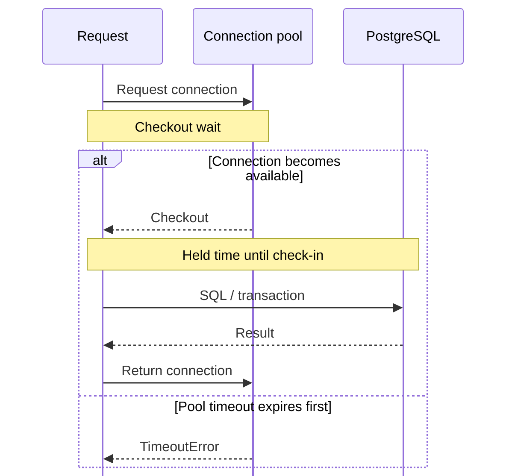

# What to monitor in a SQLAlchemy connection pool

<div class="bdr-post__hero" data-bdr-post="2026-09-07-what-to-monitor-in-a-sqlalchemy-connection-pool" role="img" aria-label="The number everyone dashboards is the one that says nothing" markdown="0"></div>

The dashboard everyone builds first shows connections in use, and it is the least useful of the numbers available. I ran eight workers against a pool of four, made the database three times slower halfway through, and watched what the metrics did. Connections in use said `4/4` before the slowdown and `4/4` after it, unchanged through the entire incident. Everything that mattered was in the other three series.

<!-- more -->

The numbers come from [the post's lab](https://github.com/bedrock-python/bedrock-python.github.io/tree/master/docs/blog/lab/2026-09-07-sqlalchemy-pool-metrics), against PostgreSQL 17 in a container. Versions: sqlalchemy-foundation-kit 0.4.0, SQLAlchemy 2.0.52, asyncpg 0.31.0, Python 3.13.

## The run

Eight workers in a loop, `pool_size=2`, `max_overflow=2`, `pool_timeout=1.0`, and a query that takes fifty milliseconds. Six seconds in, the same query starts taking a second.

```text
   0.5 s  in_use=4/4  checkouts/s=  72  wait=    57 ms  held=    53 ms  timeouts_total=0  failed=0
   2.0 s  in_use=4/4  checkouts/s=  78  wait=    52 ms  held=    52 ms  timeouts_total=0  failed=0
   3.0 s  in_use=4/4  checkouts/s=  78  wait=    53 ms  held=    52 ms  timeouts_total=0  failed=0
  ... the database slows down: queries take 1.0 s instead of 0.05 s
   4.0 s  in_use=4/4  checkouts/s=  16  wait=    55 ms  held=    54 ms  timeouts_total=0  failed=0
   5.0 s  in_use=4/4  checkouts/s=  12  wait=   669 ms  held=  1002 ms  timeouts_total=2  failed=2
   6.0 s  in_use=4/4  checkouts/s=   8  wait=   979 ms  held=  1003 ms  timeouts_total=2  failed=2
   7.0 s  in_use=4/4  checkouts/s=  12  wait=   669 ms  held=  1002 ms  timeouts_total=4  failed=4
   8.0 s  in_use=4/4  checkouts/s=   8  wait=   979 ms  held=  1003 ms  timeouts_total=4  failed=4
```

(`failed` is the application's own count of requests that gave up. The rows at half-second boundaries with no completed checkouts are dropped from this listing: the sampling window is shorter than the query, so every other sample sees nothing finish.)

## Saturation is not an incident

`in_use=4/4` is the first line and the last line. Eight workers against four connections keep the pool full by construction, and that is what a correctly sized pool looks like under load: fully used. A gauge that reads maximum in the healthy state cannot tell you anything about the unhealthy one.

This is why "connections in use" dashboards mislead in both directions. A pool sitting at its limit is not evidence of a problem, and a pool at half its limit is not evidence of health — it might be half-used because the application is failing to get connections at all and has backed off.

What saturation *is* good for is the ratio to what the database can take. `pool_size` times the number of replicas has to stay under PostgreSQL's `max_connections`, minus whatever else connects, and that arithmetic is a capacity plan, not an alert. It is also the number that goes wrong quietly when the deployment scales out: twenty pods with a pool of twenty is four hundred connections.

## The wait is the request's latency

The number that changed when the incident started is how long a caller waited for a connection: fifty-three milliseconds before, up to nine hundred and seventy-nine after.

That number is the queue in front of the pool, and it is pure added latency. It is not time spent doing work, it is time spent waiting to be allowed to do work, and it lands on the user's request exactly as if the database itself had been slow. When the wait is a second, every request pays a second before its query starts.

It is also the leading indicator. The wait rises before the timeouts do, because a caller has to queue for the whole `pool_timeout` before it fails. In this run the wait was already high at five seconds, and the timeouts were still counting up in twos. **Alert on the wait, not on the failures**, and pick the threshold from what your latency budget can absorb rather than from the pool's timeout.

Watch it as a percentile rather than a mean. The mean in the healthy phase was fifty-three milliseconds because *every* caller waited; a pool with plenty of headroom shows a mean near zero and a p99 that spikes when a slow query holds a connection, and the p99 is the request that got hurt.

<!-- diagram:concept -->
<figure class="bdr-diagram" markdown="1">
<figcaption><span class="bdr-diagram__eyebrow">THE IDEA, VISUALIZED</span><strong>Waiting and holding measure different problems</strong></figcaption>
<div class="bdr-diagram__viewport" markdown="1" data-search-exclude>



</div>
<p class="bdr-diagram__caption">Checkout wait is latency before a request gets a connection. Held time begins after checkout and ends at check-in; long holds consume capacity and make other requests wait or time out.</p>
</figure>
<!-- /diagram:concept -->

## Held time is the cause

The other histogram is how long a caller kept the connection after it got one, and in this run it went from fifty-two milliseconds to a flat second, tracking the query time exactly. That is the cause of the wait, and having both numbers separately is what makes the incident readable in one graph:

- **held time up, wait up**: the database or the queries got slower, and the pool is passing that on. Look at the database.
- **held time flat, wait up**: more concurrency arrived, or the pool got smaller. Look at traffic and configuration.
- **held time up, wait flat**: something holds connections longer without contention yet. This is the warning before the previous case, and it is what a long-running transaction, an N+1 loop, or an HTTP call made inside a session block looks like.

That last one is worth its own alert, because held time is not the same as query time. It is the whole time the session block was open, including everything your code did in it. A connection held across an external API call is the classic way to turn a slow dependency into a pool exhaustion, and the held-time histogram is where it shows up before it takes the service down.

The subtle version of this failure is a histogram named "checkout duration" that actually measures held time. It looks like the wait, moves like the wait, and is not the wait — the two are separate series here for exactly that reason.

## The timeout counter is your error budget

`timeouts_total` counts callers that queued for the full timeout and got nothing. In this run it matched the application's own count of failed requests exactly, two for two and four for four, which is what makes it worth alerting on: it is not a proxy for user pain, it *is* user pain, counted at the pool.

Any non-zero rate on this counter deserves a page. There is no healthy amount of "requests that could not get a database connection", and the counter distinguishes the pool running out from the database refusing connections, which is a different failure with a different fix.

## Throughput, and what it tells you about capacity

Checkouts per second went from around seventy-five to under fifteen. That is the arithmetic of the pool: four connections holding a one-second query is four checkouts a second, and no amount of application concurrency changes it. Eight workers against a capacity of four means half of them are queued at any moment, and that is where the wait came from.

Which gives the sizing rule the metrics let you apply: **capacity is pool size divided by held time**. Four connections at fifty milliseconds is eighty operations a second; the same four at a second is four. When a database slows down by a factor of twenty, the pool's capacity drops by the same factor, and no pool size that was right before is right after. This is also why raising the pool during an incident usually makes things worse: the queries did not get faster, and now more of them are queued inside PostgreSQL instead of inside your process, where at least you could see them.

## The six to graph

```text
postgres_db_pool_size                          gauge      what the pool is configured for
postgres_db_pool_checked_out                   gauge      connections in use right now
postgres_db_pool_overflow                      gauge      connections beyond pool_size, in use
postgres_db_connection_checkout_wait_seconds   histogram  how long a caller waited for a connection
postgres_db_connection_held_duration_seconds   histogram  how long it held the connection afterwards
postgres_db_connection_timeouts_total          counter    callers that never got one
```

Two alerts: the wait's p99 above your latency budget, and any rate at all on the timeout counter. One panel with the two histograms overlaid, which reads as "is this us or the database". The gauges are for the capacity conversation, not for the pager.

If PgBouncer sits between the pool and PostgreSQL, `SHOW POOLS` has the same two facts one layer down, `cl_waiting` and `maxwait`, and comparing them with the application's wait tells you which layer is the bottleneck; that comparison is in [the PgBouncer post](2026-09-07-pgbouncer-transaction-mode-async-sqlalchemy.md).

## The pieces

The metrics above come from [sqlalchemy-foundation-kit](https://bedrock-python.github.io/sqlalchemy-foundation-kit/), which instruments the pool it builds and publishes them through a protocol, with a Prometheus implementation in an extra. The wait had to be measured by wrapping the pool's own connect, because SQLAlchemy's checkout event fires once a connection is in hand and knows nothing about the time spent queueing for it.

Connections in use never moved. Everything else did.
