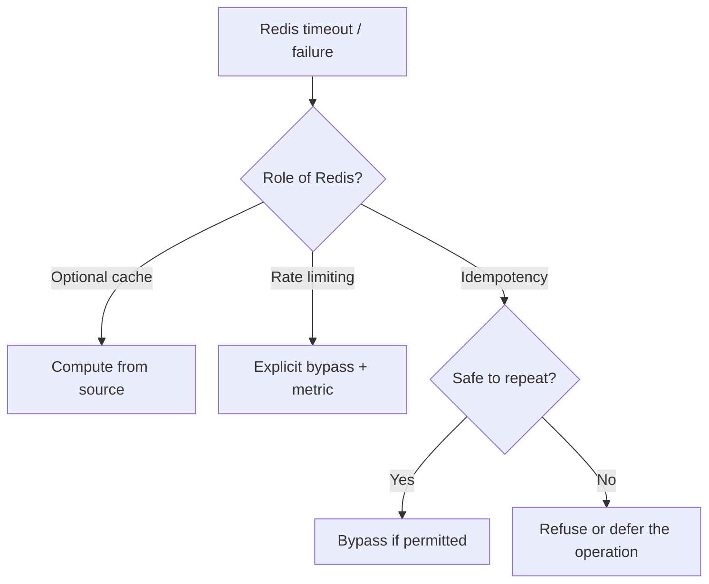

# When should Redis fail open?

<div class="bdr-post__hero" data-bdr-post="2026-09-07-when-should-redis-fail-open" role="img" aria-label="The absent dependency is one thing; what to do without it is three different decisions" markdown="0"></div>

Redis is down. It is your cache, your rate limiter and the store behind your idempotency keys, and every request that arrives now has to decide what to do without it. Refuse them all, and a cache outage is a full outage. Let them all through, and a rate limiter that is not there is a rate limiter that allows everything, and an idempotency store that is not there is a payment that might be charged twice. The question has no single answer, and this post's argument is that it should not have one: the decision belongs to each *use* of Redis, not to the client. What the client owes every one of them is the ability to find out fast that Redis is gone, and that is where the measurement starts.

<!-- more -->

The numbers come from [the post's lab scripts](https://github.com/bedrock-python/bedrock-python.github.io/tree/master/docs/blog/lab/2026-09-07-when-should-redis-fail-open), against Redis 7 in a container that the scripts pause mid-run, so that connections neither succeed nor fail, which is what a dead box on the network looks like. Versions: redis-client-kit 0.1.4, idempotency-kit 0.3.0, redis-py 8.1.0, Python 3.13.

## Before deciding anything: how long does it take to know?

A decision to fail open is worthless if it takes ten seconds to reach. The request that would have been served from the cache in a millisecond instead waits for the socket, and the caller's own deadline expires before the fallback runs. So the first property of a Redis client in a service that fails open is that it fails *fast*. One `GET` against a paused Redis, per client configuration:

```text
bare redis-py, defaults                                 retries=10  -> still waiting        20.00 s  (gave up watching)
bare redis-py, timeouts 0.5 + Retry(NoBackoff(), 0)     retries=0   -> TimeoutError          0.50 s
kit, timeouts 0.5, retries off (the default)            retries=0   -> TimeoutError          0.50 s
```

The bare redis-py client with its defaults has no socket timeout, and a paused server is not a refused connection; it is silence, and the client waits for the operating system to give up, which on this laptop is longer than the twenty seconds I was willing to watch. Setting the socket and connect timeouts to half a second is the obvious fix, and on redis-py 8 it is not enough, because the client also ships a default retry policy of ten attempts with exponential backoff, so a half-second timeout becomes ten to eighteen seconds of retrying. The row that fails in half a second is the one whose retry policy is explicitly zero, which is what a client configured for fail-open has to hand redis-py, and what the kit hands it when retries are off.

Half a second is the budget within which every decision below is made.

## The cache: open, always

```text
Redis up:      cache, first lookup       -> computed                      0.05 s
               cache, second lookup      -> hit 9.99                      0.00 s
Redis paused:  cache lookup (fails open) -> computed (cache unavailable)  0.50 s
```

A cache miss is the normal case and the fallback already exists: compute the value. When Redis is gone, every lookup is a miss that costs the timeout, and the answer is still correct. Nothing about the request's correctness depended on the cache, only its latency, and a latency cost is the right price for a cache outage. The write-back after computing fails too, and is ignored for the same reason. The only thing to watch is the timeout itself: at half a second per lookup, a request that does five cache lookups is two and a half seconds slower than usual, which is the argument for a short timeout and for a circuit breaker in front of the cache during a long outage so the lookups stop being attempted at all.

## The rate limiter: open, and say so

```text
Redis up:      rate limiter                   -> allowed                        0.00 s
Redis paused:  rate limiter, fail_open=True   -> allowed (limiter unavailable)  0.50 s
               rate limiter, fail_open=False  -> denied (limiter unavailable)   0.50 s
```

A rate limiter that cannot count has two options, and both are shown. Failing open means the limit is not enforced for the duration of the outage, which for most APIs is the right trade: the limiter exists to protect against abuse, an outage is not an attack, and refusing every legitimate request to keep out the hypothetical abuser is a worse outcome than letting the abuser in for ten minutes. Failing closed means every request is denied, which is right for a limiter that is a billing boundary or a safety limit on something expensive downstream. The decision is per limiter, and the one thing both must do is log and count the outage so that "the limiter was off from 14:02 to 14:11" is a known fact and not a mystery in next month's usage report.

## The idempotency store: it depends on what repeating costs

```text
Redis up:      idempotent charge                            -> charge_id='ch_1'   0.01 s
Redis paused:  idempotent charge, new key (fails open: runs)  -> charge_id='ch_2'   1.00 s
               idempotent charge, SAME key again (store gone) -> charge_id='ch_3'   1.01 s
               charges made while the store was gone: 2
```

With the store gone there is no way to know whether this key was seen before. The coordinator runs the action, which is the availability-over-exactly-once trade the [idempotency post](2026-09-07-idempotency-keys-the-part-everyone-gets-wrong.md) describes, and the measurement shows what it costs: two calls with the same key while the store was gone made two charges. For a cache invalidation or an email, that is fine. For a card charge it depends entirely on whether the provider deduplicates on its own key, which the good ones do and which is why the key is passed downstream; where it does not, the right decision is to fail closed on the operation, return a retryable error, and let the client try again when the store is back. That is a decision the coordinator cannot make, because it does not know what the action costs to repeat, so it counts and logs the storage error and leaves the raising to the caller who does.

<!-- diagram:concept -->
<figure class="bdr-diagram" markdown="1">
<figcaption><span class="bdr-diagram__eyebrow">THE IDEA, VISUALIZED</span><strong>Choose by the cost of repeating the operation</strong></figcaption>
<div class="bdr-diagram__viewport" markdown="1" data-search-exclude>



</div>
<p class="bdr-diagram__caption">Fail-open is a business decision after a bounded Redis failure. Bypassing a cache can be acceptable; bypassing deduplication for a charge can duplicate money movement, so the application must choose that policy explicitly.</p>
</figure>
<!-- /diagram:concept -->

## Health: what readiness should depend on

```text
Redis up:      health check -> True    0.00 s
Redis paused:  health check -> False   0.50 s
```

The health check answers false within the same half second, and the question is what to do with that. Marking the pod unready because Redis is down takes the pod out of the load balancer, and if every pod does it, Redis being down becomes the service being down, which is the fail-closed answer applied to the whole process. For a service whose Redis uses all fail open, the check belongs in the *liveness* of nothing and the *readiness* of nothing; it is a metric and an alert. For a service where one use fails closed, readiness should reflect that use, so that traffic goes to pods that can serve it. Most services are the first kind and wire the check into readiness anyway, out of a feeling that a dependency being down should be visible somewhere. It should be visible on the dashboard, not in the endpoint list.

## And then it comes back

```text
Redis back:    kit GET, same client, no restart -> b'9.99'   0.00 s
               health check                     -> True      0.00 s
```

The same client, no restart, no reconnect logic in the application: the connection pool discards the connections that failed and opens new ones on the next command. Fail-open code that works during the outage and needs a redeploy after it has not failed open; it has failed differently.

## The shape

```python
from redis_client_kit import check_async_redis_health, create_async_redis_client
from redis_client_kit.settings import BaseRedisSettings, RedisConnectionSettings, RedisPoolSettings

settings = BaseRedisSettings(
    key_prefix="shop",
    connection=RedisConnectionSettings(host="redis", port=6379),
    pool=RedisPoolSettings(socket_timeout=0.5, socket_connect_timeout=0.5),   # how long "gone" takes to notice
)                                                                            # retries off: zero, not redis-py's ten
redis = create_async_redis_client(settings)                                  # a plain redis.asyncio.Redis
```

One decision on the client: how long finding out may take. Every other decision, open or closed, per use, is in the code that uses it, wrapped in the two exceptions that mean "Redis is gone" and a log line that says so. That client is [redis-client-kit](https://bedrock-python.github.io/redis-client-kit/), which builds a redis-py client from a settings object and, since 0.1.4, hands redis-py an explicit zero-retry policy when retries are off, because the version before it handed nothing and got ten.

The point was the first table. Half a second, or ten.
