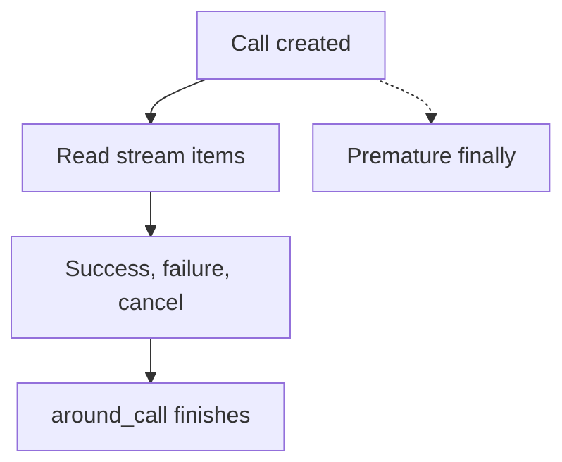

# Why gRPC interceptors break on streaming RPCs {#why-grpc-interceptors-break-on-streaming-rpcs}

<div class="bdr-post__hero" data-bdr-post="2026-09-07-why-grpc-interceptors-break-on-streaming-rpcs" role="img" aria-label="A reporting stream keeps running after a timer around call creation has already stopped" markdown="0"></div>

Imagine an export worker downloading rows from a reporting service over gRPC. The download takes hundreds of milliseconds, but its interceptor records almost zero. When the server fails after two rows, the worker receives an error while the interceptor still reports success.

We will reproduce both problems, fix the measurement and check what happens when the worker stops reading. The examples run against a real local gRPC server with `grpc-client-kit 0.4.0`, `grpcio 1.84.0` and Python `3.13`.

<!-- more -->

## The reporting service we will call {#reporting-service}

Our service has four operations, one for each RPC shape. In a shape such as unary-stream, the first part describes the request and the second the response:

| Method | RPC shape | What the worker does |
|---|---|---|
| `Get` | unary-unary | Fetch one report status |
| `Stream` | unary-stream | Download report rows |
| `Upload` | stream-unary | Send rows and receive a count |
| `Chat` | stream-stream | Send rows and receive acknowledgements |

The lab uses byte messages and generic gRPC handlers to avoid a protobuf generation step. It still sends real RPCs over `127.0.0.1` on an automatically selected port. Here is the row generator behind `Stream`:

```python
import asyncio

import grpc

GAP = 0.03
ITEMS = [bytes([number]) for number in range(1, 6)]


async def report_rows(request, context):
    for number, row in enumerate(ITEMS, start=1):
        if request == b"fail" and number == 3:
            await context.abort(
                grpc.StatusCode.UNAVAILABLE, "report generator failed at row 3"
            )
        if request != b"fast":
            await asyncio.sleep(GAP)
        yield row
```

A request containing `b"ok"` receives five rows. `b"fail"` receives two, then `UNAVAILABLE`. `b"fast"` removes the pauses for a later timing check. The service also sends trailing metadata `report-id: r-42`.

## First, make sure the interceptor actually runs {#the-interceptor-that-is-registered-for-one-kind-out-of-four}

Suppose we put all four methods into one interceptor:

```python
from collections import Counter

import grpc
import grpc.aio


class EverythingInterceptor(
    grpc.aio.UnaryUnaryClientInterceptor,
    grpc.aio.UnaryStreamClientInterceptor,
    grpc.aio.StreamUnaryClientInterceptor,
    grpc.aio.StreamStreamClientInterceptor,
):
    def __init__(self):
        self.calls = Counter()

    async def intercept_unary_unary(self, continuation, details, request):
        self.calls["unary_unary"] += 1
        return await continuation(details, request)

    async def intercept_unary_stream(self, continuation, details, request):
        self.calls["unary_stream"] += 1
        return await continuation(details, request)

    async def intercept_stream_unary(self, continuation, details, request):
        self.calls["stream_unary"] += 1
        return await continuation(details, request)

    async def intercept_stream_stream(self, continuation, details, request):
        self.calls["stream_stream"] += 1
        return await continuation(details, request)
```

After calling each service method once, `calls` contains only `{"unary_unary": 1}`. In the tested grpcio version, the [channel constructor](https://grpc.github.io/grpc/python/_modules/grpc/aio/_channel.html) registers each object through an `if`/`elif` chain. The first matching base class wins.

Use one native interceptor object per RPC shape, or the four adapters supplied by `grpc-client-kit` below. Before comparing timings, the lab asserts that the measured interceptor was entered. An untouched counter is not evidence of a fast RPC.

## Timing continuation measures setup {#what-a-unary-interceptor-measures-on-a-stream}

This interceptor has only the streaming base class, so registration is correct. Its measurement is still wrong:

```python
import asyncio
from time import perf_counter

import grpc


class SetupTimer(grpc.aio.UnaryStreamClientInterceptor):
    def __init__(self):
        self.entered = 0
        self.errors = 0
        self.seconds = None
        self.finished = asyncio.Event()

    async def intercept_unary_stream(self, continuation, details, request):
        self.entered += 1
        started = perf_counter()
        try:
            return await continuation(details, request)
        except grpc.aio.AioRpcError:
            self.errors += 1
            raise
        finally:
            self.seconds = perf_counter() - started
            self.finished.set()
```

The lab checks that `entered == 1` and `finished` is already set when the first row arrives. On the failing stream, the worker receives two rows and `UNAVAILABLE`, while `errors` remains zero.

[`continuation`](https://grpc.github.io/grpc/python/grpc_asyncio.html#grpc.aio.UnaryStreamClientInterceptor) returns a call object. It does not wait for the response stream to finish. The network failure appears later, during `async for`. This distinction also matters for a native unary interceptor: receiving its call object is not the same as awaiting its response.

<!-- diagram:concept -->
<figure class="bdr-diagram" markdown="1">
<figcaption><span class="bdr-diagram__eyebrow">THE IDEA, VISUALIZED</span><strong>Creating a call does not complete the RPC</strong></figcaption>
<div class="bdr-diagram__viewport" markdown="1" data-search-exclude>



</div>
<p class="bdr-diagram__caption">Wrapping continuation alone ends timing after call creation. The around_call interceptor observes the RPC outcome: success, failure or cancellation.</p>
</figure>
<!-- /diagram:concept -->

## Wrap iteration for the simple case {#doing-it-by-hand}

For a worker that fully reads the stream, put timing and error handling around iteration. This class uses the imports from the previous example:

```python
class IterationTimer(grpc.aio.UnaryStreamClientInterceptor):
    def __init__(self):
        self.errors = 0
        self.seconds = None
        self.finished = asyncio.Event()

    async def intercept_unary_stream(self, continuation, details, request):
        started = perf_counter()
        call = await continuation(details, request)

        async def rows():
            try:
                async for row in call:
                    yield row
            except grpc.aio.AioRpcError:
                self.errors += 1
                raise
            finally:
                self.seconds = perf_counter() - started
                self.finished.set()

        return rows()
```

Now the lab receives five rows on success, or two rows and one counted error on failure. `finished` remains unset at the first row and is set when iteration ends.

The order matters: create the call **before** returning the generator. In this grpcio version, gRPC associates the returned iterator with that call, so `code()`, `details()` and `trailing_metadata()` remain available. The lab checks the status and `report-id` for this manual wrapper as well as the library version. Returning a generator does not by itself remove the call interface.

This small wrapper only covers unary-stream calls read to completion or failure. Early exit needs an explicit cancellation policy, and streaming requests introduce another case: waiting for the final response inside the interceptor can block a caller that still needs to use `write()`.

## One around_call for all four shapes {#the-four-kinds-one-implementation}

Bedrock's [grpc-client-kit](https://github.com/bedrock-python/grpc-client-kit) provides `AsyncAroundClientInterceptor` for this lifecycle. Its `around_call()` yields once: setup goes before the yield, outcome handling after it. The lab records results in a queue so that it can await completion instead of guessing a delay:

```python
from contextvars import ContextVar

from grpc_client_kit.interceptors.base import AsyncAroundClientInterceptor, ClientCall

REQUEST_ID = ContextVar("request_id", default=None)


class Observability(AsyncAroundClientInterceptor):
    def __init__(self):
        self.finished = asyncio.Queue()

    async def around_call(self, call: ClientCall):
        started = perf_counter()
        outcome = "OK"
        try:
            yield
        except grpc.aio.AioRpcError as error:
            outcome = error.code().name
            raise
        except asyncio.CancelledError:
            outcome = "CANCELLED"
            raise
        except Exception:
            outcome = "LOCAL_ERROR"
            raise
        finally:
            self.finished.put_nowait(
                {
                    "kind": call.rpc_type,
                    "method": call.method,
                    "outcome": outcome,
                    "seconds": perf_counter() - started,
                    "request_id": REQUEST_ID.get(),
                }
            )
```

This continues to use `asyncio`, `grpc` and `perf_counter` from the earlier examples. In a service, send these observations to your metrics or logging layer; the queue here is a test collector.

The classes live in `observers.py`. This function in `consumer.py` connects one logical interceptor through `flatten_interceptors()` and downloads a report:

```python
from grpc_client_kit import flatten_interceptors

from observers import Observability
from report_service import STREAM


async def download(target):
    observer = Observability()
    async with grpc.aio.insecure_channel(
        target, interceptors=flatten_interceptors([observer])
    ) as channel:
        call = channel.unary_stream(STREAM)(b"ok", timeout=5)
        rows = [row async for row in call]
        record = await asyncio.wait_for(observer.finished.get(), timeout=5)
        assert await call.code() == grpc.StatusCode.OK
        assert dict(await call.trailing_metadata()) == {"report-id": "r-42"}
        return rows, record
```

The lab calls this function and separately exercises all four RPC shapes. `flatten_interceptors([observer])` produces four adapters, and each RPC produces one outcome record. A failure after two rows reaches `around_call` as `AioRpcError`; local cancellation produces `CANCELLED`. A stream-unary call using `write()` followed by `done_writing()` also completes.

**The metric follows the RPC lifecycle, not all application work on its results.** The library can finalize through the call's completion callback. In the fast-stream check, the consumer has received the fifth row but has not resumed the iterator to request EOF; `around_call` has already finished. Measure the worker's entire export operation separately if that includes validation, file writes or other processing. Consumer pacing can still affect RPC duration through stream consumption and flow control.

## Keep interceptor context separate from caller context {#the-part-that-only-shows-up-on-streams}

Suppose a layer temporarily sets a context variable while the RPC is active:

```python
class TokenScope(AsyncAroundClientInterceptor):
    def __init__(self):
        self.finished = asyncio.Queue()

    async def around_call(self, call: ClientCall):
        token = REQUEST_ID.set("interceptor-only")
        try:
            yield
        finally:
            inside = REQUEST_ID.get()
            REQUEST_ID.reset(token)
            self.finished.put_nowait((inside, REQUEST_ID.get()))
```

The probe runs this around all four RPC shapes. An inner observer sees `interceptor-only`; the caller keeps `caller-owned`; resetting the token succeeds. `grpc-client-kit` arranges a shared context for setup and teardown when those run in different tasks.

That does not inject the value into the task consuming the stream, and a `ContextVar` is not transmitted to the server. Set the request ID in the caller before creating the call if the caller's own logs need it. Cross-service propagation requires explicit gRPC metadata. Python's [context variable documentation](https://docs.python.org/3/library/contextvars.html#asyncio-support) describes task-local context handling.

There is a separate failure to test: the metrics exporter itself raises during teardown.

```python
class RaisingTeardown(AsyncAroundClientInterceptor):
    async def around_call(self, call: ClientCall):
        try:
            yield
        finally:
            raise RuntimeError("metrics exporter unavailable")
```

The probe checks that all four successful RPCs remain successful, a failing stream still raises `UNAVAILABLE`, and all five `RuntimeError` exceptions appear in the library logger. A bookkeeping failure after the yield does not replace the RPC result in these cases.

## Stop the RPC when the worker stops reading {#what-to-check-in-your-own-interceptors}

For a preview, the worker needs only the first row. Here is the caller-side lifetime in `consumer.py`; it uses the same `REQUEST_ID` as the observers:

```python
from observers import REQUEST_ID
from report_service import STREAM


async def first_row(channel, request=b"hold"):
    token = REQUEST_ID.set("req-42")
    call = None
    try:
        call = channel.unary_stream(STREAM)(request, timeout=5)
        async for row in call:
            assert REQUEST_ID.get() == "req-42"
            return row
    finally:
        if call is not None:
            call.cancel()
        REQUEST_ID.reset(token)
```

The special `b"hold"` request sends one row and keeps the server handler waiting. The lab verifies that this function cancels the call, stops the server handler, produces exactly one `CANCELLED` observation and restores the caller's context.

It also tries `break` without cancellation while retaining the call object: the RPC stays active and the observation is unfinished. Cancel explicitly in `finally`; leaving the loop is not a completion signal to the server. `cancel()` is synchronous and does nothing to an already finished call.

## Run the examples {#labs}

From the website repository root, with uv installed:

```bash
cd docs/blog/lab/2026-09-07-grpc-interceptors-and-streams
uv run --no-project --python 3.13 --with-requirements requirements.txt python interceptors_lab.py
uv run --no-project --python 3.13 --with-requirements requirements.txt python probe.py
```

Both scripts assert outcomes and fail on a mismatch. They check registration, row counts, errors, status and trailing metadata, context isolation, cancellation and teardown logging. Durations are printed for comparison, not asserted as exact millisecond values. See the [lab README](../lab/2026-09-07-grpc-interceptors-and-streams/README.md) for the files and scope.

<div id="the-pieces" data-search-exclude></div>

## What to take into your service {#conclusion}

We followed a report from call creation through reading, a mid-stream failure and early cancellation. The interceptor must run for the right RPC shape and observe its outcome; the caller must own the reading loop and cancellation. Those are separate responsibilities.

Use [grpc-client-kit](https://github.com/bedrock-python/grpc-client-kit) when a shared logging, metrics or tracing layer needs to work across all four RPC shapes. `around_call` and `flatten_interceptors` provide that common implementation. Keep a consumer scenario like this lab alongside it, including partial reads and failure after the first item. For channel ownership, deadlines and retries, continue with [production HTTP and gRPC clients](2026-09-13-production-http-grpc-clients.md).
