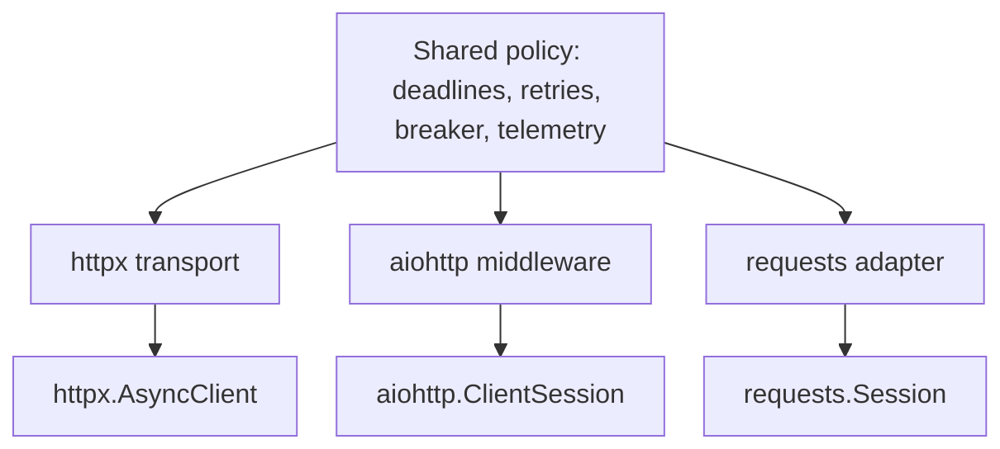

# Why I stopped wrapping HTTP clients

<div class="bdr-post__hero" data-bdr-post="2026-09-07-why-i-stopped-wrapping-http-clients" role="img" aria-label="Keep the client; attach the policy beside it" markdown="0"></div>

Every company I have worked at eventually wrote its own HTTP client wrapper. It starts as a retry helper, grows a config class, learns to emit metrics, and ends as `class HttpClient` in a shared package that every service imports and nobody can migrate away from. I have written three of them. I think the wrapper is the wrong abstraction, not because the things it does are wrong, but because of the one thing it does by accident: it takes the client away. This post is about what a wrapper actually owns, what that costs, measured, and the shape I use instead, where the policy lives beside the native client and the client stays exactly the class its library documents.

<!-- more -->

Numbers come from [the post's lab directory](https://github.com/bedrock-python/bedrock-python.github.io/tree/master/docs/blog/lab/2026-09-07-why-i-stopped-wrapping-http-clients), against an in-process origin that fails on request. Versions: clientwright 0.2.2, httpx 0.28.1, aiohttp 3.14.3, requests 2.34.2, tenacity 9.1.4, Python 3.13.

## The life of a wrapper

Stage one is a function. A downstream service flaked on a Tuesday, someone wrote `async def get_with_retry(url)`, and it was correct and eleven lines long.

Stage two is a class. The function needed a timeout, then a different timeout for one slow endpoint, then a header everyone had to send, then a metric. So now there is `HttpClient(base_url, timeout, retries, headers)` with `.get()`, `.post()` and a settings object, and every service constructs one at startup. This is the stage where the wrapper is at its most useful and the decision that matters has already been made without anyone noticing: the methods on `HttpClient` are the only HTTP surface the services have.

Stage three is the passthrough. Someone needs streaming, and `HttpClient` grows `.stream()`. Someone needs an auth flow, and it grows an `auth=` argument that forwards to the library. Someone needs event hooks, mounts, HTTP/2, a proxy, a custom transport for tests, and each one is a pull request against the shared package, a review, a release and a dependency bump in thirty services. By now the wrapper is two thousand lines, it re-exports half the underlying library's API with slightly different names, and the underlying library's documentation no longer applies to any code in the company. Nobody can replace it, because it is not a client any more. It is the company's HTTP dialect.

## What the wrapper actually owns

Strip the passthrough away and look at what the wrapper was for. Retries with backoff. A timeout that means the whole call. A circuit breaker. A deadline carried from the inbound request. Standard headers. A metric per call and a span per call. Error classification, so a connect failure and a 503 are different things.

None of that is HTTP. Not one of those concerns needs to know whether the bytes go through httpx, aiohttp or requests; they are policies about *calls*, and the same policy is right for all three libraries. The wrapper bundles the policy with a particular library's API and then hides the API, so the policy cannot move to another library and the library cannot be used without the policy. Two things that should have been independent got welded.

The weld has a price you can measure.

## Measured: the price

**The type is gone.** The first casualty is the one everyone notices last. A service that holds an `HttpClient` cannot hand it to anything that wants an `httpx.AsyncClient`: not a third-party SDK that takes a client to reuse your connection pool, not a test fixture that mounts a mock transport, not the library's own documentation. Here is the alternative, a policy applied to three libraries, and what each build returns:

```text
build('httpx')    -> httpx.AsyncClient              type(client) is AsyncClient:   True
build('aiohttp')  -> aiohttp.client.ClientSession   type(client) is ClientSession: True
build('requests') -> requests.sessions.Session      type(client) is Session:       True
```

Not a subclass. Not a proxy. `type(client) is httpx.AsyncClient`, so every line of httpx's documentation applies, every SDK that accepts one accepts this one, and the engine that does the retrying sits under the library's own extension seam: the transport for httpx, the middleware for aiohttp, the adapter for requests. The policy is invisible from above and complete from below.

**The retry loop doubles.** A wrapper that retries is a wrapper that will one day be wrapped in something else that retries: a tenacity decorator on the caller, a service mesh, a native retry policy in the library. Each layer is correct alone. Together:

```text
tenacity(3) around a client with max_attempts=3, one 503 endpoint: origin saw 9 requests
```

Nine requests to a server that was already answering 503, from a caller who believed they had configured three. This is how a slow dependency becomes an outage, and it happens whenever the retry policy is not visible at the one place the call is made. When the policy is on the client's configuration object, `retry=RetryConfig(max_attempts=3)`, the person adding the decorator can see it. When it is inside `HttpClient.get`, they cannot.

**Observability belongs to the wrapper.** The metrics a wrapper emits are named after the wrapper, labelled the way the wrapper's author thought of it, and lost the day the wrapper is replaced. The alternative is a metric schema that belongs to the policy layer and says which library carried the bytes as a label. The same policy, an endpoint that fails twice then succeeds, driven through two libraries:

```text
httpx    status=200  origin saw 3 requests  attempt records=3
         {'service': 'orders', 'adapter': 'httpx',   'seam': 'transport',  'method': 'GET', 'status': '200', 'outcome': 'success'}
aiohttp  status=200  origin saw 3 requests  attempt records=3
         {'service': 'orders', 'adapter': 'aiohttp', 'seam': 'middleware', 'method': 'GET', 'status': '200', 'outcome': 'success'}
```

Same retries, same outcome, same record shape; the two labels that differ say which library and where the engine sat. A dashboard built on this survives a library migration, and a library migration is a one-word change in a config file, because the policy did not move.

<!-- diagram:concept -->
<figure class="bdr-diagram" markdown="1">
<figcaption><span class="bdr-diagram__eyebrow">THE IDEA, VISUALIZED</span><strong>Keep the native client; attach policy underneath</strong></figcaption>
<div class="bdr-diagram__viewport" markdown="1" data-search-exclude>



</div>
<p class="bdr-diagram__caption">The policy engine uses each library&#x27;s extension point. Callers keep the native client type and its API; adapter capability checks expose settings the chosen library cannot honor.</p>
</figure>
<!-- /diagram:concept -->

## Capability honesty

The strongest argument for a wrapper is uniformity: one API, same behaviour everywhere. It is also the argument that turns out to be false, because the libraries underneath are not uniform. requests cannot cancel a blocked attempt, so a per-attempt ceiling means nothing to it. aiohttp has no write timeout. A wrapper that offers `timeout_attempt=0.5` on top of requests is offering a setting it cannot honour, and it will honour it by ignoring it, silently, until the day a blocked upload runs for an hour under a config that says half a second.

The alternative is to make the mismatch a build-time fact. Every adapter declares what it can express, and building a config against an adapter produces a report:

```text
requests, attempt=0.5, on_unsupported=warn   -> built; report.dropped = {'timeout_attempt': 'sync engine cannot cancel a blocked attempt; only phase timeouts and the soft total apply'}
requests, attempt=0.5, on_unsupported=strict -> UnsupportedCapabilityError: Adapter 'requests' cannot express the requested config: timeout_attempt: ...
aiohttp, write=1.0                           -> built; report.dropped = {'timeout_write': 'aiohttp has no write timeout; a slow upload is bounded only by the attempt ceiling'}
```

Under the default the build logs a warning and continues with the setting dropped and named. Under `strict`, which is what a production config should say, the build fails, and a dropped knob becomes a failed deploy instead of a false belief. A wrapper cannot do this, because a wrapper's whole promise is that the differences do not exist.

## The shape

The whole thing, for a service that talks to a warehouse API:

```python
import httpx

from clientwright import CircuitBreakerConfig, ClientConfig, RetryConfig, TimeoutConfig, build

config = ClientConfig(
    service_name="orders",
    base_url="https://api.warehouse.example.com",
    timeout=TimeoutConfig(total=10.0, connect=2.0),   # the call, not the attempt
    retry=RetryConfig(max_attempts=3),                # visible to whoever adds the next loop
    circuit_breaker=CircuitBreakerConfig(fail_threshold=5),
    on_unsupported="strict",                          # a knob this adapter cannot honour fails the build
)

client: httpx.AsyncClient = build("httpx", config)
response = await client.get("/stock/widgets")
```

Everything the wrapper used to own is on the config object, where a reader can see it and a reviewer can question it. Everything HTTP is on the client, which is httpx's, so httpx's docs, httpx's test tooling and httpx's ecosystem all apply. When the day comes to move to aiohttp, or to run the same policy over requests in a script, the first line's string changes and the config does not.

That layout is [clientwright](https://bedrock-python.github.io/clientwright/): one engine for retries, deadlines, redirects, breakers and telemetry, adapters for httpx, aiohttp, requests and urllib3 that find the seam under each library's public API, and a capability record per adapter that says, in writing, what it cannot do. It exists because I wrote the wrapper three times and the third time I finally counted what it had taken.

The point was the first table. `True`, three times.
