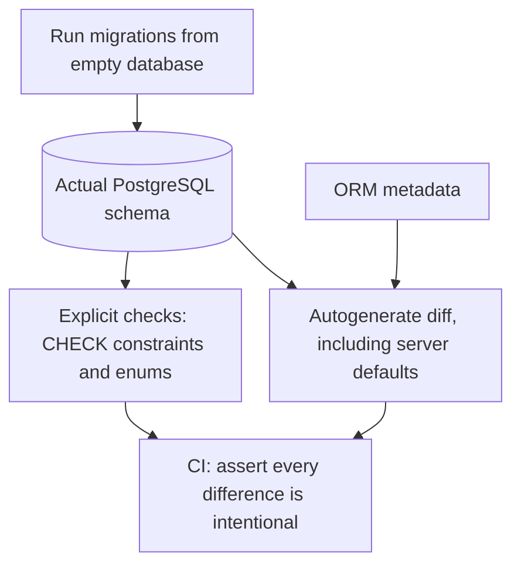

# Your models and your schema have drifted. Would CI notice?

<div class="bdr-post__hero" data-bdr-post="2026-09-07-your-models-and-your-schema-have-drifted" role="img" aria-label="Two things that should be identical, offset by exactly the amount nobody measured" markdown="0"></div>

The migration ran, the deploy went out, and the models and the database now say different things. Nothing failed, because the thing most pipelines run, `alembic upgrade head` against an empty database, has no opinion about whether the schema it produced matches the models. I built six kinds of drift, each one revision away from a clean history, and ran three suites against all of them. The pipeline everybody has caught none of the six. Autogenerate caught three. The other three needed checks that autogenerate does not perform at all.

<!-- more -->

The numbers come from [the post's lab](https://github.com/bedrock-python/bedrock-python.github.io/tree/master/docs/blog/lab/2026-09-07-five-alembic-migration-tests), which runs the suites against PostgreSQL 17 in a container. Versions: alembic-gauntlet 0.3.0, Alembic 1.19.2, SQLAlchemy 2.0.52, Python 3.13.

## Where drift comes from

Nobody writes a migration that disagrees with the models on purpose. Drift arrives three ways.

**A hand-edited migration.** Autogenerate writes a revision, someone edits it, because autogenerate emitted a table rename as a drop and a create, or because the generated `ALTER` would lock the table for too long. The edit is correct as SQL and no longer equal to what the models describe.

**A hotfix applied to production.** An index created by hand at three in the morning to stop an outage. It exists in production, it does not exist in the migrations, and the next `--autogenerate` on a developer's machine cheerfully generates a `DROP INDEX` for it.

**What autogenerate does not look at.** This is the largest source and the least known. Alembic compares tables, columns, types, nullability and indexes. It does not compare check constraints. It does not compare enum members. It does not compare server defaults unless you ask it to.

## The six drifts

Six histories, each identical to a clean one except for a single revision:

| Variant | The revision | What the database ends up with |
|---|---|---|
| `drift` | `0004` makes `is_active` nullable | a column the models call `NOT NULL` |
| `drift_server_default` | `0004` gives it `server_default false` | the models say `true` |
| `drift_index_missing` | `0002` never creates the index | the model column has `index=True` |
| `drift_extra_column` | `0001` adds a column nothing declares | a column with no model behind it |
| `drift_check_missing` | `0003` creates no check constraint | the models declare `amount > 0` |
| `drift_enum_value` | `0002` creates the enum without `shipped` | the models have three members |

Three suites run against each: what most pipelines do (`upgrade head` on an empty database), the five checks written by hand against Alembic's own API, and the same five inherited from a base class, plus the two checks that base class adds.

```text
                                    clean     drift  server_default  check_missing  enum_value  index_missing  extra_column
test_upgrade_head                    pass      pass       pass           pass          pass         pass          pass
test_every_revision_up_down_up       pass      pass       pass           pass          pass         pass          pass
test_schema_matches_the_models       pass      FAIL       pass           pass          pass         FAIL          FAIL
test_migrations_up_to_date           pass      FAIL       FAIL           pass          pass         FAIL          FAIL
test_check_constraints_match         pass      pass       pass           FAIL          pass         pass          pass
test_enum_values_match               pass      pass       pass           pass          FAIL         pass          pass
test_downgrade_to_base               pass      pass       pass           pass          pass         pass          pass
test_exactly_one_head                pass      pass       pass           pass          pass         pass          pass
test_names_follow_the_convention     pass      pass       pass           pass          pass         pass          pass
```

The first row is the whole argument. `alembic upgrade head` succeeds on every single drift, because every one of these migrations is valid SQL that applies cleanly. It is a test that the migrations *run*, and it is being used as a test that the schema is *right*.

## The check that catches half of them

The one that does the work is four lines: migrate a fresh database to head, run autogenerate's comparison against the models, and treat any output as a failure.

```python
context = MigrationContext.configure(connection, opts={"compare_server_default": True})
differences = compare_metadata(context, Base.metadata)
assert not differences
```

That is `test_migrations_up_to_date`, and it is the difference between "the migrations run" and "the migrations produce the schema the code expects". It catches the type change, the missing index and the extra column, and it tells you what it saw:

```text
AssertionError: Database schema is out of sync with ORM models. Differences:
  [[('modify_nullable', None, 'users', 'is_active', {...}, True, False)]]
  Run: alembic revision --autogenerate
```

That failure is also the fix instruction: the difference it printed is exactly what `--autogenerate` would write into the next revision.

## The one it will not look at unless you ask

`drift_server_default` is the interesting column of the matrix, because it has a `pass` and a `FAIL` in it for the same check. The same suite, on the same history:

```text
    migration_diff_compare_server_default left at its default:  7 passed
    the same suite with it set to True:                         1 failed
```

Alembic does not compare server defaults by default, and that is a defensible decision rather than an oversight. PostgreSQL rewrites the expression it was given: `server_default="true"` comes back as `true`, `sa.text("now()")` comes back as `now()`, and a default written as `0` on a numeric column comes back as `0.0`. A naive comparison reports differences that are not differences, which is worse than reporting nothing, because a check that cries wolf gets deleted.

So it is opt-in, and the trade is real. Turn it on and you may have to spell your defaults the way the database echoes them back. Leave it off and a migration that sets `false` where the model says `true` is invisible, which is what the first line above shows. My rule: turn it on, and when it complains about a formatting difference, fix the spelling in the model rather than turning it back off.

## The two it will never look at

The last two drifts are not a matter of a flag. Autogenerate does not compare check constraints or enum members at all, which means the migration that forgets them is *empty* when you regenerate it. Autogenerate says there is nothing to do, and it is telling the truth about what it inspected.

Reflecting the constraints and comparing by name catches the first:

```text
AssertionError: CHECK constraints are out of sync with ORM models:
  Check constraint 'chk_orders_amount_positive' on table 'orders' is in the models but not in the database.
```

The comparison has to be by name, and the names have to come from the metadata's naming convention, or the check compares an explicit `chk_orders_amount_positive` in the database against an anonymous `CheckConstraint("amount > 0")` in the models and fails on every run. This is the practical argument for a naming convention in `MetaData` that everyone repeats without saying why: it is what makes the database's names and the models' names comparable at all.

Enums need `pg_enum`, because that is the only place the members live:

```text
AssertionError: Enum values are out of sync with ORM models:
  Enum type 'order_status' has values ['new', 'paid'] in the database and ['new', 'paid', 'shipped'] in the models.
```

A missing enum member is the drift with the shortest fuse. The application starts fine, serves fine, and fails the first time a row takes the value the database has never heard of, with `invalid input value for enum order_status: "shipped"`, in whatever code path added that member. And that path is usually the new feature, in production, an hour after the deploy.

## What to run in CI

The five that answer different questions, plus the two that cover what autogenerate cannot see:

1. **Upgrade to head on an empty database.** The migrations run at all.
2. **Every revision up, down, up.** Each downgrade is real, and each upgrade is repeatable after one.
3. **Downgrade to base.** The whole history reverses.
4. **Exactly one head.** Two people branched the history and nobody noticed.
5. **The schema matches the models.** Autogenerate produces nothing.
6. **Check constraints match**, by name, against the naming convention.
7. **Enum members match**, read from `pg_enum`.

Six and seven exist because five has blind spots, and the blind spots are not exotic: a check constraint and an enum are two of the most ordinary things in a PostgreSQL schema.

They all need a real database. There is no version of this that works against SQLite while the service runs on PostgreSQL, because every drift above is a question about what PostgreSQL actually did with the DDL. A container per test session, a fresh schema per test, and the whole matrix above runs in a couple of minutes.

<!-- diagram:concept -->
<figure class="bdr-diagram" markdown="1">
<figcaption><span class="bdr-diagram__eyebrow">THE IDEA, VISUALIZED</span><strong>Compare what migrations built with what models declare</strong></figcaption>
<div class="bdr-diagram__viewport" markdown="1" data-search-exclude>



</div>
<p class="bdr-diagram__caption">Autogenerate compares much of the schema but does not cover every contract. Enable server-default comparison deliberately and add explicit checks for constraints and enum values that it misses.</p>
</figure>
<!-- /diagram:concept -->

## The pieces

The seven are a base class in [alembic-gauntlet](https://bedrock-python.github.io/alembic-gauntlet/): inherit it, hand it your `MetaData`, and set `migration_diff_compare_server_default = True` if you want the fifth one to look at defaults. The container and the fresh-schema fixtures come with it. What it needs from you is an `env.py` that takes the connection and the schema it is given instead of building its own, which is the same contract [the migration testing post](2026-09-07-five-alembic-migration-tests.md) sets out.

The three drifts in the second half of this post were the reason for the 0.3.0 release: the base class had the five, and the five let a missing check constraint and a missing enum member through.
