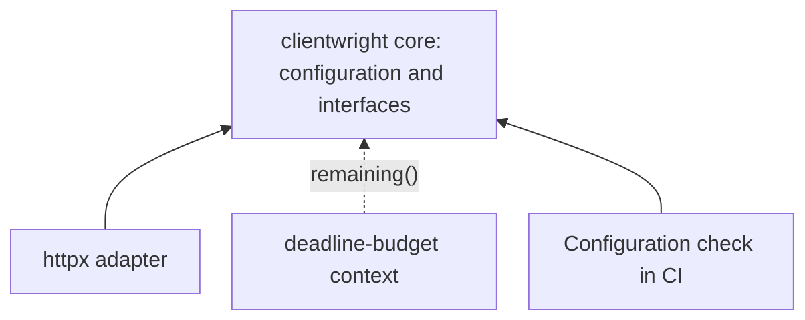

# A core without dependencies: install the integrations your service needs {#zero-dependency-cores-why-optional-dependencies-matter-in-infrastructure-libraries}

<div class="bdr-post__hero" data-bdr-post="2026-09-07-zero-dependency-cores" role="img" aria-label="A shared client configuration works on its own; the orders API adds HTTP and deadline integrations" markdown="0"></div>

Imagine an orders API that reads stock from a warehouse over HTTP. A separate CI job inspects the same client configuration and checks which adapters support it. The API needs an HTTP library; inspecting configuration should work without installing every transport and web framework.

We will start with a bare clientwright install, reach the point where an extra is required, then add it and make a real request. The question is concrete: which operations work before we install the integration, and what happens when we ask for more?

<!-- more -->

## Share configuration before choosing a transport {#what-a-good-core-looks-like}

Our `warehouse_policy.py` defines a two-second limit and one attempt. Retries are disabled here to keep the example about dependencies. These types come from the [clientwright](https://github.com/bedrock-python/clientwright) core:

```python
from clientwright import ClientConfig, RetryConfig, TimeoutConfig


def warehouse_config(base_url):
    return ClientConfig(
        service_name="warehouse",
        base_url=base_url,
        timeout=TimeoutConfig(total=2),
        retry=RetryConfig(max_attempts=1),
        circuit_breaker=None,
        deadline_header="X-Deadline-Ms",
        on_unsupported="strict",
    )
```

With only `clientwright==0.5.0` installed, the lab creates this configuration, reads the adapter registry and checks the capabilities matrix:

```python
from importlib.util import find_spec
from clientwright import capabilities_matrix, registered_adapters
from warehouse_policy import warehouse_config

config = warehouse_config("http://127.0.0.1:1")
assert config.timeout.total == 2
assert "httpx" in capabilities_matrix()
assert find_spec("httpx") is None
print(registered_adapters())
```

`find_spec()` checks whether Python can find httpx. The registry and matrix remain usable when it cannot. Registered names are `aiohttp`, `httpx`, `httpx2`, `requests` and `urllib3`; registration does not mean their libraries are installed.

In this version, the registry stores import paths. Even `import clientwright.adapters.httpx` is lazy: it does not load the HTTP implementation. The selected adapter is loaded when `build()` resolves it. This gives the CI job something useful to inspect before choosing a transport; it does not prove that an eventual client configuration can be applied in full.

<!-- diagram:concept -->
<figure class="bdr-diagram" markdown="1">
<figcaption><span class="bdr-diagram__eyebrow">THE IDEA, VISUALIZED</span><strong>Integrations connect to the core</strong></figcaption>
<div class="bdr-diagram__viewport" markdown="1" data-search-exclude>



</div>
<p class="bdr-diagram__caption">Client configuration and the budget interface work without an HTTP library. The httpx adapter and deadline-budget are added where the application needs them.</p>
</figure>
<!-- /diagram:concept -->

## The message is the feature {#the-message-is-the-feature}

Now let the orders API try to create its client in that same bare environment:

```python
from clientwright import build
from warehouse_policy import warehouse_config

build("httpx", warehouse_config("http://127.0.0.1:1"))
```

The lab verifies that this raises `ImportError` and that the message names `clientwright[httpx]`. The reported error is:

```text
ImportError: httpx support requires clientwright[httpx]; install it.
```

That tells the developer which integration to install. A complaint about an unfamiliar transitive package would leave them searching through the dependency tree. For comparison, bare `servicewright==0.13.1` imports successfully, but importing its FastAPI adapter raises an error naming `servicewright[fastapi]`.

Test the public operation that needs the integration. Testing only `import clientwright.adapters.httpx` would miss this failure path because that package is lazy.

## Install the extra and make the request {#install-extra}

Install `clientwright[httpx]==0.5.0` in the API's environment. An **extra** is a named set of additional dependencies, declared in package metadata. It does not switch a runtime flag or replace the core. Python's packaging guide describes how to declare [optional dependencies](https://packaging.python.org/en/latest/guides/writing-pyproject-toml/#dependencies-and-requirements).

The service can now use the same configuration to fetch stock:

```python
from clientwright import build

from warehouse_policy import warehouse_config


async def fetch_stock(base_url, deps=None):
    async with build("httpx", warehouse_config(base_url), deps) as client:
        response = await client.get("/stock/sku-42")
        response.raise_for_status()
        return response.json()
```

In the lab, a local HTTP server returns `{"available": 3}`. The check verifies the request path, response and propagated `X-Deadline-Ms` header. It also checks that `build()` returns an actual `httpx.AsyncClient` and that exiting its context closes it. FastAPI, aiohttp and requests remain absent from this environment.

The important boundary is where we choose `"httpx"`. The configuration module imports only clientwright; the service creates and owns the transport client when it needs HTTP.

## Accept a small interface for the remaining time {#protocols}

Suppose the order lookup now has a 500 ms budget shared with other steps. Install `clientwright[httpx,deadline]==0.5.0`; the `[deadline]` extra adds [deadline-budget](https://github.com/bedrock-python/deadline-budget). We can pass its budget directly to the client:

```python
from clientwright import AdapterDeps
from deadline_budget import BudgetContext

from http_flow import fetch_stock


async def fetch_with_budget(base_url):
    budget = BudgetContext.create(total_seconds=0.5)
    return await fetch_stock(base_url, AdapterDeps(deadline_source=budget))
```

clientwright's `DeadlineSource` protocol requires `remaining() -> float | None`. `BudgetContext` has that method, so it can provide the remaining time without inheriting a clientwright class. The core uses that interface without importing deadline-budget. In this example the budget belongs to one call; [the deadlines article](2026-09-06-timeouts-are-not-deadlines.md) covers sharing one across a larger operation.

The local server receives at most 500 ms, even though the client configuration allows two seconds. Before installing the extra, importing our `budget_flow.py` fails because `deadline_budget` is absent. We deliberately keep that failure: once the application promises a shared deadline, silently falling back to a different time limit would change its behavior.

An integration may be optional for a library while being required by a particular service.

## What is actually installed {#what-each-library-costs}

The lab starts with three separate environments, then adds extras to two of them. With Python 3.13 and the pinned versions, it checks these outcomes:

| Installation | What the lab verifies |
|---|---|
| `deadline-budget==0.1.3` | Only this distribution; a budget works without HTTP or web packages |
| `clientwright==0.5.0` | Only this distribution; configuration and capability discovery work |
| `clientwright[httpx]==0.5.0` | Native HTTP client sends a request; deadline-budget is still absent |
| `clientwright[httpx,deadline]==0.5.0` | The same request uses the 500 ms budget |
| `servicewright==0.13.1` | Only this distribution; the FastAPI adapter reports its missing extra |
| `servicewright[fastapi]==0.13.1` | The adapter imports and its entrypoint can be constructed |

“One distribution” includes the library itself: it means zero additional installed packages. Extras add their transitive dependencies too. A constraints file pins versions for this lab; passing it with `--constraint` does not install every package it lists.

The optional `--measure` mode records the full inventory, `site-packages` size in MiB and five fresh-process imports of the package root. It reports the median and all samples. That import measurement excludes starting Python, does not measure loading every adapter, and runs with the operating system's file cache in play. Use the report to compare your own environment, not as a promise about startup time on another machine.

## Keep unrelated version constraints out of a service {#the-failure-mode-this-prevents}

Suppose a shared lifecycle library required FastAPI in its base dependencies. A worker using only its lifecycle would still inherit FastAPI's dependency constraints. If another package required an incompatible version, the worker's environment could stop resolving even though the worker never serves HTTP.

An extra narrows that problem to the applications which select it. It does **not** remove conflicts in the API environment where FastAPI is actually needed. Installing every extra everywhere would also give up this benefit.

## When a dependency belongs in the base install {#when-a-hard-dependency-is-right}

The test is whether the library has a useful scenario without that dependency. A configuration inspector can use clientwright without httpx. A lifecycle worker can use servicewright without FastAPI. A package whose purpose is SQLAlchemy integration can reasonably require SQLAlchemy.

There is also a cost to optional integrations: import guards, more installation combinations to test, and documentation explaining which extra provides each operation. Extract a real boundary rather than turning every import into a plugin. [The composition example](2026-09-13-why-bedrock-python-libraries.md) shows how these choices meet inside one service.

## Check both sides of the boundary {#the-checklist}

Run the core checks in a clean environment, then check each integration after installing its extra. A developer environment containing every extra cannot demonstrate that a bare installation works. The lab's `footprint.py` can run in CI: a failed installation, unexpected import result or failed assertion makes it exit with an error.

<div id="the-pieces" data-search-exclude></div>

## Start with the core, add the integration you use {#conclusion}

We used clientwright configuration without an HTTP library, saw a useful error at client creation, added httpx and then connected a shared deadline. The same boundary lets servicewright offer a lifecycle without forcing FastAPI into every consumer.

Use `clientwright[httpx]` when the service needs an httpx client, add `[deadline]` when its calls must share a deadline-budget context, and choose `servicewright[fastapi]` for the FastAPI entrypoint. Keep the base install where the core is enough. The result is a dependency list that follows what the application actually does.

## Run the example {#labs}

From the website repository root, with uv installed:

```bash
cd docs/blog/lab/2026-09-07-zero-dependency-cores
uv run --no-project --python 3.13 python footprint.py
```

The script creates its own temporary environments and a local HTTP server. It works with Windows and POSIX environment paths; Docker is not needed. Package downloads require network access. For inventories and measurements, use:

```bash
uv run --no-project --python 3.13 python footprint.py --measure --report footprint-results.json
```

The [lab README](../lab/2026-09-07-zero-dependency-cores/README.md) describes the files, assertions and measurement limits.
