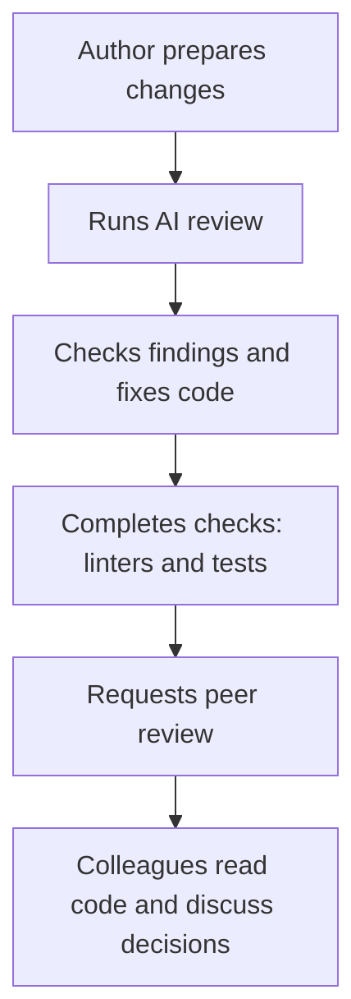

# Why AI code review needs human oversight {#ai-code-review-should-not-be-fully-autonomous}

AI helped me find bugs in my own merge requests. The problems began when I started automating reviews of colleagues' code: useful findings arrived alongside incorrect suggestions and wordy comments. That experience convinced me that the main place for AI review is in the author's preparation, before handing an MR to the team.

<!-- more -->

## From my own MRs to colleagues' code {#how-i-started}

The first experiments worked well. I asked an agent to check my code, assessed its findings, and fixed the bugs it found. With the task's context fresh in my mind, evaluating its suggestions was relatively straightforward.

I then started using AI to review colleagues' MRs. I manually turned useful findings into discussion threads after checking the reasoning and editing the text. I understood every comment I published and could explain it to the author.

## What changed with automation {#the-pipeline}

When I automated the process, comment quality became a problem. The model produced lengthy explanations where a couple of sentences would have sufficed and suggested fixes without accounting for context. The output still needed work before publication.

That led to a separate *polish* stage: verify the findings, remove irrelevant ones, and shorten the rest. I used this approach in [mr-review](https://bedrock-python.github.io/mr-review/), too. The resulting reviews became more useful and easier to read.

A colleague's process was fully autonomous. AI created threads and replied to discussions without anyone checking the messages first. Sometimes it posted a finding under his name and then automatically replied to the same thread. Watching this, I identified three problems.

## 1. The cost of an incorrect finding {#what-goes-wrong-when-the-bot-posts}

A model may understand the code without knowing the team's plans, the task's scope, or the reasons behind earlier decisions. A suggested improvement, for example, might already be planned for a later stage. Without that context, even a technically sound comment can be misplaced.

While a finding remains with the reviewer, they can check and dismiss it. Once it is published, that work passes to the MR's author: read it, investigate, explain the constraints, and close the discussion. The time saved by skipping verification becomes a colleague's expense.

## 2. Trust between colleagues {#review-is-a-conversation}

In a review, I expect a substantive conversation about the chosen approach, the alternatives considered, and anything I may have missed. That is how participants learn from each other.

Long generated threads make that conversation harder. First, the author has to extract a specific concern from general commentary. If the reply to their explanation is also sent automatically, it becomes unclear whether their colleague is participating at all.

I find that frustrating: the review feels like a formality, with the work of sorting through the output left to me. The wish to save time is understandable, but from the author's perspective, it can feel dismissive of their work.

A comment under a reviewer's name implies that they have read the code, checked the finding, and are prepared to discuss it. Using AI does not remove that responsibility.

## 3. Losing knowledge of the project {#what-the-person-adds}

Reading colleagues' MRs teaches us which features are being added, how they work, and which tradeoffs the team has made. We will need that knowledge for future changes and debugging.

If the entire review is delegated to an agent, the implementation may remain familiar only to its author. While that person is around, this can go unnoticed. If they leave or become unavailable, everyone else has to reconstruct the context.

Participating in reviews helps distribute knowledge across the team. That requires reading code and asking questions; an agent's report alone is insufficient.

## AI review before requesting peer review {#the-copilot-not-the-gatekeeper}

**I propose making AI review a routine part of preparing changes, owned by the author.** If an agent can find a problem before the team discusses the code, the developer can run that check themselves. They know the task's purpose and can assess findings and fix bugs sooner.

In the workflow, this belongs alongside pre-commit, linters, and tests. The distinction is that the model's conclusions require judgement: each finding needs verification, and an absence of findings does not guarantee correctness. The MR can already exist as a draft—the check should precede the request for peer review.

<!-- diagram:concept -->
<figure class="bdr-diagram" markdown="1">
<figcaption>THE IDEA, VISUALIZED<strong>AI checks before peer review</strong></figcaption>

The author runs AI review and assesses its findings before handing the MR to colleagues. The team reads the code and discusses decisions personally.

</figure>
<!-- /diagram:concept -->

The team then reads the code and discusses the decisions. Reviewers can also consult AI if it helps their analysis, but publishing a comment or reply should remain their own decision.

## Team agreements {#what-it-costs}

For this process, I would agree on a few rules:

- **Timing.** Which changes require AI review, and which revisions warrant another pass.
- **Context and focus.** Supply the task description, constraints, and project rules. Check logic, error handling, and gaps in tests; leave formatting to linters.
- **Handling findings.** The author verifies the findings and fixes confirmed problems before requesting peer review.
- **Publication.** Every comment or reply sent under an employee's name must be read and checked by that person.

By the time the author requests review, they should have worked through the AI findings. That leaves colleagues' time for evaluating decisions, sharing experience, and understanding the project—the work that gives team review its value.
