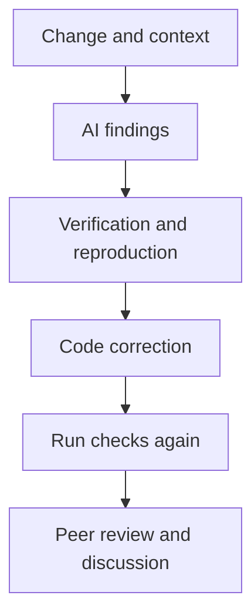

# Why AI review findings need verification {#ai-code-review-should-not-be-fully-autonomous}

<div class="bdr-post__hero" data-bdr-post="2026-09-13-ai-code-review-should-not-be-fully-autonomous" role="img" aria-label="A review finding becomes a reproducible failure, a code change and a checked comment" markdown="0"></div>

Imagine a merge request that adds a retry when the warehouse times out while reserving stock. The change looks small, and the successful-path test passes. But the warehouse may have created the reservation before its reply was lost. Retrying can create a second reservation for the same order.

AI can help identify that scenario. Before turning it into a comment for a colleague, we need to check the warehouse contract, reproduce the effect and decide what the application should do instead. Here is that workflow with executable code. The example findings are written for this walkthrough; no model evaluation is being reported.

<!-- more -->

## Start with the change and its contract {#how-i-started}

Our orders service calls an application adapter, `warehouse.reserve(order_id)`. For this example, every accepted call creates a new reservation. The warehouse does not deduplicate by order ID, and a `TimeoutError` does not reveal whether the write happened. These are explicit assumptions for the example, not properties of every warehouse API.

The MR adds a second attempt:

```python
async def reserve_with_retry(order_id, warehouse):
    for attempt in range(2):
        try:
            return await warehouse.reserve(order_id)
        except TimeoutError:
            if attempt == 1:
                raise
```

The lab uses a controlled substitute for the adapter, with failure points before and after the write. It lets us inspect the simulated side effect without waiting for a real network failure.

An instruction to review this change should include the adapter contract, the task's purpose and the relevant tests. Otherwise, the agent may assume that repeated calls are deduplicated or that a timeout guarantees no write. [The documentation article](2026-09-07-documentation-for-ai-coding-agents.md) shows how to supply that context.

## Turn a suspected bug into a reproduction {#the-pipeline}

The suspected failure is precise: the warehouse records a reservation, loses the reply, and receives the same operation again. In `WarehouseStub`, `"timeout_after_write"` appends the reservation before raising `TimeoutError`; `"ok"` returns the next reservation normally.

This check can run against either implementation:

```python
from reservation import ReservationOutcomeUnknown
from warehouse_stub import WarehouseStub


async def check_lost_reply(reserve):
    warehouse = WarehouseStub("timeout_after_write", "ok")
    try:
        await reserve("order-42", warehouse)
    except ReservationOutcomeUnknown:
        pass
    print(f"calls={len(warehouse.calls)}, reservations={len(warehouse.reservations)}")
    assert len(warehouse.reservations) == 1, (
        "One operation created duplicate reservations"
    )
```

With `reserve_with_retry`, it prints `calls=2, reservations=2` and fails the assertion. A successful second reply does not undo the first reservation. We now have an input condition, a path through the changed code and an observable result.

The fixture demonstrates this control flow under the stated contract. It does not prove that a particular deployed warehouse behaves this way; that still needs its API contract or an integration test. If the real operation is already deduplicated, the finding must be reconsidered.

## Separate bugs, incorrect claims and open questions {#what-goes-wrong-when-the-bot-posts}

A review pass might return several suggestions about this loop. They need different treatment:

| Proposed finding | What we can establish | Action |
|---|---|---|
| A lost reply can create two reservations | The reproduction shows two writes | Keep, with the scenario and consequence |
| The loop retries forever | `range(2)` and a two-timeout test show two attempts | Dismiss the claim |
| Add an idempotency key | Useful only if the receiving API supports the required semantics | Check the contract before proposing a fix |
| Rename `attempt` or adjust formatting | No behavior problem established | Leave to project conventions and tooling |

An incorrect finding costs someone time even if it sounds careful. Once it becomes a discussion thread, the author has to investigate and explain it. Checking it while it is still a draft keeps that work with the person preparing the review.

## Publish a short comment you can defend {#review-is-a-conversation}

A useful comment points at the retry branch and states the condition and effect:

> If the warehouse creates the reservation and then loses the reply, this retry creates another reservation for the same order. `reproduce.py before` produces two reservations. Could we avoid the automatic retry until the API provides a deduplication contract?

That is enough to start a technical conversation. It does not need a general lecture about distributed systems. If the author answers that the real warehouse deduplicates requests, the next step is to inspect that behavior and update or withdraw the finding.

Someone posting under their name should be able to explain the comment and assess that reply. Automatically continuing the thread without understanding the new context can keep an already-resolved objection alive.

## Choose the behavior after the timeout {#what-the-person-adds}

For this example, the narrow correction is to stop retrying automatically and preserve the unknown outcome:

```python
class ReservationOutcomeUnknown(RuntimeError):
    def __init__(self, order_id):
        self.order_id = order_id
        super().__init__(f"Reservation outcome is unknown for order {order_id}")


async def reserve_once(order_id, warehouse):
    try:
        return await warehouse.reserve(order_id)
    except TimeoutError as error:
        raise ReservationOutcomeUnknown(order_id) from error
```

This does not say that the reservation failed. The caller receives the order ID and the original exception as the cause. It must handle the uncertain result through the application's status-check or reconciliation process, rather than treating it as success or blindly retrying this new exception at a higher layer.

The same reproduction now prints `calls=1, reservations=1` and passes. Tests also cover a timeout before the write: it yields the same public unknown-outcome error, but no reservation exists. The client cannot distinguish those two cases from the timeout alone.

Deduplication may be the right longer-term design. A new header is not enough: the receiving service has to enforce the contract, and retries must use the same operation identity. That is a separate decision, covered in [the idempotency article](2026-09-13-idempotency-in-apis-and-background-jobs.md).

This is where peer review adds project knowledge. The team needs to agree who resolves an unknown reservation, how the order state changes and what the user sees. A local reproduction establishes the bug; it does not choose those product behaviors.

## Run AI review while preparing the MR {#the-copilot-not-the-gatekeeper}

I use AI review as part of the author's preparation: run the normal checks, examine the findings, reproduce plausible failures, fix confirmed problems and then request peer review. Reviewers can also use an agent to explore code, while keeping responsibility for the comments they publish.

[mr-review](https://github.com/bedrock-python/mr-review#how-it-works) supports a workflow of **Brief → Dispatch → Polish → Post**. Brief supplies review context; Dispatch obtains findings; Polish lets the user edit, keep or dismiss them; Post publishes the selected comments. In the example above, reproducing the lost reply and rejecting the infinite-loop claim belong before publication. Editing wording alone would not verify either claim.

<!-- diagram:concept -->
<figure class="bdr-diagram" markdown="1">
<figcaption><span class="bdr-diagram__eyebrow">THE IDEA, VISUALIZED</span><strong>From a finding to a checked comment</strong></figcaption>
<div class="bdr-diagram__viewport" markdown="1" data-search-exclude>


```mermaid
---
config:
  theme: default
  look: classic
  flowchart:
    useMaxWidth: false
    wrappingWidth: 150
    padding: 12
    nodeSpacing: 24
    rankSpacing: 32
---
flowchart TD
    accTitle: From a finding to a checked comment
    accDescr: The author checks the finding, reproduces the failure and fixes the code. After another check, colleagues discuss the current change and application behavior.
    A["Change and context"] --> B["AI findings"]
    B --> C["Verification and reproduction"]
    C --> D["Code correction"]
    D --> E["Run checks again"]
    E --> F["Peer review and discussion"]
```

</div>
<p class="bdr-diagram__caption">The author checks the finding, reproduces the failure and fixes the code. After another check, colleagues discuss the current change and application behavior.</p>
</figure>
<!-- /diagram:concept -->

An AI pass with no findings does not prove the MR is correct. Its value is in the confirmed problems it helps uncover. Colleagues still need to read the implementation and discuss decisions, so knowledge of the new behavior is shared beyond its author.

## Recheck a finding when the code changes {#what-it-costs}

After replacing `reserve_with_retry`, a comment describing that old loop is no longer ready to publish. Record which revision was reviewed, compare the updated diff and rerun the relevant reproduction. Check that the cited line and claimed behavior still exist. A substantial change may justify another review pass; an unchanged comment does not become valid merely because the tool can post it.

Teams can make this routine with three agreements: provide the task and contracts, verify each finding before sending it, and have the person publishing a comment handle the discussion. Also decide where automated checks fit in the MR process. The policy should make responsibility clear without turning every style preference into a blocking issue.

## Run the example {#labs}

With uv installed, run from the website repository root:

```bash
cd docs/blog/lab/2026-09-13-ai-code-review-should-not-be-fully-autonomous
uv run --no-project --python 3.13 python reproduce.py before
uv run --no-project --python 3.13 python reproduce.py after
uv run --no-project --python 3.13 python test_review.py
```

The `before` command intentionally exits with an assertion error. `after` passes, and the seven-test suite checks successful calls, both timeout positions, bounded retries and unrelated errors. The lab uses Python 3.13 and the standard library; it calls no model, contacts no warehouse and posts no review comments.

The [lab README](../lab/2026-09-13-ai-code-review-should-not-be-fully-autonomous/README.md) explains the assumptions and results.

## Keep the evidence with the finding {#conclusion}

We took a possible finding through a failing reproduction, a focused fix and a passing check. Along the way, one claim was rejected and a larger design question was left for the team. That is useful work to finish before asking a colleague to respond.

Use mr-review to collect and refine findings, and attach the relevant code and test result to the comments you keep. Let AI help you find the next question; take responsibility for checking the answer, publishing the comment and discussing it with the author.
