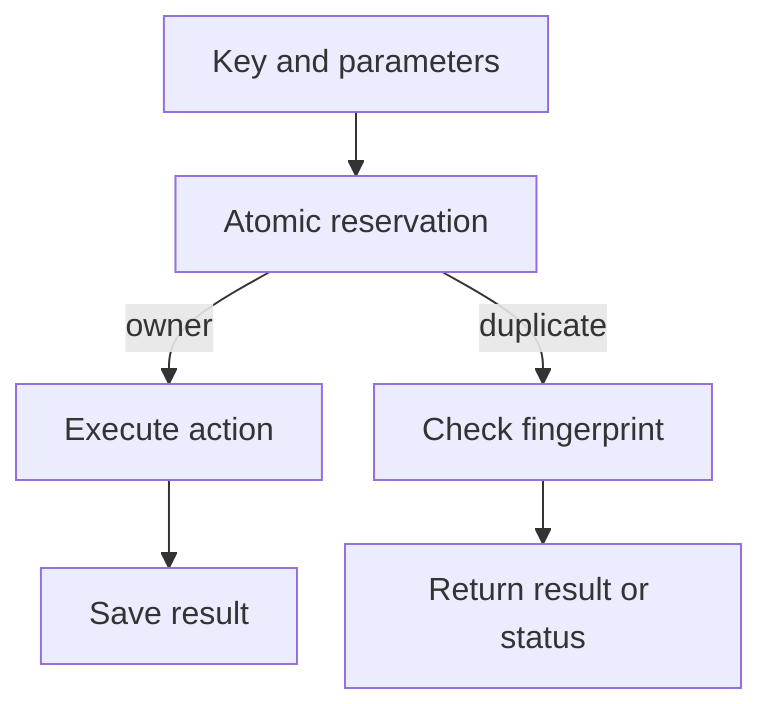

# Idempotency in APIs and background jobs {#idempotency-in-apis-and-background-jobs}

A client sends a request, loses the response and retries. A worker finishes a job but crashes before acknowledging it. Redelivery is normal in both cases; the risk is repeating the business action.

Idempotency begins by identifying that action. A key represents the intent to perform an operation, rather than a particular network attempt or message delivery.

<!-- more -->

## A result cache does not protect work in progress {#reservation}

“Check the cache, execute, save” admits two concurrent requests: both can observe a missing result. An atomic attempt to reserve the key must precede the action.

A record normally includes scope, key, parameter fingerprint and execution state. The winner performs the work. A duplicate with matching parameters receives the stored result, waits for a bounded time or learns that execution is still in progress. Reusing the key with different parameters should be rejected under an explicit contract.

A fingerprint does not replace authorization. Scope must separate users, tenants and different business operations so that another caller cannot retrieve a stored response.

<!-- diagram:concept -->
<figure class="bdr-diagram" markdown="1">
<figcaption>THE IDEA, VISUALIZED<strong>Reserve the key before the action</strong></figcaption>

The atomic reservation winner executes the action. A duplicate checks its parameters and receives a saved result or an in-progress response.

</figure>
<!-- /diagram:concept -->

## Keep identity stable across attempts {#propagation}

In a gateway → orders → payments chain, minting a new key at each hop does not connect a repeated payment to the user's original intent. Create the key at the operation boundary and propagate it, or derive a stable key for a particular child action.

Sending an invoice and charging an order are different actions. They need different key scopes even when both use an order id. For a background job, identify the business action and its version rather than the delivery attempt.

Successful deduplication does not necessarily produce an immediate answer. While the first call is running, the API needs a way to retrieve its outcome: another request with the same key, a status endpoint or an operation identifier.

## Close the gap between effect and result recording {#effects}

A Redis reservation does not make an external payment atomic with saving its result. The process can complete the payment and crash before marking success. Another worker may acquire the key after the lease expires.

If the effect lives in the same database, the deduplication record and data change can share a transaction. An external provider needs its own stable idempotency key or an outcome reconciliation and recovery process. A local lock alone cannot promise that an email or payment happens once.

Lease duration and renewal must match the work. Expiry does not establish that the previous executor has stopped. This matters especially for long background jobs.

## Define retention and failure behavior {#failure-policy}

| Decision | Consider |
|---|---|
| Result TTL | Maximum retry, replay and queue recovery window |
| Incomplete record | Detecting and recovering interrupted operations |
| Action failure | Whether another attempt is safe and what callers receive |
| Store outage | Whether duplicate effects are acceptable without deduplication |
| Old-key cleanup | What a late retry will do |

Deleting a key on every exception is dangerous when an external effect may already have occurred. Continuing without the store is also dangerous when duplicates are unacceptable. Fail-open is an operation-specific decision.

## Test retries at inconvenient boundaries {#verification}

Exercise concurrent requests, parameter mismatch, lost responses, restart after the effect but before result recording, lease expiry and store failure. Sequentially repeating a completed operation tests only the easy case.

For Kafka, an [inbox](2026-09-13-reliable-events-outbox-inbox-kafka.md) protects transactional consumer effects inside the database. External actions remain a separate boundary. [idempotency-kit](https://bedrock-python.github.io/idempotency-kit/) coordinates keys; the system performing the effect still defines the complete contract.

## Examples and labs {#labs}

The complete setups and reproduction instructions are available separately:

- [Lab: idempotency keys](../lab/2026-09-07-idempotency-keys/README.md)
- [Lab: idempotency across a chain of services](../lab/2026-09-07-idempotency-across-a-chain/README.md)
- [Lab: idempotency for background jobs and consumers](../lab/2026-09-07-idempotency-for-jobs-and-consumers/README.md)
