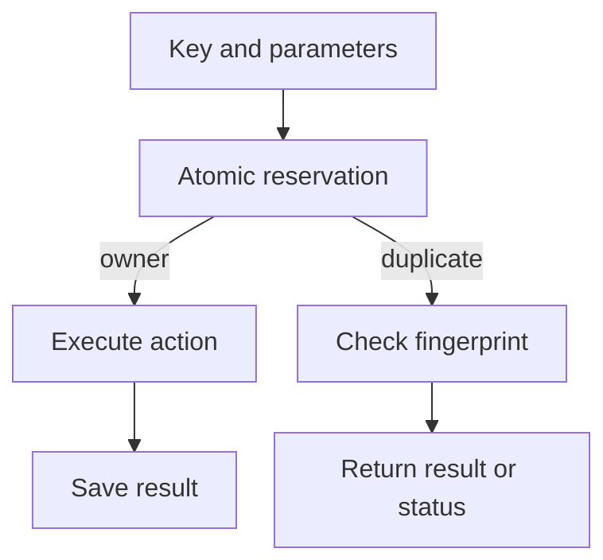

# Idempotency in APIs and background jobs {#idempotency-in-apis-and-background-jobs}

<div class="bdr-post__hero" data-bdr-post="2026-09-13-idempotency-in-apis-and-background-jobs" role="img" aria-label="The case that matters is the retry that arrives while the first request is still running" markdown="0"></div>

Imagine an orders service. A buyer pays 1,999 kopecks, the charge succeeds, but the HTTP connection closes before the response arrives. The client retries. Later, a worker sends the invoice and loses its queue connection before acknowledging the job. How do we recover the payment result and process the delivery again without another charge or email?

We will use `idempotency-kit` for two requests to one API, a service chain, and a background job. The examples were checked with **0.4.1**, Redis **7**, and Python **3.13**. We will also reproduce failures where a Redis record alone is insufficient.

<!-- more -->

## One payment, several attempts {#payment-example}

The service receives an amount in kopecks, a currency, and an order ID. `tenant_id` identifies the buyer's organization: in an application it comes from authenticated server context. We also authorize access to the order before charging it.

```python
from typing import Literal
from uuid import UUID

from pydantic import BaseModel, Field


class Payment(BaseModel):
    tenant_id: UUID
    order_id: UUID
    amount: int = Field(gt=0)
    currency: Literal["RUB"] = "RUB"


class Charge(BaseModel):
    charge_id: str
    amount: int
```

The client creates an `Idempotency-Key` when starting a payment and keeps it for every retry of that operation. A new payment gets a new key, even with identical parameters. A request-body hash cannot distinguish two separate intentions with the same payload.

<div id="idempotency-keys-the-part-everyone-gets-wrong" data-search-exclude></div>
<div id="what-the-key-promises" data-search-exclude></div>
<div id="measured-the-request-that-is-still-running" data-search-exclude></div>
<div id="it-is-still-not-a-lock" data-search-exclude></div>
<div id="the-key-is-not-the-request" data-search-exclude></div>
<div id="failures-are-not-cached-and-neither-is-the-store" data-search-exclude></div>
<div id="scope-and-lifetime" data-search-exclude></div>
<div id="the-shape" data-search-exclude></div>

## A retry arrives while the first request is running {#reservation}

“Read the cached result → charge → save” admits a race: both requests can find an empty cache. The coordinator reserves the key in Redis before executing the action. Our API immediately gives the second request an `IdempotencyInProgressError`; its handler maps that to HTTP 409 with `payment_in_progress` and `Retry-After: 1`.

```python
from redis.asyncio import Redis
from idempotency_kit import AsyncIdempotencyCoordinator, IdempotencyDomainService
from idempotency_kit.infra.storage.redis.aio import RedisAsyncIdempotencyRepository


def make_coordinator(redis: Redis) -> AsyncIdempotencyCoordinator:
    return AsyncIdempotencyCoordinator(
        RedisAsyncIdempotencyRepository(redis),
        IdempotencyDomainService(),
        in_flight="raise",
        in_flight_lease_seconds=30,
    )
```

`redis` is a client shared for the application's lifetime; close it with `await redis.aclose()` at shutdown. A 30-second reservation is suitable here for a short operation with a smaller total deadline. Version 0.4.1 does not renew it automatically.

Now wrap the charge. The `charge` argument is an async payment-provider call: it accepts a payment and a key and returns a `Charge`.

```python
from collections.abc import Awaitable, Callable
from idempotency_kit import (
    IdempotencyIdentifiers, PydanticResultAdapter, fingerprint_of,
)


async def charge_once(
    coordinator: AsyncIdempotencyCoordinator,
    charge: Callable[[Payment, str], Awaitable[Charge]],
    payment: Payment,
    key: str,
) -> Charge:
    ids = IdempotencyIdentifiers(
        operation=f"payment.charge.{payment.tenant_id.hex}",
        idempotency_key=key,
    )
    provider_key = f"{ids.operation}.{ids.idempotency_key}"
    return await coordinator.coordinate(
        ids.operation, ids.idempotency_key, 3600,
        PydanticResultAdapter(Charge), charge, payment, provider_key,
        idempotency_fingerprint=fingerprint_of(
            order_id=str(payment.order_id),
            amount=payment.amount,
            currency=payment.currency,
        ),
    )
```

The operation name separates tenants' keys. `fingerprint_of` records the parameters, so a retry with a different amount is refused. The provider key also includes the tenant and action to identify the same operation downstream.

`IdempotencyIdentifiers` validates the key **before** entering the coordinator. In this version, an empty key bypasses protection, and an invalid key such as one containing a colon can cause the action to run without a saved result. Map validation failures to HTTP 400 at the boundary.

<!-- diagram:concept -->
<figure class="bdr-diagram" markdown="1">
<figcaption><span class="bdr-diagram__eyebrow">THE IDEA, VISUALIZED</span><strong>Reserve the key before the action</strong></figcaption>
<div class="bdr-diagram__viewport" markdown="1" data-search-exclude>


```mermaid
---
config:
  theme: default
  look: classic
  flowchart:
    useMaxWidth: false
    wrappingWidth: 150
    padding: 12
    nodeSpacing: 24
    rankSpacing: 32
---
flowchart TD
    accTitle: Reserve the key before the action
    accDescr: The atomic reservation winner executes the action. A duplicate checks its parameters and receives a saved result or an in-progress response.
    A["Key and parameters"]
    B["Atomic reservation"]
    C["Execute action"]
    D["Save result"]
    E["Check fingerprint"]
    F["Return result or status"]
    A --> B
    B -->|"owner"| C --> D
    B -->|"duplicate"| E --> F
```

</div>
<p class="bdr-diagram__caption">The atomic reservation winner executes the action. A duplicate checks its parameters and receives a saved result or an in-progress response.</p>
</figure>
<!-- /diagram:concept -->

Check a completed payment: identical requests return the same result, while changing the amount raises `IdempotencyKeyReuseError`.

```python
from idempotency_kit import IdempotencyKeyReuseError


async def replay_example(coordinator, charge, payment, key):
    first = await charge_once(coordinator, charge, payment, key)
    again = await charge_once(coordinator, charge, payment, key)
    assert first == again

    changed = payment.model_copy(update={"amount": 5})
    try:
        await charge_once(coordinator, charge, changed, key)
    except IdempotencyKeyReuseError:
        return first
    raise AssertionError("A changed amount must not reuse the saved result")
```

Map that error to HTTP 409 too, but use the code `key_reused`: retrying unchanged cannot fix it. For a payment still in progress, the client waits and retries with its original key.

The lab holds the first call inside its action until the second reaches the coordinator. With working Redis and a live reservation:

| `in_flight` | What happens to the second request | Charges |
|---|---|---|
| `"run"` | Executes the action too | 2 |
| `"wait"` — the default | Waits for the first result | 1 |
| `"raise"` — our API | Receives `IdempotencyInProgressError` | 1 |

In `wait` mode the lease duration bounds waiting; set the request's total deadline separately. Use `run` only where concurrent duplicate actions are acceptable.

<div id="idempotency-across-a-chain-of-microservices" data-search-exclude></div>
<div id="the-shape-of-the-problem" data-search-exclude></div>
<div id="the-mistake-that-looks-like-a-fix" data-search-exclude></div>
<div id="the-key-belongs-to-the-request-not-to-the-attempt" data-search-exclude></div>
<div id="the-line-that-says-the-work-is-not-finished" data-search-exclude></div>
<div id="when-there-is-no-key-to-propagate" data-search-exclude></div>
<div id="what-to-standardise-across-the-chain" data-search-exclude></div>
<div id="the-pieces" data-search-exclude></div>

## A response is lost between services {#propagation}

Add a chain: the gateway calls orders, which calls payments. The client's key passes through both hops. Below, `http` is a shared `httpx.AsyncClient(timeout=2)` and `url` addresses the next service.

```python
import httpx


async def request_payment(http, url, payment, key):
    for attempt in range(2):
        try:
            response = await http.post(
                url,
                json=payment.model_dump(mode="json"),
                headers={"Idempotency-Key": key},
            )
            response.raise_for_status()
            return Charge.model_validate(response.json())
        except httpx.TransportError:
            if attempt == 1:
                raise
```

The key is an argument and stays unchanged on the second attempt. This example makes at most two attempts for transport errors; its caller handles HTTP 409. For total deadlines and retry delays, use the approach in [the HTTP and gRPC clients article](2026-09-13-production-http-grpc-clients.md).

The lab deliberately closes two connections: first after charging and saving the payment result, then after orders receives that result. With two calls to orders and three to payments, we get:

| Design | Charges |
|---|---|
| No coordinator | 3 |
| A coordinator, but the gateway creates a new key on retry | 2 |
| The same key survives every attempt | 1 |

If one order requires several distinct payments, each needs its own stable key, such as a payment-operation ID. One key for the entire order would incorrectly collapse them.

<div id="idempotency-for-background-jobs-and-kafka-consumers" data-search-exclude></div>
<div id="the-crash-before-the-ack" data-search-exclude></div>
<div id="two-workers-one-job" data-search-exclude></div>
<div id="what-the-key-is-made-of" data-search-exclude></div>
<div id="consumers-the-inbox-and-the-key-are-not-the-same-tool" data-search-exclude></div>
<div id="lifetime" data-search-exclude></div>

## The worker sent the invoice but did not acknowledge the job {#jobs}

Now the queue redelivers an invoice job. `delivery_id` changes between deliveries; the invoice is identified by tenant, order, and version. Those fields define its key.

```python
from idempotency_kit import JsonResultAdapter


class InvoiceJob(BaseModel):
    delivery_id: UUID
    tenant_id: UUID
    order_id: UUID
    invoice_version: int = Field(ge=1)
    email: str


async def send_invoice_once(coordinator, send, job: InvoiceJob):
    operation = f"mail.invoice.{job.tenant_id.hex}"
    key = f"{job.order_id.hex}.v{job.invoice_version}"
    return await coordinator.coordinate(
        operation, key, 86400, JsonResultAdapter(),
        send, job, f"{operation}.{key}",
        idempotency_fingerprint=fingerprint_of(email=job.email),
    )
```

`send` calls a mail provider and returns a JSON-compatible result such as `{"email_id": "em_1"}`. Our workflow sends each invoice version once; a separately requested resend would need a new operation identity.

Acknowledge after the coordinator finishes:

```python
async def handle_invoice(coordinator, send, job, ack):
    receipt = await send_invoice_once(coordinator, send, job)
    await ack(job.delivery_id)
    return receipt
```

In the lab, acknowledgement fails on the first attempt **after the result is stored**. On redelivery, `send_invoice_once` returns the original `email_id`, and the worker acknowledges the job. Two deliveries produce one email. A new invoice version sends separately; changing the recipient on an old version is refused by the fingerprint check.

## The provider acted, but Redis does not know yet {#effects}

Move the failure earlier. The provider has charged the buyer, but its response is lost inside `charge`. The function raises, so the coordinator releases the reservation. The next attempt calls the provider again.

| Provider behavior in the lab | Calls | Charges |
|---|---|---|
| Every call charges the buyer | 2 | 2 |
| Stores a result under the stable provider key | 2 | 1 |

This is why `charge_once` forwards a key. A real provider's support and retention period are part of the integration contract. Without that support, an uncertain outcome requires checking the operation status before another charge.

An abrupt process crash may leave the reservation until its lease expires. Expiry itself does not stop work: the lab holds the first action beyond a short lease and demonstrates a second action starting. Long jobs need a separate coordination design; a longer completed-result TTL does not fix this.

## Redis is unavailable, or the key has expired {#failure-policy}

Version 0.4.1 has fixed behavior for storage errors: it runs the action without protection (**fail open**). It has no `fail_closed=True` setting. In the lab, two calls with one key while Redis is unreachable produce two charges at a provider without its own deduplication.

Account for this when choosing the tool. Payment protection must hold at the provider. If the repeated operation changes only your database, combine the processing record and changes in one transaction, as in [the inbox example](2026-09-13-reliable-events-outbox-inbox-kafka.md). A preliminary Redis `PING` cannot close a failure window between checking and writing.

The retention settings serve different purposes:

| Setting in the example | Purpose |
|---|---|
| `in_flight_lease_seconds=30` | Holds the key while the action is unfinished |
| `3600` in `charge_once` | Stores the payment result for one hour |
| `86400` in `send_invoice_once` | Stores the mail result for one day |

Choose result TTLs to cover the maximum retry and queue-recovery window. Once the record is gone, the original key permits execution again. In 0.4.1, coordinator TTLs are converted to minutes, rounding down with a one-minute minimum; the whole-hour values here lose no precision.

## What we verified {#verification}

The labs assert concurrent behavior, parameter changes, tenant separation, lost HTTP responses, queue redelivery, lease and result expiry, and Redis unavailability. Redis and HTTP services are real; local counters simulate payment and mail providers, and the queue is modeled in memory.

## Choosing the tools {#conclusion}

We covered a payment retry, a lost response across services, and a redelivered invoice job. In all three, start with an identity for the specific action and preserve it between attempts.

Use our [idempotency-kit](https://bedrock-python.github.io/idempotency-kit/) to reserve keys, compare parameters, and replay saved results. For safe retries of external actions, add provider support for the same key; for changes in your own database, use one transaction with the processing record. [Clientwright](https://bedrock-python.github.io/clientwright/) and [DeadlineBudget](https://bedrock-python.github.io/deadline-budget/) help bound retries and waiting on the client side.

## Examples and labs {#labs}

- [Lab: idempotency keys](../lab/2026-09-07-idempotency-keys/README.md)
- [Lab: idempotency across a chain of services](../lab/2026-09-07-idempotency-across-a-chain/README.md)
- [Lab: idempotency for background jobs and consumers](../lab/2026-09-07-idempotency-for-jobs-and-consumers/README.md)
