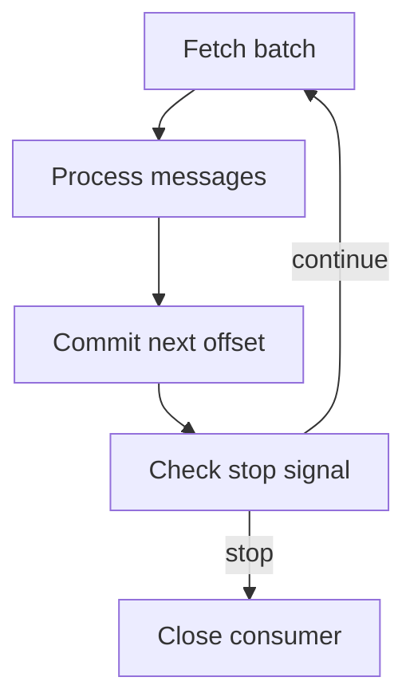

# Kafka in a Python service: producers, consumers and operations {#kafka-in-python-services}

<div class="bdr-post__hero" data-bdr-post="2026-09-13-kafka-in-python-services" role="img" aria-label="Each default checked against a real broker, not against the documentation" markdown="0"></div>

A Kafka client must fit the service's rules: who owns topics, when a message counts as processed and what happens during shutdown. Library defaults do not answer those questions.

Consider producer and consumer alongside their lifecycle. Acknowledgements, retries and process termination then form one testable process.

<!-- more -->

<div id="the-production-checklist-for-aiokafka" data-search-exclude></div>
<div id="the-producer" data-search-exclude></div>
<div id="the-consumer" data-search-exclude></div>
<div id="topics-and-health" data-search-exclude></div>
<div id="the-list-short" data-search-exclude></div>
<div id="the-pieces" data-search-exclude></div>

## Configure publication for the required guarantee {#producer}

Create the producer inside a running event loop and let the application owner close it. Distinguish local enqueueing from broker acknowledgement. If publication matters to a user response, await the appropriate future or expose an explicit asynchronous contract.

Acknowledgements, replication and the minimum number of in-sync replicas must agree. An idempotent producer helps with retries of its publication; it does not deduplicate two separate application submissions of the same business operation.

Define serialization, partition keys and message-size limits beforehand. Ordering is within a partition, making key selection part of the data contract.

## Define what commit means {#consumer}

An offset identifies a read position; committing records the group's recovery point. A manual commit stores the next offset after successfully processed messages. The [aiokafka documentation](https://aiokafka.readthedocs.io/en/stable/consumer.html) describes this API and rebalance behavior.

This loop assumes `enable_auto_commit=False`. The application supplies `process` and the `stop` event:

```python
async def consume_batches(consumer, process, stop):
    await consumer.start()
    try:
        while not stop.is_set():
            batches = await consumer.getmany(timeout_ms=1000, max_records=100)
            for partition, messages in batches.items():
                for message in messages:
                    await process(message)
                if messages:
                    await consumer.commit({partition: messages[-1].offset + 1})
    finally:
        await consumer.stop()
```

If `process` raises, progress for that batch is not committed and some messages may be delivered again. Processing must tolerate duplicates. With concurrency, never commit beyond an unfinished message.

This is a loop foundation rather than a complete runtime: the application also needs exception policy, rebalance handling and a shutdown time limit. A commit failure after partition ownership changes cannot be treated as successfully recorded progress.

<!-- diagram:concept -->
<figure class="bdr-diagram" markdown="1">
<figcaption><span class="bdr-diagram__eyebrow">THE IDEA, VISUALIZED</span><strong>Record progress after processing</strong></figcaption>
<div class="bdr-diagram__viewport" markdown="1" data-search-exclude>



</div>
<p class="bdr-diagram__caption">The consumer processes an accepted batch before committing its offset. After a stop signal it does not request another batch.</p>
</figure>
<!-- /diagram:concept -->

<div id="should-your-application-create-kafka-topics-on-startup" data-search-exclude></div>
<div id="what-the-broker-does-for-you" data-search-exclude></div>
<div id="what-the-application-does" data-search-exclude></div>
<div id="the-shape-is-decided-once-forever" data-search-exclude></div>
<div id="three-replicas-start-at-the-same-time" data-search-exclude></div>
<div id="a-shape-the-cluster-cannot-give-you" data-search-exclude></div>
<div id="so-should-it" data-search-exclude></div>

## Assign topic ownership {#topics}

Automatic creation is convenient locally. A production topic has a contract covering partitions, replication, retention, permissions and message compatibility.

A service-owned topic can be provisioned during deployment. Shared topics need an explicit owner for infrastructure changes. “Create if absent” does not necessarily update an existing topic: provisioning and reconciliation are different tasks.

Test simultaneous replica startup and refusal to create an invalid configuration. Both should produce understandable outcomes rather than leaving the application accidentally running without its topic.

<div id="graceful-kafka-consumer-shutdown-in-kubernetes" data-search-exclude></div>
<div id="what-the-group-does-when-a-member-disappears" data-search-exclude></div>
<div id="measured-the-consumer-that-exits" data-search-exclude></div>
<div id="the-protocol" data-search-exclude></div>
<div id="the-numbers-to-set" data-search-exclude></div>

## Finish within the shutdown budget {#shutdown}

After a stop signal, the consumer stops requesting work, completes the accepted batch, commits completed progress and leaves the group. Batch size and handler duration determine drain time.

If work cannot finish within the budget, redelivery is possible. That is an expected case for an idempotent handler, not a reason to acknowledge unfinished work. The [service lifecycle article](2026-09-13-python-service-lifecycle.md) covers process shutdown order.

## Observe processing delay {#verification}

Lag is useful alongside arrival rate, processing duration and oldest-message age. Also observe producer errors, failed commits, rebalances and messages routed for separate investigation.

Test broker loss, handler failure and shutdown halfway through a batch. [Outbox and Inbox](2026-09-13-reliable-events-outbox-inbox-kafka.md) cover database and external-effect guarantees. [aiokafka-foundation-kit](https://bedrock-python.github.io/aiokafka-foundation-kit/) supplies settings and client lifecycle integration; the application owns the processing contract.

## Examples and labs {#labs}

The complete setups and reproduction instructions are available separately:

- [Lab: the production checklist for aiokafka](../lab/2026-09-07-aiokafka-checklist/README.md)
- [Lab: who creates the Kafka topic](../lab/2026-09-07-topics-on-startup/README.md)
- [Lab: graceful Kafka consumer shutdown in Kubernetes](../lab/2026-09-07-kafka-consumer-shutdown/README.md)
