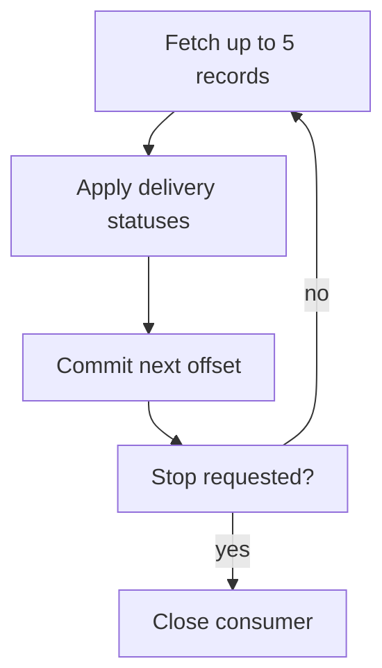

# Kafka in Python: publishing, processing and stopping safely {#kafka-in-python-services}

<div class="bdr-post__hero" data-bdr-post="2026-09-13-kafka-in-python-services" role="img" aria-label="Delivery statuses: publish, process, commit and finish the current batch on shutdown" markdown="0"></div>

Imagine a delivery service that publishes parcel statuses to Kafka. A tracking service reads them and updates the customer's order page. During a deployment, it must finish the messages it has accepted or leave them for its replacement to retry.

We will build that flow, fail a handler and stop a consumer halfway through a batch. Each example answers a concrete question: what was sent, what was processed and where the next instance will start.

<!-- more -->

<div id="the-production-checklist-for-aiokafka" data-search-exclude></div>
<div id="the-producer" data-search-exclude></div>
<div id="the-consumer" data-search-exclude></div>
<div id="topics-and-health" data-search-exclude></div>
<div id="the-list-short" data-search-exclude></div>
<div id="the-pieces" data-search-exclude></div>

## Publish a delivery status {#producer}

Agree on the message contract before creating clients:

| Field | Our example |
| --- | --- |
| Topic | `delivery.status`, provisioned before service startup |
| Key | Delivery ID encoded as UTF-8 bytes |
| Value | JSON with `delivery_id`, `status` and an increasing `revision` |
| Consumer group | `tracking`, shared by replicas of the tracking service |

Use [aiokafka-foundation-kit](https://bedrock-python.github.io/aiokafka-foundation-kit/) for settings, JSON serialization and client lifecycle. Its Pydantic models live in `contrib.models`; the examples use the `[models]` extra.

The eight Kafka snippets below form the lab's `kafka_flow.py`. The servicewright adapter near the end lives in `consumer_service.py`. The labs run these same functions against a real broker.

The delivery service opens one producer inside its running event loop and reuses it until shutdown. `bootstrap` is its Kafka bootstrap address. The context manager starts and closes the client:

```python
from contextlib import asynccontextmanager

from aiokafka_foundation_kit import producer_lifecycle
from aiokafka_foundation_kit.contrib.models import BaseKafkaProducerSettings

TOPIC = "delivery.status"


@asynccontextmanager
async def delivery_producer(bootstrap):
    settings = BaseKafkaProducerSettings(
        bootstrap_servers=bootstrap,
        acks="all", enable_idempotence=True, compression_type="gzip",
    )
    async with producer_lifecycle(settings) as producer:
        yield producer
```

An update goes through this function:

```python
async def publish_status(producer, delivery_id, status, revision):
    return await producer.send_and_wait(
        TOPIC,
        value={"delivery_id": delivery_id, "status": status, "revision": revision},
        key=delivery_id.encode("utf-8"),
    )
```

For example, `publish_status(producer, "delivery-42", "in_transit", 4)` sends a dictionary as JSON and a byte key. Awaiting it returns broker acknowledgement metadata, including partition and offset. It does not mean the tracking service has applied the update. The [client lab](../lab/2026-09-07-aiokafka-checklist/README.md) reads five such messages back and checks the payloads, byte keys and sequence.

`acks="all"` and idempotence must agree with the cluster's replication and `min.insync.replicas` policy. A single-broker lab cannot demonstrate replicated durability. Producer idempotence covers its own retry protocol; two explicit application calls can still publish the same business update twice. See [aiokafka's producer guarantees](https://aiokafka.readthedocs.io/en/stable/producer.html#idempotent-produce).

If a request must save application data and publish a message together, use the [Outbox flow](2026-09-13-reliable-events-outbox-inbox-kafka.md). Here we focus on the Kafka clients and their processing lifecycle.

## Update the tracking view, then commit {#consumer}

First define what the handler does. The lab keeps each delivery's latest status in a dictionary and ignores repeated or older revisions:

```python
class TrackingView:
    def __init__(self):
        self.deliveries = {}

    async def process(self, message):
        event = message.value
        delivery_id = event["delivery_id"]
        previous = self.deliveries.get(delivery_id)
        if previous is None or event["revision"] > previous["revision"]:
            self.deliveries[delivery_id] = event
```

This dictionary is an observable test effect. A real tracking view needs durable storage; an in-memory dictionary cannot survive a restart. The revision rule is suitable for complete status snapshots. Operations that must apply every transition need their own sequence protocol.

Configure the consumer to commit manually:

```python
from aiokafka_foundation_kit import consumer_lifecycle
from aiokafka_foundation_kit.contrib.models import BaseKafkaConsumerSettings


def tracking_settings(bootstrap, group="tracking"):
    return BaseKafkaConsumerSettings(
        bootstrap_servers=bootstrap, group_id=group,
        enable_auto_commit=False, auto_offset_reset="earliest",
        max_poll_records=5, max_poll_interval_ms=30_000,
    )
```

`earliest` is the fallback when no usable committed offset exists. A replacement in the same group resumes from its committed position. The kit deserializes the JSON value before passing the message to our handler.

The consumer is already started by `consumer_lifecycle`. Pass `TrackingView().process` and an `asyncio.Event` named `stop` to this loop:

```python
import asyncio


async def consume_batches(consumer, process, stop):
    while not stop.is_set():
        batches = await consumer.getmany(timeout_ms=500, max_records=5)
        async with asyncio.timeout(10):
            for partition, messages in batches.items():
                for message in messages:
                    await process(message)
                if messages:
                    await consumer.commit({partition: messages[-1].offset + 1})
```

Each poll returns at most five records across all partitions. The ten-second timeout covers processing **and commits for the fetched batch**. A commit is made separately for each partition after its records succeed. Completing offsets 0–4 stores offset **5**, the next record to read.

If processing raises or times out, the loop exits. It does not continue and commit past the failed record. Previously committed partitions keep their progress; the unfinished partition may replay records whose effects already happened. Our revision check tolerates those repeats.

The lab checks these outcomes on a single partition:

| Scenario | Processed offsets | Committed offset | Replacement starts at |
| --- | --- | --- | --- |
| Handler fails on the third record | 0, 1 | None | 0 |
| All five records finish, manual commit | 0–4 | 5 | 5 |
| Auto-commit runs after fetching five but processing two | 0, 1 | 5 | 5 |

The last row is why auto-commit is wrong for this batch-processing contract: it can move the recovery point beyond work that has not happened. Those records remain in Kafka, but an ordinary group restart will skip them.

The 30-second `max_poll_interval_ms` leaves room for our bounded batch. A rebalance can still move a partition to another consumer while work is in flight. Let a failed commit stop this loop; do not log it as success and continue. More advanced concurrent workers need coordinated partition revocation and commits. See [aiokafka's consumer and rebalance API](https://aiokafka.readthedocs.io/en/stable/consumer.html#manual-vs-automatic-committing).

<!-- diagram:concept -->
<figure class="bdr-diagram" markdown="1">
<figcaption><span class="bdr-diagram__eyebrow">THE IDEA, VISUALIZED</span><strong>Finish the accepted batch before stopping</strong></figcaption>
<div class="bdr-diagram__viewport" markdown="1" data-search-exclude>


```mermaid
---
config:
  theme: default
  look: classic
  flowchart:
    useMaxWidth: false
    wrappingWidth: 150
    padding: 12
    nodeSpacing: 24
    rankSpacing: 32
---
flowchart TD
    accTitle: Finish the accepted batch before stopping
    accDescr: Successful processing commits the next offset. Failure or timeout leaves unfinished progress for replay; the consumer then closes.
    A["Fetch up to 5 records"]
    B["Apply delivery statuses"]
    C["Commit next offset"]
    D["Stop requested?"]
    E["Close consumer"]
    A --> B --> C --> D
    D -->|"no"| A
    D -->|"yes"| E
```

</div>
<p class="bdr-diagram__caption">Successful processing commits the next offset. Failure or timeout leaves unfinished progress for replay; the consumer then closes.</p>
</figure>
<!-- /diagram:concept -->

<div id="should-your-application-create-kafka-topics-on-startup" data-search-exclude></div>
<div id="what-the-broker-does-for-you" data-search-exclude></div>
<div id="what-the-application-does" data-search-exclude></div>
<div id="the-shape-is-decided-once-forever" data-search-exclude></div>
<div id="three-replicas-start-at-the-same-time" data-search-exclude></div>
<div id="a-shape-the-cluster-cannot-give-you" data-search-exclude></div>
<div id="so-should-it" data-search-exclude></div>

## Create the topic before starting the service {#topics}

Suppose the delivery team owns `delivery.status`. Its deployment step can create the topic through the kit:

```python
from aiokafka_foundation_kit import TopicConfig, ensure_topics_async


async def provision_delivery_topic(bootstrap, *, partitions=3, replicas=1):
    settings = BaseKafkaProducerSettings(bootstrap_servers=bootstrap)
    await ensure_topics_async([
        TopicConfig(
            name=TOPIC, num_partitions=partitions, replication_factor=replicas,
            topic_configs={"retention.ms": "604800000"},
        ),
    ], settings)
```

This requests three partitions and seven days of time-based retention. One replica is for the lab's single broker; choose replication and retention for the deployed cluster. Retention also depends on other topic settings, such as size limits.

`ensure_topics_async()` creates missing topics. It does not reconcile an existing topic's configuration. The [topic lab](../lab/2026-09-07-topics-on-startup/README.md) makes the distinction visible:

| Request | Result |
| --- | --- |
| Three callers simultaneously request the same three-partition topic | All return successfully; one topic with three partitions exists |
| The next call requests six partitions for that topic | The existing topic still has three |
| Request three replicas from one broker | `InvalidReplicationFactorError` |

Creation of a list is not atomic either. For `[valid_topic, invalid_topic, next_topic]`, the first remains created, the invalid configuration raises, and the last is not attempted. A deployment should report that partial result and resolve it before starting workers.

If you use `producer_lifecycle(..., topics=[...])` instead, pass `auto_create_topics=True` to that context manager to request creation. The `topics` argument alone does not enable it. The labs disable automatic broker-side topic creation so it cannot conceal a missing provisioning step.

<div id="graceful-kafka-consumer-shutdown-in-kubernetes" data-search-exclude></div>
<div id="what-the-group-does-when-a-member-disappears" data-search-exclude></div>
<div id="measured-the-consumer-that-exits" data-search-exclude></div>
<div id="the-protocol" data-search-exclude></div>
<div id="the-numbers-to-set" data-search-exclude></div>

## Stop halfway through a batch {#shutdown}

Now deploy a new tracking-service version. The old instance has fetched five records and completed two when its stop event is set. Finishing the remaining three lets it commit offset 5; immediate cancellation leaves the batch available for replay.

Give the current batch a bounded opportunity to finish, then close the consumer:

```python
async def run_tracking(bootstrap, process, stop, *, group="tracking", grace=12):
    async with consumer_lifecycle(
        tracking_settings(bootstrap, group), topics=(TOPIC,),
    ) as consumer:
        worker = asyncio.create_task(consume_batches(consumer, process, stop))
        stopping = asyncio.create_task(stop.wait())
        try:
            await asyncio.wait({worker, stopping}, return_when=asyncio.FIRST_COMPLETED)
            async with asyncio.timeout(grace):
                await worker
        finally:
            worker.cancel()
            stopping.cancel()
            await asyncio.gather(worker, stopping, return_exceptions=True)
```

`consume_batches()` checks `stop` before the next poll, so a stop during processing finishes only the accepted batch. A poll already in progress can return a final batch to drain. If the worker fails before a stop request, `await worker` propagates that failure too.

After `stop`, `grace` limits waiting for the worker. Expiry cancels it and raises `TimeoutError`; unfinished progress is not committed. The consumer then closes through its lifecycle context. Allow additional time for that cleanup in the process termination budget. As with other asyncio timeouts, handlers must cooperate with cancellation.

### Pass process shutdown to the worker {#service}

Our [servicewright](https://bedrock-python.github.io/servicewright/) library supplies the process lifecycle and signal handling. `DaemonEntrypoint` passes the service's stop event to the consumer function. The [shutdown lab](../lab/2026-09-07-kafka-consumer-shutdown/README.md) provides minimal `Settings` and `Container` objects in `consumer_common.py`:

```python
from servicewright import AppSpec, DaemonEntrypoint, Service, run_sync

from consumer_common import Container, Settings, flow


def build_service(bootstrap, process, *, group="tracking", grace=12):
    async def consume(scope, stop):
        # The timeout belongs to this loop. DaemonEntrypoint.drain() is a no-op.
        await flow.run_tracking(bootstrap, process, stop, group=group, grace=grace)

    spec = AppSpec(
        service_name="tracking", create_container=lambda settings: Container(),
        cleanup_timeout_seconds=3,
    )
    return Service(spec, entrypoints=[DaemonEntrypoint(consume)])
```

The executable `consumer_service.py` uses `run_sync(service, Settings())` to run the service. In tests, `service.run(Settings(), stop=event)` accepts an explicit event and works on Windows too. The processing timeout is in `run_tracking()`; `AppSpec.drain_grace_seconds` alone does not bound an arbitrary `DaemonEntrypoint` function.

With ten records waiting in one partition, the lab gets:

```text
Cancel after two effects: processed=[0, 1],          committed=None, restart=0
Finish the batch:         processed=[0, 1, 2, 3, 4], committed=5,    restart=5
Drain budget expires:    processed=[0, 1],          committed=None, restart=0
```

These checks use a stop event or task cancellation, a real broker and replacement consumers. They verify draining and offsets; they do not reproduce a Kubernetes rollout or a hard process kill. Deployment shutdown ordering is covered in the [service lifecycle article](2026-09-13-python-service-lifecycle.md).

## Measure work left to acknowledge {#verification}

A consumer can have fetched the entire topic while its handler is still working. Compare the current read position with committed progress:

```python
async def read_lag(consumer):
    partitions = consumer.assignment()
    ends = await consumer.end_offsets(partitions)
    result = {}
    for partition, end in ends.items():
        position = await consumer.position(partition)
        committed = await consumer.committed(partition)
        result[partition] = {
            "position_lag": end - position,
            "committed_lag": None if committed is None else end - committed,
        }
    return result
```

In the lab, the group has committed offset 0 and fetched five records. `position_lag` is **0**, while `committed_lag` is **5**. After successful processing and commit, both become zero. `None` means this group has no saved offset yet. These separate broker calls provide an observational snapshot, not an atomic measurement.

Track handler duration, failed commits and rebalance events alongside lag. A successful `check_kafka_health_async()` checks connectivity; it does not prove permission to publish to this topic or successful processing by tracking.

The examples were checked with Python 3.13, aiokafka-foundation-kit 0.1.3, aiokafka 0.14.0 and servicewright 0.13.1. The labs pin their dependencies and run `confluentinc/cp-kafka:7.6.0` in KRaft mode. Their assertions verify the public library APIs without replacing library internals.

## Start with the processing contract {#conclusion}

We sent a delivery update, replayed a failed batch, provisioned a topic and stopped a worker during processing. The recovery point stayed correct when the application committed only completed work and made failure leave the processing loop.

Use our [aiokafka-foundation-kit](https://bedrock-python.github.io/aiokafka-foundation-kit/) for settings, JSON clients and lifecycle management. Add [servicewright](https://bedrock-python.github.io/servicewright/) when the worker needs a shared process lifecycle. Keep the topic contract, durable handler effect and commit decision explicit in the application; the runnable labs give you a starting point for checking them.

## Examples and labs {#labs}

- [Lab: JSON, commits and repeated delivery](../lab/2026-09-07-aiokafka-checklist/README.md)
- [Lab: topic creation and concurrent startup](../lab/2026-09-07-topics-on-startup/README.md)
- [Lab: draining a consumer and exceeding its shutdown budget](../lab/2026-09-07-kafka-consumer-shutdown/README.md)
