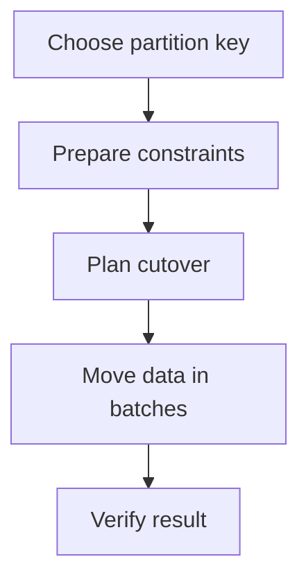

# Partitioning an existing PostgreSQL table {#partitioning-an-existing-postgresql-table}

Partitioning an existing table changes more than row storage. It affects uniqueness, foreign keys, query plans and writes during the transition. Before creating partitions, choose a key that can satisfy those constraints.

The migration should produce a predictable partition tree, verified data and an explicit application cutover.

<!-- more -->

## Choose the key from queries and constraints {#keys}

Time ranges naturally suggest a timestamp column. A partitioned table's unique constraint generally must include every partition-key column. That can turn `PRIMARY KEY (id)` into a composite key and require changes to incoming foreign keys. See [PostgreSQL's partitioning restrictions](https://www.postgresql.org/docs/current/ddl-partitioning.html).

For suitable new data, another option is partitioning directly on UUIDv7. Bounds are then id values, and the unique key can remain one column. A predicate on a separate `created_at` column does not automatically prune partitions keyed on id: predicates must align with the partition key.

UUIDv7 is useful when its time ordering matches the data and query model. It does not transform existing random UUIDs or eliminate late-arriving records. Validate the choice with real `EXPLAIN` output and retention rules.

## Design cutover separately {#cutover}

An ordinary table cannot simply be declared partitioned without structural work. Create a new parent and a path for moving or attaching existing data. One lab in this blog adopts the old table as DEFAULT and subsequently moves rows into ranges.

Before cutover, inventory incoming foreign keys, sequences, defaults, privileges, indexes, triggers and dependent views. Renaming tables alone does not guarantee that every dependency now references the intended parent.

DDL cutover requires locks. Rehearse with concurrent writes, limit lock waiting and define when to abandon an attempt. “Without changing application queries” does not mean zero interruption or an unchanged schema.

<!-- diagram:concept -->
<figure class="bdr-diagram" markdown="1">
<figcaption>THE IDEA, VISUALIZED<strong>A controlled transition to partitioning</strong></figcaption>

Keys and references are designed before cutover. The migration ends by checking rows, constraints and query plans.

</figure>
<!-- /diagram:concept -->

## Move data in bounded batches {#movement}

Batch size bounds transaction duration, WAL volume and interference with live traffic. After each batch, identify completed work and how a restart resumes it.

Creating a range alongside DEFAULT needs care: rows belonging to that range may still reside in DEFAULT and prevent the new partition from being added. Movement, validation and attach order must respect the actual tree's constraints. An uncoordinated `INSERT ... SELECT` followed by deletion is not a general substitute when writes continue.

For large tables, compare a maintenance window, controlled copy-and-cutover or a dedicated synchronization approach. The right option depends on acceptable downtime and write intensity.

## Verify more than row counts {#verification}

Reconcile data and duplicates, restore and validate foreign keys, and check the sequence's next value. Verify defaults, permissions and important constraints, then run representative queries with `EXPLAIN`.

Also test writes outside prepared ranges. The application needs either an acceptable DEFAULT path or an expected, observable refusal. Regular [partition maintenance](2026-09-13-postgresql-partition-maintenance.md) follows the migration.

The labs retain transition and UUIDv7 examples. [pg-partsmith](https://bedrock-python.github.io/pg-partsmith/) helps maintain ranges; key selection, cutover design and reference validation remain migration responsibilities.

## Examples and labs {#labs}

The complete setups and reproduction instructions are available separately:

- [Lab: partitioning a live table](../lab/2026-09-07-partition-existing-table/README.md)
- [Lab: UUIDv7 as a PostgreSQL partition key](../lab/2026-09-07-uuidv7-partition-key/README.md)
