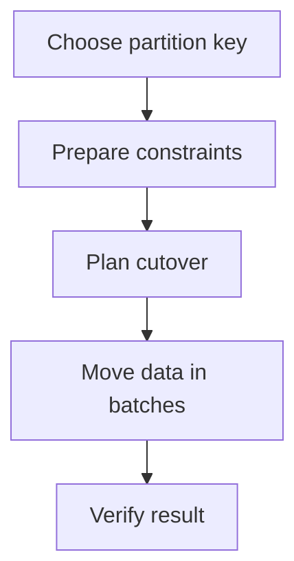

# Partitioning an existing PostgreSQL table {#partitioning-an-existing-postgresql-table}

<div class="bdr-post__hero" data-bdr-post="2026-09-13-partitioning-an-existing-postgresql-table" role="img" aria-label="Prepare keys, attach the old table as DEFAULT and verify each migration step" markdown="0"></div>

Imagine an analytics service that stores events in `events`. Reports usually read one month, and operators add notes in `event_notes`. We want monthly partitions while keeping the name `events` for application queries. The existing primary key, foreign key, view and sequence all have to survive the transition.

We will rehearse the migration on PostgreSQL 17 using pg-partsmith 1.5.1, SQLAlchemy 2.0.54 and asyncpg 0.31.0. This example uses a **maintenance window**: application reads and writes are paused until data and dependencies have been verified. The lab's diagnostic queries deliberately inspect intermediate states.

<!-- more -->

## Start with the table and its references {#keys}

Here is the complete starting schema. `events_app` represents the application's permissions; the lab administrator switches into that role to check access. `event_summary` is a deliberately simple reporting view:

```sql
CREATE TABLE events (
    id bigserial PRIMARY KEY,
    created_at timestamptz NOT NULL,
    kind text NOT NULL,
    payload text NOT NULL
);
CREATE INDEX events_created_at_idx ON events (created_at);
CREATE TABLE event_notes (
    id bigserial PRIMARY KEY,
    event_id bigint NOT NULL REFERENCES events (id),
    note text NOT NULL
);
CREATE VIEW event_summary AS SELECT count(*) AS total FROM events;
CREATE ROLE events_app NOLOGIN;
GRANT USAGE ON SCHEMA public TO events_app;
GRANT SELECT, INSERT ON events TO events_app;
GRANT USAGE ON SEQUENCE events_id_seq TO events_app;
```

The lab inserts 615 events across July, August and September 2026, plus one event through the application's role. Twenty notes reference existing events. Before changing anything, it saves the full event and note rows for comparison afterward.

The tempting `CREATE TABLE ... (LIKE events INCLUDING ALL) PARTITION BY RANGE (created_at)` fails with SQLSTATE `0A000`: `PRIMARY KEY (id)` does not include the partition key. Dropping that key also fails, with `2BP01`, because `event_notes` references it. PostgreSQL requires a partitioned table's unique/primary key to include every partition-key column. See the [PostgreSQL 17 restrictions](https://www.postgresql.org/docs/17/ddl-partitioning.html#DDL-PARTITIONING-DECLARATIVE-LIMITATIONS).

For this migration we choose `(id, created_at)`, so notes will reference both values. **This no longer guarantees uniqueness of `id` alone.** The lab checks that the same pair is rejected but the same id with another timestamp is accepted. If single-column uniqueness is a requirement, resolve that before choosing time-based partitions.

After pausing application work and letting active transactions finish, prepare the referencing column and replacement index:

```python
async def prepare_keys(connection):
    await connection.execute("""
        ALTER TABLE event_notes ADD COLUMN event_created_at timestamptz;
        UPDATE event_notes AS n
        SET event_created_at = e.created_at
        FROM events AS e WHERE e.id = n.event_id;
        ALTER TABLE event_notes ALTER COLUMN event_created_at SET NOT NULL;
    """)
    await connection.execute("""
        CREATE UNIQUE INDEX CONCURRENTLY events_id_created_at_key
        ON events (id, created_at)
    """)
```

These functions receive an `asyncpg.Connection`. `event_created_at` becomes NOT NULL so a note cannot bypass the future composite foreign key with a missing timestamp. New note-writing code must supply that timestamp too; keeping the parent table name does not remove this application change.

`CREATE INDEX CONCURRENTLY` runs outside an explicit transaction. It reduces blocking while building the index on the ordinary table; swapping constraints and tables still needs locks. The lab does not claim a production duration from its small dataset.

<div id="how-to-partition-an-existing-postgresql-table-without-rewriting-your-application" data-search-exclude></div>
<div id="step-1-the-primary-key-has-to-contain-the-partition-column" data-search-exclude></div>
<div id="step-2-the-swap" data-search-exclude></div>
<div id="step-3-the-first-maintenance-tick" data-search-exclude></div>
<div id="step-4-the-drain" data-search-exclude></div>
<div id="step-5-the-foreign-key-comes-back-composite" data-search-exclude></div>
<div id="step-6-the-empty-default-and-the-sequence" data-search-exclude></div>
<div id="the-result" data-search-exclude></div>
<div id="the-order-and-where-the-risk-is" data-search-exclude></div>
<div id="the-pieces" data-search-exclude></div>

## Replace the parent in one transaction {#cutover}

Rename the old table, create the partitioned parent and attach the old table as its DEFAULT partition. The prepared index supplies the replacement primary key:

```python
async def cutover(connection):
    async with connection.transaction():
        await connection.execute("SET LOCAL lock_timeout = '200ms'")
        await connection.execute("""
            LOCK TABLE events, event_notes IN ACCESS EXCLUSIVE MODE;
            ALTER TABLE event_notes DROP CONSTRAINT event_notes_event_id_fkey;
            ALTER TABLE events DROP CONSTRAINT events_pkey,
                ADD CONSTRAINT events_pkey PRIMARY KEY USING INDEX events_id_created_at_key;
            ALTER TABLE events RENAME TO events_legacy;
            ALTER TABLE events_legacy RENAME CONSTRAINT events_pkey TO events_legacy_pkey;
            ALTER INDEX events_created_at_idx RENAME TO events_legacy_created_at_idx;
            CREATE TABLE events (LIKE events_legacy INCLUDING ALL)
                PARTITION BY RANGE (created_at);
            ALTER TABLE events ATTACH PARTITION events_legacy DEFAULT;
        """)
```

The 200 ms lock timeout is deliberately short for the demonstration. The lab holds a read transaction on a second connection, then calls `cutover`. It gets SQLSTATE `55P03`; the transaction context rolls back, preserving the original table, foreign key and rows. Once that reader exits, the same cutover succeeds.

At this point, querying the new parent returns all 616 rows from `events_legacy`. Two dependencies still need repair: the new parent has not inherited the application's table grants, and the view still refers to the old table object. We check both instead of assuming a rename redirects them.

Our sample has no custom triggers or row-level security policies. Inventory those, incoming references, views and privileges in your own schema before adopting this cutover.

<!-- diagram:concept -->
<figure class="bdr-diagram" markdown="1">
<figcaption><span class="bdr-diagram__eyebrow">THE IDEA, VISUALIZED</span><strong>A controlled transition to partitioning</strong></figcaption>
<div class="bdr-diagram__viewport" markdown="1" data-search-exclude>


```mermaid
---
config:
  theme: default
  look: classic
  flowchart:
    useMaxWidth: false
    wrappingWidth: 150
    padding: 12
    nodeSpacing: 24
    rankSpacing: 32
---
flowchart TD
    accTitle: A controlled transition to partitioning
    accDescr: Keys and references are designed before cutover. The migration ends by checking rows, constraints and query plans.
    A["Choose partition key"]
    B["Prepare constraints"]
    C["Plan cutover"]
    D["Move data in batches"]
    E["Verify result"]
    A --> B --> C --> D --> E
```

</div>
<p class="bdr-diagram__caption">Keys and references are designed before cutover. The migration ends by checking rows, constraints and query plans.</p>
</figure>
<!-- /diagram:concept -->

## Move rows out of DEFAULT and inspect intermediate results {#movement}

Creating a July partition immediately fails with SQLSTATE `23514`: DEFAULT still contains July rows. A new range cannot overlap the rows that PostgreSQL must exclude from DEFAULT.

`pg-partsmith` handles the order: create an unattached table for a month, move rows into it and attach it after that month's rows leave DEFAULT. Each batch moves rows using a single `DELETE ... RETURNING` / `INSERT` statement. Until attachment, those rows are absent from queries through the parent. This is why application traffic is paused.

These functions use `PartitionGranularity` and `TablePartitionConfig` from `pg_partsmith`, plus `PartitionToolkit` from `pg_partsmith.aio`. `engine` is a SQLAlchemy `AsyncEngine` connected to the same database:

```python
def migration_toolkit(engine):
    config = TablePartitionConfig(
        schema="public",
        table_name="events",
        partition_column="created_at",
        granularity=PartitionGranularity.MONTH,
    )
    return PartitionToolkit.from_engine(engine), config


async def move_batch(toolkit, config, *, max_batches=10):
    result = await toolkit.service.partition_data(
        config, batch_rows=100, max_batches=max_batches,
    )
    if result.issues:
        raise RuntimeError(f"Data movement needs attention: {result.issues}")
    return result


async def finish_ranges(toolkit, config, expected_months):
    while True:
        result = await move_batch(toolkit, config)
        if result.complete:
            break
        if result.rows_moved == 0:
            raise RuntimeError("Data movement made no progress")
    await toolkit.service.ensure_partitions(config, expected_months)
    return result
```

Call `move_batch(toolkit, config, max_batches=1)` to stop after one batch. With the lab's data, the result is measurable:

| Observation after the first batch | Result |
|---|---|
| `rows_moved`, `batches`, `complete` | `100`, `1`, `False` |
| Rows visible through `events` | `516` |
| Rows in the unattached `events__2026_07` | `100` |
| Full rows from both locations combined | Exactly the original 616 rows |

The lab disposes the engine's connections, constructs another toolkit and calls `finish_ranges` with the expected July, August and September starts as UTC datetimes. This resumes from committed database state. It checks `issues` on every batch, refuses a stalled loop and explicitly ensures that the expected ranges are attached. All saved rows must then be visible through `events` again.

Why the explicit final step? A separate check reproduces an edge case in **pg-partsmith 1.5.1**: exactly 100 July rows, `batch_rows=100`, `max_batches=1`. The batch empties DEFAULT but leaves July unattached. The next call reports `complete=True` because DEFAULT is empty, while a parent query returns zero rows. `ensure_partitions` attaches the expected July range, and a full row comparison confirms that all 100 rows are visible again. Treat `complete` as one signal; verify attachment and data before reopening the service.

During this migration we call `partition_data` and explicitly create the October range with `ensure_partitions`. We do not run a retention cycle that could retire historical data being migrated.

## Restore references before reopening the service {#verification}

The old single-column foreign key can no longer be added: the new parent has no unique constraint on `id` alone. Restore the composite reference, validate existing notes, transfer ownership of the sequence, replace the view's query and grant access to the parent:

```python
async def restore_references(connection):
    async with connection.transaction():
        await connection.execute("SET LOCAL lock_timeout = '200ms'")
        await connection.execute("""
            ALTER TABLE event_notes ADD CONSTRAINT event_notes_event_fkey
                FOREIGN KEY (event_id, event_created_at)
                REFERENCES events (id, created_at) NOT VALID;
            ALTER TABLE event_notes VALIDATE CONSTRAINT event_notes_event_fkey;
            ALTER SEQUENCE events_id_seq OWNED BY events.id;
            CREATE OR REPLACE VIEW event_summary AS SELECT count(*) AS total FROM events;
            GRANT SELECT, INSERT ON events TO events_app;
        """)
```

`NOT VALID` lets the foreign key be installed before checking old rows; `VALIDATE CONSTRAINT` performs that check. Both steps complete before traffic resumes. A missing note timestamp now fails with `23502`; an `(event_id, event_created_at)` pair that does not exist fails with `23503`.

Without rewriting the view, `event_summary` reports zero after the old table has been drained. Without transferring sequence ownership, dropping the legacy table conflicts with the default that still uses its sequence. The lab verifies the repaired view and performs another insert as `events_app` after cleanup; its generated id is greater than the pre-cutover id.

Remove DEFAULT only after verifying it is empty. The count check and detach happen under the same parent-table lock:

```python
async def remove_empty_default(connection):
    async with connection.transaction():
        await connection.execute("SET LOCAL lock_timeout = '200ms'")
        await connection.execute("LOCK TABLE events IN ACCESS EXCLUSIVE MODE")
        remaining = await connection.fetchval("SELECT count(*) FROM ONLY events_legacy")
        if remaining:
            raise RuntimeError(f"DEFAULT still contains {remaining} rows")
        await connection.execute("ALTER TABLE events DETACH PARTITION events_legacy")
        await connection.execute("DROP TABLE events_legacy")
```

The completed rehearsal checks more than a total count:

| Check | Expected result |
|---|---|
| Full saved rows and all twenty original notes | Unchanged |
| Validated composite foreign key | Wrong references are rejected |
| Application insert with the original event SQL | Works with the restored grants and sequence |
| `event_summary` | Counts rows through the new parent |
| July timestamp range in `EXPLAIN (FORMAT JSON)` | Scans only `events__2026_07` |
| Insert for an unprepared old month after DEFAULT removal | Fails with `23514` |

Decide the out-of-range behavior before reopening: this example rejects such writes. Keeping a monitored DEFAULT partition is another policy. The next task is regular [partition maintenance](2026-09-13-postgresql-partition-maintenance.md).

<div id="uuidv7-as-a-postgresql-partition-key" data-search-exclude></div>
<div id="one-column-in-the-primary-key" data-search-exclude></div>
<div id="the-bounds-are-uuids" data-search-exclude></div>
<div id="pruning-happens-on-the-id-not-on-the-timestamp" data-search-exclude></div>
<div id="the-three-ids-that-do-not-fit" data-search-exclude></div>
<div id="retention-has-the-same-edge" data-search-exclude></div>
<div id="when-to-reach-for-it" data-search-exclude></div>

## When UUIDv7 can keep a single-column primary key {#uuidv7}

For a different event model, suppose the id is already UUIDv7 and its embedded time is the intended partitioning axis. PostgreSQL then accepts `id UUID PRIMARY KEY ... PARTITION BY RANGE (id)` because the primary key includes the partition key.

The second lab uses a separate table, `uuid_events`. Configure monthly UUID bounds with the library's codec:

```python
from pg_partsmith import (
    PartitionGranularity, RangePartitioning, TablePartitionConfig,
    TimeBoundaries, UUIDv7BoundaryCodec,
)


CONFIG = TablePartitionConfig(
    schema="public",
    table_name="uuid_events",
    scheme=RangePartitioning(
        key="id",
        boundaries=TimeBoundaries(
            granularity=PartitionGranularity.MONTH,
            codec=UUIDv7BoundaryCodec(),
        ),
    ),
)
```

`toolkit.service.ensure_partitions(CONFIG, months)` creates the four explicit ranges from July through October 2026. To read August by the partition key, encode both boundaries; this function also imports `datetime` and `UTC` from `datetime`:

```python
async def august_events(connection):
    start = datetime(2026, 8, 1, tzinfo=UTC)
    end = datetime(2026, 9, 1, tzinfo=UTC)
    lower, upper = UUIDv7BoundaryCodec().encode(start, end)
    return await connection.fetch(
        "SELECT payload FROM uuid_events WHERE id >= $1::uuid AND id < $2::uuid",
        lower, upper,
    )
```

The lab checks real JSON query plans: the id range scans one partition; the equivalent condition on the independent `created_at` column scans all four. The smallest UUID at September's boundary routes into September, so adjacent ranges meet without overlapping.

Two further checks prevent misleading assumptions:

- A UUIDv7 encoding September with `created_at` set to 2020 still routes into September. Routing and retention follow the id's time.
- Range bounds do not validate the UUID version. A deliberately constructed UUIDv4 with a timestamp-like prefix fits the August range. The lab adds an explicit version CHECK and verifies rejection afterward.

An id outside prepared ranges is rejected, as is a late July row after July has been detached. UUIDv7 does not convert existing random ids or solve late arrivals; it is a different key design, useful when those semantics fit the service.

## Reproduce the migration {#reproduction}

The two labs need Docker and `uv`. Run the corresponding command from each lab directory:

```bash
uv run --no-project --python 3.13 --with-requirements requirements.txt python migrate_lab.py
uv run --no-project --python 3.13 --with-requirements requirements.txt python batch_boundary_lab.py
```

```bash
uv run --no-project --python 3.13 --with-requirements requirements.txt python uuidv7_lab.py
```

They start disposable PostgreSQL containers, assert the results and clean up on exit. Python dependencies are pinned in `requirements.txt`; fixed dates make the scenarios independent of the current month. These are correctness checks, not a throughput benchmark or a zero-downtime migration system.

## What to take into your migration {#conclusion}

We changed keys, rehearsed a lock timeout, attached the old table as DEFAULT, inspected partially moved data and restored references, grants, a view and a sequence. The UUIDv7 alternative showed how a different key changes uniqueness and query pruning.

Use [pg-partsmith](https://bedrock-python.github.io/pg-partsmith/) to create ranges and move DEFAULT rows in batches. Make the application's pause, dependency changes and final row checks explicit in the migration procedure. Resume service only after the new parent serves the expected data and the application's real queries work.

## Examples and labs {#labs}

- [Lab: partitioning a live table](../lab/2026-09-07-partition-existing-table/README.md): the rehearsal uses a maintenance window and checks intermediate visibility.
- [Lab: UUIDv7 as a PostgreSQL partition key](../lab/2026-09-07-uuidv7-partition-key/README.md)
