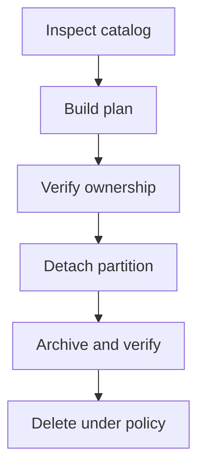

# PostgreSQL partition maintenance: creation, archiving and deletion {#postgresql-partition-maintenance}

Creating the next partition is relatively straightforward. Operational complexity surrounds it: who owns the schedule, which tables may be deleted, what happens if archiving fails and how two replicas avoid maintaining the same table at once.

Automation should therefore start with a reviewable operation plan, especially when it has DDL and deletion privileges.

<!-- more -->

## Inspect before planning {#planning}

Build the plan from PostgreSQL's actual catalog and the table policy. Show ranges to create, reasons for detaching or dropping tables, expected locks and operations requiring separate authorization.

A table name does not establish ownership. An unrelated partition can match a naming pattern. Check bounds, parent attachment and ownership metadata before destructive work; ambiguity is a reason to stop and investigate.

A saved plan can become stale when configuration or catalog state changes. Recheck important preconditions at execution time.

## Separate retirement from deletion {#retention}

`DETACH PARTITION` removes a table from the parent's tree while retaining its data. `DROP TABLE` removes the table itself. These are separate decisions, and a recovery interval can sit between them.

Locking and concurrent-detach availability depend on the operation and tree structure. DEFAULT partitions and foreign keys can change the available path. Check [PostgreSQL's restrictions](https://www.postgresql.org/docs/current/ddl-partitioning.html) rather than assuming every maintenance run can use one transaction.

Archiving should be part of permission to delete. Calling a hook does not prove that an archive is usable: require completed export, an identifiable destination and verification. Failed mandatory archiving prevents deletion.

<!-- diagram:concept -->
<figure class="bdr-diagram" markdown="1">
<figcaption>THE IDEA, VISUALIZED<strong>Deletion follows a reviewable plan</strong></figcaption>

A partition is detached and deleted only after ownership checks and successful archiving when archiving is required.

</figure>
<!-- /diagram:concept -->

## Assign one scheduling owner {#scheduling}

A CronJob, worker or existing scheduler can trigger maintenance. The schedule, permissions and monitoring need an owner. Multiple replicas need protection against concurrent work on the same table.

A lock does not replace idempotent operations and reinspection. After failure, some DDL may already have completed. The next run must continue from actual state instead of replaying assumptions from the previous plan.

Create ranges far enough ahead to tolerate missed runs. Monitor DEFAULT accumulation and time since successful maintenance. A scheduler's successful exit does not establish that the required partitions exist.

## Hand over from pg_partman {#migration}

Changing maintenance tools normally does not require recreating existing PostgreSQL partitions. The owner inspecting and maintaining the tree changes. Compare policies, inspect the new tool's plan and confirm that it recognizes existing bounds.

Use one active DDL owner during the handover. Do not assume two schedulers can safely coexist without coordinated locks and policies. After switching, verify creation of the next partition, retention and a way back to the previous maintenance arrangement.

Check any advanced pg_partman features in use: a replacement may not implement equivalents. The step-by-step transition lab remains available below.

## Make outcomes observable {#verification}

Record duration, affected tables, completed and rejected operations, refusal reasons and time since the last success. Deletion logs should explain the basis of each decision.

[pg-partsmith](https://bedrock-python.github.io/pg-partsmith/) separates inspection, planning and policy execution. That separation makes the tool's intent visible before a database change and its result inspectable afterwards.

## Examples and labs {#labs}

The complete setups and reproduction instructions are available separately:

- [Lab: partition retention is not DROP TABLE](../lab/2026-09-07-partition-retention/README.md)
- [Lab: adopting a pg_partman-managed table](../lab/2026-09-07-migrating-from-pg-partman/README.md)
