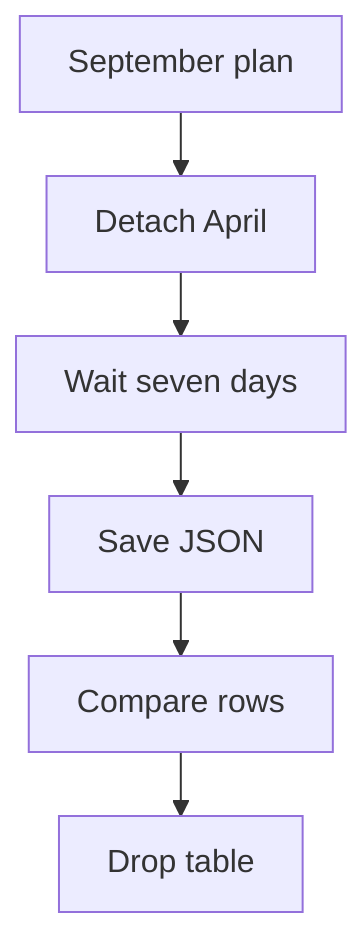

# PostgreSQL partition maintenance: from a plan to a verified archive {#postgresql-partition-maintenance}

<div class="bdr-post__hero" data-bdr-post="2026-09-13-postgresql-partition-maintenance" role="img" aria-label="Create future ranges, detach expired partitions, verify the archive before deletion" markdown="0"></div>

Imagine an analytics service with monthly `events` partitions. Reports need the current month and the previous two. Writers need another two months prepared ahead. An old table may be deleted only seven days after detachment and after its archive has been verified. A `receipts` table still references some events.

Follow one maintenance run on September 15, 2026: April–September exist, but October does not. We will inspect the plan, see a foreign key prevent detachment, and check what survives when archiving fails. The examples run against PostgreSQL 17 and pg-partsmith 1.5.1, with Python dependencies pinned in the labs.

<!-- more -->

<div id="managing-postgresql-partitions-one-failure-at-a-time" data-search-exclude></div>
<div id="not-knowing-what-maintenance-will-do" data-search-exclude></div>
<div id="dropping-something-you-did-not-make" data-search-exclude></div>
<div id="two-replicas-tick-at-once" data-search-exclude></div>
<div id="the-team-with-no-python-in-it" data-search-exclude></div>
<div id="the-archiver-has-to-run-before-the-drop" data-search-exclude></div>
<div id="wiring-it-with-an-assistant-in-the-loop" data-search-exclude></div>

## Define the policy using actual months {#planning}

`events` has three columns: `id bigint`, `created_at timestamptz`, and `payload text`. Its primary key is `(id, created_at)` and its partition key is `created_at`. A receipt holds a composite `(event_id, event_at)` reference to a May event.

Express the requirements in a configuration. The policy classes come from `pg_partsmith`; `timedelta` comes from `datetime`:

```python
def events_config(*, protect_references=True):
    retention = KeepNewest(count=3)
    if protect_references:
        retention = ExpireIf(
            when=AllOf(members=(retention, Unreferenced())),
        )
    return TablePartitionConfig(
        schema="public",
        table_name="events",
        partition_column="created_at",
        granularity=PartitionGranularity.MONTH,
        lifecycle=LifecyclePolicy(
            creation=CreateAhead(count=3),
            retention=retention,
            drop=DropAfter(grace=timedelta(days=7)),
        ),
    )
```

The two counts mean different things:

| September setting | Meaning |
|---|---|
| `CreateAhead(count=3)` | Ensure September, October, and November: the current month counts as one |
| `KeepNewest(count=3)` | Keep July, August, and September; future ranges do not reduce that history |
| `Unreferenced()` combined with retention | Keep an old partition attached while another table references its rows |
| `DropAfter(grace=timedelta(days=7))` | Wait at least seven days after detachment before deletion |

These rules apply to whole ranges, not to individual rows reaching 90 days of age. The receipt keeps May available longer than normal: that is intentional for this service.

Build `toolkit = PartitionToolkit.from_engine(engine)`, importing `PartitionToolkit` from `pg_partsmith.aio`. Here `engine` is a SQLAlchemy `AsyncEngine` connected to the service database. We can now get a plan without DDL, print it, and apply it separately:

```python
async def preview(toolkit, config, *, now=None):
    plan = await toolkit.service.plan(config, now=now)
    print(plan.describe())
    return plan


async def apply_reviewed(toolkit, config, plan):
    result = await toolkit.service.apply(config, plan)
    if result.error or result.issues:
        raise RuntimeError(f"Maintenance needs attention: {result}")
    return result
```

The lab calls `preview(toolkit, events_config(), now=datetime(2026, 9, 15, tzinfo=UTC))`. The plan creates October and November, detaches April and June, and keeps referenced May. It schedules no drops yet. Catalog snapshots before and after `preview` are identical: displaying the plan changes nothing.

Serialize a plan with `model_dump_json()` and reload it with `MaintenancePlan.model_validate_json()`. If the policy changes afterwards, `apply` refuses it with `PlanConfigMismatchError`. The lab checks that refusal and the absence of DDL. The scheduled path below builds a fresh plan from the current database state.

## Understand which tables the library will manage {#ownership}

Add three unusual cases to the same database:

| Table | Result |
|---|---|
| Manually created `events_may_manual`, with May bounds | Eligible for maintenance; currently protected by its receipt |
| `events__2026_03`, spanning February 1 to April 1 | Left alone, with an `unmanaged_partition` finding |
| Standalone `events__2025_01`, unattached and unmarked | Absent from the drop plan |

For an attached RANGE partition in version 1.5.1, the actual bounds must fit within one configured period. A full month qualifies, as does a shorter range entirely inside a month. The creator and table name do not determine ownership. Ordinary monthly partitions created by another tool can therefore become detach candidates.

After detachment, the library writes a table comment recording its parent and detach time. Subsequent runs use that marker to find tables eligible for deletion. Do not apply that rule to attached partitions: lacking a marker does not exclude them from maintenance.

<div id="where-to-read-more" data-search-exclude></div>
<div id="partition-retention-is-not-drop-table" data-search-exclude></div>
<div id="the-job-everybody-writes" data-search-exclude></div>
<div id="print-the-plan-first" data-search-exclude></div>
<div id="detach-and-drop-are-two-steps" data-search-exclude></div>
<div id="the-archive-runs-before-the-drop-and-may-refuse-it" data-search-exclude></div>
<div id="what-a-foreign-key-does-to-retention" data-search-exclude></div>

## Detach old ranges while preserving their data {#retention}

After `apply_reviewed`, the counters are `created=2`, `detached=2`, `dropped=0`. An October insert now succeeds; before maintenance PostgreSQL rejected it with SQLSTATE `23514`. April and June disappear from queries through `events`, but their tables and four original rows still exist. A late April event now gets `23514`: this example has no DEFAULT partition.

Test foreign-key protection separately by planning without `Unreferenced()`. May now appears in the plan, but PostgreSQL refuses its detachment because of the receipt. The result has `success=True` and nonempty `issues`; both May and its receipt survive. **`success` means no fatal run error, not that every operation succeeded.** Once the receipt is deleted, the regular policy can detach May.

Maintenance operations do not share one encompassing transaction. A later failure does not roll back partitions already created or detached. A retry must inspect current state. This example uses the default `AUTO` detach mode; lock behavior and restrictions on `DETACH ... CONCURRENTLY` are described in the [PostgreSQL 17 documentation](https://www.postgresql.org/docs/17/ddl-partitioning.html#DDL-PARTITIONING-DECLARATIVE-MAINTENANCE).

<!-- diagram:concept -->
<figure class="bdr-diagram" markdown="1">
<figcaption><span class="bdr-diagram__eyebrow">THE IDEA, VISUALIZED</span><strong>The April partition before deletion</strong></figcaption>
<div class="bdr-diagram__viewport" markdown="1" data-search-exclude>


```mermaid
---
config:
  theme: default
  look: classic
  flowchart:
    useMaxWidth: false
    wrappingWidth: 150
    padding: 12
    nodeSpacing: 24
    rankSpacing: 32
---
flowchart TD
    accTitle: The April partition before deletion
    accDescr: September maintenance detaches April. After seven days, the hook saves and verifies the archive before the table can be dropped.
    A["September plan"]
    B["Detach April"]
    C["Wait seven days"]
    D["Save JSON"]
    E["Compare rows"]
    F["Drop table"]
    A --> B --> C --> D --> E --> F
```

</div>
<p class="bdr-diagram__caption">September maintenance detaches April. After seven days, the hook saves and verifies the archive before the table can be dropped.</p>
</figure>
<!-- /diagram:concept -->

## Archive the rows before permitting a drop {#archive}

The `before_drop` hook runs before each table is deleted. Raising an exception prevents that table's `DROP`. Save this small dataset as JSON, read the file back, and compare every field with the source rows:

```python
class JsonArchive(BasePartitionLifecycleHooks):
    def __init__(self, connection, directory: Path):
        self.connection = connection
        self.directory = directory

    async def before_drop(self, event: PartitionEvent):
        schema, name = event.partition.name.split(".", 1)
        quoted = ".".join('"' + part.replace('"', '""') + '"' for part in (schema, name))
        rows = await self.connection.fetch(
            f"SELECT id, created_at, payload FROM {quoted} ORDER BY id, created_at",
        )
        data = [[row["id"], row["created_at"].isoformat(), row["payload"]] for row in rows]
        document = {"table": event.partition.name, "rows": data}
        # The OID distinguishes a replacement table with the same name.
        path = self.directory / f"{event.operation.oid}.json"
        if not path.exists():
            temporary = path.with_suffix(".tmp")
            with temporary.open("w", encoding="utf-8") as stream:
                json.dump(document, stream, ensure_ascii=False)
                stream.flush()
                os.fsync(stream.fileno())
            temporary.replace(path)
        if json.loads(path.read_text(encoding="utf-8")) != document:
            raise RuntimeError(f"Archive verification failed: {path.name}")
```

Import `BasePartitionLifecycleHooks` from `pg_partsmith.aio`, `PartitionEvent` from `pg_partsmith`, plus `json`, `os`, and `Path` from `pathlib`. Pass an `asyncpg.Connection` and an existing directory to the hook. Register it with `PartitionToolkit.from_engine(engine, hooks=[JsonArchive(connection, directory)])`.

The filename uses the OID from the planned operation. A repeated call verifies an existing archive; a mismatch refuses deletion. This runnable example loads a small table into memory and writes it to local disk. A large archive needs streaming export to persistent storage and a separate restoration check.

In this scenario the application writes through the parent only and never changes detached tables. If direct writes to those tables remain possible, `before_drop` alone cannot keep data unchanged between export and deletion: stop those writes first.

The lab checks the whole path:

| Situation | Database and archive assertion |
|---|---|
| Seven days have not elapsed | The plan contains no `DROP` |
| Grace elapsed, storage unavailable | The hook raises; both tables remain |
| An archive exists with incorrect contents | Verification refuses deletion |
| Retry after fixing the problem | Two tables are dropped; all four rows are restored from JSON into a temporary table and match the originals |

Rather than waiting a week, the lab passes `plan(now=...)` instants just before and after the recorded detach time plus seven days. It does not change `DropAfter`. Only the `DROP` portion of the future plan is applied. A production job uses the real clock.

## Schedule a run and notice partial failures {#scheduling}

Suppose a daily CronJob invokes maintenance. It needs one completed run, useful log fields, and failure propagation:

```python
async def maintenance_tick(toolkit, config):
    result = await toolkit.maintainer.run_maintenance_safe(config)
    print({
        "created": result.created_count,
        "detached": result.detached_count,
        "dropped": result.dropped_count,
        "duration_ms": result.duration_ms,
        "error": result.error,
        "issues": [issue.model_dump() for issue in result.issues],
    })
    if result.error or result.issues:
        raise RuntimeError("Partition maintenance did not finish cleanly")
    return result
```

`run_maintenance_safe` plans and applies under the table lock, returning fatal failures in `error`. Our wrapper checks `issues` too: the receipt example showed why `success` alone is insufficient.

The lab creates two toolkits backed by different engines. The first holds the advisory lock for `public.events`; the second reports lock acquisition failure without changing the catalog. Releasing the lock makes the same key available again. Replicas must use the same database and lock-key configuration. This lock does not automatically coordinate an arbitrary external script or another maintenance tool.

The log records counters, duration, and failure reasons. Separately check upcoming range coverage and the time since the last run without errors or issues. If you use DEFAULT, monitor its rows too: successful inserts can conceal missed maintenance.

<div id="the-checklist-for-a-retention-job" data-search-exclude></div>
<div id="the-pieces" data-search-exclude></div>
<div id="migrating-from-pg_partman-to-application-managed-partitions" data-search-exclude></div>
<div id="what-pg_partman-built" data-search-exclude></div>
<div id="the-configuration-is-the-migration" data-search-exclude></div>
<div id="adoption-is-not-a-step" data-search-exclude></div>
<div id="running-both-at-once" data-search-exclude></div>
<div id="switching-pg_partman-off" data-search-exclude></div>
<div id="what-you-give-up-and-what-you-get" data-search-exclude></div>

## Hand maintenance over from pg_partman {#migration}

Suppose `pg_partman` already created these monthly tables. The second lab runs actual version **5.5.0**: `partman.create_partition` creates the initial set, then we read `partman.part_config` and the existing table bounds.

Choose the new horizon explicitly: `CreateAhead(count=3)` ensures the current month and two future months. Compare actual bounds instead of assuming a direct conversion of `premake`: this pg_partman configuration can already have additional future tables. Likewise, `retention='3 months'` and `KeepNewest(count=3)` produce different retention boundaries. The lab finds an additional old partition that the new rule would detach. We choose that rule explicitly as a requirement change and retain the detached table with `DropNever()`:

```python
def adopted_config(settings):
    return TablePartitionConfig(
        schema="public",
        table_name="events",
        partition_column=settings["control"],
        granularity=PartitionGranularity.MONTH,
        lifecycle=LifecyclePolicy(
            creation=CreateAhead(count=3),  # Current month and two future months.
            # An explicit NEW retention rule, not a conversion of an interval.
            retention=KeepNewest(count=3),
            drop=DropNever(),
        ),
    )


async def unregister_partman(connection):
    # First stop and drain jobs that explicitly pass this parent table.
    await connection.execute(
        "DELETE FROM partman.part_config WHERE parent_table = 'public.events'",
    )
```

`settings` is the saved `part_config` row. This example expects `created_at`, a monthly interval, and `retention_keep_table=true`. It is not a universal converter: compare timezone, DEFAULT, template tables, publications, and other settings separately.

Perform the handover in this order:

1. Save the configuration, table OIDs and bounds, and reference rows; inspect the new tool's plan.
2. Disable automatic maintenance for this table and stop jobs explicitly calling `run_maintenance('public.events')`. Wait for active runs to finish.
3. Remove registration with `unregister_partman`, then apply the reviewed pg-partsmith plan.
4. Compare OIDs and data, extend the horizon by one month, and verify that the next plan is empty.

`automatic_maintenance='off'` alone is insufficient: a call explicitly naming the parent still runs. The [pg_partman 5.5.0 documentation](https://github.com/pgpartman/pg_partman/blob/v5.5.0/doc/pg_partman.md#maintenance-objects) states this, and the lab verifies it **before** handover. The two tools do not mutate the partition set concurrently.

Existing monthly tables are recognized by bounds, without renaming or rebuilding them. The lab compares their OIDs and all original rows. Tables previously detached by pg_partman lack pg-partsmith markers and do not automatically become its archives to delete.

## Reproduce the checks {#verification}

The first example needs Docker and `uv`. Run this from `2026-09-07-partition-retention`:

```bash
uv run --no-project --python 3.13 --with-requirements requirements.txt python retention_lab.py
```

For handover, first build the image containing pg_partman 5.5.0. Run both commands from `2026-09-07-migrating-from-pg-partman`:

```bash
docker build -t pg-partman-lab:17 .
uv run --no-project --python 3.13 --with-requirements requirements.txt python partman_lab.py
```

Each script uses a disposable container. The first fixes the planning date for monthly rules. The second reads PostgreSQL's current month because pg_partman uses that clock. The first lab's JSON archive is temporary and its directory is removed after verification.

## Bring the checks into your service {#conclusion}

We created future ranges, preserved a referenced partition, exercised archive failure and retry, restored deleted rows from a file, and handed maintenance over from another tool. Each scenario supplied a concrete check of the outcome.

Use [pg-partsmith](https://bedrock-python.github.io/pg-partsmith/) to plan and execute creation, detachment, and deletion policies. Connect your archive through `before_drop`, check `error` together with `issues`, and schedule maintenance well before the next period. Define retention using actual dates so the data that remains available to your service is clear.

## Examples and labs {#labs}

- [Lab: partition retention and archive verification](../lab/2026-09-07-partition-retention/README.md)
- [Lab: adopting a pg_partman-managed table](../lab/2026-09-07-migrating-from-pg-partman/README.md)
