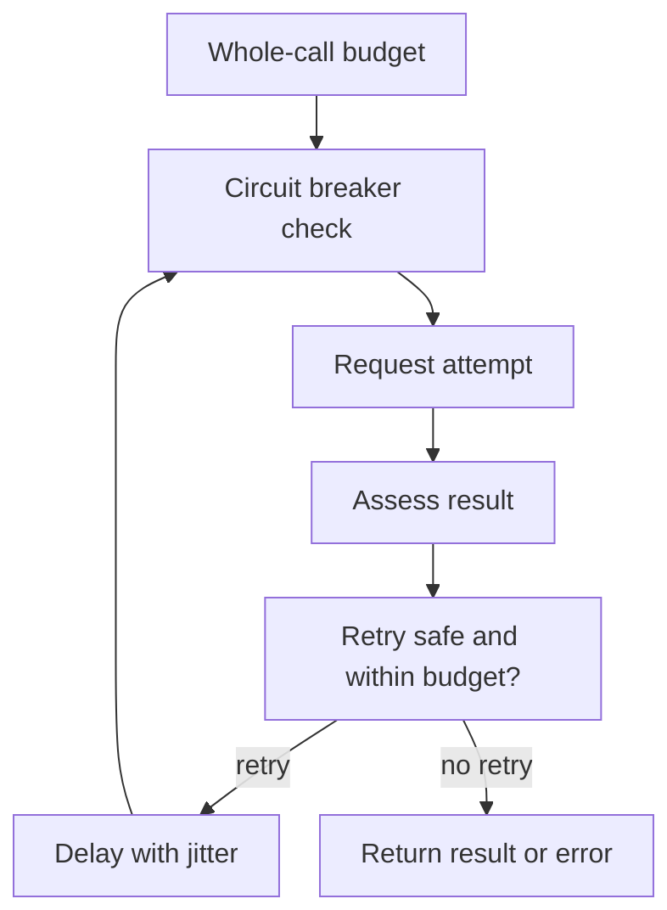

# Building HTTP and gRPC clients for production {#production-http-grpc-clients}

<div class="bdr-post__hero" data-bdr-post="2026-09-13-production-http-grpc-clients" role="img" aria-label="Keep the client; attach the policy beside it" markdown="0"></div>

A client for an external service needs to bound the cost of failure: waiting time, attempts and load on the dependency. These decisions interact. Retries without a total deadline extend latency; a circuit breaker sharing statistics across unrelated services spreads one outage to the others.

Consider an orders service calling inventory and payments. It needs a coherent policy from acquiring a connection through handling an uncertain result.

<!-- more -->

<div id="why-i-stopped-wrapping-http-clients" data-search-exclude></div>
<div id="the-life-of-a-wrapper" data-search-exclude></div>
<div id="what-the-wrapper-actually-owns" data-search-exclude></div>
<div id="measured-the-price" data-search-exclude></div>
<div id="capability-honesty" data-search-exclude></div>
<div id="the-shape" data-search-exclude></div>

## The application owns the client {#ownership}

An HTTP client or gRPC channel usually outlives an individual request: it owns and reuses connections. Creating one inside every handler repeats connection setup and loses accumulated state. Close it after the work using it has finished.

Shared infrastructure can supply timeouts, metrics and retry rules while preserving the underlying library's interface. A universal wrapper that copies HTTPX methods soon obscures streaming, transport options and response types. Extract the shared policy; a business operation such as charging a payment belongs in the client for that particular service.

<div id="reliability-is-not-retry3" data-search-exclude></div>
<div id="why-retries-look-free" data-search-exclude></div>
<div id="what-they-cost-when-it-matters" data-search-exclude></div>
<div id="a-deadline-is-the-first-real-mechanism" data-search-exclude></div>
<div id="a-retry-budget-removes-the-amplification" data-search-exclude></div>
<div id="a-circuit-breaker-protects-the-next-wave-not-this-one" data-search-exclude></div>
<div id="what-none-of-them-do" data-search-exclude></div>
<div id="the-list" data-search-exclude></div>
<div id="the-pieces" data-search-exclude></div>

## Bound the entire call {#budgets}

HTTPX separates connect, read, write and pool timeouts. Its read timeout bounds the wait for another chunk of data. A separate limit is needed for the operation's total duration. See the [HTTPX timeout documentation](https://www.python-httpx.org/advanced/timeouts/).

A minimal Python 3.11+ example is:

```python
import asyncio
import httpx

async def fetch_stock(client: httpx.AsyncClient, url: str) -> dict:
    async with asyncio.timeout(2.0):
        response = await client.get(url)
        response.raise_for_status()
        return response.json()

async def main(url: str) -> dict:
    async with httpx.AsyncClient(
        timeout=httpx.Timeout(1.0, connect=0.3, pool=0.2),
        limits=httpx.Limits(max_connections=50),
    ) as client:
        return await fetch_stock(client, url)
```

These numbers illustrate two levels of limits, not defaults suitable for every service. In a running application, create the client once and call `fetch_stock` repeatedly. If retries are added, attempts and sleeps must fit inside the outer budget. An incoming deadline can tighten it further; [propagating that deadline](2026-09-06-timeouts-are-not-deadlines.md) is a separate topic.

<div id="retries-can-make-an-outage-worse-designing-a-retry-budget" data-search-exclude></div>
<div id="the-arithmetic" data-search-exclude></div>
<div id="measured-one-hop" data-search-exclude></div>
<div id="when-the-budget-is-invisible-and-when-it-hurts" data-search-exclude></div>
<div id="measured-three-services-deep" data-search-exclude></div>
<div id="where-retries-belong" data-search-exclude></div>
<div id="the-policy" data-search-exclude></div>
<div id="retry-after-backoff-and-jitter-what-a-production-http-client-actually-does" data-search-exclude></div>
<div id="honour-retry-after" data-search-exclude></div>
<div id="jitter-or-the-herd" data-search-exclude></div>
<div id="a-read-timeout-is-not-a-connection-error" data-search-exclude></div>
<div id="what-is-retried-at-all" data-search-exclude></div>
<div id="the-checklist" data-search-exclude></div>

## Establish whether a retry is safe {#retries}

After a payment timeout, the server may already have charged the customer. Another unprotected request can repeat the effect. Permission to retry therefore starts with the operation's contract: idempotency, a stable key, or reliable knowledge that processing never started.

A status code helps classify failure but does not establish that no effect occurred. This also applies to gRPC `UNAVAILABLE`, which an application handler can return after starting work. Validation failures normally require a corrected request; temporary unavailability may justify retrying a repeatable operation. The client must also be able to reproduce the request body: a consumed iterator cannot simply be sent again. A stream that has delivered messages needs its own resumption protocol.

Retry delays should respect `Retry-After`, when supplied, and the time remaining. Backoff increases intervals; jitter spreads attempts across callers. Neither limits the total retries issued by the service. That requires a budget for extra traffic and agreement about which layers retry.

<div id="circuit-breakers-should-be-per-origin-not-per-client" data-search-exclude></div>
<div id="measured-one-counter-three-upstreams" data-search-exclude></div>
<div id="what-counts-as-a-failure" data-search-exclude></div>
<div id="one-signal-per-logical-call" data-search-exclude></div>
<div id="the-probe" data-search-exclude></div>
<div id="the-configuration" data-search-exclude></div>

## Isolate a dependency's failure {#circuit-breakers}

A circuit breaker temporarily refuses calls after accumulating evidence of failure. Its scope should match an independently failing dependency. For HTTP, an origin—scheme, host and port—is a starting point. A route with a separate failure profile may need a narrower key.

In the orders service, failed payments should not prevent inventory reads. After a pause, a limited number of probe calls tests recovery. Caller cancellation needs separate treatment because it does not necessarily indicate a failed dependency.

Also define the unit of observation: each attempt or the final outcome of a logical call. This depends on the breaker's position relative to the retry layer. A threshold cannot be transferred between these designs without checking it. The older HTTP and gRPC labs in this blog use different arrangements; they describe implementations, not competing universal rules.

<!-- diagram:concept -->
<figure class="bdr-diagram" markdown="1">
<figcaption><span class="bdr-diagram__eyebrow">THE IDEA, VISUALIZED</span><strong>Limits around an outgoing call</strong></figcaption>
<div class="bdr-diagram__viewport" markdown="1" data-search-exclude>



</div>
<p class="bdr-diagram__caption">One budget bounds the whole call. A retry requires a repeatable operation, remaining time and permission from the resilience policy.</p>
</figure>
<!-- /diagram:concept -->

<div id="safe-grpc-retries-which-status-codes-you-should-actually-retry" data-search-exclude></div>
<div id="what-a-status-code-tells-you-about-the-work" data-search-exclude></div>
<div id="measured-five-ways-to-fail-a-charge" data-search-exclude></div>
<div id="the-deadline-is-for-the-call-not-the-attempt" data-search-exclude></div>
<div id="the-breaker-counts-attempts" data-search-exclude></div>
<div id="streams-are-not-calls" data-search-exclude></div>
<div id="the-policy-written-down" data-search-exclude></div>
<div id="grpc-channels-should-not-be-pooled-by-address-alone" data-search-exclude></div>
<div id="what-a-channel-is" data-search-exclude></div>
<div id="measured-the-audit-client-that-retried" data-search-exclude></div>
<div id="the-opposite-mistake-a-channel-per-call" data-search-exclude></div>
<div id="options-are-identity-too" data-search-exclude></div>
<div id="health-per-address" data-search-exclude></div>
<div id="the-pool" data-search-exclude></div>

## What changes with gRPC {#grpc}

gRPC retry policy can be configured per method through [service config](https://grpc.io/docs/guides/retry/). Check whether transport, interceptor and business client all retry: nested attempts multiply load.

A channel is selected by more than its address. Its users need compatible security, credentials, options and interceptor chains. Rebuilding a chain for every request can defeat channel reuse. Interceptors around [streaming RPCs](2026-09-07-why-grpc-interceptors-break-on-streaming-rpcs.md) need separate verification.

## What to check before deployment {#verification}

| Scenario | Expected property |
|---|---|
| Dependency responds slowly | The call ends within its budget |
| Response to a write is lost | Retrying does not duplicate the business effect |
| One dependency fails | Other dependencies remain usable |
| Many calls fail together | Retries are bounded and spread over time |
| Recovery begins | Probes avoid another burst of load |

Measure both logical calls and attempts: eventual success can hide expensive retries. Track connection acquisition, deadline exhaustion, breaker refusals and the ratio of attempts to calls separately.

Bedrock provides these policies through [clientwright](https://bedrock-python.github.io/clientwright/) and [grpc-client-kit](https://bedrock-python.github.io/grpc-client-kit/). The integration decision is whether the policies agree, not whether every method has the same attempt count.

## Examples and labs {#labs}

The complete setups and reproduction instructions are available separately:

- [Lab: circuit breakers should be per origin](../lab/2026-09-07-circuit-breakers-per-origin/README.md)
- [Lab: reliability is not retry=3](../lab/2026-09-07-reliability-is-not-retry-3/README.md)
- [Lab: retries can make an outage worse](../lab/2026-09-07-retry-budget/README.md)
- [Lab: Retry-After, backoff and jitter](../lab/2026-09-07-retry-after-backoff-jitter/README.md)
- [Lab: safe gRPC retries](../lab/2026-09-07-safe-grpc-retries/README.md)
- [Lab: gRPC channels should not be pooled by address alone](../lab/2026-09-07-grpc-channel-identity/README.md)
- [Lab: why I stopped wrapping HTTP clients](../lab/2026-09-07-why-i-stopped-wrapping-http-clients/README.md)
