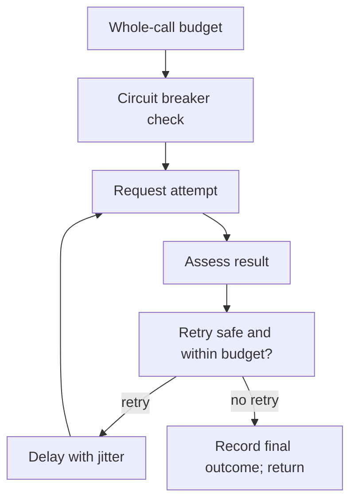

# Building HTTP and gRPC clients for production {#production-http-grpc-clients}

<div class="bdr-post__hero" data-bdr-post="2026-09-13-production-http-grpc-clients" role="img" aria-label="Keep the client; attach the policy beside it" markdown="0"></div>

Imagine an orders service with two HTTP dependencies. Inventory returns the available quantity of a product; payments charges the order. A failed inventory read may be repeated. A failed payment response needs more care: the money may already have been charged.

We will configure those clients, make the dependencies fail and count the requests that actually reach them. Then we will connect to a gRPC version of inventory and check which settings can be carried over and which behave differently.

<!-- more -->

<div id="why-i-stopped-wrapping-http-clients" data-search-exclude></div>
<div id="the-life-of-a-wrapper" data-search-exclude></div>
<div id="what-the-wrapper-actually-owns" data-search-exclude></div>
<div id="measured-the-price" data-search-exclude></div>
<div id="capability-honesty" data-search-exclude></div>
<div id="the-shape" data-search-exclude></div>

## Create clients when the application starts {#ownership}

Use [clientwright](https://bedrock-python.github.io/clientwright/) to attach time limits and retry policy to HTTPX. `build('httpx', ...)` returns a native `httpx.AsyncClient`; handlers keep using `get()`, `post()` and native responses:

```python
from clientwright import (
    AdapterDeps, ClientConfig, RetryConfig, TimeoutConfig, build,
)


def http_client(base_url, *, metrics=None):
    return build(
        'httpx',
        ClientConfig(
            service_name='orders',
            base_url=base_url,
            timeout=TimeoutConfig(total=2, connect=0.3, read=0.5),
            retry=RetryConfig(max_attempts=3, budget_ratio=0.1),
            circuit_breaker=None,
            on_unsupported='strict',
        ),
        AdapterDeps(metrics=metrics),
    )
```

`max_attempts=3` includes the first request. `service_name='orders'` identifies the caller in telemetry. We will add a circuit breaker below. `on_unsupported='strict'` makes an unsupported setting fail at client construction; the [adapter lab](../lab/2026-09-07-why-i-stopped-wrapping-http-clients/README.md) demonstrates this with a Requests attempt timeout.

Create both clients in the application's startup scope, inject them into handlers, and exit that scope after active handlers finish:

```python
from contextlib import asynccontextmanager


@asynccontextmanager
async def outbound_clients(inventory_url, payments_url):
    async with http_client(inventory_url) as inventory:
        async with http_client(payments_url) as payments:
            yield inventory, payments
```

These are the base URLs of the two dependencies, for example `http://inventory:8080` and `http://payments:8080`. Opening this context for every incoming order would discard connection reuse and accumulated retry state. See the [service lifecycle example](2026-09-13-python-service-lifecycle.md) for where the application scope belongs.

<div id="reliability-is-not-retry3" data-search-exclude></div>
<div id="why-retries-look-free" data-search-exclude></div>
<div id="what-they-cost-when-it-matters" data-search-exclude></div>
<div id="a-deadline-is-the-first-real-mechanism" data-search-exclude></div>
<div id="a-retry-budget-removes-the-amplification" data-search-exclude></div>
<div id="a-circuit-breaker-protects-the-next-wave-not-this-one" data-search-exclude></div>
<div id="what-none-of-them-do" data-search-exclude></div>
<div id="the-list" data-search-exclude></div>
<div id="the-pieces" data-search-exclude></div>

## Give a stock read a total time limit {#budgets}

Inventory exposes `GET /stock/{sku}` and returns `{"sku": "sku-42", "available": 7}`. Our handler needs one small function; the client already owns the transport policy:

```python
async def fetch_stock(client, sku):
    response = await client.get(f'/stock/{sku}')
    response.raise_for_status()
    return response.json()['available']
```

For `await fetch_stock(inventory, 'sku-42')`, the configuration allows 0.3 seconds to connect, 0.5 seconds waiting for the next response chunk, and two seconds for the outgoing call across attempts and backoff. HTTPX's read timeout is a limit on inactivity, not the total response duration. See [HTTPX timeouts](https://www.python-httpx.org/advanced/timeouts/).

The [deadline lab](../lab/2026-09-07-reliability-is-not-retry-3/README.md) makes that distinction visible: the server sends one byte every 80 ms. Plain HTTPX with a 300 ms read timeout receives all ten bytes. With `TimeoutConfig(total=0.35, read=0.3)`, clientwright ends body consumption with `DeadlineExceededError` before the response completes.

This limit covers an outgoing call. If inventory and payments must share the time left on an incoming order request, pass a common [DeadlineBudget](2026-09-06-timeouts-are-not-deadlines.md) through the call chain. Giving each client two fresh seconds would not provide a two-second budget for the whole order.

<div id="retries-can-make-an-outage-worse-designing-a-retry-budget" data-search-exclude></div>
<div id="the-arithmetic" data-search-exclude></div>
<div id="measured-one-hop" data-search-exclude></div>
<div id="when-the-budget-is-invisible-and-when-it-hurts" data-search-exclude></div>
<div id="measured-three-services-deep" data-search-exclude></div>
<div id="where-retries-belong" data-search-exclude></div>
<div id="the-policy" data-search-exclude></div>
<div id="retry-after-backoff-and-jitter-what-a-production-http-client-actually-does" data-search-exclude></div>
<div id="honour-retry-after" data-search-exclude></div>
<div id="jitter-or-the-herd" data-search-exclude></div>
<div id="a-read-timeout-is-not-a-connection-error" data-search-exclude></div>
<div id="what-is-retried-at-all" data-search-exclude></div>
<div id="the-checklist" data-search-exclude></div>

## Retry a payment only when the server can deduplicate it {#retries}

Now payments saves a charge, then returns 503. A plain POST is not retried by this HTTP policy. Setting an idempotency flag alone makes a second request possible and produces a second charge in the lab.

Suppose the payments API has a stronger contract: the same `Idempotency-Key` and payload return the saved result; reusing that key with a different payload is rejected. An order has exactly one charge operation, so its stable key can be derived from the order ID:

```python
from clientwright.adapters.httpx import IDEMPOTENT_EXTENSION


async def charge(client, order_id, amount_minor):
    response = await client.post(
        '/payments',
        json={'order_id': order_id, 'amount_minor': amount_minor},
        headers={'Idempotency-Key': f'charge:{order_id}'},
        extensions={IDEMPOTENT_EXTENSION: True},
    )
    response.raise_for_status()
    return response.json()['payment_id']
```

`IDEMPOTENT_EXTENSION` tells clientwright that this call may be retried. The header tells the payments service which operation to deduplicate. The server must implement that contract; the client flag does not implement it for the server.

The [retry lab](../lab/2026-09-07-retry-after-backoff-jitter/README.md) checks three outcomes against a local HTTP service:

| After the first charge, the response is 503 | HTTP requests for the call | Charges recorded |
| --- | --- | --- |
| Plain POST | 1 | 1; caller receives 503 |
| POST marked idempotent, no server key | 2 | 2 |
| POST with the stable key and client flag | 2 | 1; caller receives the saved payment ID |

Calling `charge()` again with the same order and amount still returns that payment ID. The lab's deduplication uses memory and sequential requests to demonstrate the contract. A deployed payment API needs durable storage and atomic handling of concurrent duplicates; see [idempotency in APIs and jobs](2026-09-13-idempotency-in-apis-and-background-jobs.md).

### Respect the requested delay and limit extra traffic {#retry-budget}

Use this policy for backoff, random spreading of attempts and a shared retry budget:

```python
RETRIES = RetryConfig(
    max_attempts=3,
    initial_backoff=0.1,
    max_backoff=1,
    multiplier=2,
    jitter=0.2,
    respect_retry_after=True,
    budget_ratio=0.1,
)
```

With no `Retry-After`, the first delay is 80 to 120 ms and the second is 160 to 240 ms. With `Retry-After: 1`, the policy uses a one-second delay instead. If that delay cannot fit the remaining deadline, the lab observes the original 503 response and one server request: there is no extra attempt and no need to wait until the deadline expires. The library also caps `Retry-After` with `retry_after_max`, which defaults to 60 seconds; consider that cap when adopting an upstream's contract.

`budget_ratio=0.1` applies to extra attempts for an origin within the client runtime. The origin is the URL's scheme, host and port. In version 0.5.0 a fresh origin starts with ten retry tokens, then logical calls replenish the bucket at the configured ratio. It therefore permits an initial burst; it is not a strict ten-percent cap for every batch of calls.

The [budget lab](../lab/2026-09-07-retry-budget/README.md) makes 50 sequential calls to an endpoint that always returns 503, with the breaker disabled:

| Retry settings | Server requests |
| --- | --- |
| Three attempts, `budget_ratio=None` | 150 |
| Three attempts, `budget_ratio=0.1` | 64 in this run |

The test checks the token-budget bound rather than assuming a universal count for concurrent traffic. These are process-local controls. Multiple replicas have separate buckets, and constructing a new client repeatedly would keep giving them fresh state. An outer three-attempt loop around this client's three attempts also produces nine requests for one operation; the adapter lab checks that case.

Retries also need a reproducible body. This HTTPX adapter buffers a finite request iterator before replaying it; the lab checks that all three requests contain the same bytes. Do not assume a large upload remains streaming under that policy. For an upload client, disable owned retries and redirects with `retry=None, redirects='native'` when buffering is unsuitable, and separately bound the time spent obtaining data from the upload source.

<div id="circuit-breakers-should-be-per-origin-not-per-client" data-search-exclude></div>
<div id="measured-one-counter-three-upstreams" data-search-exclude></div>
<div id="what-counts-as-a-failure" data-search-exclude></div>
<div id="one-signal-per-logical-call" data-search-exclude></div>
<div id="the-probe" data-search-exclude></div>
<div id="the-configuration" data-search-exclude></div>

## Keep a payments outage from blocking inventory {#circuit-breakers}

Suppose both destinations use one shared HTTP client. A circuit breaker should temporarily refuse the failing destination while healthy inventory remains usable:

```python
from clientwright import CircuitBreakerConfig


def shared_http_client():
    return build('httpx', ClientConfig(
        service_name='orders',
        timeout=TimeoutConfig(total=2),
        retry=RETRIES,
        circuit_breaker=CircuitBreakerConfig(
            fail_threshold=3,
            recovery_timeout=10,
            half_open_max_calls=1,
        ),
    ))
```

Call it with full URLs. The default breaker key is the origin. In the [breaker lab](../lab/2026-09-07-circuit-breakers-per-origin/README.md), three failed calls to payments make nine attempts in total. The fourth call raises `CircuitOpenError` without another server request. A stock read to the other origin still returns 200.

After the recovery interval, a limited probe can test the dependency again. The lab advances a supplied test clock to check the `open → half_open → closed` transition; it does not measure load-balancer recovery time. A 400 response does not trip this breaker.

For clientwright, the breaker records one final outcome per logical call. It sits outside the retry loop:

<!-- diagram:concept -->
<figure class="bdr-diagram" markdown="1">
<figcaption><span class="bdr-diagram__eyebrow">THE IDEA, VISUALIZED</span><strong>One HTTP call, several possible attempts</strong></figcaption>
<div class="bdr-diagram__viewport" markdown="1" data-search-exclude>


```mermaid
---
config:
  theme: default
  look: classic
  flowchart:
    useMaxWidth: false
    wrappingWidth: 150
    padding: 12
    nodeSpacing: 24
    rankSpacing: 32
---
flowchart TD
    accTitle: One HTTP call, several possible attempts
    accDescr: The HTTP breaker checks once before retries and records their final outcome. All attempts share the call deadline.
    A["Whole-call budget"]
    B["Circuit breaker check"]
    C["Request attempt"]
    D["Assess result"]
    E["Retry safe and within budget?"]
    F["Delay with jitter"]
    G["Record final outcome; return"]
    A --> B --> C --> D --> E
    E -->|"retry"| F --> C
    E -->|"no retry"| G
```

</div>
<p class="bdr-diagram__caption">The HTTP breaker checks once before retries and records their final outcome. All attempts share the call deadline.</p>
</figure>
<!-- /diagram:concept -->

An origin is a starting point for isolation. Two independently failing backends behind the same gateway origin need a more specific separation, such as distinct clients and policies.

<div id="safe-grpc-retries-which-status-codes-you-should-actually-retry" data-search-exclude></div>
<div id="what-a-status-code-tells-you-about-the-work" data-search-exclude></div>
<div id="measured-five-ways-to-fail-a-charge" data-search-exclude></div>
<div id="the-deadline-is-for-the-call-not-the-attempt" data-search-exclude></div>
<div id="the-breaker-counts-attempts" data-search-exclude></div>
<div id="streams-are-not-calls" data-search-exclude></div>
<div id="the-policy-written-down" data-search-exclude></div>
<div id="grpc-channels-should-not-be-pooled-by-address-alone" data-search-exclude></div>
<div id="what-a-channel-is" data-search-exclude></div>
<div id="measured-the-audit-client-that-retried" data-search-exclude></div>
<div id="the-opposite-mistake-a-channel-per-call" data-search-exclude></div>
<div id="options-are-identity-too" data-search-exclude></div>
<div id="health-per-address" data-search-exclude></div>
<div id="the-pool" data-search-exclude></div>

## Give gRPC an explicit list of repeatable methods {#grpc}

Now inventory also exposes gRPC: `GetStock` reads quantity, `Reserve` changes it, and `Export` streams records. The lab's `InventoryStub` binds those methods using raw bytes; a production service would normally generate its stub from protobuf. It is defined in the [gRPC lab](../lab/2026-09-07-safe-grpc-retries/README.md).

Use [grpc-client-kit](https://bedrock-python.github.io/grpc-client-kit/) to allow retries only for `GetStock`:

```python
import grpc
from grpc_client_kit import (
    RetryConfig as GrpcRetry,
    TimeoutConfig as GrpcTimeout,
    build_interceptors,
)


def inventory_chain():
    return build_interceptors(
        timeout=GrpcTimeout(default=1),
        retry=GrpcRetry(
            max_attempts=3,
            initial_backoff=0.05,
            retryable_codes={grpc.StatusCode.UNAVAILABLE},
            idempotent_methods={'/shop.Inventory/GetStock'},
            retry_streaming=False,
        ),
    )
```

`UNAVAILABLE` is not evidence that a handler did no work. The lab makes `Reserve` change inventory and then return that status. With the unrestricted retry policy it records three reservations; with this allowlist it records one and returns the error. `GetStock`, which fails twice before succeeding, still makes three attempts and returns `b'7'`.

The one-second timeout covers the whole RPC. A separate test gives the RPC 300 ms: after a slow failed first attempt, the second gets only the remaining time and ends with `DEADLINE_EXCEEDED`.

### Share channels only between compatible clients {#channel-identity}

An audit reader uses the same inventory address but must make only one attempt. Build its policy separately and keep the pool alive for the application:

```python
from contextlib import asynccontextmanager
from grpc_client_kit import ChannelPool, GrpcClient, GrpcClientConfig


@asynccontextmanager
async def grpc_clients(target):
    config = GrpcClientConfig(
        target=target,
        insecure=True,  # Local lab; configure credentials for a TLS deployment.
        options=[('grpc.enable_retries', 0)],
    )
    async with ChannelPool() as pool:
        orders = GrpcClient(
            InventoryStub, config, pool,
            interceptor_factory=lambda target: inventory_chain(),
        )
        audit = GrpcClient(
            InventoryStub, config, pool,
            interceptor_factory=lambda target: build_interceptors(
                timeout=GrpcTimeout(default=1), retry=None,
            ),
        )
        yield orders, audit
```

`interceptor_factory` creates and caches a chain per target. Reusing those chains keeps channel identity stable. The pool distinguishes security, credentials, options, compression and interceptor chains; an address alone is not enough. Exiting a `GrpcClient` context releases its stub use, while exiting `ChannelPool` closes the pooled channels. The [identity lab](../lab/2026-09-07-grpc-channel-identity/README.md) verifies reuse and separation through the public API and actual server attempt counts.

The example disables native gRPC retries with `grpc.enable_retries=0`, leaving retry ownership to the interceptor. Otherwise native service-config retries and application retries can combine. See [gRPC retry configuration](https://grpc.io/docs/guides/retry/). For the audit chain, `retry=None` omits the retry interceptor. In version 0.4.0 an empty `idempotent_methods` set does not mean “retry nothing.”

Two more behaviors differ from HTTP:

- The gRPC breaker is inside the retry loop and counts attempts. With a threshold of two, it blocks attempt three of the first failing call. The HTTP threshold above counts completed calls.
- Restarting `Export` after receiving items `1, 2` can produce `1, 2, 1, 2, 3`. The lab checks both this opt-in behavior and the default failure after `1, 2`. Keep streaming retries off until the protocol defines resumption or deduplication; see [streaming interceptors](2026-09-07-why-grpc-interceptors-break-on-streaming-rpcs.md).

## Count attempts as well as successful calls {#verification}

For a stock endpoint that returns 503 twice and then succeeds, this helper returns `(7, 1, 3)`: quantity, logical calls and attempts.

```python
from clientwright.core.testing import RecordingMetrics


async def observe_stock(base_url):
    metrics = RecordingMetrics()
    async with http_client(base_url, metrics=metrics) as client:
        available = await fetch_stock(client, 'sku-42')
    return available, len(metrics.calls), len(metrics.attempts)
```

`RecordingMetrics` is the library's test recorder; production supplies an implementation through `AdapterDeps(metrics=...)`. One successful business call can conceal three requests to the dependency. Body-consumption timings are recorded separately from the transport call, so account for that when interpreting latency metrics.

All nine snippets are extracted from the runnable labs and checked with Python 3.13, `clientwright==0.5.0`, `httpx==0.28.1`, `grpc-client-kit==0.4.0` and `grpcio==1.84.0`. The seven labs use actual local HTTP/gRPC servers and assertions. They test client behavior; they are not benchmarks or tests of production TLS, proxies or payment storage.

## Choose policies for the operations you actually call {#conclusion}

We read stock, retried a temporary failure, recovered a payment result without repeating its effect, isolated an unavailable origin and connected two gRPC clients with different retry rules. When choosing settings, check the number of attempts, elapsed time and records left after a failure.

Use our [clientwright](https://bedrock-python.github.io/clientwright/) library for HTTP policy while keeping native SDK interfaces, and [grpc-client-kit](https://bedrock-python.github.io/grpc-client-kit/) for gRPC channels and interceptors. Start with a total time limit and the operations that are safe to repeat. Then add the retry budget and breaker, checking them against a failing test dependency before using the configuration in your service.

## Examples and labs {#labs}

- [Native HTTP clients, metrics and nested retries](../lab/2026-09-07-why-i-stopped-wrapping-http-clients/README.md)
- [Read timeout versus total deadline](../lab/2026-09-07-reliability-is-not-retry-3/README.md)
- [Retry-After, payment deduplication and body replay](../lab/2026-09-07-retry-after-backoff-jitter/README.md)
- [Retry budget and server request counts](../lab/2026-09-07-retry-budget/README.md)
- [Circuit breakers per origin](../lab/2026-09-07-circuit-breakers-per-origin/README.md)
- [gRPC retry safety, deadlines and streams](../lab/2026-09-07-safe-grpc-retries/README.md)
- [gRPC channel reuse and isolation](../lab/2026-09-07-grpc-channel-identity/README.md)
