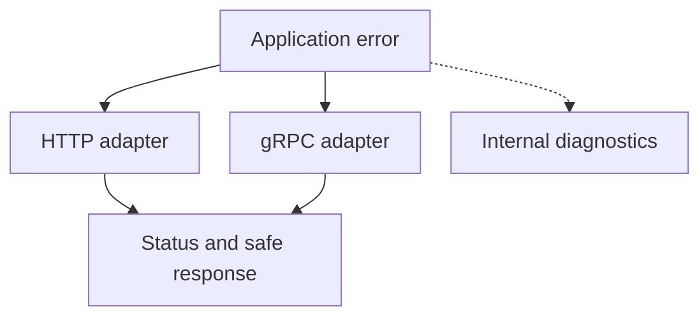

# Preparing a Python gRPC server for production {#production-python-grpc-server}

Registering a servicer and opening a port is enough for the first gRPC call. Operating that server requires decisions around the handler: which errors clients receive, when the service can accept requests and what happens to active RPCs during shutdown.

Keeping these rules in the transport layer and runtime gives new methods the same error contract, limits and observability as existing ones.

<!-- more -->

## The incoming call and its boundaries {#pipeline}

At the boundary, the server checks access, establishes request context and invokes the handler. Execution needs duration measurements, final-status accounting and exception handling. Authorization for a particular action may still belong in application code: a valid token does not grant access to every order.

Interceptor ordering changes the outcome. Once an exception becomes a deliberate gRPC abort, an outer layer should not report it as a new unexpected failure or overwrite its status. Cancellation also needs deliberate handling: release resources and preserve the cancellation signal.

Test the chain through a real RPC. A unit test of an error-mapping function cannot show what the client received or which status the metrics recorded.

## Errors should name the cause {#errors}

Application code can report `OrderNotFound` or `OrderAlreadyPaid` without importing `grpc` or choosing an HTTP status. The transport adapter translates that result into the public contract.

| Situation | Possible gRPC status | Consideration |
|---|---|---|
| Invalid request fields | `INVALID_ARGUMENT` | The request needs correction |
| Missing object | `NOT_FOUND` | Decide whether disclosing existence is appropriate |
| State prevents the action | `FAILED_PRECONDITION` | State must change before retrying |
| Temporary unavailability | `UNAVAILABLE` | Retrying requires a safe operation and a budget |
| Unexpected internal exception | `INTERNAL` | Return no internal details |

These are API decisions, not universal mappings from Python built-ins. A `ValueError` can come from a programming bug; a `TimeoutError` can concern an internal dependency while the incoming RPC still has time left. Likewise, `RESOURCE_EXHAUSTED` may indicate a quota that short backoff cannot restore.

HTTP and gRPC can share an application error code while maintaining separate representation tables. Avoid turning every conflict into `ALREADY_EXISTS`: a duplicate resource and a forbidden state transition mean different things. The [gRPC error guide](https://grpc.io/docs/guides/error/) documents the status semantics.

## Choose the status and public details separately {#details}

Recognizing an error type does not make every message it carries safe. Even an application-defined exception can contain personal data or a connection string. Public fields need an explicit contract; other cases need a generic response.

A stable machine-readable code and approved parameters let clients make decisions without parsing prose. Human-readable detail supports diagnosis; user-facing localization belongs in the interface. Structured gRPC error details are an option when the clients support that format.

Associate internal reports with the request using a trace or correlation ID. This is not permission to log every exception and payload indiscriminately: secrets and sensitive data need filtering there too.

<!-- diagram:concept -->
<figure class="bdr-diagram" markdown="1">
<figcaption>THE IDEA, VISUALIZED<strong>Translate errors at the transport boundary</strong></figcaption>

Application code reports the failure. The adapter selects a status and approved public details; internal reporting supports diagnosis.

</figure>
<!-- /diagram:concept -->

## Readiness, limits and shutdown {#operations}

A health service reports whether the server can serve a particular service, while reflection lets tools discover the API description. Enable and expose them according to the environment. A successful health response does not replace a business-path test.

The server needs message-size and concurrency limits, and handlers must respect deadlines and cancellation. A child task that outlives a cancelled RPC still consumes resources and may produce effects.

During shutdown, stop accepting new work, give active calls bounded time, then terminate those that remain. Close shared pools after the calls finish. The shutdown budget must fit within the process termination limit; the [lifecycle article](2026-09-13-python-service-lifecycle.md) covers that coordination.

## What to verify before release {#verification}

The minimum integration scenarios are a successful call, denied authorization, a known application error, an unexpected exception, cancellation, deadline expiry and shutdown during an RPC. Check the client-visible status, absence of leaked details, metrics and resource cleanup together.

Streaming RPCs need additional coverage: failure can occur while consuming the next message, after the handler has returned. The [article on interceptors and streaming](2026-09-07-why-grpc-interceptors-break-on-streaming-rpcs.md) covers that separate implementation problem.

[grpc-server-kit](https://bedrock-python.github.io/grpc-server-kit/) and [servicewright](https://bedrock-python.github.io/servicewright/) provide transport and lifecycle building blocks. The service still owns its application error contract and the tests that establish its behavior.

## Examples and labs {#labs}

The complete setups and reproduction instructions are available separately:

- [Lab: the anatomy of a production gRPC server](../lab/2026-09-07-production-grpc-server/README.md)
- [Lab: Python exceptions to gRPC status codes](../lab/2026-09-07-python-exceptions-to-grpc-status-codes/README.md)
- [Lab: one domain error, two transports](../lab/2026-09-07-transport-independent-errors/README.md)
