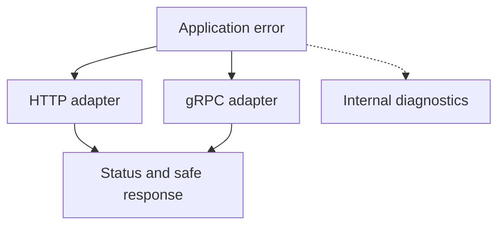

# Preparing a Python gRPC server for production {#production-python-grpc-server}

<div class="bdr-post__hero" data-bdr-post="2026-09-13-production-python-grpc-server" role="img" aria-label="A six-line server versus the assembly you can actually run" markdown="0"></div>

Imagine an orders service with a `GetInvoice` method: a buyer requests an invoice for a paid order. It works locally. Then someone requests another buyer's order, storage stops responding, and a rollout needs to finish RPCs already in progress.

We will handle these cases in one example: define errors, assemble the server, and check limits, health, and shutdown. The code was verified with **grpc-server-kit 0.2.0**, **servicewright 0.13.1**, and **grpcio 1.84.0** on Python **3.13**.

<!-- more -->

<div id="the-anatomy-of-a-production-python-grpc-server" data-search-exclude></div>
<div id="the-handler-that-raises" data-search-exclude></div>
<div id="where-the-reporting-interceptor-goes" data-search-exclude></div>
<div id="message-size" data-search-exclude></div>
<div id="shutdown" data-search-exclude></div>
<div id="health" data-search-exclude></div>
<div id="tls-and-the-file-permissions" data-search-exclude></div>
<div id="reflection-and-the-rest-of-the-list" data-search-exclude></div>
<div id="the-order" data-search-exclude></div>
<div id="the-pieces" data-search-exclude></div>

## Start with the invoice operation {#pipeline}

Our shop makes the invoice available after payment. A request needs an order ID and a buyer identity from verified authentication context. Storage opens a read context; the application function checks ownership and order state.

We will use the shared error types from `servicewright`: `ServiceError` describes the failure and `ErrorKind` its category. Neither requires HTTP or gRPC objects. The same errors will later serve both transports.

```python
from servicewright import ErrorKind, ServiceError


class OrderNotFound(ServiceError):
    kind = ErrorKind.NOT_FOUND
    code = "order_not_found"


class InvoiceNotReady(ServiceError):
    kind = ErrorKind.PRECONDITION_FAILED
    code = "invoice_not_ready"


class InvoiceAccessDenied(ServiceError):
    kind = ErrorKind.FORBIDDEN
    code = "invoice_access_denied"


class InvoiceStoreUnavailable(ServiceError):
    kind = ErrorKind.UNAVAILABLE
    code = "invoice_store_unavailable"
```

```python
async def get_invoice(store, order_id: str, buyer_id: str) -> dict:
    async with store.read(order_id) as order:
        if order is None:
            raise OrderNotFound("Order not found")
        if order["buyer_id"] != buyer_id:
            raise InvoiceAccessDenied("Access denied")
        if not order["paid"]:
            raise InvoiceNotReady("The order has not been paid")
        return {"invoice_id": order["invoice_id"], "amount": order["amount"]}
```

`store.read()` releases its resource when the context exits, including on exceptions and cancellation. The lab uses in-memory storage with an active-read counter. The gRPC handler calls `get_invoice` and serializes its result.

To focus on server behavior, the lab registers the method through `register_invoice_service` and passes bytes without generating protobuf classes. Its buyer identity is fixed fixture data. An application's authentication layer must establish that identity; the ownership check stays in application code.

<div id="mapping-python-exceptions-to-grpc-status-codes-without-leaking-internals" data-search-exclude></div>
<div id="what-happens-with-no-map-at-all" data-search-exclude></div>
<div id="the-default-map" data-search-exclude></div>
<div id="the-map-is-a-client-contract-not-a-formatting-decision" data-search-exclude></div>
<div id="details-the-two-tier-rule" data-search-exclude></div>
<div id="what-belongs-where" data-search-exclude></div>

## The order is unpaid: what does the client receive? {#errors}

Choose `FAILED_PRECONDITION` for `InvoiceNotReady`: repeating the call without changing order state cannot help. Missing orders get `NOT_FOUND`, denied access gets `PERMISSION_DENIED`, and temporary storage failures get `UNAVAILABLE`. The [gRPC status guide](https://grpc.io/docs/guides/status-codes/) defines these meanings.

Configure the mappings in `grpc-server-kit`'s `AsyncExceptionHandlerInterceptor`:

```python
import grpc
from grpc_server_kit.aio.interceptors import AsyncExceptionHandlerInterceptor


SERVICE = "orders.Invoices"

ERROR_STATUS = {
    OrderNotFound: grpc.StatusCode.NOT_FOUND,
    InvoiceNotReady: grpc.StatusCode.FAILED_PRECONDITION,
    InvoiceAccessDenied: grpc.StatusCode.PERMISSION_DENIED,
    InvoiceStoreUnavailable: grpc.StatusCode.UNAVAILABLE,
}


def public_details(error, status):
    if isinstance(error, tuple(ERROR_STATUS)) and error.public:
        return error.code
    return "internal_error"


def exception_handler():
    return AsyncExceptionHandlerInterceptor(
        error_status_map=ERROR_STATUS,
        detail_factory=public_details,
        merge_defaults=False,
    )
```

`merge_defaults=False` keeps only our table. That matters: the library's default table maps `ValueError` to `INVALID_ARGUMENT`. An internal programming error that raises `ValueError` should not blame the client's request.

The lab triggers the same failure through a real RPC:

| Server assembly | Status for an internal `ValueError` | What the client sees |
|---|---|---|
| No exception interceptor | `UNKNOWN` | Exception text with internal data |
| Default interceptor | `INVALID_ARGUMENT` | Safe details, but the wrong classification |
| Our mapping | `INTERNAL` | `internal_error` |

A deliberate `await context.abort(...)` passes through with its original status. It does not need another conversion to an internal error.

<div id="transport-independent-errors-one-domain-error-http-and-grpc-responses" data-search-exclude></div>
<div id="the-domain-raises-and-does-not-format" data-search-exclude></div>
<div id="the-same-seven-calls-two-transports" data-search-exclude></div>
<div id="what-each-layer-is-allowed-to-know" data-search-exclude></div>
<div id="testing-it-once" data-search-exclude></div>
<div id="what-this-does-not-solve" data-search-exclude></div>

## Choose which details leave the service {#details}

`public_details` returns the stable code of a known public error. It does not copy exception text. An unknown error or `public=False` becomes `internal_error`, even if the original contains a connection string or details of corrupted data.

Clients can distinguish `invoice_not_ready` from `order_not_found` without parsing prose. Internal diagnostics remain separate and correlate with the request. Configure secret filtering in logging and error reporting systems: a safe client response does not automatically sanitize logs.

<!-- diagram:concept -->
<figure class="bdr-diagram" markdown="1">
<figcaption><span class="bdr-diagram__eyebrow">THE IDEA, VISUALIZED</span><strong>Translate errors at the transport boundary</strong></figcaption>
<div class="bdr-diagram__viewport" markdown="1" data-search-exclude>


```mermaid
---
config:
  theme: default
  look: classic
  flowchart:
    useMaxWidth: false
    wrappingWidth: 150
    padding: 12
    nodeSpacing: 24
    rankSpacing: 32
---
flowchart TD
    accTitle: Translate errors at the transport boundary
    accDescr: Application code reports the failure. The adapter selects a status and approved public details; internal reporting supports diagnosis.
    A["Application error"]
    B["HTTP adapter"]
    C["gRPC adapter"]
    D["Status and safe response"]
    E["Internal diagnostics"]
    A --> B --> D
    A --> C --> D
    A -.-> E
```

</div>
<p class="bdr-diagram__caption">Application code reports the failure. The adapter selects a status and approved public details; internal reporting supports diagnosis.</p>
</figure>
<!-- /diagram:concept -->

## Bound message sizes and active calls {#operations}

Our small response gets a 64 KiB message limit and up to 32 active RPCs. Port `0` is for the lab: the OS assigns a free port, which the client reads through `app.bound_port`.

```python
from grpc_server_kit import GrpcApp, GrpcServerConfig


def server_config():
    return GrpcServerConfig(
        host="127.0.0.1", port=0,
        max_receive_message_length=64 * 1024,
        max_send_message_length=64 * 1024,
        max_concurrent_rpcs=32,
        grace_period=1.0,
    )
```

The lab lowers the limit to one RPC and holds the first request inside its read:

| Next request | Result |
|---|---|
| On the same HTTP/2 connection | Waits for a stream slot and may exceed its deadline |
| Through a separate connection | Gets `RESOURCE_EXHAUSTED` from the server-wide RPC limit |
| With a 65 KiB body under a 64 KiB limit | Gets `RESOURCE_EXHAUSTED` before accessing storage |

In 0.2.0, `max_concurrent_rpcs` sets both the server-wide RPC limit and the connection's `grpc.max_concurrent_streams`. Therefore overload does not always produce an immediate refusal: clients still need deadlines to bound waiting.

## Metrics need the status; diagnostics need the original exception {#interceptors}

Assemble the chain. `metrics` is a recorder exposing `record_request`; `reporter` receives errors. Both store their results in lists in the lab. `AsyncSentryInterceptor` accepts a reporter interface, so running the example requires no Sentry connection.

```python
from grpc_server_kit.aio.interceptors import (
    AsyncMetricsInterceptor, AsyncSentryInterceptor,
)
from grpc_server_kit.aio.interceptors.exception_handler import find_mapped_status


def build_app(store, metrics, reporter, *, config=None):
    app = GrpcApp(config or server_config(), interceptors=[
        AsyncMetricsInterceptor(metrics, service_name=SERVICE),
        exception_handler(),
        AsyncSentryInterceptor(reporter, capture_filter=lambda error:
            find_mapped_status(type(error), ERROR_STATUS) in {
                grpc.StatusCode.INTERNAL, grpc.StatusCode.UNAVAILABLE,
            }),
    ])
    app.register(lambda server: register_invoice_service(server, store))
    return app
```

The list runs outermost first. Exceptions travel back outward: the reporter sees the original `RuntimeError`, the error handler chooses `INTERNAL`, and metrics record the final status. Expected failures such as `InvoiceNotReady` are filtered out of server-error reports.

The lab also checks the wrong order: a reporter outside the exception handler sees an already completed gRPC abort and misses the original exception.

## Health checks report readiness {#readiness}

Add a storage check with its own timeout. Disable caching here so a state change appears immediately.

```python
class InvoiceStoreHealth:
    name = "invoice-store"

    def __init__(self, store):
        self.store = store

    async def check(self) -> bool:
        return await self.store.ping()


def enable_readiness(app, store):
    app.enable_health(
        checkers=[InvoiceStoreHealth(store)],
        service_names=[SERVICE],
        cache_ttl=0,
        check_timeout=0.2,
    )
```

Call `enable_readiness(app, store)` before building or starting the server. In the lab, the check returns `SERVING`, then `NOT_SERVING`, then `SERVING` again. A hanging check also becomes `NOT_SERVING` after its timeout.

A direct `GetInvoice` call still reaches the handler. The [health service](https://grpc.io/docs/guides/health-checking/) reports state to a client or load balancer; its presence alone does not block RPCs. The library excludes standard health methods from request metrics by default.

## The client leaves, then the server shuts down {#shutdown-example}

Use context managers and `finally` to release resources on cancellation. Do not catch `CancelledError` as an ordinary application failure. In the lab, both explicit cancellation and a client deadline end the read and return active-resource usage to zero.

A deadline has a useful distinction: the client receives `DEADLINE_EXCEEDED`, while the server metric records `CANCELLED` because its handler was cancelled. These are different observations of one termination.

For service shutdown, wait for `GrpcApp` to exit before closing shared storage:

```python
async def serve_invoices(app, store, stop):
    try:
        async with app:
            await stop.wait()
    finally:
        await store.close()
```

Here `app` comes from `build_app`, and external orchestration sets the `stop` event. The `GrpcApp` context stops accepting new RPCs and allows active calls to finish within `grace_period`.

The lab checks both outcomes: a short request returns its response, while a stuck request is cancelled after the grace period. Storage closes after the handler releases its resource. If `servicewright` owns the process, let it stop entrypoints and shared resources as described in [the lifecycle article](2026-09-13-python-service-lifecycle.md).

## Enable TLS and verify the client {#tls-example}

TLS requires the server certificate and private key. Providing a CA additionally makes this example require a client certificate: mTLS.

```python
from dataclasses import replace


def tls_config(cert_file, key_file, ca_file=None):
    return replace(
        server_config(),
        ssl_enabled=True,
        ssl_cert_file=str(cert_file),
        ssl_key_file=str(key_file),
        ssl_ca_file=str(ca_file) if ca_file else None,
        ssl_client_auth=ca_file is not None,
    )
```

Pass the result to `build_app(..., config=tls_config(...))`. The lab generates temporary certificates and checks real connections: an ordinary TLS client succeeds under TLS, mTLS requires a client certificate, and plaintext fails in both configurations.

Invalid PEM input is detected before serving. The library's Unix private-key permission check does not apply on Windows, where ACLs control file access. Enable reflection separately when tools need to discover the API description.

## One application function for HTTP and gRPC {#two-transports}

Add an HTTP endpoint for the same invoice. `servicewright` creates both entrypoints and translates our `ServiceError` instances. The lab's `Container` owns shared storage and closes it when the application exits.

```python
from fastapi import APIRouter
from servicewright import AppSpec, Service
from servicewright.adapters.fastapi import FastApiEntrypoint, HttpConfig
from servicewright.adapters.grpc import GrpcConfig, GrpcEntrypoint


def build_service(store):
    router = APIRouter()

    @router.get("/orders/{order_id}/invoice")
    async def invoice(order_id: str):
        return await get_invoice(store, order_id, buyer_id="buyer-7")

    http = FastApiEntrypoint(
        config=HttpConfig(host="127.0.0.1", port=0), routers=(router,),
    )
    grpc_entry = GrpcEntrypoint(
        config=GrpcConfig(host="127.0.0.1", port=0, grace_period=1),
        servicers=lambda server, ctx: register_invoice_service(server, store),
    )
    spec = AppSpec(
        service_name="invoices", create_container=lambda settings: Container(store),
    )
    return Service(spec, entrypoints=[http, grpc_entry]), http, grpc_entry
```

Run this through `service.run(Settings(), stop=stop)`. Requests to both local servers verify this table:

| Cause | HTTP | gRPC | Shared error code |
|---|---|---|---|
| Missing order | 404 | `NOT_FOUND` | `order_not_found` |
| Unpaid order | 412 | `FAILED_PRECONDITION` | `invoice_not_ready` |
| Another buyer's order | 403 | `PERMISSION_DENIED` | `invoice_access_denied` |
| Storage temporarily unavailable | 503 | `UNAVAILABLE` | `invoice_store_unavailable` |
| Internal failure | 500 | `INTERNAL` | `internal_error` |

HTTP returns the code in problem JSON; gRPC uses `x-error-code` trailing metadata. The 412 ↔ `FAILED_PRECONDITION` mapping comes from `PRECONDITION_FAILED`. This version's `CONFLICT` category would produce 409 ↔ `ALREADY_EXISTS`, so we do not use it for the unpaid order.

## What the executable checks cover {#verification}

Three labs assert successful responses, application and unexpected errors, absence of internal details in responses, interceptor order, metrics, limits, health, cancellation, deadlines, shutdown, TLS, and mTLS. gRPC and HTTP use real local connections; storage and diagnostic receivers are controlled fixtures.

This article covers single requests and responses. Failures while reading streams require additional checks, covered in [the streaming interceptor article](2026-09-07-why-grpc-interceptors-break-on-streaming-rpcs.md).

## What to use in your service {#conclusion}

We covered invoice retrieval during failures, overload, cancellation, and shutdown, then connected the same application function to HTTP. Start with meaningful operation errors and verify the response that actually reaches the client.

Use our [grpc-server-kit](https://bedrock-python.github.io/grpc-server-kit/) for gRPC server assembly, interceptors, limits, health checks, and TLS. When HTTP, gRPC, and shared resources need to start and stop together, add [servicewright](https://bedrock-python.github.io/servicewright/). The labs below provide a starting point for your service's checks.

## Examples and labs {#labs}

- [Lab: the anatomy of a production gRPC server](../lab/2026-09-07-production-grpc-server/README.md)
- [Lab: Python exceptions to gRPC status codes](../lab/2026-09-07-python-exceptions-to-grpc-status-codes/README.md)
- [Lab: one domain error, two transports](../lab/2026-09-07-transport-independent-errors/README.md)
