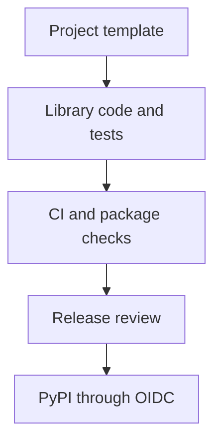

# A Python library from template to release {#python-library-from-template-to-release}

Maintaining several Python libraries repeats more than code. Each repository needs packaging, tests, formatting rules, documentation and a path to PyPI. With manual setup, fixing a shared mistake means carrying the same change through each project.

Bedrock Python keeps these decisions in a template and repository configuration. Libraries retain their own versions and release schedules, while recurring work follows one documented process.

<!-- more -->

## What belongs in the template {#template}

A template helps where the answer does not depend on the library's purpose: package structure, supported Python versions, Ruff and mypy configuration, test layout, wheel and sdist builds, and documentation scaffolding.

Checks should run immediately after generating a project. That establishes a working baseline; green CI on an empty package says little about its future API. High coverage of a version function is not evidence of library quality either.

[python-library-template](https://github.com/bedrock-python/python-library-template) stores these conventions for Bedrock Python. Updating the template does not automatically change existing repositories: each consumer must receive and verify the changes, accounting for its own differences.

## Test what the configuration promises {#checks}

A list of tools says little about what the gate enforces. A linter rule family can be selected and excluded at the same time; an aggregate CI job can pass without checking the result of a skipped test job.

Small tests of the template itself help: generate a project, run its commands, introduce a deliberate violation and check that the gate catches it. If timezone-naive datetimes are forbidden, that example must fail lint.

| Layer | What it establishes |
|---|---|
| Lint and types | Compliance with selected rules and consistency of annotations |
| Unit tests | Code behavior in specified scenarios |
| Integration tests | Compatibility with a real database, broker or transport |
| Installing the built package | Artifact correctness, including modules and required files |
| Trial use in a service | Whether the API and resource ownership model fit |

One required aggregate status simplifies branch protection when it accounts for every required job, including failures and unintended skips.

## Repository settings belong to the process {#repositories}

Some standards live outside Git: branch protection, Actions permissions, the publishing environment and allowed release sources. Describe and audit them alongside CI files. A setup script should show its changes and respect each repository's constraints.

A shared template does not require simultaneous releases. Each library changes version after its own checks. Dependency and compatibility conventions help them evolve independently; copying one workflow does not establish that compatibility.

## From a change to a verified artifact {#release}

Release automation can assemble a changelog and propose a version from commit messages. Reviewing the release PR remains the point to check public changes: whether incompatibilities are identified, documentation is current and the package version matches the tag.

Build from a specific, verified commit. Install the wheel and sdist in clean environments and check required imports, package data and metadata. A publication rerun should not silently accept a mismatch between an already-published artifact and a different file with the same name.

<!-- diagram:concept -->
<figure class="bdr-diagram" markdown="1">
<figcaption>THE IDEA, VISUALIZED<strong>A shared process with independent releases</strong></figcaption>

The template defines structure and checks. Each project tests its implementation, builds an artifact and publishes its own version through an authorized workflow.

</figure>
<!-- /diagram:concept -->

## Publish without a long-lived token {#publishing}

[PyPI Trusted Publishing](https://docs.pypi.org/trusted-publishers/) exchanges a CI OIDC identity for short-lived publishing credentials. For GitHub Actions, trust identifies an owner, repository, workflow and optionally an environment. The job making that exchange needs `id-token: write`.

This removes a persistent PyPI token from CI secrets, but the publishing workflow still needs protection. Changes to the authorized workflow, a compromised action or untrusted code running with publishing permissions remain risks. Separate build and publish permissions where practical, and restrict the environment's allowed sources and access.

The first release exercises the entire path from project settings to an installable package. Taking a small useful version through that path helps uncover publishing mistakes before an urgent fix depends on it.

## What the library author still owns {#verification}

A template cannot choose a good API or establish that a package is needed. That requires a concrete use case, behavior tests and a real consumer.

Documentation should explain installation, limitations and resource ownership. A compact [page for AI agents](2026-09-07-documentation-for-ai-coding-agents.md) can complement the guide with verified examples and public names. The shared process leaves more time for that work; the author still has to do it.

## Examples and labs {#labs}

The complete setups and reproduction instructions are available separately:

- [Lab: twelve libraries, one standard](../lab/2026-09-07-twelve-libraries-one-standard/README.md)
