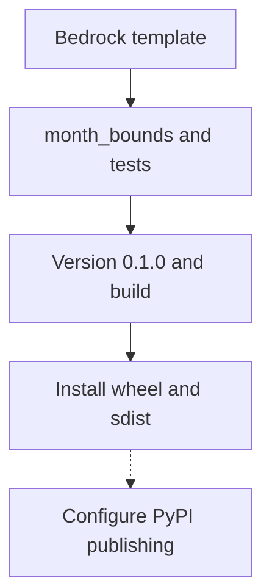

# A Python library from template to release {#python-library-from-template-to-release}

<div class="bdr-post__hero" data-bdr-post="2026-09-13-python-library-from-template-to-release" role="img" aria-label="A report-period library moves from project generation through tests to an installed package" markdown="0"></div>

Imagine a reporting service and an export worker that both need the start and end of a UTC month. Each has its own helper, and one gets December wrong. We decide to move that behavior into `report-periods`, a small library with one public function: `month_bounds()`.

We will generate a project with the Bedrock template, add the function and its tests, build version `0.1.0`, then install both distribution formats in clean environments. This gives us a package we can check before configuring its first PyPI release.

<!-- more -->

<div id="how-i-start-a-production-grade-python-library-in-2026" data-search-exclude></div>
<div id="one-command" data-search-exclude></div>
<div id="what-is-in-the-forty-one" data-search-exclude></div>
<div id="the-gate-has-to-run-what-it-claims" data-search-exclude></div>
<div id="the-things-a-template-cannot-give-you" data-search-exclude></div>
<div id="the-order-i-actually-work-in" data-search-exclude></div>
<div id="the-pieces" data-search-exclude></div>

## Generate a project for the reporting library {#template}

The example uses [python-library-template at commit `a1a1e7d`](https://github.com/bedrock-python/python-library-template/tree/a1a1e7d5eafdcac08aeed7c1a0daaff31c67ac8c), Copier `9.18.2` and its `jinja2-time` extension `0.2.0`. The distribution is called `report-periods`, the import is `report_periods`, and the minimum Python version is `3.11`.

To reproduce the full walkthrough, run this command from the website repository. It needs Git, uv and network access, and creates a **new** output directory:

```bash
uv run --no-project --python 3.13 --with-requirements docs/blog/lab/2026-09-07-twelve-libraries-one-standard/requirements.txt python docs/blog/lab/2026-09-07-twelve-libraries-one-standard/generate_and_check.py --output build/report-periods-lab
```

The lab generates the project, adds the files shown below and runs every local check. It retains the project, `uv.lock`, built packages, command logs and `report.json` with tool versions. It does not create a GitHub repository or publish a package.

Copier runs with trust enabled because this snapshot uses a Jinja extension and a post-generation task. We inspected that task: it only prints next steps. [Review executable template features](https://copier.readthedocs.io/en/stable/configuring/#unsafe) before trusting a different revision.

Initially, the generated `report_periods/` directory contains a version, an `__init__.py` and the `py.typed` marker. From the generated project directory, the baseline checks are:

```bash
uv sync --python 3.13 --group dev
uv run ruff check .
uv run ruff format --check .
uv run mypy report_periods
uv run pytest --cov=report_periods --cov-fail-under=90
```

They pass with one test of the exported version and 100% coverage of the tiny skeleton. Running `pytest -m integration` selects no tests and exits with code `5`; the generated CI explicitly allows that result. We still need to test the reporting behavior.

## Add behavior that the service actually needs {#checks}

Our contract is a half-open interval: `start <= timestamp < end`. Both boundaries are midnight in UTC. An input with an explicit offset is converted to UTC first; an input without an offset is rejected. These are UTC reporting months, not months in the customer's local timezone.

- `2026-12-31T23:59:59+00:00` falls in December: `[2026-12-01, 2027-01-01)` in UTC.
- `2026-10-01T00:30:00+03:00` is still September in UTC: `[2026-09-01, 2026-10-01)`.

Add `report_periods/periods.py`:

```python
"""UTC month boundaries for reports."""

from datetime import UTC, datetime


def month_bounds(value: datetime) -> tuple[datetime, datetime]:
    """Return the inclusive start and exclusive end of the containing UTC month."""
    if value.utcoffset() is None:
        raise ValueError("An explicit UTC offset is required")
    value = value.astimezone(UTC)
    start = value.replace(day=1, hour=0, minute=0, second=0, microsecond=0)
    end = start.replace(year=start.year + 1, month=1) if start.month == 12 else start.replace(month=start.month + 1)
    return start, end
```

Expose the function through `report_periods/__init__.py`, so consumers can use `from report_periods import month_bounds`:

```python
"""UTC month boundaries for reports."""

from .__version__ import __version__
from .periods import month_bounds

__all__ = ["__version__", "month_bounds"]
```

The tests in `tests/unit/test_periods.py` cover a normal month, December, leap-year February, both directions of timezone conversion and a missing offset:

```python
"""Behavior tests copied into the generated package's unit suite."""

from datetime import UTC, datetime

import pytest

from report_periods import month_bounds

pytestmark = pytest.mark.unit


@pytest.mark.parametrize(
    ("value", "expected_start", "expected_end"),
    [
        ("2026-09-15T12:00:00+00:00", "2026-09-01", "2026-10-01"),
        ("2026-12-31T23:59:59+00:00", "2026-12-01", "2027-01-01"),
        ("2024-02-29T12:00:00+00:00", "2024-02-01", "2024-03-01"),
        ("2026-10-01T00:30:00+03:00", "2026-09-01", "2026-10-01"),
        ("2026-09-30T23:30:00-03:00", "2026-10-01", "2026-11-01"),
    ],
)
def test__month_bounds__aware_input__returns_utc_range(value: str, expected_start: str, expected_end: str) -> None:
    start, end = month_bounds(datetime.fromisoformat(value))
    assert start == datetime.fromisoformat(expected_start).replace(tzinfo=UTC)
    assert end == datetime.fromisoformat(expected_end).replace(tzinfo=UTC)
    assert start.tzinfo is UTC and end.tzinfo is UTC
    assert start <= datetime.fromisoformat(value) < end


def test__month_bounds__missing_offset__raises() -> None:
    value = datetime(2026, 9, 1, tzinfo=UTC).replace(tzinfo=None)
    with pytest.raises(ValueError, match="explicit UTC offset"):
        month_bounds(value)
```

Together with the generated version test, that is seven passing tests on Python `3.11`, `3.12` and `3.13`. Ruff, formatting, mypy and the coverage threshold also pass. The lab then removes the December year increment and confirms that the corresponding test fails. It separately inserts `datetime.now()` without a timezone and checks that Ruff reports `DTZ005`.

These deliberate failures tell us that the configured checks detect the mistakes we care about.

<div id="twelve-libraries-one-engineering-standard-no-monorepo" data-search-exclude></div>
<div id="what-one-standard-means-in-practice" data-search-exclude></div>
<div id="the-template" data-search-exclude></div>
<div id="the-script" data-search-exclude></div>
<div id="releases-without-a-human-typing-a-version" data-search-exclude></div>
<div id="the-three-things-i-got-wrong" data-search-exclude></div>
<div id="why-not-a-monorepo" data-search-exclude></div>

## Make the required CI status mean what it says {#repositories}

Suppose GitHub requires the `All checks passed` status before merging. In the pinned template, this job rejects `failure` and `cancelled`, but accepts `skipped`. A skipped unit-test job can therefore leave the aggregate status green.

For this project, all three prerequisite jobs must finish successfully. Replace `jobs.all-checks-passed` in `.github/workflows/ci.yml` with this job, indented under `jobs`:

```yaml
# Replace jobs.all-checks-passed in the generated ci.yml with this job.
all-checks-passed:
  name: All checks passed
  if: always()
  needs: [lint, test-unit, test-integration]
  runs-on: ubuntu-latest
  steps:
    - name: Require every declared job to succeed
      env:
        NEEDS_JSON: ${{ toJSON(needs) }}
      shell: python
      run: |
        import json
        import os
        import sys

        jobs = json.loads(os.environ["NEEDS_JSON"])
        required = {"lint", "test-unit", "test-integration"}
        valid = set(jobs) == required and all(
            job["result"] == "success" for job in jobs.values()
        )
        print({name: job["result"] for name, job in jobs.items()})
        sys.exit(0 if valid else 1)
```

The lab executes the Python from this YAML against all 64 combinations of the four job results, plus a missing-job case. Only three `success` results pass. The original condition accepts seven additional combinations containing skipped jobs. This replacement is part of the lab; it is not already present in the pinned upstream template.

It checks **job results**. An integration job that treats “no tests collected” as success still passes. Our date library has no external integration to exercise; a database library would need actual database tests and a different policy for an empty suite.

Branch protection and environments live outside these files. The template repository has a [`scripts/setup_repo.py`](https://github.com/bedrock-python/python-library-template/blob/a1a1e7d5eafdcac08aeed7c1a0daaff31c67ac8c/scripts/setup_repo.py) helper for them. It is not copied into the generated project, changes GitHub settings through `gh`, and has no dry-run mode. Run it from the template checkout only after reviewing its changes and the repository's first CI result. The local lab does not invoke it.

## Prepare version 0.1.0 and build it {#release}

The generated project starts at `0.0.0`. In a real repository, Release Please uses commit messages to propose a release PR with a version and changelog. For this local exercise, the lab writes the corresponding `0.1.0` values to `report_periods/__version__.py`, `.release-please-manifest.json` and `CHANGELOG.md` without creating a release or tag.

Before building, check that the intended tag agrees with the package version. This example accepts the template's two tag shapes for a stable three-part version:

```python
"""Reject a tag/version mismatch instead of rewriting the package to fit a tag."""
import re


def require_release_tag(tag: str, package_version: str) -> None:
    match = re.fullmatch(r"(?:report-periods-)?v(\d+\.\d+\.\d+)", tag)
    if match is None or match[1] != package_version:
        raise ValueError("Release tag and package version must agree")
```

`v0.1.0` and `report-periods-v0.1.0` pass for version `0.1.0`; a different version, another package's prefix, an extra suffix and `main` fail. Prerelease versions would need an extended policy.

Now build from the generated project directory:

```bash
uv build --no-sources
```

The output is `dist/report_periods-0.1.0-py3-none-any.whl` and `dist/report_periods-0.1.0.tar.gz`. [`--no-sources`](https://docs.astral.sh/uv/guides/package/) checks that the build works without relying on `tool.uv.sources` overrides. The lab compares the package modules in both archives and checks the metadata: name, version, Python `>=3.11`, no runtime dependencies and the `py.typed` marker.

<!-- diagram:concept -->
<figure class="bdr-diagram" markdown="1">
<figcaption><span class="bdr-diagram__eyebrow">THE IDEA, VISUALIZED</span><strong>From a useful function to an installed package</strong></figcaption>
<div class="bdr-diagram__viewport" markdown="1" data-search-exclude>


```mermaid
---
config:
  theme: default
  look: classic
  flowchart:
    useMaxWidth: false
    wrappingWidth: 150
    padding: 12
    nodeSpacing: 24
    rankSpacing: 32
---
flowchart TD
    accTitle: From a useful function to an installed package
    accDescr: The local lab runs from project generation through wheel and sdist installation. Publishing requires separate GitHub and PyPI configuration.
    A["Bedrock template"]
    B["month_bounds and tests"]
    C["Version 0.1.0 and build"]
    D["Install wheel and sdist"]
    E["Configure PyPI publishing"]
    A --> B --> C --> D
    D -.-> E
```

</div>
<p class="bdr-diagram__caption">The local lab runs from project generation through wheel and sdist installation. Publishing requires separate GitHub and PyPI configuration.</p>
</figure>
<!-- /diagram:concept -->

## Install the package as a consumer {#verification}

A passing import from the project directory can hide a broken package: Python may find the source tree. The lab creates separate Python `3.11` environments for the wheel and sdist, installs each with `uv pip install --no-deps`, changes to a consumer directory and runs this script with `python -I`:

```python
"""Run with the isolated interpreter of each clean installation."""
from datetime import UTC, datetime
from importlib.metadata import version
from importlib.resources import files
from pathlib import Path
import sys

import report_periods

assert report_periods.__version__ == version("report-periods") == "0.1.0"
assert Path(report_periods.__file__).resolve().is_relative_to(Path(sys.prefix).resolve())
assert files("report_periods").joinpath("py.typed").is_file()
assert report_periods.month_bounds(datetime.fromisoformat("2026-10-01T00:30:00+03:00")) == (
    datetime(2026, 9, 1, tzinfo=UTC), datetime(2026, 10, 1, tzinfo=UTC),
)
print("PASS installed artifact: version, public API, UTC result, py.typed, import from the clean environment")
```

The path assertion confirms that the import comes from the clean environment. The remaining assertions exercise the public API and installed metadata. Installing the sdist also checks that a consumer can build it from the source archive. Both installations pass independently.

<div id="publishing-to-pypi-without-api-tokens-trusted-publishing-end-to-end" data-search-exclude></div>
<div id="what-replaces-the-token" data-search-exclude></div>
<div id="the-environment-is-the-gate" data-search-exclude></div>
<div id="from-a-merged-pull-request-to-a-tag" data-search-exclude></div>
<div id="the-publish-trigger-and-why-it-is-a-workflow_run" data-search-exclude></div>
<div id="the-day-something-goes-wrong" data-search-exclude></div>
<div id="what-this-buys-concretely" data-search-exclude></div>

## Connect the verified project to PyPI {#publishing}

The local checks end at an installable package. A real release additionally needs GitHub and PyPI configuration. With [Trusted Publishing](https://docs.pypi.org/trusted-publishers/adding-a-publisher/), PyPI recognizes a workflow's OIDC identity and issues short-lived publishing credentials. For our fictional project, the publisher settings would be:

| PyPI publisher field | Example value |
|---|---|
| Repository owner | `example-org` |
| Repository name | `report-periods` |
| Workflow filename | `publish.yml` |
| Environment name | `pypi` |

Use your own owner and available project name. The publishing job must use `environment: pypi`, and the [OIDC exchange needs](https://docs.pypi.org/trusted-publishers/using-a-publisher/) these permissions:

```yaml
permissions:
  contents: read
  id-token: write
```

An environment name alone does not require a reviewer. Configure its allowed release sources and any required approval in GitHub.

The pinned template starts publishing when `Release Please` finishes:

```yaml
on:
  workflow_run:
    workflows: ["Release Please"]
    types: [completed]
```

[`workflow_run`](https://docs.github.com/en/actions/reference/workflows-and-actions/events-that-trigger-workflows#workflow_run) lets the publishing workflow react to that completion. The template then checks the Release Please result, looks for a release tag and checks out that tag. This is **not a check that CI passed for the tagged commit**. The template also rewrites the version file from the tag before building. Before using this flow for a real release, require successful CI for that exact commit and add the tag/version check before the rewrite, or replace the rewrite with the check.

There is another first-release detail: [a PR created with the default `GITHUB_TOKEN` does not trigger ordinary PR workflows](https://github.com/googleapis/release-please-action#other-actions-on-release-please-prs). Plan how the release PR will receive its required checks. For example, use a GitHub App token for Release Please. The local lab does not verify those repository settings, OIDC or a PyPI upload.

## What we have at the end {#conclusion}

The `report-periods` project now includes a month-boundary function, edge-case tests and installation checks for both wheel and sdist. Deliberate failures verified that CI catches errors; clean environments confirmed that the built package works.

Use Bedrock's [python-library-template](https://github.com/bedrock-python/python-library-template) to reuse packaging, test and release configuration across libraries. Add a real consumer scenario and an installation check to each project, then configure and verify its publication path. Each library can keep its own version and release schedule.

## Reproduce the walkthrough {#labs}

The [lab README](../lab/2026-09-07-twelve-libraries-one-standard/README.md) lists prerequisites, source files and the retained results. All executable examples above come from that lab; publication remains a separate step.
