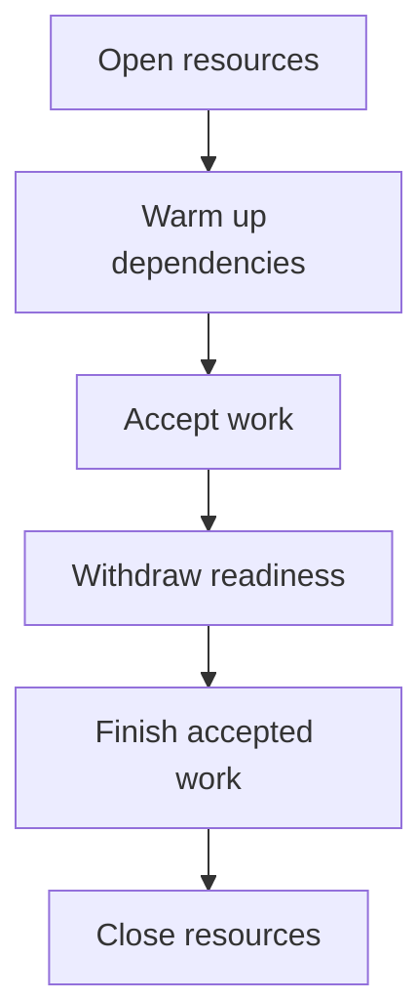

# The Python service lifecycle: startup, health checks and shutdown {#python-service-lifecycle}

An HTTP API, Kafka consumer and background job may share settings, a database pool and outbound clients. If each process independently decides how to open and close them, their behavior gradually diverges. Gracefully stopping one handler does not establish that the application shuts down correctly.

Describe the lifecycle at service level: who owns resources, when work may enter and what must finish before exit.

<!-- more -->

## Separate the application from its entrypoints {#ownership}

FastAPI lifespan is convenient for resources specific to an HTTP application. Settings, dependency injection, database pools and shutdown policy are also needed by workers and commands. Their owner should exist independently of the web framework.

An entrypoint receives work through a request, message or schedule. It uses prepared resources and knows how to stop accepting new work. This separation allows HTTP and workers to run together or in separate processes with the same initialization rules.

## Start in dependency order {#startup}

Validate settings, open resources and perform required initialization before enabling readiness. A startup failure halfway through must still close resources already created.

`AsyncExitStack` helps own several asynchronous resources: it registers cleanup as each opens and closes them in reverse order. Supervise critical background tasks; their failure should not leave an apparently healthy process with a dead subsystem.

Warmup is useful where the first real operation would otherwise receive an unexpected delay or error. Waiting indefinitely for an optional cache is usually unnecessary. Readiness criteria should reflect the application's actual ability to serve.

## Health checks answer different questions {#health}

| Check | Question | Include |
|---|---|---|
| Startup | Has initial preparation finished? | Required initialization |
| Readiness | Can work be routed here? | Application state and dependencies required for that work |
| Liveness | Does this process need restarting? | Signs of an internal process failure |

In Kubernetes, failed readiness removes the pod from ordinary Service routing; liveness failure can restart the container. Restarting every application usually does not repair a shared database outage. The [Kubernetes documentation](https://kubernetes.io/docs/concepts/workloads/pods/pod-lifecycle/) describes probe behavior.

An optional dependency may allow degraded operation. Whether Redis failure should affect readiness depends on its role as a cache or a required state store.

<!-- diagram:concept -->
<figure class="bdr-diagram" markdown="1">
<figcaption>THE IDEA, VISUALIZED<strong>One owner for every phase</strong></figcaption>

Readiness follows initialization. During shutdown, resources close after accepted work finishes.

</figure>
<!-- /diagram:concept -->

## Shutdown begins before connections close {#shutdown}

Pod termination does not change routing and stop the process atomically. Some clients may briefly continue sending requests to the old address. Withdrawing readiness and closing the listening socket must therefore be coordinated with the infrastructure.

The application then stops taking new work and finishes accepted work within a budget. For HTTP, that means requests in progress; for a consumer, the current batch and recording completed progress. Close clients, database pools and other resources afterwards.

The complete sequence must fit inside `terminationGracePeriodSeconds`: routing propagation, drain and cleanup. Time spent in `preStop` is part of that budget too. Choose values from actual work duration and cluster behavior rather than copying another service's manifest.

## Test transitions, not just startup {#verification}

A useful integration test starts a long operation, signals shutdown and verifies that the operation completes before its resources close. Another test fails during startup and checks that everything already created is released.

Also exercise a slow dependency, a failed worker and an exhausted drain budget. Each case should have an explicit owner for stopping admission and handling unfinished work.

[servicewright](https://bedrock-python.github.io/servicewright/) expresses this boundary through a shared runtime and entrypoints. The essential order is to prepare resources, accept work, finish it and release the resources.

## Examples and labs {#labs}

The complete setups and reproduction instructions are available separately:

- [Lab: why application lifecycle should not belong to FastAPI](../lab/2026-09-07-lifecycle-not-fastapi/README.md)
- [Lab: one lifecycle for HTTP, a scheduler and a worker](../lab/2026-09-07-one-lifecycle/README.md)
- [Lab: warmup, readiness and liveness](../lab/2026-09-07-warmup-readiness-liveness/README.md)
- [Lab: graceful shutdown is a protocol](../lab/2026-09-07-graceful-shutdown/README.md)
