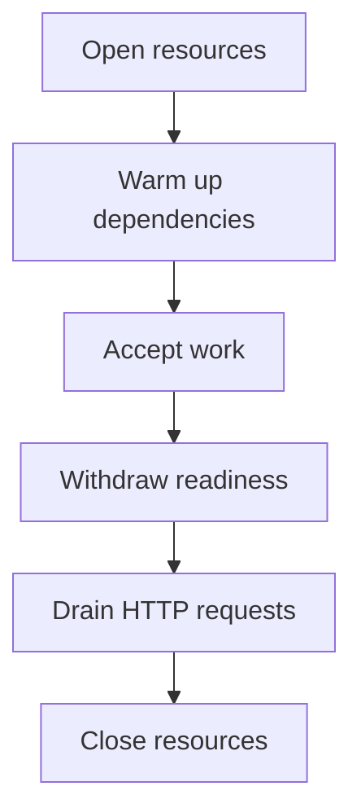

# The Python service lifecycle: startup, health checks and shutdown {#python-service-lifecycle}

<div class="bdr-post__hero" data-bdr-post="2026-09-13-python-service-lifecycle" role="img" aria-label="Stop being routed first, then drain, then finish, then exit" markdown="0"></div>

Imagine a reports service. `GET /reports` builds a report on demand; a worker periodically builds the same report in the background. Both need a database connection. During deployment, an accepted HTTP request should finish before that connection closes.

We will wire the two entrypoints to one application lifecycle, fail startup, disconnect a dependency and stop a request in progress. Each step has a runnable example and a result we can check.

<!-- more -->

<div id="why-application-lifecycle-should-not-belong-to-fastapi" data-search-exclude></div>
<div id="the-api-as-usually-written" data-search-exclude></div>
<div id="the-worker-as-usually-written" data-search-exclude></div>
<div id="the-framework-is-an-entrypoint" data-search-exclude></div>
<div id="what-fastapis-lifespan-is-still-for" data-search-exclude></div>

## Open the resource once for both entrypoints {#ownership}

In an HTTP-only application, FastAPI lifespan can open the database pool and close it after Uvicorn drains requests. Once a separate worker needs the same initialization, that setup gets repeated. The [before example](../lab/2026-09-07-lifecycle-not-fastapi/README.md) shows both working implementations, including cleanup after a startup failure.

Use [servicewright](https://bedrock-python.github.io/servicewright/) to give HTTP and the worker the same startup and shutdown rules. `AppSpec` describes the application, `Service` runs it, and entrypoints receive work. FastAPI remains responsible for HTTP routes.

For this lab, `ReportStore` is an in-memory stand-in for the database. Its `report()` method waits to simulate a query and returns `{"rows": 42}`. `open_store()` records when the resource opens and closes; using a closed store or closing it during a report fails an assertion. The implementation is in the [shared lifecycle lab](../lab/2026-09-07-one-lifecycle/README.md). HTTP and servicewright are real; these examples do not test a database driver.

The container implements servicewright's application and unit scopes. The application scope owns the store; each request or worker scope borrows it:

```python
from contextlib import asynccontextmanager
from report_store import ReportStore, open_store


class Scope:
    def __init__(self, store):
        self.store = store

    async def get(self, key):
        if key is ReportStore:
            return self.store
        raise KeyError(key)


class Container:
    def __init__(self, store):
        self.store = store

    @asynccontextmanager
    async def app_scope(self):
        async with open_store(self.store):
            yield Scope(self.store)

    @asynccontextmanager
    async def unit_scope(self, context=None):
        yield Scope(self.store)
```

`unit_scope()` creates a small dependency resolver, not another store. In production, this is where a DI container can provide a request-scoped session while the connection pool remains application-scoped. The lab keeps the resolver small so resource ownership is easy to follow.

<div id="one-lifecycle-for-http-grpc-workers-and-cron-jobs" data-search-exclude></div>
<div id="host-and-entrypoints" data-search-exclude></div>
<div id="one-process" data-search-exclude></div>
<div id="two-processes" data-search-exclude></div>
<div id="what-the-entrypoints-look-like" data-search-exclude></div>
<div id="the-one-thing-to-get-right" data-search-exclude></div>

## Check the store, then start HTTP and the worker {#startup}

Opening a client object does not prove its dependency is reachable. Before accepting work, run a bounded warmup:

```python
import asyncio
from servicewright import AsyncWarmer


class StoreWarmer(AsyncWarmer):
    def __init__(self, store):
        super().__init__()
        self.store = store

    async def warmup(self):
        async with asyncio.timeout(2):
            await self.store.ping()
```

If `ping()` fails, startup fails. If it stalls, the two-second limit ends the attempt. In either case, the application scope exits and closes the store; the HTTP port has not opened yet. The lab checks failure and a stop request received during warmup.

The HTTP handler gets the prepared store through `UnitScopeDep`:

```python
from fastapi import APIRouter
from servicewright.adapters.fastapi import UnitScopeDep

router = APIRouter()


@router.get('/reports')
async def report(unit: UnitScopeDep) -> dict[str, int]:
    store = await unit.get(ReportStore)
    return await store.report('http')
```

The worker uses the same store to build a report every half second after the previous one finishes. It checks the stop event before starting another report and gives the current report at most one second:

```python
async def periodic_report(scope, stop: asyncio.Event):
    store = await scope.get(ReportStore)
    while not stop.is_set():
        try:
            await asyncio.wait_for(stop.wait(), timeout=0.5)
            return
        except TimeoutError:
            pass
        if stop.is_set():
            return
        async with asyncio.timeout(1):
            await store.report('worker')
```

Now describe the shared lifecycle and select the process role:

```python
from servicewright import AppSpec


def make_spec(container):
    return AppSpec(
        service_name='reports',
        create_container=lambda settings: container,
        warmers=[StoreWarmer(container.store)],
        drain_delay_seconds=0.5,
        drain_grace_seconds=3,
        cleanup_timeout_seconds=2,
    )
```

```python
from servicewright import DaemonEntrypoint, Service
from servicewright.adapters.fastapi import FastApiEntrypoint, HttpConfig


def build_service(role, *, port=8080, store=None):
    container = Container(store if store is not None else ReportStore())
    api = FastApiEntrypoint(
        config=HttpConfig(host='127.0.0.1', port=port, graceful_timeout=1),
        routers=(router,),
    )
    worker = DaemonEntrypoint(periodic_report)
    roles = {'api': [api], 'worker': [worker], 'all': [api, worker]}
    service = Service(make_spec(container), entrypoints=roles[role])
    return service, api, container
```

`build_service('all')` gives HTTP and the worker one store in one process. Running `api` and `worker` as separate deployments gives each process its own store, with the same initialization rules. The script calls `run_sync(service, Settings())`; the small settings adapter is included in the lab.

There is one relevant limit to the worker example: `DaemonEntrypoint` runs this callback, and the Host waits for it to return before beginning drain. Our callback therefore bounds each report itself. In the `all` role, readiness can remain true while the current worker report finishes. For a queue consumer that needs separate admission and drain phases, use a dedicated entrypoint; see the [Kafka shutdown example](2026-09-13-kafka-in-python-services.md#shutdown).

<div id="warmup-readiness-and-liveness-are-three-different-things" data-search-exclude></div>
<div id="the-whole-life-of-a-pod-in-six-transitions" data-search-exclude></div>
<div id="warmup-is-not-readiness-and-neither-is-it-liveness" data-search-exclude></div>
<div id="liveness-is-about-the-process-not-the-dependencies" data-search-exclude></div>
<div id="readiness-has-to-go-false-before-the-pod-stops-serving" data-search-exclude></div>
<div id="the-three-in-one-table" data-search-exclude></div>
<div id="the-pieces" data-search-exclude></div>

## Disconnect a dependency and watch the right probe fail {#health}

Suppose the service also stores background-job status in Redis. For this deployment, losing that state makes the pod unsuitable for new work. Add a readiness check to its `HealthRegistry`:

```python
from redis.exceptions import RedisError
from servicewright import HealthRegistry


class RedisReady:
    def __init__(self, redis):
        self.redis = redis

    async def check(self) -> bool:
        try:
            async with asyncio.timeout(0.25):
                return bool(await self.redis.ping())
        except (RedisError, TimeoutError):
            return False


def redis_health(redis):
    health = HealthRegistry()
    health.add_check('job-state', RedisReady(redis))
    return health
```

The [health lab](../lab/2026-09-07-warmup-readiness-liveness/README.md) creates the Redis client, uses `health=redis_health(client)` on the spec, and closes the client with the application scope. The check has a 250 ms total limit, including any client retries. It does not register a liveness dependency.

The driver pauses a real Redis container and observes these transitions through localhost HTTP:

| Situation | `/system/health/livez` | `/system/health/readyz` | Direct `/reports` request |
| --- | --- | --- | --- |
| Warmup is still running | No listener yet | No listener yet | No listener yet |
| Startup completed | 200 | 200 | 200 |
| Redis is paused | 200 | 503 | 200 |
| Redis is available again | 200 | 200 | 200 |
| Stop requested, routing delay still running | 200 | 503 | 200 |

The lab's `/reports` route does not use Redis, so a direct call still works during the outage. Readiness reports routing eligibility; it does not block the handler itself. If Redis were only an optional cache and reports could still be served, we would leave it out of required readiness checks.

In servicewright 0.13.1, the FastAPI adapter binds after warmup. A startup probe gives that initialization time to finish before liveness checks begin. For Kubernetes, change `HttpConfig.host` from the lab's `127.0.0.1` to `0.0.0.0` so probes can reach the pod IP. This container fragment allows roughly 30 seconds for startup:

```yaml
# Fragment of spec.containers[0]; the container listens on port 8080.
startupProbe:
  httpGet: {path: /system/health/livez, port: 8080}
  periodSeconds: 1
  failureThreshold: 30
readinessProbe:
  httpGet: {path: /system/health/readyz, port: 8080}
  periodSeconds: 2
livenessProbe:
  httpGet: {path: /system/health/livez, port: 8080}
  periodSeconds: 10
  failureThreshold: 3
```

Here startup uses `livez` because this HTTP listener only appears after warmup. Readiness decides whether the pod should receive Service traffic; repeated liveness failures can restart the container. The built-in `livez` confirms that the HTTP/event-loop path responds, not that the database is healthy. See [Kubernetes probe configuration](https://kubernetes.io/docs/tasks/configure-pod-container/configure-liveness-readiness-startup-probes/).

<div id="graceful-shutdown-in-kubernetes-is-a-protocol-not-a-signal-handler" data-search-exclude></div>
<div id="what-kubernetes-actually-does" data-search-exclude></div>
<div id="the-measurement" data-search-exclude></div>
<div id="the-protocol" data-search-exclude></div>
<div id="the-same-measurement-with-the-protocol" data-search-exclude></div>
<div id="sizing-the-numbers" data-search-exclude></div>
<div id="not-only-http" data-search-exclude></div>
<div id="what-changed-in-the-code" data-search-exclude></div>

## Finish an accepted report before closing its store {#shutdown}

Take the API-only role. A request has started a 0.8-second report when shutdown is requested. The settings above produce this sequence:

1. Readiness changes to false; the probe returns 503.
2. The HTTP listener stays open for the configured 0.5-second routing delay.
3. The adapter asks Uvicorn to stop accepting connections and finish active requests. Our report returns 200.
4. The adapter stops, then the application scope closes the store.

<!-- diagram:concept -->
<figure class="bdr-diagram" markdown="1">
<figcaption><span class="bdr-diagram__eyebrow">THE IDEA, VISUALIZED</span><strong>The HTTP shutdown sequence</strong></figcaption>
<div class="bdr-diagram__viewport" markdown="1" data-search-exclude>


```mermaid
---
config:
  theme: default
  look: classic
  flowchart:
    useMaxWidth: false
    wrappingWidth: 150
    padding: 12
    nodeSpacing: 24
    rankSpacing: 32
---
flowchart TD
    accTitle: The HTTP shutdown sequence
    accDescr: HTTP requests have time to finish before resources close. Requests that exceed the configured limit are cancelled.
    A["Open resources"]
    B["Warm up dependencies"]
    C["Accept work"]
    D["Withdraw readiness"]
    E["Drain HTTP requests"]
    F["Close resources"]
    A --> B --> C --> D --> E --> F
```

</div>
<p class="bdr-diagram__caption">HTTP requests have time to finish before resources close. Requests that exceed the configured limit are cancelled.</p>
</figure>
<!-- /diagram:concept -->

These settings control different parts of that sequence:

| Setting in the example | What it limits |
| --- | --- |
| `drain_delay_seconds=0.5` | A pause after withdrawing readiness, before drain starts |
| `HttpConfig.graceful_timeout=1` | Uvicorn's wait for active requests during shutdown |
| `drain_grace_seconds=3` | The drain allowance passed to each entrypoint; here it leaves time for Uvicorn to finish |
| `cleanup_timeout_seconds=2` | Individual runtime cleanup steps, not the total shutdown duration |

The application's resource finalizers need their own limits too. `cleanup_timeout_seconds` does not wrap the whole `app_scope()` exit. The in-memory store closes immediately; a real pool or client must have a bounded close path.

The [shutdown lab](../lab/2026-09-07-graceful-shutdown/README.md) also tries a 30-second report. It exceeds Uvicorn's one-second limit and is cancelled before the store closes. For this route, which has not begun sending a response, the pinned stack returns 500. A request that has already streamed part of its response may end differently. A shutdown budget cannot promise that every accepted request succeeds.

The 0.5-second delay is a local demonstration value. During pod termination, Kubernetes updates endpoint routing while the node shuts down the container; those changes are not instantaneous for every client. Size `terminationGracePeriodSeconds` for the complete sequence, including any `preStop` hook, worker completion, routing delay, drains and cleanup. Measure those times in your deployment. See [Pod termination flow](https://kubernetes.io/docs/concepts/workloads/pods/pod-lifecycle/#pod-termination-flow).

## Check the order with an HTTP request in progress {#verification}

This is the successful-shutdown check from the lab. `running()` starts the real server and yields a stop event, service task and HTTPX client. Its context exit waits for shutdown. `wait_until()` has a time limit and fails if the service exits early:

```python
from lab_support import running, wait_until


async def check_graceful_shutdown():
    store = ReportStore(duration=0.8)
    service, api, _ = build_service('api', port=0, store=store)
    async with running(service, api) as (stop, task, client):
        request = asyncio.create_task(client.get('/reports'))
        try:
            await asyncio.wait_for(store.started.wait(), timeout=2)
            stop.set()
            await wait_until(lambda: not service.spec.health.ready, task)
            assert (await client.get('/system/health/readyz')).status_code == 503
            assert (await request).status_code == 200
        finally:
            await asyncio.gather(request, return_exceptions=True)
    assert store.events.index('http:done') < store.events.index('store:close')
```

The important assertion compares events: the report completed before the store closed. The other labs check failed warmup, stop during warmup, all three process roles, Redis failure and recovery, a failed essential worker, and request cancellation after the graceful timeout.

The examples were checked with Python 3.13, `servicewright==0.13.1`, `fastapi==0.141.1`, `uvicorn==0.53.0` and `httpx==0.28.1`; requirements are pinned in the labs. Drivers use `Service.run(..., stop=event)`, which does not install OS signal handlers. These runs verify application behavior and real HTTP/Redis interactions, not SIGTERM delivery or a Kubernetes rollout.

## What to use in your service {#conclusion}

We started HTTP and a worker from one resource setup, rejected a failed startup, kept liveness green during a Redis outage, and tested both completion and cancellation of an active request. Each case has an observable result instead of a promise to “shut down gracefully.”

Use our [servicewright](https://bedrock-python.github.io/servicewright/) library when several entrypoints need the same lifecycle: `AppSpec` owns the shared configuration, adapters handle their transports, and your code defines required dependencies and work limits. Keep FastAPI lifespan for an HTTP-only application when it already covers your needs. The useful next step is to run the lab's shutdown check against one of your real handlers and its actual resources.

## Examples and labs {#labs}

- [FastAPI lifespan and a separately wired worker](../lab/2026-09-07-lifecycle-not-fastapi/README.md)
- [One lifecycle for HTTP and a worker](../lab/2026-09-07-one-lifecycle/README.md)
- [Warmup, readiness and liveness with real Redis](../lab/2026-09-07-warmup-readiness-liveness/README.md)
- [Completion and cancellation of HTTP requests during shutdown](../lab/2026-09-07-graceful-shutdown/README.md)
