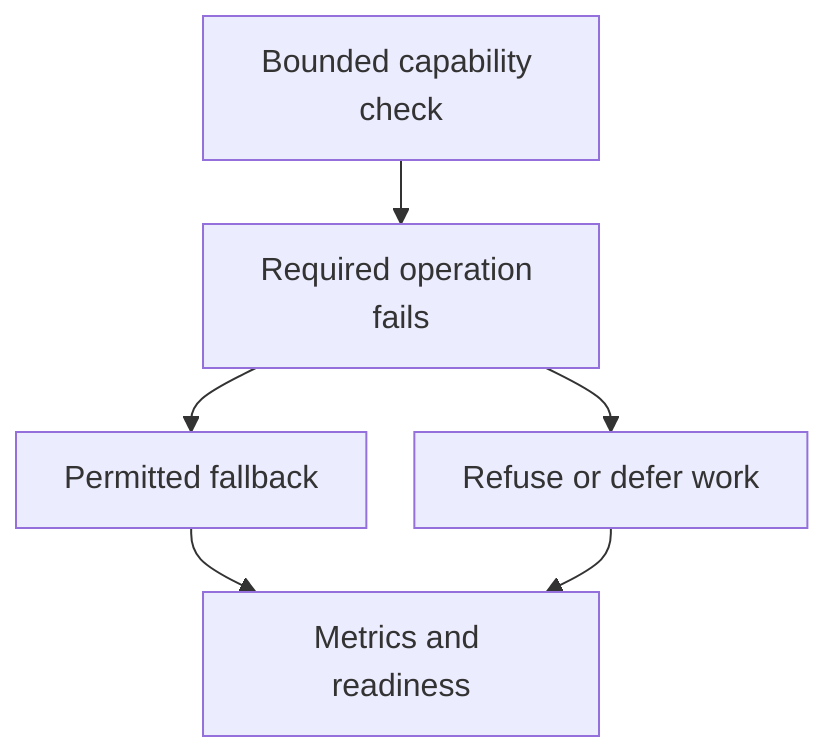

# Redis failures: health checks and service behavior {#redis-failures-and-health-checks}

Redis may serve as a cache, a rate limiter and an idempotency store within the same service. Those uses need different failure policies. Reading from the database instead of a cache can preserve availability; executing a payment without duplicate protection can change the outcome.

Client configuration, health checks and fallback behavior therefore belong in the same design discussion. A health check is useful when its result leads to a deliberate action.

<!-- more -->

## Bound the wait first {#timeouts}

While a client waits for Redis, it consumes the time available for a fallback. Set explicit connection and command timeouts, and account for retries. A per-attempt timeout does not bound the operation when the client repeats it several times.

Defaults depend on the client version. Check the installed version and test a stalled server as well as a refused connection: the socket can be established without any response arriving. Measure connection-pool waiting, retries and backoff as part of the operation.

## Continue or refuse the operation {#failure-policy}

*Fail open* permits an operation without the unavailable check or dependency; *fail closed* refuses it. That choice belongs to each use of Redis.

| Redis responsibility | Response to failure |
|---|---|
| Optional cache | Read from the source if it can absorb the additional load |
| Rate limiting | Choose bypass, a local limit or refusal according to the cost and risk |
| Duplicate-payment protection | Do not bypass it without another idempotency guarantee |
| Required application state | Refuse or defer work when no correct fallback exists |

Bypassing a cache requires spare database capacity. If every request falls through to PostgreSQL after a short timeout, a Redis outage can overload the next dependency. Concurrency limits, coalescing identical requests and temporarily skipping an unavailable cache help contain that load.

Rate limiting and idempotency have no universal permission to fail open. A payment provider may accept its own idempotency key, but that is a separate guarantee to propagate and verify. Even sending an email twice is not always harmless. The [idempotency article](2026-09-13-idempotency-in-apis-and-background-jobs.md) explains those boundaries.

## What PING actually checks {#capabilities}

A successful `PING` establishes that Redis answered that command. It does not establish write capability: a read-only replica or a server at its memory limit with `noeviction` can answer while rejecting `SET`.

When writes are required, a dedicated key with a short TTL and a reserved prefix can probe that capability. Use the application's permissions and connection route. Run the bounded check periodically rather than before every request.

The probe still has limits. A small write does not guarantee a large one; one Redis Cluster key checks a particular slot; a successful `SET` does not prove that every application command or Lua script is available. Choose the depth of the check from the actual workload. The [Redis documentation](https://redis.io/docs/latest/commands/ping/) describes the base command.

<!-- diagram:concept -->
<figure class="bdr-diagram" markdown="1">
<figcaption>THE IDEA, VISUALIZED<strong>Decide what each operation does without Redis</strong></figcaption>

A capability check detects a failed operation. The application chooses a permitted fallback or refusal, then reflects that decision in readiness.

</figure>
<!-- /diagram:concept -->

## Connect the result to Kubernetes behavior {#health}

An external Redis outage usually does not justify restarting a healthy process. Putting that dependency into liveness can restart every replica without fixing the cause.

Readiness asks whether a replica can accept its intended traffic. An optional cache may need only a degradation metric. Required state may justify withdrawing readiness, but a shared dependency failure will then remove every replica from routing. That should be deliberate. When part of an API remains useful, refusing the affected route can preserve the available functions.

These choices belong to the [service lifecycle](2026-09-13-python-service-lifecycle.md), beyond the implementation of one health endpoint.

## Test failure and recovery {#verification}

Cover an unreachable address, a stalled server, rejected writes, pool exhaustion and Redis returning to service. For each case, verify response time, the selected fallback, load on the alternative path and recovery using the same client instance.

Distinguish Redis errors, fallback use and refused business operations in metrics. Otherwise successful HTTP responses can hide a period when rate limiting or duplicate protection was absent.

[redis-client-kit](https://bedrock-python.github.io/redis-client-kit/) provides client configuration and health checks. The application still decides which operations are allowed without Redis.

## Examples and labs {#labs}

The complete setups and reproduction instructions are available separately:

- [Lab: when should Redis fail open?](../lab/2026-09-07-when-should-redis-fail-open/README.md)
- [Lab: Redis health checks, PING is not the whole story](../lab/2026-09-07-redis-health-checks/README.md)
