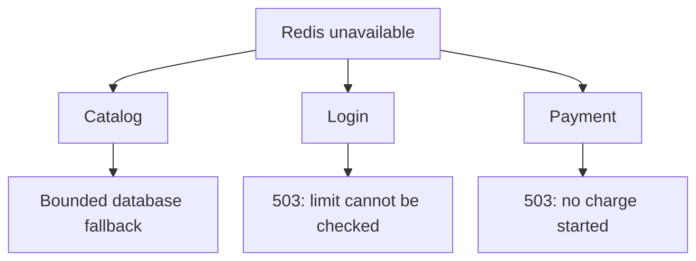

# Redis failures: health checks and service behavior {#redis-failures-and-health-checks}

<div class="bdr-post__hero" data-bdr-post="2026-09-13-redis-failures-and-health-checks" role="img" aria-label="The absent dependency is one thing; what to do without it is three different decisions" markdown="0"></div>

Imagine an online shop with three operations: looking up a price, signing in and paying for an order. Redis caches prices, counts login attempts and temporarily gates repeated payment attempts. We will take it offline and work through which requests the shop can still serve and which it must refuse.

For each case, we will write the code, reproduce a failure and check the outcome. Then we will connect those decisions to health checks.

<!-- more -->

## Bound the wait for Redis {#timeouts}

Prices live in PostgreSQL, so an unavailable cache has a fallback. But if waiting for Redis consumes almost the entire request budget, there may be no time left to read the database.

For the shared client we use our [redis-client-kit](https://bedrock-python.github.io/redis-client-kit/) library: it builds a `redis-py` client from settings and provides health checks. In the functions below, `redis` is one such client, created at application startup and closed with `await redis.aclose()` at shutdown.

The examples were checked with Python 3.13, `redis-client-kit[settings]==0.3.0`, `redis==8.1.0` and Redis 7.4.11. The [lab](../lab/2026-09-07-when-should-redis-fail-open/README.md) contains the complete code and pinned dependencies.

```python
from redis_client_kit import create_async_redis_client
from redis_client_kit.settings import (
    BaseRedisSettings,
    RedisConnectionSettings,
    RedisPoolSettings,
    RedisResponseSettings,
    RedisRetrySettings,
)


def make_redis(host="localhost", port=6379):
    return create_async_redis_client(BaseRedisSettings(
        key_prefix="shop",
        connection=RedisConnectionSettings(host=host, port=port),
        pool=RedisPoolSettings(
            max_connections=10,
            socket_connect_timeout=0.1,
            socket_timeout=0.1,
        ),
        response=RedisResponseSettings(decode_responses=True),
        retry=RedisRetrySettings(enabled=False, max_attempts=0),
        health_check_interval=0,
    ))
```

Retries are explicitly disabled, with separate connection and socket timeouts. `key_prefix` does not automatically prefix keys: we will include `shop:` in the commands. `health_check_interval=0` disables the automatic pre-command `PING` after an idle period; we will add our own check below.

Give each Redis call a total limit that includes obtaining a connection and executing the command:

```python
import asyncio
import logging

from redis.exceptions import RedisError

log = logging.getLogger("shop")
REDIS_FAILURES = (RedisError, TimeoutError)


class ServiceUnavailable(Exception):
    pass


async def redis_call(command):
    async with asyncio.timeout(0.15):
        return await command
```

If Redis stalls, `redis_call` bounds the application's wait. Cancellation from the caller still propagates: `CancelledError` is not in `REDIS_FAILURES`. A command already sent may still execute on the server; timing out does not undo its result.

These limits are example settings. Choose application values from the workload and the [overall request deadline](2026-09-06-timeouts-are-not-deadlines.md). The lab's `retry_probe.py` also shows how retries extend the wait without changing the socket timeout.

<div id="when-should-redis-fail-open" data-search-exclude></div>
<div id="before-deciding-anything-how-long-does-it-take-to-know" data-search-exclude></div>
<div id="the-cache-open-always" data-search-exclude></div>
<div id="the-rate-limiter-open-and-say-so" data-search-exclude></div>
<div id="the-idempotency-store-it-depends-on-what-repeating-costs" data-search-exclude></div>
<div id="health-what-readiness-should-depend-on" data-search-exclude></div>
<div id="and-then-it-comes-back" data-search-exclude></div>
<div id="the-shape" data-search-exclude></div>

## Three operations, three failure decisions {#failure-policy}

Allowing an operation without its unavailable check is called *fail open*; refusing it is *fail closed*. We will choose the behavior for each shop route.

### Catalog: read the price from the database {#cache-fallback}

A customer requests a product price. We try the cache, then PostgreSQL on a miss or Redis error. `load_price(sku)` is an application async function returning a price string; the lab substitutes a counted lookup with a fixed response.

```python
db_slots = asyncio.Semaphore(8)


async def product_price(redis, load_price, sku):
    key = f"shop:price:{sku}"
    cache_available = True
    try:
        cached = await redis_call(redis.get(key))
        if cached is not None:
            return cached
    except REDIS_FAILURES:
        cache_available = False
        log.warning("cache_read_failed", exc_info=True)

    try:
        async with asyncio.timeout(0.5):
            async with db_slots:
                price = await load_price(sku)
    except TimeoutError as error:
        raise ServiceUnavailable("Catalog is busy") from error

    if cache_available:
        try:
            await redis_call(redis.set(key, price, ex=60))
        except REDIS_FAILURES:
            log.warning("cache_write_failed", exc_info=True)
    return price
```

The first request reads the database and caches the result; the second reads Redis. When Redis is unavailable, the function falls back and skips the cache write. If the cache read succeeds but filling the cache fails, the customer still receives the database price.

The semaphore allows at most eight concurrent database reads through this function per process. The half-second limit includes both queueing for the semaphore and reading. Overload raises `ServiceUnavailable`, which the HTTP handler maps to `503`. A cache outage therefore cannot create an unbounded database queue here. Capacity planning must also account for all replicas and other database work.

In the lab, two consecutive price responses require one source lookup. After pausing Redis, the next response reads the source again. A separate check occupies every semaphore slot and verifies that the extra request is refused.

### Login: keep the attempt limit {#login-rate-limit}

For login, choose five attempts in a one-minute window starting with the first attempt. If Redis is unavailable, return `503`: this route does not allow login without checking the limit. Exceeding a working limit is a different error, `429`.

The counter must expire. Separate `INCR` and `EXPIRE` calls leave a gap where the application could crash after incrementing but before setting the TTL. Combine them in Lua, as in the [Redis rate limiter example](https://redis.io/docs/latest/commands/incr/).

```python
LOGIN_WINDOW = """
local count = redis.call('INCR', KEYS[1])
if count == 1 then
    redis.call('PEXPIRE', KEYS[1], ARGV[1])
end
return count
"""


class TooManyRequests(Exception):
    pass


async def allow_login(redis, account_id):
    try:
        count = await redis_call(redis.eval(
            LOGIN_WINDOW, 1, f"shop:login:{account_id}", 60_000,
        ))
    except REDIS_FAILURES as error:
        raise ServiceUnavailable("Login protection unavailable") from error
    if count > 5:
        raise TooManyRequests("Login limit reached")
```

Here, `account_id` is a stable identifier derived from the normalized login name. Call this check before checking the password. It is one protection layer: a real login flow also needs limits by request source and protection against deliberately locking out somebody else's account.

Eight concurrent lab calls admit five attempts and reject three. A new attempt is admitted after the key expires. If the `EVAL` response is lost, the attempt may already have been counted; we do not automatically retry that command.

### Payment: stop before charging when admission is uncertain {#payment-admission}

The customer clicks Pay twice. A temporary `SET NX` key admits one handler and returns `PaymentBusy` to the other, mapped to `409` by the HTTP layer. If setting the key fails, return `503` without calling the payment API.

There is an essential condition: **the provider supports idempotent charges**. Repeating a key with the same amount, including concurrently, does not create another payment. `charge` is the adapter for that API. The order ID and amount come from a validated server-side order; retries use the same key and parameters.

```python
class PaymentBusy(Exception):
    pass


async def pay_order(redis, charge, order_id, amount_minor):
    try:
        acquired = await redis_call(redis.set(
            f"shop:payment:{order_id}", "pending", nx=True, ex=30,
        ))
    except REDIS_FAILURES as error:
        raise ServiceUnavailable("Payment admission unavailable") from error
    if not acquired:
        raise PaymentBusy("A payment attempt already exists")

    return await charge(
        amount_minor=amount_minor,
        idempotency_key=f"shop:order:{order_id}",
    )
```

Redis only gates admission temporarily. The key expires, can be lost during a failure, or can disappear before a slow call finishes. The provider's contract supplies the protection against a second charge. Its key retention period must cover the allowed retry window.

After an uncertain outcome, leave the Redis key until its TTL expires. Even a successful attempt occupies the full window in this small example; a complete API can return a persisted result from the database. If the provider charged the customer but its response was lost, a retry after the TTL sends the original `idempotency_key`. The lab models that case and verifies that the charge count does not increase.

Without that provider contract, this example is insufficient: payment tracking and reconciliation need a separate design. The [idempotency article](2026-09-13-idempotency-in-apis-and-background-jobs.md) covers storing results and handling repeated requests.

<div id="redis-health-checks-ping-is-not-the-whole-story" data-search-exclude></div>
<div id="what-ping-answers" data-search-exclude></div>
<div id="liveness-and-readiness-are-different-questions" data-search-exclude></div>
<div id="what-it-costs-and-what-it-does-not-answer" data-search-exclude></div>
<div id="the-rule" data-search-exclude></div>
<div id="the-pieces" data-search-exclude></div>

## Redis answers PING but rejects writes {#capabilities}

Bring Redis back, but connect the shop to a read-only replica. `PING` succeeds. Login and payment still fail because they require writes. A primary at `maxmemory` under `noeviction` presents a similar case.

In `redis-client-kit`, passing `write_key` runs `PING`, then `SET` with a 60-second TTL. Wrap that check in the same total limit:

```python
from redis_client_kit import check_async_redis_health


async def redis_health(redis, *, require_write=False):
    try:
        return await redis_call(check_async_redis_health(
            redis,
            write_key="shop:health:write" if require_write else None,
        ))
    except TimeoutError:
        return False
```

`redis_health(redis)` checks the `PING` response; `redis_health(redis, require_write=True)` also attempts a write. Real servers in the [health lab](../lab/2026-09-07-redis-health-checks/README.md) produced these results:

| Redis state | `PING` | `PING` + `SET` |
|---|---|---|
| Healthy primary | `True` | `True` |
| Memory limit reached, `noeviction` | `True` | `False` |
| Read-only replica | `True` | `False` |
| Paused process | `False` | `False` |
| Resumed, same client | `True` | `True` |

Use a dedicated probe key allowed by the application's permissions. A successful `SET` does not test `EVAL`, guarantee writes of any size, or check every Redis Cluster slot. Business functions still need error handling: a health result reports a condition rather than guaranteeing that the next request will succeed.

<!-- diagram:concept -->
<figure class="bdr-diagram" markdown="1">
<figcaption><span class="bdr-diagram__eyebrow">THE IDEA, VISUALIZED</span><strong>One Redis outage, three shop routes</strong></figcaption>
<div class="bdr-diagram__viewport" markdown="1" data-search-exclude>


```mermaid
---
config:
  theme: default
  look: classic
  flowchart:
    useMaxWidth: false
    wrappingWidth: 150
    padding: 12
    nodeSpacing: 24
    rankSpacing: 32
---
flowchart TD
    accTitle: One Redis outage, three shop routes
    accDescr: When Redis is unavailable, the catalog uses a bounded database fallback. Login and payment return 503 without bypassing their checks.
    A["Redis unavailable"]
    B["Catalog"]
    C["Login"]
    D["Payment"]
    E["Bounded database fallback"]
    F["503: limit cannot be checked"]
    G["503: no charge started"]
    A --> B
    A --> C
    A --> D
    B --> E
    C --> F
    D --> G
```

</div>
<p class="bdr-diagram__caption">When Redis is unavailable, the catalog uses a bounded database fallback. Login and payment return 503 without bypassing their checks.</p>
</figure>
<!-- /diagram:concept -->

## What readiness and liveness should do {#health}

Our shop keeps serving the catalog from the database during a Redis outage, while login and payment return errors on their own routes. As long as the application and PostgreSQL can accept traffic, overall readiness stays successful. A separate degradation metric reports the Redis failure.

If payment becomes a separate service that requires Redis on every request, its readiness may depend on the write probe. A shared Redis outage would then remove all of that service's replicas from routing. Account for that outcome when designing the API.

Redis is not part of our application's liveness check: restarting a healthy process does not restore an external store. This follows the different purposes of [Kubernetes probes](https://kubernetes.io/docs/concepts/workloads/pods/probes/).

Run the Redis check periodically within the [application lifecycle](2026-09-13-python-service-lifecycle.md), storing its result and timestamp. The health handler reads that state without another network call. If readiness depends on it, define a freshness limit so a stopped probe cannot leave the service permanently marked ready.

## Test failure and recovery {#verification}

The labs start their own Redis containers; PostgreSQL and the payment API are explicitly labeled test doubles. Checks cover the consequences for shop operations as well as client exceptions:

| Failure | What the lab verifies |
|---|---|
| Refused connection, stalled Redis or exhausted pool | Catalog reads the source; login and payment are refused; no charge occurs |
| Redis accepts reads but rejects writes | Price is returned without filling the cache; login and payment stop |
| All database read slots occupied | Waiting is bounded; no extra read starts |
| Request task cancelled | Cancellation propagates without starting a fallback read |
| Provider response lost after a charge | Retry uses the same key and returns the existing result |
| Redis returns to service | All three operations work with the same client |

Successful HTTP responses alone do not describe the outage. Track Redis errors, source fallbacks, limiter `429` responses and `503` responses caused by unavailable protection separately. The example logs cache errors; the other failures reach the HTTP layer through distinct exceptions.

## Conclusion {#conclusion}

In this shop, the catalog can survive a cache outage while the database can support the fallback. Login stops when its limit cannot be checked. Payment does not start without admission, and the provider's separate guarantee prevents another charge. A successful `PING` alone cannot tell you which routes still work.

Use [redis-client-kit](https://bedrock-python.github.io/redis-client-kit/) to build a client with explicit connection, timeout and retry settings, and to add a `PING` or write probe. Define route behavior in the application and verify it against your failure scenarios. Start by running the labs below and replacing their test doubles with your adapters.

## Examples and labs {#labs}

- [Cache, limiter, payment and Redis waiting time](../lab/2026-09-07-when-should-redis-fail-open/README.md)
- [Write capability: primary, exhausted memory and replica](../lab/2026-09-07-redis-health-checks/README.md)
