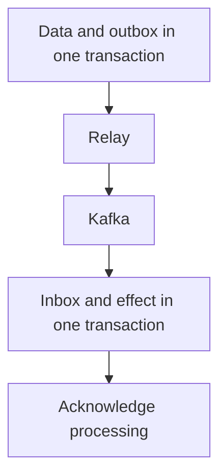

# Reliable event delivery with Outbox, Inbox and Kafka {#reliable-events-outbox-inbox-kafka}

A service saves an order in PostgreSQL and needs to publish it through Kafka. The process can fail between commit and publication. Reversing the order creates the opposite risk: the event exists, but the database transaction rolls back.

Outbox and Inbox make these boundaries explicit. They retain redelivery as an expected part of processing.

<!-- more -->

## Record intent with the business data {#outbox}

Write an outbox row, including a stable event id and payload, in the order transaction. The transaction has one outcome: both records exist or neither does. An outbox repository must not independently commit the caller's transaction.

A separate relay selects pending rows, publishes them and records the outcome. If it crashes after Kafka acknowledges but before the database update, publication repeats. The event id therefore survives retries, and consumers need to recognize duplicates.

Parallel relays need a work-claiming protocol. Claims, ownership expiry, recovery and completion must agree; selecting the first N rows alone is insufficient.

<!-- diagram:concept -->
<figure class="bdr-diagram" markdown="1">
<figcaption>THE IDEA, VISUALIZED<strong>Atomicity on each side of delivery</strong></figcaption>

The producer commits its data with the outbox. The consumer commits its effect with the inbox; delivery between them may repeat.

</figure>
<!-- /diagram:concept -->

## Commit processing with its effect {#inbox}

The consumer begins a transaction, attempts to record the message id in an inbox, applies the business change and commits both. A unique constraint distinguishes new delivery from completed processing.

Broker acknowledgement follows commit. A crash between them causes redelivery, which finds the inbox row and does not repeat the transactional effect. A handler failure before commit rolls back both the effect and its marker.

Identity must include the logical recipient: independent handlers of one event need not share a deduplication record. Inbox retention must cover possible replay, not just ordinary delivery delays.

## Name the guarantee's boundary {#boundaries}

An inbox protects changes included in its transaction. PostgreSQL rollback cannot undo a sent email or external payment. Those actions need their own [idempotency contract](2026-09-13-idempotency-in-apis-and-background-jobs.md).

Kafka supports transactional scenarios within its ecosystem, but those guarantees do not automatically extend to an arbitrary external database. See [Kafka's delivery semantics](https://kafka.apache.org/41/design/design/#message-delivery-semantics).

A useful system property is specific: repeating this event id does not create a second invoice row in this database. “Everything is exactly-once” hides conditions that must be checked during failure.

## A broker outage creates a backlog {#outage}

While Kafka is unavailable, the application may continue committing business data and outbox rows if the product contract permits it and database capacity allows. The event is durable but not delivered. The UI must not represent an unfinished external process as complete.

Backlog size grows approximately with arrival rate multiplied by outage duration. Recovery requires relay throughput above the rate of new work. Bound retries and monitor oldest-event age, queue size and messages that cannot be processed.

Ordering also needs a decision. Multiple relays and repeated publication can change observed order. Entities that depend on ordering need suitable partition keys and a verified version or sequence protocol.

## Test every interruption point {#verification}

Exercise failure before commit, after commit before publication, after publication before marking completion, and after the consumer effect before acknowledgement. Include long outages, backlog recovery and replay after inbox cleanup.

[omni-box](https://bedrock-python.github.io/omni-box/) provides outbox and inbox components. Integration begins with application transaction boundaries: where intent is stored, where an effect commits and exactly what an acknowledgement means.

## Examples and labs {#labs}

The complete setups and reproduction instructions are available separately:

- [Lab: exactly-once effects](../lab/2026-09-07-exactly-once-effects/README.md)
- [Lab: the transactional inbox](../lab/2026-09-07-transactional-inbox/README.md)
- [Lab: what happens when Kafka is down for an hour?](../lab/2026-09-07-when-kafka-is-down/README.md)
