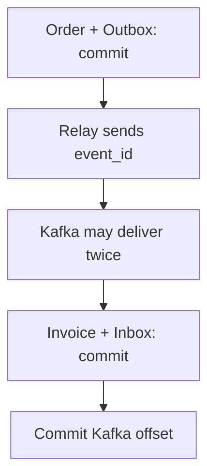

# Reliable event delivery with Outbox, Inbox and Kafka {#reliable-events-outbox-inbox-kafka}

<div class="bdr-post__hero" data-bdr-post="2026-09-13-reliable-events-outbox-inbox-kafka" role="img" aria-label="The order and event commit together; billing handles repeated delivery" markdown="0"></div>

Imagine an online shop with two services. The order service saves a purchase in PostgreSQL and publishes `order.created` to Kafka. The billing service reads that event and creates an invoice. Restarting either service should not lose the event or create a second invoice.

We will interrupt this flow at the database and broker boundaries, then use Outbox and Inbox to make recovery predictable.

<!-- more -->

<div id="the-transactional-outbox-pattern-in-python-omni-box" data-search-exclude></div>
<div id="the-dual-write-problem" data-search-exclude></div>
<div id="the-outbox-pattern" data-search-exclude></div>
<div id="using-omni-box" data-search-exclude></div>
<div id="the-inbox-side" data-search-exclude></div>
<div id="why-a-library" data-search-exclude></div>

## The order exists, but its event is missing {#outbox}

Start with the obvious implementation: commit the order, then call `producer.send_and_wait()`. A crash between those operations leaves an order that billing never hears about. Publishing first moves the failure window:

| Sequence and failure | Orders in PostgreSQL | Records in Kafka |
| --- | --- | --- |
| Commit order; crash before publication | 1 | 0 |
| Publish event; roll back the order transaction | 0 | 1 |

These are assertions from the [delivery lab](../lab/2026-09-07-exactly-once-effects/README.md). Changing the order of two independent commits cannot make them atomic.

Instead, save the order and a row describing its event in **one PostgreSQL transaction**. This table is the Outbox. We will use [omni-box](https://bedrock-python.github.io/omni-box/) for its event models, repositories and delivery components; the application keeps control of commit.

The lab's `models.py` defines `Order`, `Invoice`, `OutboxEventDB` and `InboxEventDB`. The latter two inherit omni-box's ORM bases. The Python snippets below assemble into `event_flow.py`. Here, `sessions` is a SQLAlchemy `async_sessionmaker` for the order database; in the billing examples it belongs to billing. The lab uses one database to keep the setup small.

```python
from uuid import UUID

from sqlalchemy.ext.asyncio import AsyncSession, async_sessionmaker

from omni_box import OmniBoxDomainService
from omni_box.infra.storage.postgres import PostgresOutboxRepository

from models import Order, OutboxEventDB


async def record_order(session: AsyncSession, order_id: UUID) -> UUID:
    session.add(Order(id=order_id))
    event = OmniBoxDomainService().create_outbox_event(
        aggregate_type="order",
        aggregate_id=order_id,
        event_type="order.created",
        topic="orders.created",
        partition_key=str(order_id),
        payload={"order_id": str(order_id)},
    )
    repo = PostgresOutboxRepository(session, model_class=OutboxEventDB)
    await repo.create(event)
    return event.id


async def place_order(sessions: async_sessionmaker, order_id: UUID) -> UUID:
    async with sessions.begin() as session:
        return await record_order(session, order_id)
```

`record_order()` adds both rows without committing. `place_order()` owns the transaction: successful context-manager exit saves both; an exception rolls back both. After it returns, the order is accepted and delivery is pending. No connection to Kafka is needed on this request path.

### Publish the saved events {#relay}

A separate worker, the **relay**, reads the Outbox. At startup it creates a producer, the client that sends messages to Kafka. This context manager owns its connection:

```python
from contextlib import asynccontextmanager

from aiokafka import AIOKafkaProducer

from omni_box.core.converters import EnvelopeEventConverter
from omni_box.infra.brokers.kafka import KafkaEventPublisher


@asynccontextmanager
async def kafka_publisher(bootstrap: str):
    producer = AIOKafkaProducer(
        bootstrap_servers=bootstrap, enable_idempotence=True, acks="all",
    )
    try:
        await producer.start()
        yield KafkaEventPublisher(producer, EnvelopeEventConverter())
    finally:
        await producer.stop()
```

`bootstrap` is the application's Kafka bootstrap address. `EnvelopeEventConverter` serializes the event body, and `KafkaEventPublisher` puts the stored event's ID in the `event_id` header. The same row keeps the same ID on another publication attempt.

The worker periodically calls `relay_once(sessions, broker)` inside that context:

```python
from omni_box import OutboxPublisher


async def relay_batch(session: AsyncSession, broker: KafkaEventPublisher):
    repo = PostgresOutboxRepository(session, model_class=OutboxEventDB)
    return await OutboxPublisher(repo, broker, publish_timeout=2).publish_batch(
        worker_id="relay-1", batch_size=20,
    )


async def relay_once(sessions: async_sessionmaker, broker: KafkaEventPublisher):
    async with sessions.begin() as session:
        return await relay_batch(session, broker)
```

In this version, the PostgreSQL repository claims pending rows with `FOR UPDATE SKIP LOCKED`. The surrounding transaction holds the connection and row locks while the batch is sent. The two-second limit applies to **each publication**, not the whole batch; size the batch and retry interval for the service's database capacity.

Now interrupt the relay after Kafka acknowledges the send but before the PostgreSQL transaction commits. The database rolls back the completion marker. The next cycle sends the row again:

```text
First cycle, interrupted:  Kafka records=1, outbox=pending
Second cycle, committed:  Kafka records=2, distinct event_id=1
```

`enable_idempotence=True` protects producer-level retries. It does not merge two explicit application publications of the same Outbox row. Billing still needs to recognize the repeated event. See the [aiokafka producer documentation](https://aiokafka.readthedocs.io/en/stable/producer.html#idempotent-produce).

<!-- diagram:concept -->
<figure class="bdr-diagram" markdown="1">
<figcaption><span class="bdr-diagram__eyebrow">THE IDEA, VISUALIZED</span><strong>From an order to one invoice</strong></figcaption>
<div class="bdr-diagram__viewport" markdown="1" data-search-exclude>


```mermaid
---
config:
  theme: default
  look: classic
  flowchart:
    useMaxWidth: false
    wrappingWidth: 150
    padding: 12
    nodeSpacing: 24
    rankSpacing: 32
---
flowchart TD
    accTitle: From an order to one invoice
    accDescr: Order and event commit together. Invoice and Inbox commit together. Kafka delivery between them may repeat.
    A["Order + Outbox: commit"]
    B["Relay sends event_id"]
    C["Kafka may deliver twice"]
    D["Invoice + Inbox: commit"]
    E["Commit Kafka offset"]
    A --> B --> C --> D --> E
```

</div>
<p class="bdr-diagram__caption">Order and event commit together. Invoice and Inbox commit together. Kafka delivery between them may repeat.</p>
</figure>
<!-- /diagram:concept -->

<div id="transactional-inbox-the-other-half-of-the-outbox-pattern" data-search-exclude></div>
<div id="the-consumers-two-problems" data-search-exclude></div>
<div id="the-inbox-row" data-search-exclude></div>
<div id="measured-the-handler-fails-halfway" data-search-exclude></div>
<div id="what-the-inbox-does-not-do" data-search-exclude></div>
<div id="the-pair" data-search-exclude></div>

## Two deliveries, one invoice {#inbox}

Billing stores an **Inbox** row alongside the invoice. It records which event this consumer group has processed. Both writes must use the same session and transaction. Pass that boundary to omni-box:

```python
from omni_box.infra.storage.postgres import PostgresInboxRepository

from models import InboxEventDB


class InboxTransaction:
    def __init__(self, sessions: async_sessionmaker):
        self.sessions = sessions

    @asynccontextmanager
    async def transaction(self):
        async with self.sessions.begin() as session:
            yield PostgresInboxRepository(session, model_class=InboxEventDB)
```

The handler uses the repository's session to insert the invoice:

```python
from sqlalchemy import insert

from omni_box import InboxEvent

from models import Invoice


async def create_invoice(event: InboxEvent, repo: PostgresInboxRepository):
    await repo.session.execute(
        insert(Invoice).values(order_id=UUID(str(event.payload["order_id"])))
    )
```

The lab deliberately leaves `Invoice.order_id` without a unique constraint: an accidental second insert must remain visible, so the test proves that Inbox suppresses it. A production rule such as “one invoice per order” should also have its own database constraint; different events can refer to the same order.

Now connect billing to the `orders.created` topic. Automatic offset commits are disabled; the selected strategy commits the offset after the Inbox transaction succeeds:

```python
from aiokafka import AIOKafkaConsumer

from omni_box import AckStrategy, InboxConsumerRunner
from omni_box.infra.brokers.kafka import KafkaEventConsumer


def billing_runner(sessions, bootstrap, *, topic="orders.created",
                   group="billing", handler=create_invoice):
    consumer = AIOKafkaConsumer(
        topic, bootstrap_servers=bootstrap, group_id=group,
        auto_offset_reset="earliest", enable_auto_commit=False,
    )
    return InboxConsumerRunner(
        consumer=KafkaEventConsumer(consumer),
        transaction_provider=InboxTransaction(sessions),
        handler=handler,
        worker_id="billing-1", consumer_group=group,
        ack_strategy=AckStrategy.EXACTLY_ONCE_INBOX,
        exactly_once_commit_on_failed=False,
    )
```

Feed the two records from the interrupted relay to `InboxConsumerRunner`:

```text
Delivery 1: processed=True,  duplicate=False, committed=True, invoices=1
Delivery 2: processed=False, duplicate=True,  committed=True, invoices=1
```

The Inbox's unique key is `(message_id, consumer_group)`. With these adapters, `message_id` comes from the `event_id` header. A caller-supplied `message_id` header takes precedence, so it must also remain stable across retries.

### The handler failed: what should the worker do? {#consumer-restart}

Suppose `create_invoice()` raises after its INSERT. The transaction rolls back both the invoice and the Inbox row. With this configuration, `process_one()` returns a result with `committed=False`; a handler exception does not necessarily escape that method.

Stop this worker when that happens:

```python
async def run_billing(runner: InboxConsumerRunner):
    try:
        await runner.start()
        while True:
            result = await runner.process_one()
            if not result.committed:
                raise RuntimeError(f"Retry message {result.message_id}")
    finally:
        await runner.stop()
```

The application runs `run_billing(billing_runner(sessions, bootstrap))`. Its process supervisor can restart it with backoff and the **same group** after a failure. A repeatedly failing event needs an explicit repair or dead-letter policy, rather than an endless restart cycle.

Why stop reading? Kafka's current position advances when a record is fetched. If processing offset 0 fails, then processing offset 1 commits offset 2, a restart will skip the failed record. With this sequential loop, billing stops before that can happen. The distinction between position and committed offset is described in the [aiokafka consumer documentation](https://aiokafka.readthedocs.io/en/stable/consumer.html#manual-vs-automatic-committing).

There is one more interruption point: PostgreSQL has committed the invoice, but the offset commit fails. On restart, the same record finds the completed Inbox row. The handler is skipped and the offset is committed. The [Inbox lab](../lab/2026-09-07-transactional-inbox/README.md) checks both failure windows against real Kafka offsets.

<div id="exactly-once-is-a-lie-exactly-once-effects-are-not" data-search-exclude></div>
<div id="messages-versus-effects" data-search-exclude></div>
<div id="every-window-measured" data-search-exclude></div>
<div id="the-outbox-closes-the-producer-side" data-search-exclude></div>
<div id="the-inbox-closes-the-consumer-side" data-search-exclude></div>
<div id="the-http-edge" data-search-exclude></div>
<div id="the-whole-path" data-search-exclude></div>
<div id="why-the-library-must-not-own-the-transaction" data-search-exclude></div>
<div id="what-it-looks-like" data-search-exclude></div>

## Where this protection ends {#boundaries}

The same lab changes one condition at a time:

| Change | Observed result |
| --- | --- |
| Publish two copies without `event_id` or `message_id` | Each record falls back to `topic:partition:offset`; two invoices are inserted |
| Read the event with another consumer group | It is a different Inbox recipient; the handler runs again |
| Delete the completed Inbox row, then replay the event | The previous result is forgotten; the handler runs again |

Preserve the event ID end to end, keep a stable group name for the same logical handler, and retain Inbox rows for the full replay window. In the lab, cleanup is an explicit deletion to reproduce the last case; it is not a retention recommendation.

An external action is another boundary. If the handler sends an email and its database transaction later rolls back, PostgreSQL cannot unsend the email. Persist a notification intent in the same transaction and give the external operation its own [idempotency contract](2026-09-13-idempotency-in-apis-and-background-jobs.md). Kafka transactions also do not automatically include an arbitrary PostgreSQL transaction; see [Kafka's delivery semantics](https://kafka.apache.org/41/design/design/#message-delivery-semantics).

<div id="what-happens-when-kafka-is-down-for-an-hour" data-search-exclude></div>
<div id="publishing-from-the-request-path" data-search-exclude></div>
<div id="the-outbox-during-the-outage" data-search-exclude></div>
<div id="what-an-hour-actually-costs-you" data-search-exclude></div>
<div id="what-it-does-not-solve" data-search-exclude></div>
<div id="the-pieces" data-search-exclude></div>

## Kafka is unavailable; new orders keep arriving {#outage}

Pause the broker after establishing the producer connection, then place three more orders. The order service can save them with their Outbox rows while billing waits. The customer-facing status should say that the order is accepted and the invoice is pending. Continuing to accept orders is a product decision bounded by database capacity.

The [outage lab](../lab/2026-09-07-when-kafka-is-down/README.md) runs three relay cycles with the broker paused and executes this query after each:

```sql
SELECT status, count(*) AS events, max(attempts_made) AS attempts
FROM outbox_events
WHERE status <> 'completed'
GROUP BY status;
```

```text
status  | events | attempts
pending | 3      | 0
```

In omni-box 0.3.0, a publication timeout or `TransientError` defers work without spending the event's attempt budget. After the first such failure, the remaining rows in that batch are also deferred. Other publication errors can consume attempts and eventually require investigation; do not automatically requeue every failed row.

After unpausing Kafka, all three events reach the broker and the pending count becomes zero. A timed-out send can still arrive, so the lab checks the set of delivered event IDs rather than promising exactly three Kafka records.

For a longer outage, calculate capacity separately. At 100 events per second, an hour adds about **360,000 events**. If the relay later sends 300 per second while 100 new events arrive, clearing that backlog takes roughly **30 minutes**. This is a capacity example, not a measured hour-long run. Monitor pending count, oldest-event age and failed rows; allow for payloads, indexes and database load.

Delivery order needs its own rule too. `partition_key=order_id` routes one order's records to one partition, but parallel relays can publish a later event first. If billing must apply `created` before `cancelled`, carry an order version and define how to handle gaps or stale versions.

## What the runnable checks cover {#verification}

The labs verify both broken write orders, atomic order/Outbox rollback, repeated publication with a stable ID, handler rollback, failure before offset commit, replay after cleanup and recovery from a paused broker. Transaction-boundary failures are injected exceptions; the outage is a paused container. This exercises the recovery paths with one broker, not a replicated cluster's failover.

Verified with Python 3.13, omni-box 0.3.0, aiokafka 0.14.0, SQLAlchemy 2.0.54 and asyncpg 0.31.0. The lab dependencies are pinned; PostgreSQL uses `postgres:17-alpine`, Kafka uses `confluentinc/cp-kafka:7.6.0` in KRaft mode.

## Put the two patterns to work {#conclusion}

We followed an order through a missing publication, repeated delivery, handler failure and broker outage. **Outbox saves the event with the order; Inbox saves the processing result with the invoice.** Stable IDs and offset commits after database commit connect those two boundaries.

Use our [omni-box](https://bedrock-python.github.io/omni-box/) library when your service needs this PostgreSQL-to-Kafka flow. It supplies the repositories, relay and `InboxConsumerRunner` shown here; start with the runnable example, then choose transaction boundaries, replay retention and failure handling for your own operation.

## Examples and labs {#labs}

- [Lab: order, event and repeated delivery](../lab/2026-09-07-exactly-once-effects/README.md)
- [Lab: handler failure and Inbox boundaries](../lab/2026-09-07-transactional-inbox/README.md)
- [Lab: broker outage and backlog recovery](../lab/2026-09-07-when-kafka-is-down/README.md)
