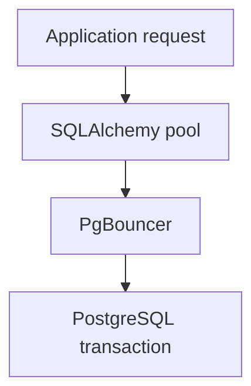

# SQLAlchemy and PgBouncer: configuring and diagnosing connection pools {#sqlalchemy-pgbouncer-pools}

A connection pool is full while the application responds quickly. After the database slows down, the same utilization graph remains full, but requests now time out. Connection counts describe capacity; diagnosis needs the time work spends waiting and holding the resource.

PgBouncer introduces another connection-management layer. Application and pooler settings need to be evaluated together.

<!-- more -->

## Identify what is being reused {#pooling}

In transaction pooling, a PostgreSQL server connection is assigned to a client for a transaction. The next transaction may use another connection. Arbitrary server-session state cannot therefore be assumed to survive between transactions. Temporary objects, settings and locks require a compatibility check; see [PgBouncer's feature table](https://www.pgbouncer.org/features.html).

Prepared statements do not have one correct setting for every driver and version. Protocol-level support depends on PgBouncer's version and configuration. Advice for an older installation may be unnecessary on a newer one. Test the actual combination of PgBouncer, asyncpg or psycopg, and SQLAlchemy.

## Coordinate the two pools {#capacity}

The application has a connection limit, overflow allowance and acquisition timeout. PgBouncer has client and server connection limits determined by its configuration. Tuning each pod independently without counting replicas and worker processes can exceed the database's capacity.

First estimate how many transactions the database can serve within the latency target. Allocate that capacity across applications and replicas. A larger pool does not accelerate a slow query; it can simply increase concurrent work.

`NullPool` can be useful with an external pooler, but it is not a universal requirement. The choice depends on connection cost, driver behavior and where requests should queue. Measure the chosen arrangement under load.

<!-- diagram:concept -->
<figure class="bdr-diagram" markdown="1">
<figcaption>THE IDEA, VISUALIZED<strong>Two queues before a query</strong></figcaption>

A request can wait for an application connection and a PgBouncer server connection. SQL execution time is only part of its latency.

</figure>
<!-- /diagram:concept -->

## Separate waiting from holding {#metrics}

| Metric | Question |
|---|---|
| Connection acquisition time | How long does work wait for a resource? |
| Connection holding time | Why is the connection not returning? |
| Acquisition timeouts | How much work is already failing? |
| Connections in use and overflow | How is configured capacity being used? |
| Checkout rate | How much work passes through the pool? |

If holding time rises with SQL duration, investigate queries, locks and the database. If SQL is brief but connections remain occupied, examine transaction boundaries and external calls made inside them. [Sessions and Unit of Work](2026-09-13-sqlalchemy-sessions-and-transactions.md) cover that boundary.

PgBouncer metrics expose the second queue. Application checkout timing does not necessarily include the later wait for a server connection when a query starts.

## Test the actual connection path {#verification}

A direct PostgreSQL connection test does not establish pooler compatibility. Exercise normal transactions, rollback, connection reuse and the driver's prepared statements through PgBouncer.

For a load test, begin with a fixed worker count and a controlled increase in SQL duration. Compare acquisition, holding time and failures before and after the slowdown. The lab explains relationships; its settings are not production defaults.

On application shutdown, finish accepted work and its transactions before disposing the engine. That belongs to the shared lifecycle rather than a separate pool optimization.

[sqlalchemy-foundation-kit](https://bedrock-python.github.io/sqlalchemy-foundation-kit/) supplies consistent pool setup and metrics. Capacity decisions still belong to the service owner who can see workload and PostgreSQL constraints.

## Examples and labs {#labs}

The complete setups and reproduction instructions are available separately:

- [Lab: PgBouncer transaction mode and async SQLAlchemy](../lab/2026-09-07-pgbouncer-async-sqlalchemy/README.md)
- [Lab: what to monitor in a SQLAlchemy connection pool](../lab/2026-09-07-sqlalchemy-pool-metrics/README.md)
