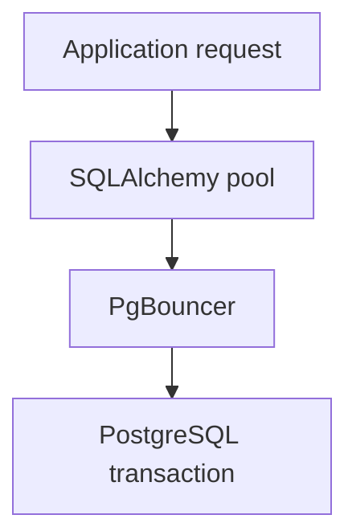

# SQLAlchemy and PgBouncer: configuring and diagnosing connection pools {#sqlalchemy-pgbouncer-pools}

<div class="bdr-post__hero" data-bdr-post="2026-09-13-sqlalchemy-pgbouncer-pools" role="img" aria-label="Transaction pooling reassigns the lane on every transaction, and session state does not survive it" markdown="0"></div>

Imagine an orders service: `GET /orders/42` reads an order from PostgreSQL and asks a shipping service for a delivery quote. SQLAlchemy keeps client connections open; PgBouncer assigns them PostgreSQL connections for each transaction. A slow response can mean waiting in either pool, running slow SQL, or holding a connection while waiting for shipping.

We will reproduce each case and use `sqlalchemy-foundation-kit` to configure the application pool and export its metrics. The lab runs PostgreSQL 17, PgBouncer 1.25.2, SQLAlchemy 2.0.54, asyncpg 0.31.0 and the kit's version 0.4.0.

<!-- more -->

<div id="pgbouncer-transaction-mode-and-async-sqlalchemy-the-production-setup-nobody-documents-enough" data-search-exclude></div>
<div id="what-transaction-mode-takes-away" data-search-exclude></div>
<div id="the-prepared-statement-error-and-when-it-stopped-happening" data-search-exclude></div>
<div id="the-setting-that-actually-breaks-the-connection" data-search-exclude></div>
<div id="pool-sizing-when-there-is-a-pool-in-front-of-your-pool" data-search-exclude></div>
<div id="what-to-monitor" data-search-exclude></div>
<div id="closing-pools-during-a-rollout" data-search-exclude></div>
<div id="the-configuration" data-search-exclude></div>

## Read an order through PgBouncer {#pooling}

The lab creates `app.orders` with order `42`, whose `total` is `1999` in minor currency units. Its PgBouncer configuration contains this section; the lab adds database routing and authentication:

```ini
[pgbouncer]
pool_mode = transaction
default_pool_size = 2
max_client_conn = 50
max_prepared_statements = 200
```

In transaction mode, PgBouncer releases a PostgreSQL connection after commit or rollback. The next transaction may get another connection, so arbitrary session state cannot be assumed to carry over. The [feature table](https://www.pgbouncer.org/features.html) lists the restrictions.

The application connects to **PgBouncer's host and port**. This configuration keeps at most two client connections per manager and waits up to 200 ms for a slot in the local pool:

```python
from pydantic import SecretStr
from sqlalchemy_foundation_kit import create_async_session_manager
from sqlalchemy_foundation_kit.contrib.settings import (
    BasePostgresConfig, ConnectionSettings, PoolSettings, QuerySettings,
)


def database_config(host, port, user, password, database):
    return BasePostgresConfig(
        connection=ConnectionSettings(
            host=host, port=port, user=user,
            password=SecretStr(password), database=database,
        ),
        application_name="orders-api",
        db_schema="app",
        jit=None,
        use_orjson_serialization=False,
        pool=PoolSettings(size=2, max_overflow=0, timeout=0.2),
        query=QuerySettings(
            statement_cache_size=100,
            prepared_statement_cache_size=100,
        ),
    )
```

Create the manager with `create_async_session_manager(config)`, where `config` is the result of `database_config(...)`. Keep one manager for the application's lifetime. The lookup uses an explicit transaction:

```python
from sqlalchemy import text


async def get_order(manager, order_id):
    async with manager.get_transaction() as session:
        row = (await session.execute(
            text("SELECT id, total FROM orders WHERE id = :id"),
            {"id": order_id},
        )).mappings().one()
        return dict(row)
```

`get_order(manager, 42)` returns `{"id": 42, "total": 1999}`. Leaving `get_transaction()` commits on success or rolls back on an exception and returns the connection. The returned dictionary can be used after the session closes.

### Prepared statements: test a change of PostgreSQL connection {#prepared-statements}

Our configuration enables both caches explicitly: asyncpg's `statement_cache_size` and the SQLAlchemy asyncpg dialect's `prepared_statement_cache_size`. The kit defaults both to `0`; these values are part of this example. Disabling the caches does not stop the dialect from preparing SQL. See [SQLAlchemy's prepared statement cache documentation](https://docs.sqlalchemy.org/en/20/dialects/postgresql.html#prepared-statement-cache).

PgBouncer's nonzero [`max_prepared_statements`](https://www.pgbouncer.org/config.html#max_prepared_statements) enables tracking of protocol-level named prepared statements. The lab forces a connection change: client A prepares a statement, client B holds A's former PostgreSQL connection, and A starts another transaction on a different backend.

| Setup | Result after the backend changes |
|---|---|
| Tracking enabled, `max_prepared_statements=200` | The same prepared statement returns `42` |
| Tracking disabled, `max_prepared_statements=0` | Reusing that statement fails with SQLSTATE `26000` |

The lab also checks the kit's unique statement names with both caches disabled: its SQLAlchemy workload passes with tracking disabled. That is a tested combination, not a reason to disable caching on every installation.

### Apply settings inside the transaction {#transaction-settings}

Suppose we pass `jit=off` and `search_path=app` as startup parameters. The lab's PgBouncer rejects them. Adding `ignore_startup_parameters=jit,search_path` allows the connection, but **drops the settings**: PostgreSQL still reports `jit=on` and its default search path. That is the documented meaning of [ignoring startup parameters](https://www.pgbouncer.org/config.html#ignore_startup_parameters).

In our configuration, `jit=None` omits the startup parameter. The kit applies `db_schema="app"` at the start of each transaction with transaction-local scope. Check what PostgreSQL actually sees:

```python
async def effective_settings(manager):
    async with manager.get_transaction() as session:
        return {
            name: (await session.execute(text(f"SHOW {name}"))).scalar_one()
            for name in ("jit", "search_path", "application_name")
        }
```

Through the lab's PgBouncer, this returns `jit=on`, `search_path=app` and `application_name=orders-api`. The schema setting disappears when the transaction ends.

A query limit can use the same scope. This diagnostic query is deliberately too slow:

```python
async def slow_query_with_limit(manager):
    async with manager.get_transaction() as session:
        await session.execute(text("SET LOCAL statement_timeout = '100ms'"))
        await session.execute(text("SELECT pg_sleep(1)"))
```

PostgreSQL cancels `pg_sleep` with SQLSTATE `57014`; the transaction context rolls back. A subsequent `get_order` succeeds, and `SHOW statement_timeout` returns the lab's original value, `0`. [`SET LOCAL`](https://www.postgresql.org/docs/17/sql-set.html) lasts until commit or rollback. This limit applies to SQL execution; it does not replace the local pool timeout or a deadline for the whole request.

## Count connections across processes {#capacity}

With four pods, two worker processes per pod and one manager per process, our application can open `4 × 2 × (2 + 0) = 16` connections to PgBouncer. The `2 + 0` is `size + max_overflow`.

For this lab's single database/user pair, PgBouncer keeps up to two PostgreSQL connections. `default_pool_size` applies per pair, and each PgBouncer instance has its own pools. `max_client_conn=50` limits incoming clients, not active PostgreSQL transactions. These small numbers make queuing visible; choose production limits from measured database capacity.

<!-- diagram:concept -->
<figure class="bdr-diagram" markdown="1">
<figcaption><span class="bdr-diagram__eyebrow">THE IDEA, VISUALIZED</span><strong>Two queues before a query</strong></figcaption>
<div class="bdr-diagram__viewport" markdown="1" data-search-exclude>


```mermaid
---
config:
  theme: default
  look: classic
  flowchart:
    useMaxWidth: false
    wrappingWidth: 150
    padding: 12
    nodeSpacing: 24
    rankSpacing: 32
---
flowchart TD
    accTitle: Two queues before a query
    accDescr: A request can wait for an application connection and a PgBouncer server connection. SQL execution time is only part of its latency.
    A["Application request"]
    B["SQLAlchemy pool"]
    C["PgBouncer"]
    D["PostgreSQL transaction"]
    A --> B --> C --> D
```

</div>
<p class="bdr-diagram__caption">A request can wait for an application connection and a PgBouncer server connection. SQL execution time is only part of its latency.</p>
</figure>
<!-- /diagram:concept -->

Setting the kit's pool kind to `"null"` selects `NullPool`: client connections are not retained for reuse. It also removes the local queue and its concurrency limit. PgBouncer does not require this choice; our example retains a small application pool.

<div id="what-to-monitor-in-a-sqlalchemy-connection-pool" data-search-exclude></div>
<div id="the-run" data-search-exclude></div>
<div id="saturation-is-not-an-incident" data-search-exclude></div>
<div id="the-wait-is-the-requests-latency" data-search-exclude></div>
<div id="held-time-is-the-cause" data-search-exclude></div>
<div id="the-timeout-counter-is-your-error-budget" data-search-exclude></div>
<div id="throughput-and-what-it-tells-you-about-capacity" data-search-exclude></div>
<div id="the-six-to-graph" data-search-exclude></div>
<div id="the-pieces" data-search-exclude></div>

## Find where the request spends its time {#metrics}

Pass `PostgresMetrics` when constructing the manager so the kit can measure connection acquisition as well as checkout-to-checkin time:

```python
from sqlalchemy_foundation_kit.contrib.metrics import PostgresMetrics


def instrumented_manager(config, prefix="orders"):
    metrics = PostgresMetrics(prefix=prefix)
    return create_async_session_manager(config, metrics=metrics)
```

Use `instrumented_manager(config)` instead of the uninstrumented factory call above. Create it once at startup: the metrics register in Prometheus's default registry, so repeatedly creating the same prefix causes duplicate registrations.

The exported names below have the prefix `orders_postgres_db_`:

| Suffix | What it tells us |
|---|---|
| `connection_checkout_wait_seconds` | Time to obtain a local connection, including connection creation or pre-ping when needed |
| `connection_held_duration_seconds` | Time from checkout until the connection returns |
| `connection_timeouts_total` | Local connection acquisition timeouts |
| `pool_size`, `pool_checked_out`, `pool_overflow` | Pool capacity and usage |

The old `connection_checkout_duration_seconds` name is a deprecated alias for **held time**, not acquisition time.

### Case 1: the application pool is full {#local-pool-wait}

The lab reduces the application pool to one connection and keeps a transaction open. A second `get_order` cannot acquire a connection within 200 ms: SQLAlchemy raises `TimeoutError`, and `connection_timeouts_total` increases by one. Once the first transaction exits, the next lookup succeeds.

### Case 2: SQL is fast, but shipping is slow {#held-connection}

`shipping.quote(order_id)` represents a call to the shipping service. This version waits for it while the database transaction remains open:

```python
async def order_with_quote_inside(manager, order_id, shipping):
    async with manager.get_transaction() as session:
        row = (await session.execute(
            text("SELECT id, total FROM orders WHERE id = :id"),
            {"id": order_id},
        )).mappings().one()
        quote = await shipping.quote(order_id)
        return {**dict(row), "shipping": quote}
```

While shipping is waiting, the lab observes one checked-out connection, although the SQL has finished. For this read-only response, finish the database work first:

```python
async def order_with_quote_after(manager, order_id, shipping):
    order = await get_order(manager, order_id)
    quote = await shipping.quote(order_id)
    return {**order, "shipping": quote}
```

Now the lab observes zero checked-out connections during the same shipping wait. Both functions return `{"id": 42, "total": 1999, "shipping": 350}`. The response combines the saved order snapshot with a later quote; no database transaction spans the external call. See [sessions and transaction boundaries](2026-09-13-sqlalchemy-sessions-and-transactions.md) for operations that also write data.

As a comparison, `SELECT pg_sleep(0.2)` increases the held-time histogram by at least about 200 ms. Long held time can therefore come from SQL or from application code: compare it with query timings.

### Case 3: checkout succeeds, but PgBouncer is waiting {#pgbouncer-wait}

The final scenario gives SQLAlchemy two connections and PgBouncer one PostgreSQL connection. Both client connections are warmed; pre-ping and the schema hook are disabled for this isolated measurement so they cannot issue SQL before the measured query.

The first transaction holds the server connection. The second request completes SQLAlchemy checkout, then waits when it sends `SELECT 42`. In PgBouncer's **admin database**, inspect:

```sql
SHOW POOLS;
SHOW STATS;
```

`SHOW POOLS` reports `cl_waiting=1` for our database while the local timeout counter remains zero. Releasing the first transaction lets the second return `42`. A short application checkout time does not establish that SQL started immediately. The lab uses `psql` for the [PgBouncer admin console](https://www.pgbouncer.org/usage.html), which requires the simple-query protocol.

## Reproduce the behavior before tuning {#verification}

The three scripts below assert outcomes against disposable PostgreSQL and PgBouncer containers:

| Script | Checks |
|---|---|
| `pgbouncer_lab.py` | Four workers run 40 parameterized statements per setup; backend switching, rollback, schema scope and query cancellation |
| `jit_probe.py` | Startup rejection, ignored settings and the transaction-local schema |
| `pool_metrics_lab.py` | Local timeout and recovery, slow SQL, shipping inside/outside the transaction, and PgBouncer's queue |

Waits are controlled by events: the test releases each held connection after observing the competing request. The shipping service is a local fixture; PostgreSQL and PgBouncer are real containers. These are behavior checks, not a throughput benchmark.

At shutdown, finish accepted work and its transactions, then call `await manager.aclose()`. Disposing the engine does not finish work that still holds connections; put that ordering in the [service lifecycle](2026-09-13-python-service-lifecycle.md).

## What to take into your service {#conclusion}

We reproduced incompatible prepared-statement reuse, ignored startup settings, a full application pool, an unnecessary open transaction and a queue inside PgBouncer. Each needs a different fix: compatible driver/pooler settings, transaction-local settings, shorter transaction boundaries or a capacity decision.

Use [sqlalchemy-foundation-kit](https://bedrock-python.github.io/sqlalchemy-foundation-kit/) for shared pool configuration, transaction contexts and wait/held metrics. Add PgBouncer's queue metrics alongside them. Together they show whether to change application code, investigate SQL or adjust connection limits.

## Examples and labs {#labs}

- [Lab: PgBouncer transaction mode and async SQLAlchemy](../lab/2026-09-07-pgbouncer-async-sqlalchemy/README.md)
- [Lab: what to monitor in a SQLAlchemy connection pool](../lab/2026-09-07-sqlalchemy-pool-metrics/README.md)
