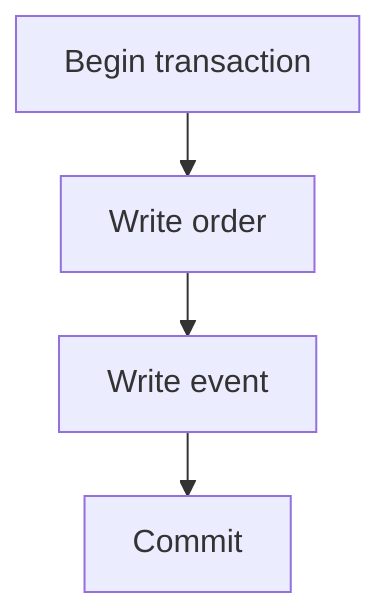

# SQLAlchemy sessions and transactions: who owns commit {#sqlalchemy-sessions-and-transactions}

<div class="bdr-post__hero" data-bdr-post="2026-09-13-sqlalchemy-sessions-and-transactions" role="img" aria-label="One transaction boundary owned by the use case, one commit at its edge" markdown="0"></div>

An order and its creation event need to appear together. If each repository calls `commit()` independently, failure to record the event leaves an order without an event. Passing one session object through every function does not solve this by itself: transaction ownership is what matters.

The business use case is a useful boundary. It decides which changes belong to one operation; repositories execute queries inside that boundary.

<!-- more -->

<div id="stop-passing-asyncsession-everywhere" data-search-exclude></div>
<div id="what-the-parameter-is-hiding" data-search-exclude></div>
<div id="what-the-same-session-is-worth" data-search-exclude></div>
<div id="what-it-costs-the-pool" data-search-exclude></div>
<div id="one-session-one-task" data-search-exclude></div>
<div id="what-leaves-the-block" data-search-exclude></div>
<div id="what-it-looks-like-when-the-session-has-an-owner" data-search-exclude></div>
<div id="the-pieces" data-search-exclude></div>

## Separate resource lifetimes {#ownership}

The engine and session factory normally belong to the application. A session belongs to one sequence of database work; a transaction belongs to a particular atomic operation. Constructing a session does not necessarily acquire a connection immediately.

A session also holds an identity map and ORM state. It is not just a convenient connection parameter and must not be used concurrently by several asyncio tasks. Independent concurrent work needs separate sessions. See [SQLAlchemy's session documentation](https://docs.sqlalchemy.org/en/20/orm/session_basics.html).

<div id="the-unit-of-work-pattern-in-sqlalchemy-2" data-search-exclude></div>
<div id="before-repositories-that-commit" data-search-exclude></div>
<div id="after-the-use-case-owns-the-boundary" data-search-exclude></div>
<div id="read-only-means-read-only" data-search-exclude></div>
<div id="savepoints-one-failed-step-not-one-failed-transaction" data-search-exclude></div>
<div id="the-use-case-under-test" data-search-exclude></div>
<div id="who-owns-the-transaction" data-search-exclude></div>

## The use case owns commit {#transaction}

Here, `orders` and `events` are application repositories. Their methods use the supplied session without committing:

```python
from sqlalchemy.ext.asyncio import async_sessionmaker

async def place_order(sessions: async_sessionmaker, orders, events, command):
    async with sessions.begin() as session:
        order = await orders.add(session, command)
        await session.flush()
        await events.add(session, order_id=order.id)
        result = {"order_id": order.id}
    return result
```

`flush()` sends pending changes to the database and makes generated identifiers available. It is not a commit. If recording the event raises, the context rolls back; after successful exit, both writes are committed.

A Unit of Work expresses the same boundary through an object that provides repositories and manages completion. Its value is an explicit contract. Adding a class with that name while leaving commit ownership unchanged fixes nothing.

<!-- diagram:concept -->
<figure class="bdr-diagram" markdown="1">
<figcaption><span class="bdr-diagram__eyebrow">THE IDEA, VISUALIZED</span><strong>One use case owns the commit boundary</strong></figcaption>
<div class="bdr-diagram__viewport" markdown="1" data-search-exclude>



</div>
<p class="bdr-diagram__caption">The order change and event record share a transaction. Failure before commit rolls back both writes.</p>
</figure>
<!-- /diagram:concept -->

## Avoid holding transactions during external work {#lifetime}

An open transaction may hold a connection and locks. If a use case waits for a slow HTTP API after its first SQL query, the database pool pays for that wait. Where possible, perform external work before a short transaction and revalidate the necessary data inside it.

Moving an HTTP call inside a database transaction does not make an external effect atomic with commit. An [outbox](2026-09-13-reliable-events-outbox-inbox-kafka.md) can durably record the intent to deliver work after commit; repeating the external action still needs its own idempotency contract.

## Define savepoint and read behavior {#savepoints}

A savepoint can roll back part of the work while allowing the outer transaction to continue. An expected conflict in an individual step is one use. Catch the exception outside the nested block, after the savepoint has rolled back.

“Read only” also requires a definition. A method named `read_only` does not prohibit database writes. Enforce a required prohibition through transaction settings, permissions or verified application behavior.

An ORM object returned after the session closes may attempt a lazy load and fail. Load the required fields beforehand or construct the use case result inside the block, as in the example.

## Test atomicity with failure {#verification}

The essential test deliberately breaks the second write and checks that the first is absent. Also test successful commit, savepoint rollback and independent concurrent operations. Repository mocks help test use case logic but do not establish PostgreSQL transaction behavior.

[sqlalchemy-foundation-kit](https://bedrock-python.github.io/sqlalchemy-foundation-kit/) supplies session and Unit of Work integration. The rule remains: the use case defines atomicity; repositories do not finish someone else's transaction.

## Examples and labs {#labs}

The complete setups and reproduction instructions are available separately:

- [Lab: the unit of work in SQLAlchemy 2](../lab/2026-09-07-unit-of-work-sqlalchemy-2/README.md)
- [Lab: who owns the session](../lab/2026-09-07-stop-passing-asyncsession-everywhere/README.md)
