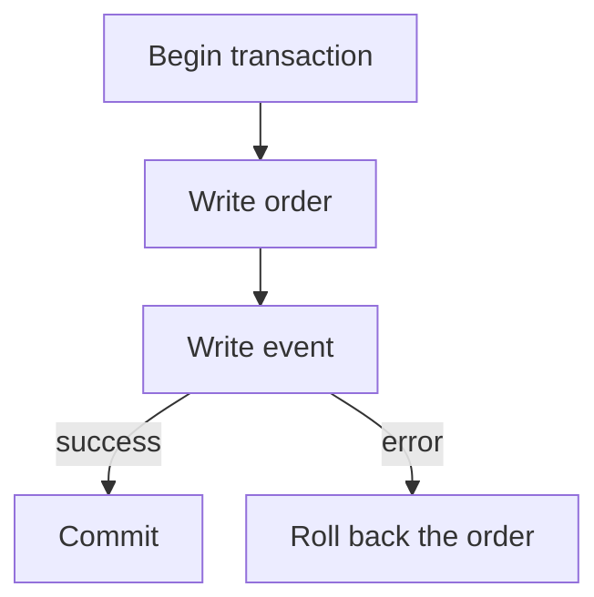

# SQLAlchemy sessions and transactions: who owns commit {#sqlalchemy-sessions-and-transactions}

<div class="bdr-post__hero" data-bdr-post="2026-09-13-sqlalchemy-sessions-and-transactions" role="img" aria-label="One transaction boundary owned by the use case, one commit at its edge" markdown="0"></div>

Imagine an order service that saves an order and a `created` event so other services can learn about the purchase. If recording the event fails, the order must roll back too. We will reproduce that failure and see why sharing a session is insufficient without a shared transaction boundary.

Then we will add a shipping quote from an external API, an optional subscription and an order lookup. Each scenario introduces a separate session-management decision.

<!-- more -->

<div id="stop-passing-asyncsession-everywhere" data-search-exclude></div>
<div id="what-the-parameter-is-hiding" data-search-exclude></div>
<div id="what-the-same-session-is-worth" data-search-exclude></div>
<div id="what-it-costs-the-pool" data-search-exclude></div>
<div id="one-session-one-task" data-search-exclude></div>
<div id="what-leaves-the-block" data-search-exclude></div>
<div id="what-it-looks-like-when-the-session-has-an-owner" data-search-exclude></div>
<div id="the-pieces" data-search-exclude></div>

## Set up the service and resource lifetimes {#ownership}

The example has two main ORM models: `Order` for `orders` and `OrderEvent` for `order_events`. An event has a foreign key to the order and a `CHECK (kind <> '')` constraint. An empty event kind gives us a reproducible PostgreSQL error. An event here is a row in the same database; broker delivery belongs to the [outbox article](2026-09-13-reliable-events-outbox-inbox-kafka.md).

Model definitions live in the [lab's](../lab/2026-09-07-unit-of-work-sqlalchemy-2/README.md) `models.py`. The snippets below use that file and assemble into one module. Verified versions: Python 3.13, SQLAlchemy 2.0.54, asyncpg 0.31.0, sqlalchemy-foundation-kit 0.4.0 and PostgreSQL 17.11.

At application startup, create an engine with a connection pool and a session factory:

```python
from sqlalchemy.ext.asyncio import async_sessionmaker, create_async_engine


def open_database(url):
    engine = create_async_engine(
        url, pool_size=2, max_overflow=0, pool_timeout=0.5,
    )
    sessions = async_sessionmaker(engine, expire_on_commit=False)
    return engine, sessions
```

`url` is a connection string such as `postgresql+asyncpg://…`. Call `open_database(url)` once at startup and `await engine.dispose()` at shutdown. The two-connection pool and short wait make the later experiment easy to reproduce; choose deployment values from the workload.

Each operation creates its own session through `sessions()`. In this setup, construction does not occupy a connection; the first SQL statement needs one. A session tracks loaded ORM objects and changes, while a transaction determines which writes commit together.

<div id="the-unit-of-work-pattern-in-sqlalchemy-2" data-search-exclude></div>
<div id="before-repositories-that-commit" data-search-exclude></div>
<div id="after-the-use-case-owns-the-boundary" data-search-exclude></div>
<div id="read-only-means-read-only" data-search-exclude></div>
<div id="savepoints-one-failed-step-not-one-failed-transaction" data-search-exclude></div>
<div id="the-use-case-under-test" data-search-exclude></div>
<div id="who-owns-the-transaction" data-search-exclude></div>

## Two commits leave a partial operation {#partial-commit}

Suppose the order repository commits to obtain an `id`, and the event repository commits its own write. Removing the repository wrappers exposes this sequence:

```python
from models import Order, OrderEvent


async def place_order_broken(sessions, sku, *, event_kind="created"):
    async with sessions() as session:
        order = Order(sku=sku, delivery_cents=0)
        session.add(order)
        await session.commit()

        session.add(OrderEvent(order_id=order.id, kind=event_kind))
        await session.commit()
        return {"order_id": order.id}
```

Calling `place_order_broken(sessions, "sku-1", event_kind="")` saves the order, then raises `IntegrityError`: PostgreSQL rejects the empty event kind. One session has executed two transactions. Rolling back the second cannot undo the first. The lab reads the surviving rows through another session:

```text
two commits + rejected event: orders=1, events=0
```

## Commit the order and event in one transaction {#transaction}

Move the commit decision to the complete operation. SQLAlchemy's `sessions.begin()` is enough to express that boundary:

```python
async def place_order_native(sessions, sku, *, event_kind="created"):
    async with sessions.begin() as session:
        order = Order(sku=sku, delivery_cents=0)
        session.add(order)
        await session.flush()
        session.add(OrderEvent(order_id=order.id, kind=event_kind))
        result = {"order_id": order.id}
    return result
```

`flush()` sends the order's `INSERT` and makes its `id` available while keeping the transaction open. On block exit, SQLAlchemy sends pending changes and commits. If the event insert violates its constraint, the order rolls back with it. Return the result after successful context-manager exit.

The same failure now leaves `orders=0, events=0`. Another lab check reads through a separate session between `flush()` and commit: the writer has an ID, but the uncommitted row is still invisible to the observer. An assigned ID is therefore not evidence of a committed order.

<!-- diagram:concept -->
<figure class="bdr-diagram" markdown="1">
<figcaption><span class="bdr-diagram__eyebrow">THE IDEA, VISUALIZED</span><strong>One use case owns the commit boundary</strong></figcaption>
<div class="bdr-diagram__viewport" markdown="1" data-search-exclude>


```mermaid
---
config:
  theme: default
  look: classic
  flowchart:
    useMaxWidth: false
    wrappingWidth: 150
    padding: 12
    nodeSpacing: 24
    rankSpacing: 32
---
flowchart TD
    accTitle: One use case owns the commit boundary
    accDescr: If recording the event fails, the order rolls back. A successful transaction saves both rows together.
    A["Begin transaction"]
    B["Write order"]
    C["Write event"]
    D["Commit"]
    E["Roll back the order"]
    A --> B --> C
    C -->|success| D
    C -->|error| E
```

</div>
<p class="bdr-diagram__caption">If recording the event fails, the order rolls back. A successful transaction saves both rows together.</p>
</figure>
<!-- /diagram:concept -->

## Assemble the repositories into a Unit of Work {#unit-of-work}

Now move queries into repositories. For each order they need one session, and their caller needs a clear block that commits everything together. This is where we use our [sqlalchemy-foundation-kit](https://bedrock-python.github.io/sqlalchemy-foundation-kit/) library, with `AsyncSQLAlchemyUnitOfWork` and a transaction object exposing application repositories.

First, the repositories. They add objects and flush but do not finish the transaction:

```python
class OrderRepository:
    def __init__(self, session):
        self.session = session

    async def add(self, sku, delivery_cents=0):
        order = Order(sku=sku, delivery_cents=delivery_cents)
        self.session.add(order)
        await self.session.flush()
        return order


class EventRepository:
    def __init__(self, session):
        self.session = session

    async def add(self, order_id, kind="created"):
        self.session.add(OrderEvent(order_id=order_id, kind=kind))
        await self.session.flush()
```

`OrderTransaction` passes the same session to both repositories. Call `make_uow(sessions)` when assembling the application, then pass that `uow` to business operations:

```python
from sqlalchemy_foundation_kit import (
    AsyncSQLAlchemyUnitOfWork,
    AsyncSQLAlchemyUowTransaction,
)


class OrderTransaction(AsyncSQLAlchemyUowTransaction):
    @property
    def orders(self):
        return OrderRepository(self.session)

    @property
    def events(self):
        return EventRepository(self.session)


def make_uow(sessions):
    return AsyncSQLAlchemyUnitOfWork(
        sessions, transaction_factory=OrderTransaction,
    )


async def place_order(uow, sku, *, delivery_cents=0, event_kind="created"):
    async with uow.transaction() as tx:
        order = await tx.orders.add(sku, delivery_cents)
        await tx.events.add(order.id, event_kind)
        result = {"order_id": order.id}
    return result
```

Every `uow.transaction()` entry creates its own session. Normal exit commits; an exception triggers rollback. The order's atomicity requirement is unchanged, now expressed consistently across operations using several repositories. A commit inside a repository would violate that agreement; introducing a Unit of Work class does not fix such code by itself.

## Get the shipping quote before opening the transaction {#lifetime}

Add an HTTP shipping-quote service. Writing the order before waiting for its response holds a PostgreSQL connection throughout that wait. In the lab, two such requests occupy the entire pool; a third operation times out trying to acquire a connection.

In this scenario, the quote needs only the product SKU. Fetch it first:

```python
async def place_order_after_quote(uow, quote_shipping, sku):
    delivery_cents = await quote_shipping(sku)
    return await place_order(uow, sku, delivery_cents=delivery_cents)
```

`quote_shipping(sku)` is an async adapter returning a cost in minor currency units. The lab substitutes a controlled wait, allowing it to inspect the pool before the response arrives. With this order of operations, neither waiting request holds a connection and a third database request succeeds.

If a quote depends on mutable order data, validate that data and the quote's expiry inside the transaction. If the external call charges money or sends email, PostgreSQL cannot roll back that effect. An [outbox](2026-09-13-reliable-events-outbox-inbox-kafka.md) can reliably record work for delivery after commit; repeating the external operation still needs its own protection.

### Give independent orders independent sessions {#concurrent-orders}

Independent orders can run concurrently. The tasks share one `uow` object, but each calls `place_order()` and enters its own transaction block:

```python
import asyncio


async def place_independent_orders(uow, skus):
    async with asyncio.TaskGroup() as group:
        tasks = [group.create_task(place_order(uow, sku)) for sku in skus]
    return [task.result() for task in tasks]
```

The lab verifies that six operations obtain six distinct sessions and commit six order/event pairs. An `AsyncSession` must not be shared by concurrent tasks: it holds mutable operation state, as described in [SQLAlchemy's documentation](https://docs.sqlalchemy.org/en/20/orm/extensions/asyncio.html#using-asyncsession-with-concurrent-tasks).

Each order commits independently. If one task fails, `TaskGroup` cancellation cannot undo orders already committed by its siblings. A requirement to commit the whole batch or nothing calls for one sequential operation in a shared transaction.

## Savepoint: keep the order when the subscription already exists {#savepoints}

During checkout, the customer also opts into a newsletter. Their address is the primary key in `newsletter_subscriptions`. If they already subscribe, the new order should still succeed.

Wrap only this optional insert in a savepoint, a partial rollback boundary inside the transaction:

```python
from sqlalchemy.exc import IntegrityError

from models import NewsletterSubscription


async def place_order_with_subscription(uow, sku, email):
    async with uow.transaction() as tx:
        order = await tx.orders.add(sku)
        await tx.events.add(order.id)
        try:
            async with tx.savepoint():
                tx.session.add(NewsletterSubscription(email=email))
                await tx.session.flush()
        except IntegrityError as error:
            if getattr(error.orig, "sqlstate", None) != "23505":
                raise
        result = {"order_id": order.id}
    return result
```

This table's only uniqueness constraint is the `email` key, so `23505` means the address already exists. Other errors propagate. If more uniqueness constraints are added, narrow the handler by constraint name.

The handler runs after `tx.savepoint()` exits and completes its partial rollback, leaving the outer transaction usable. The lab creates two orders with the same subscription: both orders and events survive, with one subscription row. A different error rolls back the whole operation.

The required event remains outside that block: losing it must cancel the order. Also, `begin_nested()`, used by `savepoint()`, flushes previously pending changes before entering. Add objects meant for partial rollback inside the nested block. See the [SAVEPOINT documentation](https://docs.sqlalchemy.org/en/20/orm/session_transaction.html#using-savepoint).

## Read the order and explicitly prohibit writes {#read-only}

The customer opens an order page. Use `uow.query()`, which closes its session without automatically committing. In version 0.4.0 this expresses the block's intended use; it does not instruct PostgreSQL to prohibit writes.

To have the database reject an accidental `INSERT` into a regular table, set `READ ONLY` as the transaction's first SQL statement:

```python
from sqlalchemy import text


async def read_order(uow, order_id):
    async with uow.query() as tx:
        await tx.session.execute(text("SET TRANSACTION READ ONLY"))
        order = await tx.session.get(Order, order_id)
        if order is None:
            raise LookupError(order_id)
        return {
            "order_id": order.id,
            "sku": order.sku,
            "delivery_cents": order.delivery_cents,
        }
```

The lab checks the distinction: a write in an ordinary `query()` block disappears without commit, but an explicit commit is possible. After `SET TRANSACTION READ ONLY`, PostgreSQL rejects the insert itself with code `25006`. These are [PostgreSQL transaction semantics](https://www.postgresql.org/docs/17/sql-set-transaction.html).

The function returns a completed dictionary, with every required field read while the session is open. Serializing the response therefore needs no unexpected database access. The `expire_on_commit=False` setting preserves loaded fields after commit; it does not automatically load lazy relationships.

## Verify rollback using PostgreSQL rows {#verification}

Observing `rollback()` on a mock does not establish what remains in the database. The central check deliberately breaks the second write and reads both tables through a new session:

```python
from sqlalchemy import func, select


async def verify_rollback(uow, sessions):
    # Run against an empty lab database.
    try:
        await place_order(uow, "sku-1", event_kind="")
    except IntegrityError as error:
        assert error.orig.sqlstate == "23514"
    else:
        raise AssertionError("The CHECK constraint should reject the event")

    async with sessions() as observer:
        assert await observer.scalar(select(func.count()).select_from(Order)) == 0
        assert await observer.scalar(select(func.count()).select_from(OrderEvent)) == 0
```

Run this against the lab's empty database. The first `INSERT` reaches PostgreSQL, the second violates `CHECK`, and both tables remain empty. Additional checks cover successful commit, partial subscription rollback, write prohibition, task cancellation before commit and connections returning to the pool.

If the response to `COMMIT` itself is lost, the application may not know the outcome: the server could already have saved the changes. Retrying that business operation safely requires [idempotency](2026-09-13-idempotency-in-apis-and-background-jobs.md).

## Conclusion {#conclusion}

We moved from two independent commits to an operation that saves the order and event together. Then we moved external waiting outside the transaction, gave concurrent tasks separate sessions, allowed a partial rollback for an optional step and checked database-enforced read-only behavior.

Use [sqlalchemy-foundation-kit](https://bedrock-python.github.io/sqlalchemy-foundation-kit/) when you want to express these operations consistently through `transaction()`, `query()` and `savepoint()`, assembling repositories around one session. Start with the labs below: substitute your models and verify that a required step's failure leaves no partial operation in the database.

## Examples and labs {#labs}

- [Commit, rollback, savepoint and READ ONLY on PostgreSQL](../lab/2026-09-07-unit-of-work-sqlalchemy-2/README.md)
- [External API waiting, connection pools and concurrent tasks](../lab/2026-09-07-stop-passing-asyncsession-everywhere/README.md)
