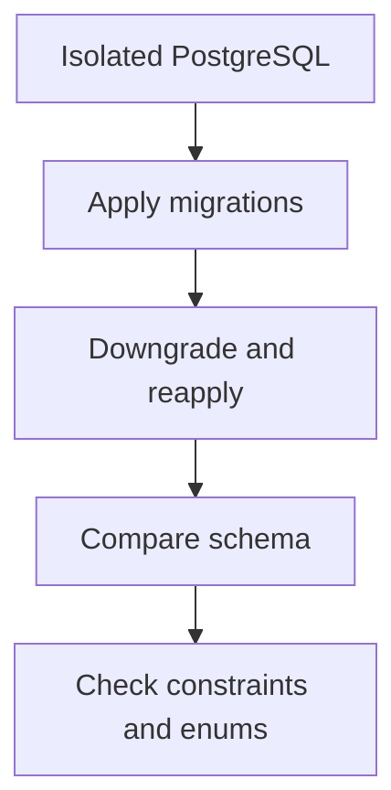

# Testing Alembic migrations in CI {#testing-alembic-migrations-in-ci}

<div class="bdr-post__hero" data-bdr-post="2026-09-13-testing-alembic-migrations-in-ci" role="img" aria-label="A revision history walked up, back and up again, with five checks planted along it" markdown="0"></div>

A successful `alembic upgrade head` checks one path: applying history to the chosen starting state. It does not establish that downgrade works, models match the database or a manually added constraint exists.

Use a small suite whose checks answer different questions. It can run against temporary PostgreSQL in the same CI pipeline as the application.

<!-- more -->

<div id="the-five-migration-tests-every-python-project-should-run-in-ci" data-search-exclude></div>
<div id="the-test-most-pipelines-have" data-search-exclude></div>
<div id="five-bugs-one-file-each" data-search-exclude></div>
<div id="five-tests-by-hand" data-search-exclude></div>
<div id="what-each-test-caught" data-search-exclude></div>
<div id="the-thing-the-naming-test-taught-me" data-search-exclude></div>
<div id="running-it-in-ci" data-search-exclude></div>
<div id="the-contract-with-envpy" data-search-exclude></div>
<div id="the-five-tests-as-one-import" data-search-exclude></div>

## Give each check a purpose {#checks}

| Check | Detects |
|---|---|
| One expected head revision | Accidental history branches |
| Full upgrade | Failures applying migrations |
| One step down and up again | Broken downgrade or reapplication |
| Full downgrade, when supported | Incorrect reverse cleanup order |
| Schema/model comparison | Missing table, column and some constraint changes |
| Explicit CHECK and enum tests | Objects that comparison may not cover |
| Data checks | Lost or incorrectly transformed existing rows |

Downgrade policy must match the project. An irreversible data migration can be intentional, but the test and recovery plan should make that explicit. A green test on empty tables does not establish preservation of production data.

<div id="testing-database-migrations-with-testcontainers-up-down-and-up-again" data-search-exclude></div>
<div id="step-1-a-database-that-exists-only-for-the-test-session" data-search-exclude></div>
<div id="step-2-pytest-configuration" data-search-exclude></div>
<div id="step-3-the-contract-with-envpy" data-search-exclude></div>
<div id="step-4-the-test-file" data-search-exclude></div>
<div id="step-5-ci" data-search-exclude></div>
<div id="what-it-costs" data-search-exclude></div>

## Give tests their own database {#isolation}

Testcontainers can provide PostgreSQL for a test session. Pin the image version to the target environment. Isolate tests with a database or schema and ensure cleanup after failure.

Alembic must run on the connection controlled by the test. Have `env.py` accept it through `config.attributes` rather than silently opening another engine. With a dedicated schema, coordinate `search_path`, the version table and object reflection.

The labs below retain complete container, pytest and `env.py` setup. Configure that once and reuse it across checks.

<!-- diagram:concept -->
<figure class="bdr-diagram" markdown="1">
<figcaption><span class="bdr-diagram__eyebrow">THE IDEA, VISUALIZED</span><strong>Check migrations in both directions</strong></figcaption>
<div class="bdr-diagram__viewport" markdown="1" data-search-exclude>



</div>
<p class="bdr-diagram__caption">A test database exercises upgrades, downgrades and reapplication. The resulting schema is checked against models and explicit constraints.</p>
</figure>
<!-- /diagram:concept -->

<div id="your-models-and-your-schema-have-drifted-would-ci-notice" data-search-exclude></div>
<div id="where-drift-comes-from" data-search-exclude></div>
<div id="the-six-drifts" data-search-exclude></div>
<div id="the-check-that-catches-half-of-them" data-search-exclude></div>
<div id="the-one-it-will-not-look-at-unless-you-ask" data-search-exclude></div>
<div id="the-two-it-will-never-look-at" data-search-exclude></div>
<div id="what-to-run-in-ci" data-search-exclude></div>
<div id="the-pieces" data-search-exclude></div>

## Understand schema comparison limits {#schema-drift}

This fragment assumes two fixtures: `migrated_connection` points to an isolated database after migrations, and `metadata` contains the application models.

```python
from alembic.autogenerate import compare_metadata
from alembic.migration import MigrationContext

def test_schema_matches_models(migrated_connection, metadata):
    context = MigrationContext.configure(
        migrated_connection,
        opts={"compare_type": True, "compare_server_default": True},
    )
    assert compare_metadata(context, metadata) == []
```

Server-default comparison is enabled explicitly. An empty diff does not establish equality of every PostgreSQL object. [Alembic documents autogenerate's limitations](https://alembic.sqlalchemy.org/en/latest/autogenerate.html), including incomplete detection of some constraints.

Check important CHECK constraints, enum members, triggers and functions separately through database catalogs or expected behavior. For example, inserting a negative amount must fail if that is a schema invariant.

## Exercise history with data {#data}

For a migration that transforms data, insert rows using the previous schema, apply the new revision and inspect the result. Include boundary values, NULLs and rows written by older application versions.

A fast test suite does not replace rehearsing expensive DDL. Large tables introduce lock duration, concurrent writes and recovery questions. Run those scenarios separately at a representative scale.

## Run the checks in ordinary CI {#ci}

Migration checks should run when models or Alembic history change, rather than only before a release. Failures need the revision name, SQL error and detected diff. An unavailable container must not silently turn a mandatory test into a successful skip.

[alembic-gauntlet](https://bedrock-python.github.io/alembic-gauntlet/) packages recurring setup and checks. Regardless of the tool, define the required properties of schema and data before choosing the tests that establish them.

## Examples and labs {#labs}

The complete setups and reproduction instructions are available separately:

- [Lab: the five migration tests](../lab/2026-09-07-five-alembic-migration-tests/README.md)
